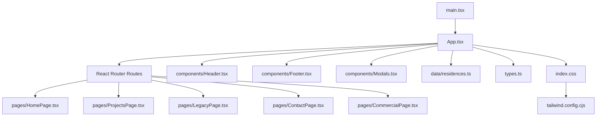
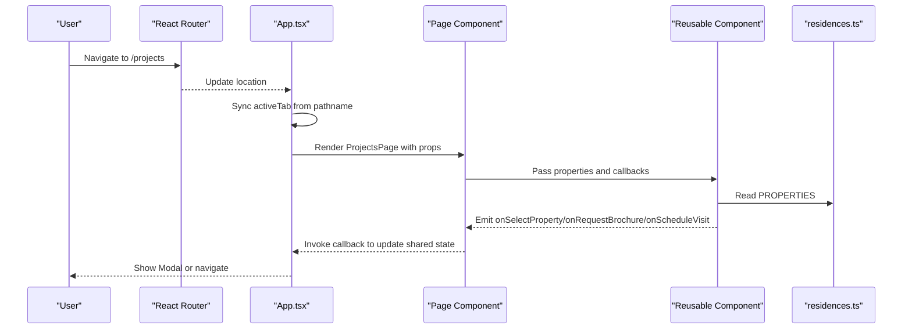
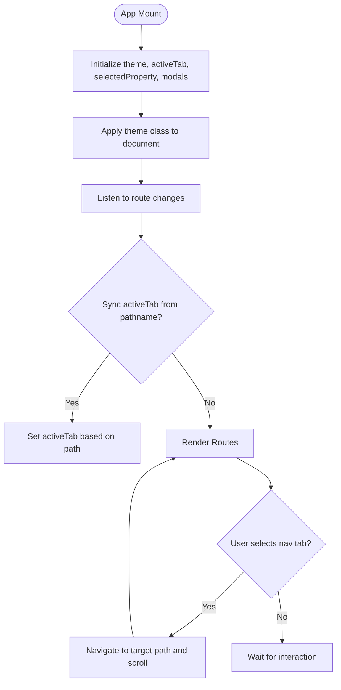
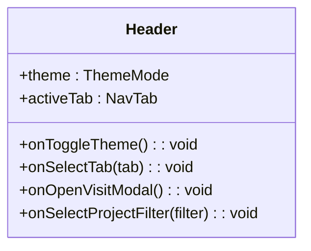
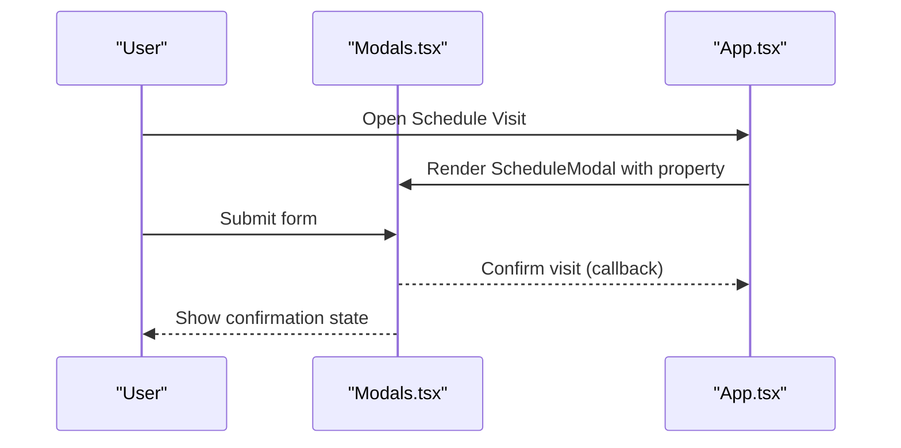
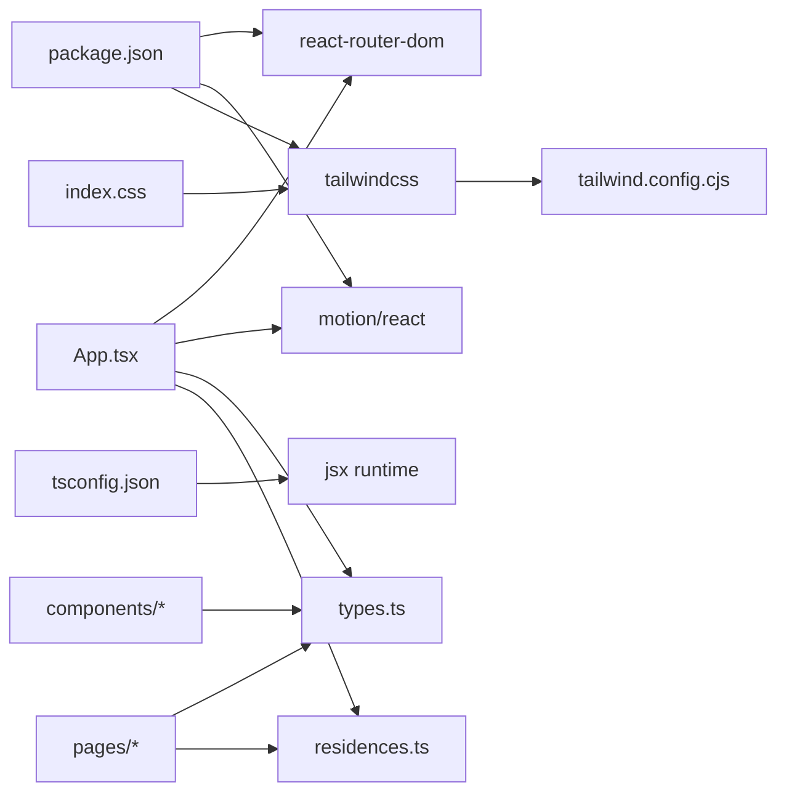

# Architecture Overview

<cite>
**Referenced Files in This Document**
- [main.tsx](file://src/main.tsx)
- [App.tsx](file://src/App.tsx)
- [types.ts](file://src/types.ts)
- [residences.ts](file://src/data/residences.ts)
- [Header.tsx](file://src/components/Header.tsx)
- [Footer.tsx](file://src/components/Footer.tsx)
- [HomePage.tsx](file://src/pages/HomePage.tsx)
- [ProjectsPage.tsx](file://src/pages/ProjectsPage.tsx)
- [Modals.tsx](file://src/components/Modals.tsx)
- [index.css](file://src/index.css)
- [tailwind.config.cjs](file://tailwind.config.cjs)
- [tsconfig.json](file://tsconfig.json)
- [package.json](file://package.json)
</cite>

## Table of Contents
1. [Introduction](#introduction)
2. [Project Structure](#project-structure)
3. [Core Components](#core-components)
4. [Architecture Overview](#architecture-overview)
5. [Detailed Component Analysis](#detailed-component-analysis)
6. [Dependency Analysis](#dependency-analysis)
7. [Performance Considerations](#performance-considerations)
8. [Troubleshooting Guide](#troubleshooting-guide)
9. [Conclusion](#conclusion)

## Introduction
This document describes the architecture of the N-Square real estate website, a React application built with TypeScript and Vite. The app follows a component-based architecture with clear separation between pages, reusable components, and static data. Routing is handled by React Router, state management includes theme and navigation state at the root, and animations are implemented using Framer Motion (via motion/react). Styling uses Tailwind CSS with custom theme extensions and global utilities. Data flows from static sources into page-level components and then into reusable UI components.

## Project Structure
The project is organized into:
- src/main.tsx: Application bootstrap and router setup
- src/App.tsx: Root component managing routing, theme, navigation, modals, and shared state
- src/pages: Page-level components for each route
- src/components: Reusable UI components (Header, Footer, Modals, sections)
- src/data: Static data (properties and hero slides)
- src/types.ts: Shared TypeScript types used across the app
- index.css: Global styles, Tailwind imports, and theme utilities
- tailwind.config.cjs: Tailwind configuration with custom colors
- tsconfig.json: TypeScript configuration
- package.json: Dependencies and scripts

**Diagram sources**
- [main.tsx:1-14](file://src/main.tsx#L1-L14)
- [App.tsx:1-255](file://src/App.tsx#L1-L255)
- [HomePage.tsx:1-47](file://src/pages/HomePage.tsx#L1-L47)
- [ProjectsPage.tsx:1-35](file://src/pages/ProjectsPage.tsx#L1-L35)
- [Header.tsx:1-328](file://src/components/Header.tsx#L1-L328)
- [Footer.tsx:1-68](file://src/components/Footer.tsx#L1-L68)
- [Modals.tsx:1-312](file://src/components/Modals.tsx#L1-L312)
- [residences.ts:1-190](file://src/data/residences.ts#L1-L190)
- [types.ts:1-60](file://src/types.ts#L1-L60)
- [index.css:1-105](file://src/index.css#L1-L105)
- [tailwind.config.cjs:1-15](file://tailwind.config.cjs#L1-L15)

**Section sources**
- [main.tsx:1-14](file://src/main.tsx#L1-L14)
- [App.tsx:1-255](file://src/App.tsx#L1-L255)
- [package.json:1-38](file://package.json#L1-L38)
- [tsconfig.json:1-27](file://tsconfig.json#L1-L27)
- [tailwind.config.cjs:1-15](file://tailwind.config.cjs#L1-L15)
- [index.css:1-105](file://src/index.css#L1-L105)

## Core Components
- App: Root component that owns theme, active navigation tab, selected property, modal states, and routes. It applies theme classes to the document and coordinates navigation via React Router.
- Header: Responsive header with navigation, dropdowns, mobile menu, theme toggle, and call-to-action. Uses Framer Motion for smooth transitions and layout animations.
- Footer: Site-wide footer with quick links, social icons, and legal info. Supports theme-aware styling and optional navigation callbacks.
- Modals: Brochure request and schedule visit modals with form handling, confirmation states, and theme-aware UI.
- Pages:
  - HomePage: Composes HeroSlider, PlatinumWorldSection, HomeExcellenceCombinedSection, OngoingProjectsCarousel, TestimonialsSection.
  - ProjectsPage: Thin wrapper delegating to a component implementation with properties and callbacks.
  - LegacyPage, ContactPage, CommercialPage: Route-specific pages consuming shared props and data.

Key responsibilities:
- Routing: Defined in App with React Router; each route renders a page wrapped in motion for enter/exit transitions.
- State: Theme mode, active tab, selected property, and modal visibility managed in App.
- Data: Static data in residences.ts consumed by pages and components.

**Section sources**
- [App.tsx:15-255](file://src/App.tsx#L15-L255)
- [Header.tsx:1-328](file://src/components/Header.tsx#L1-L328)
- [Footer.tsx:1-68](file://src/components/Footer.tsx#L1-L68)
- [Modals.tsx:1-312](file://src/components/Modals.tsx#L1-L312)
- [HomePage.tsx:1-47](file://src/pages/HomePage.tsx#L1-L47)
- [ProjectsPage.tsx:1-35](file://src/pages/ProjectsPage.tsx#L1-L35)
- [residences.ts:1-190](file://src/data/residences.ts#L1-L190)

## Architecture Overview
The application uses a top-down component hierarchy with unidirectional data flow:
- main.tsx bootstraps the app and wraps it with BrowserRouter.
- App manages global state and routes.
- Pages render content and compose reusable components.
- Components receive props and emit events upward via callbacks.
- Static data resides in data/residences.ts and is passed down as needed.

**Diagram sources**
- [App.tsx:47-85](file://src/App.tsx#L47-L85)
- [App.tsx:106-227](file://src/App.tsx#L106-L227)
- [ProjectsPage.tsx:1-35](file://src/pages/ProjectsPage.tsx#L1-L35)
- [residences.ts:60-189](file://src/data/residences.ts#L60-L189)

## Detailed Component Analysis

### App Component
Responsibilities:
- Theme management: toggles dark/light and applies classes to document elements.
- Navigation state: syncs activeTab with URL path and navigates on tab selection.
- Routing: defines routes for home, projects, about, contact, commercial, and a catch-all redirect.
- Modal orchestration: opens brochure and schedule visit modals with selected property context.
- Animation: wraps route views with motion for smooth transitions.

**Diagram sources**
- [App.tsx:15-37](file://src/App.tsx#L15-L37)
- [App.tsx:47-85](file://src/App.tsx#L47-L85)
- [App.tsx:106-227](file://src/App.tsx#L106-L227)

**Section sources**
- [App.tsx:15-255](file://src/App.tsx#L15-L255)

### Header Component
Responsibilities:
- Desktop and mobile navigation with dropdown support.
- Active tab highlighting with animated vertical line indicator.
- Theme toggle with sliding switch animation.
- Call-to-action to open schedule visit modal.
- Scroll-aware background and blur effect.

**Diagram sources**
- [Header.tsx:6-22](file://src/components/Header.tsx#L6-L22)

**Section sources**
- [Header.tsx:1-328](file://src/components/Header.tsx#L1-L328)

### Footer Component
Responsibilities:
- Quick links and project listings.
- Social media links with accessibility labels.
- Optional navigation callbacks to trigger tabs.

**Section sources**
- [Footer.tsx:1-68](file://src/components/Footer.tsx#L1-L68)

### Modals Component
Responsibilities:
- Brochure request modal with form fields and success state.
- Schedule visit modal with date/time selection and confirmation state.
- Theme-aware styling and accessible close controls.

**Diagram sources**
- [Modals.tsx:160-312](file://src/components/Modals.tsx#L160-L312)
- [App.tsx:237-250](file://src/App.tsx#L237-L250)

**Section sources**
- [Modals.tsx:1-312](file://src/components/Modals.tsx#L1-L312)

### HomePage Component
Responsibilities:
- Compose hero slider and multiple content sections.
- Pass theme and event handlers to child components.

**Section sources**
- [HomePage.tsx:1-47](file://src/pages/HomePage.tsx#L1-L47)

### ProjectsPage Component
Responsibilities:
- Wrapper that delegates rendering to an internal component implementation.
- Propagates theme, initial filter, properties, and callbacks.

**Section sources**
- [ProjectsPage.tsx:1-35](file://src/pages/ProjectsPage.tsx#L1-L35)

## Dependency Analysis
High-level dependencies:
- main.tsx depends on React Router to provide routing context.
- App.tsx depends on React Router, motion, and local components and data.
- Pages depend on components and data.
- Components depend on types and Tailwind utilities.
- Tailwind config extends color palette used globally.

**Diagram sources**
- [package.json:13-35](file://package.json#L13-L35)
- [tsconfig.json:1-27](file://tsconfig.json#L1-L27)
- [App.tsx:1-13](file://src/App.tsx#L1-L13)
- [index.css:1-21](file://src/index.css#L1-L21)
- [tailwind.config.cjs:1-15](file://tailwind.config.cjs#L1-L15)

**Section sources**
- [package.json:1-38](file://package.json#L1-L38)
- [tsconfig.json:1-27](file://tsconfig.json#L1-L27)
- [App.tsx:1-13](file://src/App.tsx#L1-L13)
- [index.css:1-21](file://src/index.css#L1-L21)
- [tailwind.config.cjs:1-15](file://tailwind.config.cjs#L1-L15)

## Performance Considerations
- Routing transitions: Use AnimatePresence and motion for smooth page transitions without heavy re-renders.
- State co-location: Keep theme and navigation state in App to minimize prop drilling and avoid redundant updates.
- Data access: Static data in residences.ts is imported once; pass only necessary slices to components to reduce payload size.
- Animations: Prefer lightweight motion properties and avoid excessive layout thrashing; use layoutId sparingly.
- Styling: Tailwind utility-first approach reduces CSS bundle size; custom classes in index.css are minimal and scoped.
- Images: Ensure images are optimized and lazy-loaded where possible to improve perceived performance.

[No sources needed since this section provides general guidance]

## Troubleshooting Guide
Common issues and resolutions:
- Theme not applying: Verify that App sets document classes and that index.css defines .dark-theme and .light-theme correctly.
- Navigation mismatch: Ensure App syncs activeTab with pathname and that Header calls onSelectTab consistently.
- Modal state persistence: Confirm that modal state is stored in App and passed to Modals; reset state on close.
- Tailwind styles missing: Check tailwind.config.cjs content paths include all source files and that index.css imports Tailwind.
- TypeScript errors: Validate types in types.ts match component props and data shapes; ensure tsconfig settings align with project structure.

**Section sources**
- [App.tsx:24-37](file://src/App.tsx#L24-L37)
- [App.tsx:47-85](file://src/App.tsx#L47-L85)
- [index.css:27-44](file://src/index.css#L27-L44)
- [tailwind.config.cjs:1-15](file://tailwind.config.cjs#L1-L15)
- [types.ts:1-60](file://src/types.ts#L1-L60)

## Conclusion
The N-Square website employs a clean, component-based architecture with clear separation of concerns:
- Routing via React Router ensures modular page composition.
- Centralized state in App manages theme, navigation, and modals.
- Static data layer keeps content decoupled from UI logic.
- Tailwind CSS and custom styles provide a consistent design system.
- Framer Motion adds polished interactions and transitions.
This structure supports scalability, maintainability, and a strong user experience across devices.

[No sources needed since this section summarizes without analyzing specific files]