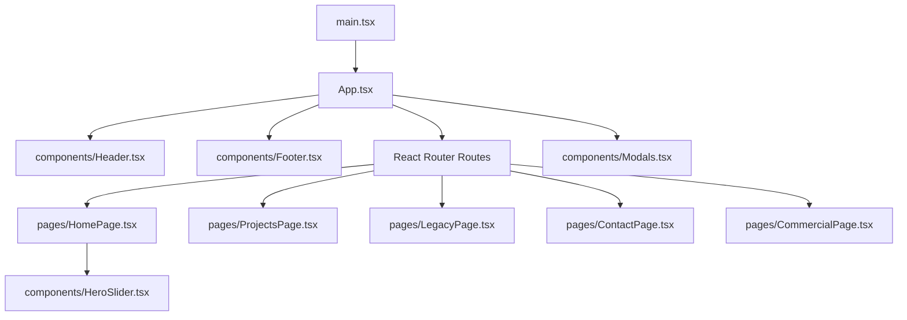
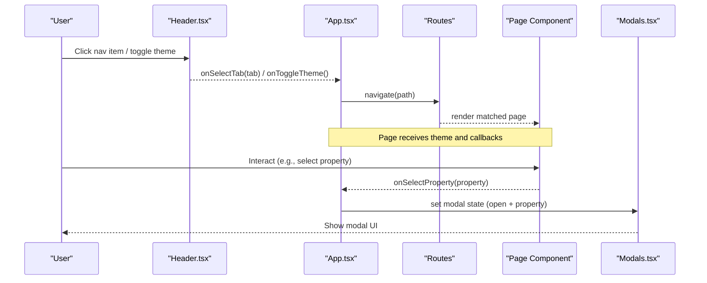
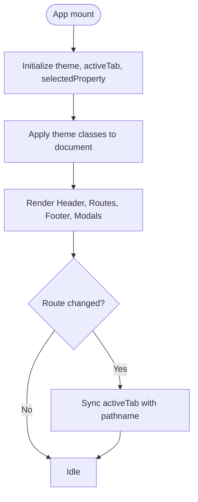
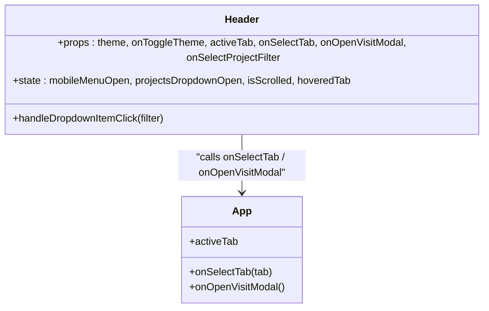
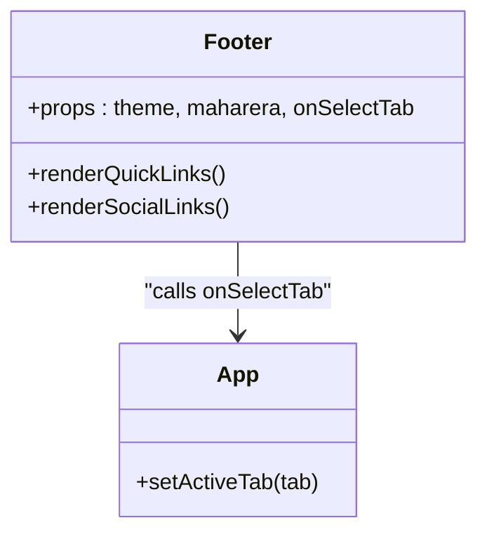
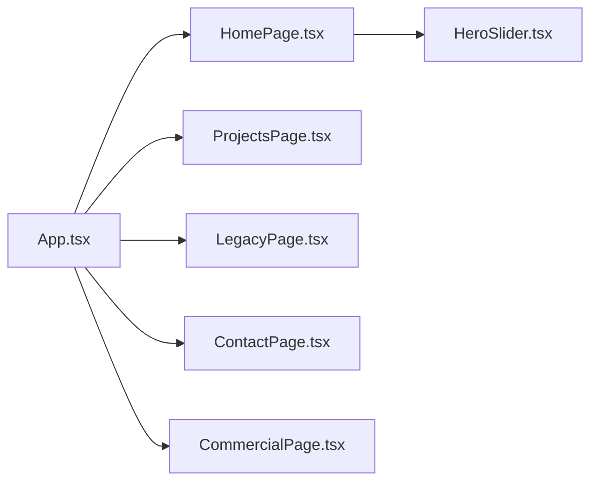
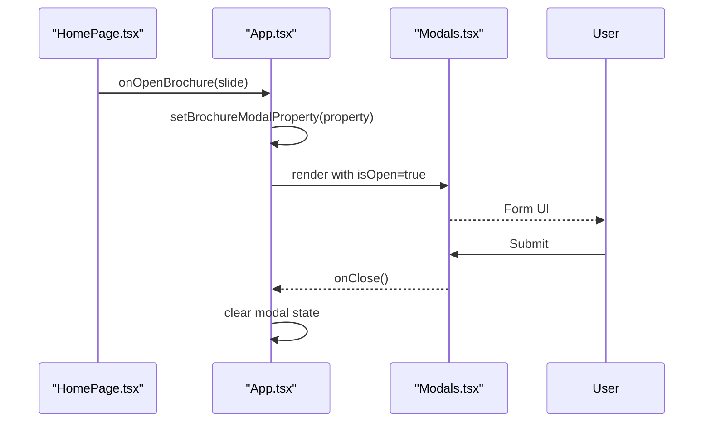
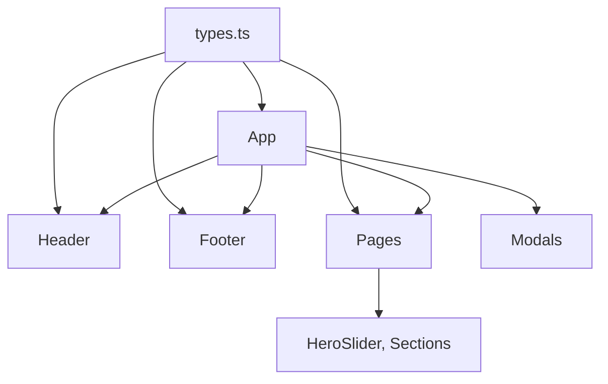

# Component Hierarchy and Structure

<cite>
**Referenced Files in This Document**
- [main.tsx](file://src/main.tsx)
- [App.tsx](file://src/App.tsx)
- [Header.tsx](file://src/components/Header.tsx)
- [Footer.tsx](file://src/components/Footer.tsx)
- [HomePage.tsx](file://src/pages/HomePage.tsx)
- [ProjectsPage.tsx](file://src/pages/ProjectsPage.tsx)
- [LegacyPage.tsx](file://src/pages/LegacyPage.tsx)
- [ContactPage.tsx](file://src/pages/ContactPage.tsx)
- [CommercialPage.tsx](file://src/pages/CommercialPage.tsx)
- [HeroSlider.tsx](file://src/components/HeroSlider.tsx)
- [Modals.tsx](file://src/components/Modals.tsx)
- [types.ts](file://src/types.ts)
</cite>

## Table of Contents
1. Introduction
2. Project Structure
3. Core Components
4. Architecture Overview
5. Detailed Component Analysis
6. Dependency Analysis
7. Performance Considerations
8. Troubleshooting Guide
9. Conclusion

## Introduction
This document explains the component hierarchy and structure of the N-Square real estate website. It focuses on how App, Header, Footer, and Page components relate to each other, how data flows through props, and how state is managed at the application root for shared concerns like theme and navigation. It also covers reusable vs page-specific components, composition patterns, lifecycle considerations, and performance strategies used throughout the app.

## Project Structure
The application follows a feature-based layout with clear separation between pages and shared UI:
- Entry point renders React Router and mounts App.
- App orchestrates routing, global state (theme, active tab, selected property), modals, and composes Header, Pages, and Footer.
- Pages are thin wrappers that compose page-specific content from components under src/components.
- Shared UI components (Header, Footer, HeroSlider, Modals, etc.) live under src/components.
- Types are centralized in types.ts to ensure consistent prop contracts across components.

**Diagram sources**
- [main.tsx:7-11](file://src/main.tsx#L7-L11)
- [App.tsx:87-251](file://src/App.tsx#L87-L251)
- [HomePage.tsx:25-44](file://src/pages/HomePage.tsx#L25-L44)
- [ProjectsPage.tsx:22-32](file://src/pages/ProjectsPage.tsx#L22-L32)
- [LegacyPage.tsx:10-14](file://src/pages/LegacyPage.tsx#L10-L14)
- [ContactPage.tsx:40-74](file://src/pages/ContactPage.tsx#L40-L74)
- [CommercialPage.tsx:20-28](file://src/pages/CommercialPage.tsx#L20-L28)

**Section sources**
- [main.tsx:1-14](file://src/main.tsx#L1-L14)
- [App.tsx:1-255](file://src/App.tsx#L1-L255)

## Core Components
- App: Root component managing global state (theme, active tab, selected property), modal visibility, and routing. It composes Header, Pages, Footer, and Modals.
- Header: Reusable top navigation with theme toggle, active tab highlighting, dropdown filters, and mobile menu. Emits events upward via callbacks.
- Footer: Reusable bottom section with quick links and social icons; can trigger navigation via callback.
- Pages: Thin route-level components that render page-specific sections by composing sub-components. They pass down props and handle page-level state when needed.
- Shared UI: HeroSlider, Modals, and other feature components encapsulate complex UI logic and animations.

Key responsibilities:
- App owns cross-cutting state and coordinates interactions between Header, Pages, and Footer.
- Header and Footer remain presentation-focused and communicate via props and callbacks.
- Pages isolate page-specific logic and delegate to reusable components.

**Section sources**
- [App.tsx:15-85](file://src/App.tsx#L15-L85)
- [Header.tsx:6-22](file://src/components/Header.tsx#L6-L22)
- [Footer.tsx:5-11](file://src/components/Footer.tsx#L5-L11)
- [HomePage.tsx:10-24](file://src/pages/HomePage.tsx#L10-L24)
- [ProjectsPage.tsx:5-12](file://src/pages/ProjectsPage.tsx#L5-L12)
- [LegacyPage.tsx:5-8](file://src/pages/LegacyPage.tsx#L5-L8)
- [ContactPage.tsx:13-15](file://src/pages/ContactPage.tsx#L13-L15)
- [CommercialPage.tsx:5-11](file://src/pages/CommercialPage.tsx#L5-L11)

## Architecture Overview
The application uses a unidirectional data flow pattern:
- Global state lives in App (theme, activeTab, selectedProperty).
- Header and Footer receive read-only props and emit events via callbacks to App.
- Pages receive data and callbacks from App and render their specific sections.
- Modals are controlled by App state and rendered globally above all pages.

**Diagram sources**
- [App.tsx:35-85](file://src/App.tsx#L35-L85)
- [App.tsx:108-227](file://src/App.tsx#L108-L227)
- [Header.tsx:55-62](file://src/components/Header.tsx#L55-L62)
- [Modals.tsx:12-32](file://src/components/Modals.tsx#L12-L32)

## Detailed Component Analysis

### App Component
- Responsibilities:
  - Manages theme mode and applies classes to document elements.
  - Tracks active navigation tab and syncs it with URL path.
  - Holds selected property context for modals and footer.
  - Renders Router with animated transitions and composes Header, Pages, Footer, and Modals.
- State lifting:
  - Theme, activeTab, selectedProperty, and modal states are lifted to App so they can be shared across Header, Pages, and Footer.
- Prop drilling:
  - Props such as theme, callbacks, and selected property are passed down to Header, Pages, and Footer.
- Lifecycle:
  - Uses effects to apply theme classes and sync activeTab with location changes.

**Diagram sources**
- [App.tsx:24-33](file://src/App.tsx#L24-L33)
- [App.tsx:51-65](file://src/App.tsx#L51-L65)
- [App.tsx:87-251](file://src/App.tsx#L87-L251)

**Section sources**
- [App.tsx:15-85](file://src/App.tsx#L15-L85)
- [App.tsx:87-251](file://src/App.tsx#L87-L251)

### Header Component
- Responsibilities:
  - Displays navigation items with active state and dropdown filters.
  - Provides theme toggle and mobile menu.
  - Emits events to App via callbacks (onSelectTab, onOpenVisitModal, onSelectProjectFilter).
- Composition:
  - Purely presentational; no global state beyond local UI toggles (mobile menu, dropdown open).
- Data flow:
  - Receives theme, activeTab, and callbacks; does not mutate parent state directly.

**Diagram sources**
- [Header.tsx:6-22](file://src/components/Header.tsx#L6-L22)
- [Header.tsx:55-62](file://src/components/Header.tsx#L55-L62)
- [App.tsx:67-85](file://src/App.tsx#L67-L85)

**Section sources**
- [Header.tsx:23-62](file://src/components/Header.tsx#L23-L62)
- [Header.tsx:64-326](file://src/components/Header.tsx#L64-L326)

### Footer Component
- Responsibilities:
  - Shows quick links and social media links.
  - Can trigger navigation via onSelectTab callback.
- Composition:
  - Minimal state; mostly presentational with optional navigation integration.

**Diagram sources**
- [Footer.tsx:5-11](file://src/components/Footer.tsx#L5-L11)
- [Footer.tsx:16-24](file://src/components/Footer.tsx#L16-L24)
- [App.tsx:231-235](file://src/App.tsx#L231-L235)

**Section sources**
- [Footer.tsx:11-65](file://src/components/Footer.tsx#L11-L65)

### Page Components
- HomePage:
  - Composes HeroSlider, PlatinumWorldSection, HomeExcellenceCombinedSection, OngoingProjectsCarousel, TestimonialsSection.
  - Passes theme and callbacks to HeroSlider for brochure/visit scheduling and property selection.
- ProjectsPage:
  - Wraps a content component and passes properties, filter, and callbacks for brochure/visit actions.
- LegacyPage:
  - Renders LegacySection with theme and visit modal trigger.
- ContactPage:
  - Owns form state and composes ContactHero, ContactInfo, ContactForm, ContactMap.
- CommercialPage:
  - Renders ResidencesGrid with filtered properties and callbacks.

**Diagram sources**
- [App.tsx:108-227](file://src/App.tsx#L108-L227)
- [HomePage.tsx:25-44](file://src/pages/HomePage.tsx#L25-L44)
- [ProjectsPage.tsx:22-32](file://src/pages/ProjectsPage.tsx#L22-L32)
- [LegacyPage.tsx:10-14](file://src/pages/LegacyPage.tsx#L10-L14)
- [ContactPage.tsx:40-74](file://src/pages/ContactPage.tsx#L40-L74)
- [CommercialPage.tsx:20-28](file://src/pages/CommercialPage.tsx#L20-L28)

**Section sources**
- [HomePage.tsx:10-46](file://src/pages/HomePage.tsx#L10-L46)
- [ProjectsPage.tsx:5-34](file://src/pages/ProjectsPage.tsx#L5-L34)
- [LegacyPage.tsx:5-16](file://src/pages/LegacyPage.tsx#L5-L16)
- [ContactPage.tsx:13-76](file://src/pages/ContactPage.tsx#L13-L76)
- [CommercialPage.tsx:5-31](file://src/pages/CommercialPage.tsx#L5-L31)

### Modals and Shared UI
- Modals:
  - BrochureModal and ScheduleModal are controlled by App state and render forms or success states based on props.
- HeroSlider:
  - Manages slide index and auto-advance; emits callbacks for brochure/visit scheduling and property selection.

**Diagram sources**
- [App.tsx:39-45](file://src/App.tsx#L39-L45)
- [App.tsx:237-250](file://src/App.tsx#L237-L250)
- [Modals.tsx:12-32](file://src/components/Modals.tsx#L12-L32)
- [HomePage.tsx:28-34](file://src/pages/HomePage.tsx#L28-L34)

**Section sources**
- [Modals.tsx:1-312](file://src/components/Modals.tsx#L1-L312)
- [HeroSlider.tsx:1-200](file://src/components/HeroSlider.tsx#L1-L200)

## Dependency Analysis
- Centralized types:
  - ThemeMode, NavTab, Property, and form interfaces define contracts across components.
- Routing:
  - React Router drives page rendering; App synchronizes activeTab with pathname.
- Shared state:
  - App holds theme, activeTab, selectedProperty, and modal states; Header/Footer/Pages consume via props and callbacks.
- Coupling:
  - Header and Footer are loosely coupled to App via callbacks, enabling reuse across pages.
  - Pages depend on shared components but keep page-specific logic isolated.

**Diagram sources**
- [types.ts:1-60](file://src/types.ts#L1-L60)
- [App.tsx:1-13](file://src/App.tsx#L1-L13)
- [Header.tsx:1-3](file://src/components/Header.tsx#L1-L3)
- [Footer.tsx:1-3](file://src/components/Footer.tsx#L1-L3)
- [HomePage.tsx:1-8](file://src/pages/HomePage.tsx#L1-L8)

**Section sources**
- [types.ts:1-60](file://src/types.ts#L1-L60)
- [App.tsx:1-13](file://src/App.tsx#L1-L13)

## Performance Considerations
- Minimize re-renders:
  - Keep Header and Footer pure where possible; avoid unnecessary state updates.
  - Use memoization for expensive computations if added later (e.g., derived lists).
- Efficient animations:
  - HeroSlider uses motion libraries with staggered variants; ensure keys change only when necessary to avoid costly remounts.
- Routing transitions:
  - AnimatePresence wraps route changes; keep transition durations reasonable to maintain responsiveness.
- Event handling:
  - Scroll listeners in Header use passive listeners to improve scroll performance.
- State co-location:
  - Lift only necessary state to App; keep local UI state within components (e.g., mobile menu, dropdowns) to reduce global updates.

[No sources needed since this section provides general guidance]

## Troubleshooting Guide
- Theme not applying:
  - Ensure App’s effect runs and sets classes on document elements; verify theme state updates correctly.
- Active tab mismatch:
  - Check App’s effect syncing activeTab with location.pathname; confirm navigation calls update both state and URL.
- Modals not closing:
  - Verify onClose handlers are wired and modal state is cleared in App.
- Navigation from Footer not working:
  - Confirm onSelectTab is passed to Footer and implemented in App to navigate and update activeTab.

**Section sources**
- [App.tsx:24-33](file://src/App.tsx#L24-L33)
- [App.tsx:51-65](file://src/App.tsx#L51-L65)
- [App.tsx:237-250](file://src/App.tsx#L237-L250)
- [Footer.tsx:16-24](file://src/components/Footer.tsx#L16-L24)

## Conclusion
The N-Square website employs a clean, modular architecture with a clear component hierarchy:
- App acts as the central coordinator for global state and routing.
- Header and Footer are reusable, presentation-focused components that communicate via callbacks.
- Pages isolate page-specific logic while composing shared UI components.
- Data flows unidirectionally from App to children, with events bubbling up to App for state updates.
This design ensures separation of concerns, maintainability, and scalability as new pages and features are added.

[No sources needed since this section summarizes without analyzing specific files]