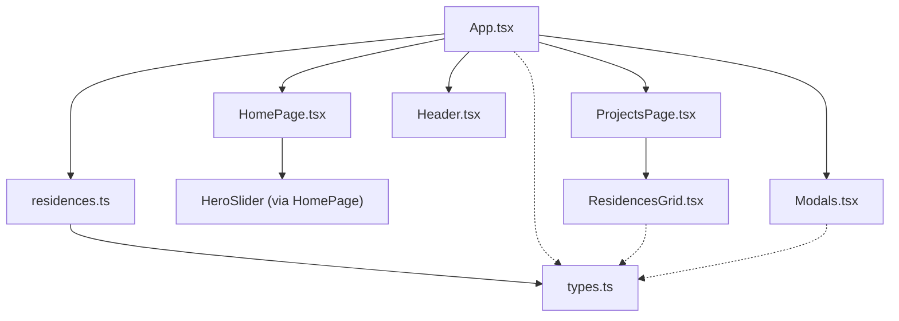
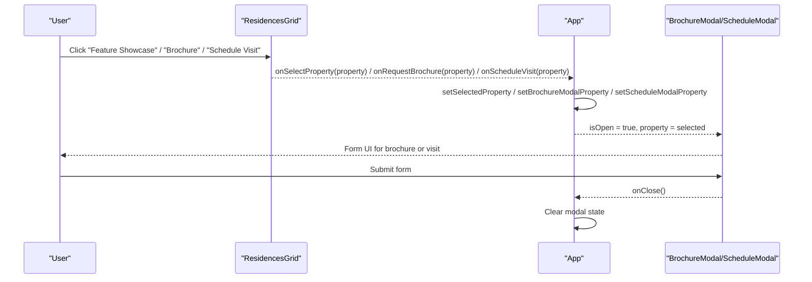
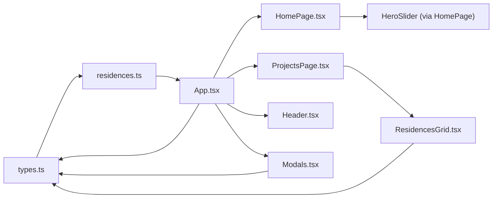

# Data Flow and Communication Patterns

<cite>
**Referenced Files in This Document**
- [residences.ts](file://src/data/residences.ts)
- [types.ts](file://src/types.ts)
- [App.tsx](file://src/App.tsx)
- [HomePage.tsx](file://src/pages/HomePage.tsx)
- [ProjectsPage.tsx](file://src/pages/ProjectsPage.tsx)
- [ResidencesGrid.tsx](file://src/components/ResidencesGrid.tsx)
- [Modals.tsx](file://src/components/Modals.tsx)
- [Header.tsx](file://src/components/Header.tsx)
</cite>

## Table of Contents
1. [Introduction](#introduction)
2. [Project Structure](#project-structure)
3. [Core Components](#core-components)
4. [Architecture Overview](#architecture-overview)
5. [Detailed Component Analysis](#detailed-component-analysis)
6. [Dependency Analysis](#dependency-analysis)
7. [Performance Considerations](#performance-considerations)
8. [Troubleshooting Guide](#troubleshooting-guide)
9. [Conclusion](#conclusion)

## Introduction
This document explains how static property data flows through the N-Square application, how components communicate via props and callbacks, and how user actions update state to drive UI changes. It focuses on:
- The source of static property data and its type-safe contracts
- Prop drilling and callback-based event flow from parent to child and back up
- Filtering and transformation patterns used for rendering lists
- Performance considerations for large datasets and efficient rendering
- Type safety across components using TypeScript interfaces

## Project Structure
At a high level:
- Static data is defined in a dedicated module and typed with shared interfaces
- The root component owns global state (theme, selected property, modals) and routes
- Pages receive data and callbacks as props and render feature-specific views
- Reusable components handle filtering, display, and user interactions
- Modals are controlled by state in the root component and receive context via props

**Diagram sources**
- [App.tsx:1-255](file://src/App.tsx#L1-L255)
- [HomePage.tsx:1-47](file://src/pages/HomePage.tsx#L1-L47)
- [ProjectsPage.tsx:1-35](file://src/pages/ProjectsPage.tsx#L1-L35)
- [ResidencesGrid.tsx:1-151](file://src/components/ResidencesGrid.tsx#L1-L151)
- [Modals.tsx:1-312](file://src/components/Modals.tsx#L1-L312)
- [residences.ts:1-190](file://src/data/residences.ts#L1-L190)
- [types.ts:1-60](file://src/types.ts#L1-L60)

**Section sources**
- [App.tsx:1-255](file://src/App.tsx#L1-L255)
- [residences.ts:1-190](file://src/data/residences.ts#L1-L190)
- [types.ts:1-60](file://src/types.ts#L1-L60)

## Core Components
- App: Root orchestrator that holds theme, active tab, selected property, modal states, and routing. It imports static data and passes it down as props or uses it to compute derived values.
- HomePage: Composes sections including HeroSlider and other content; forwards callbacks to open modals and select properties.
- ProjectsPage (page wrapper): Passes properties and callbacks into the actual projects view.
- ResidencesGrid: Renders a filtered grid of properties and emits events for selection, brochure requests, and visit scheduling.
- Modals: Controlled UI overlays for brochure and schedule forms, receiving the current property context via props.
- Header: Navigation and theme controls; triggers navigation and opens the visit modal bound to the selected property.

Key responsibilities:
- Data ownership resides at the root; children consume data via props
- User actions bubble up via callbacks to update root state
- Filtering occurs locally within list components for performance and simplicity

**Section sources**
- [App.tsx:15-255](file://src/App.tsx#L15-L255)
- [HomePage.tsx:10-47](file://src/pages/HomePage.tsx#L10-L47)
- [ProjectsPage.tsx:5-35](file://src/pages/ProjectsPage.tsx#L5-L35)
- [ResidencesGrid.tsx:5-151](file://src/components/ResidencesGrid.tsx#L5-L151)
- [Modals.tsx:5-312](file://src/components/Modals.tsx#L5-L312)
- [Header.tsx:6-328](file://src/components/Header.tsx#L6-L328)

## Architecture Overview
The application follows a unidirectional data flow:
- Static data is imported once and passed down as props
- State lives primarily in the root component
- Child components emit events via callback props
- Root updates state and re-renders affected parts

**Diagram sources**
- [ResidencesGrid.tsx:128-143](file://src/components/ResidencesGrid.tsx#L128-L143)
- [App.tsx:39-45](file://src/App.tsx#L39-L45)
- [App.tsx:151-161](file://src/App.tsx#L151-L161)
- [Modals.tsx:24-32](file://src/components/Modals.tsx#L24-L32)
- [Modals.tsx:181-184](file://src/components/Modals.tsx#L181-L184)

## Detailed Component Analysis

### Data Source and Types
- Static data: Properties and hero slides are exported from a single data module
- Shared types: Interfaces define Property, HeroSlide, and form payloads to ensure consistency across components

Data flow highlights:
- Root imports static data and passes arrays to pages/components
- Components rely on strict types to avoid runtime mismatches

**Section sources**
- [residences.ts:1-190](file://src/data/residences.ts#L1-L190)
- [types.ts:5-41](file://src/types.ts#L5-L41)
- [types.ts:43-60](file://src/types.ts#L43-L60)

### Root State Management (App)
State owned by App:
- Theme mode
- Active navigation tab
- Selected property
- Modal visibility and associated property
- Project filter for the projects route

Event handling:
- Opening brochure and schedule modals sets modal state with the relevant property
- Selecting a property updates the selected property and navigates to the residences view
- Routing logic syncs active tab with URL path

Derived data:
- Commercial page receives a filtered subset of properties based on type

**Section sources**
- [App.tsx:15-47](file://src/App.tsx#L15-L47)
- [App.tsx:51-85](file://src/App.tsx#L51-L85)
- [App.tsx:120-161](file://src/App.tsx#L120-L161)
- [App.tsx:201-224](file://src/App.tsx#L201-L224)

### Home Page and Hero Interaction
- HomePage composes sections and forwards callbacks to open modals and select properties
- Hero slider (consumed via HomePage) can trigger brochure/visit flows and property selection by id, which resolves to a full property object in the root

Flow summary:
- Slide action -> root handler -> resolve property by id -> open modal or update selected property

**Section sources**
- [HomePage.tsx:10-47](file://src/pages/HomePage.tsx#L10-L47)
- [App.tsx:120-135](file://src/App.tsx#L120-L135)

### Projects Page Wrapper
- Acts as a thin wrapper passing theme, initial filter, properties, and callbacks to the underlying projects view
- Ensures consistent prop contract across routes

**Section sources**
- [ProjectsPage.tsx:5-35](file://src/pages/ProjectsPage.tsx#L5-L35)

### ResidencesGrid: Filtering and Event Emission
Filtering pattern:
- Local state holds the active filter category
- Filtered list computed via array filter before rendering

Event emission:
- Each card exposes buttons that call provided callbacks with the property object
- Callbacks propagate to root for state updates and modal control

Rendering pattern:
- Maps over filtered results to render cards with images, specs, and actions

**Section sources**
- [ResidencesGrid.tsx:20-25](file://src/components/ResidencesGrid.tsx#L20-L25)
- [ResidencesGrid.tsx:60-147](file://src/components/ResidencesGrid.tsx#L60-L147)

### Modals: Controlled Forms and Context
- Brochure and Schedule modals receive the current property via props
- Local form state captures user input and submission status
- On submit, they transition to confirmation states and close on user action

Type safety:
- Form shapes are strictly typed to ensure required fields and correct value types

**Section sources**
- [Modals.tsx:12-32](file://src/components/Modals.tsx#L12-L32)
- [Modals.tsx:167-184](file://src/components/Modals.tsx#L167-L184)
- [types.ts:43-60](file://src/types.ts#L43-L60)

### Header: Navigation and Global Actions
- Controls theme toggling and navigation between tabs
- Opens the visit modal bound to the currently selected property
- Supports project dropdown filters that navigate to the projects route with an initial filter

**Section sources**
- [Header.tsx:6-22](file://src/components/Header.tsx#L6-L22)
- [Header.tsx:42-62](file://src/components/Header.tsx#L42-L62)
- [Header.tsx:207-234](file://src/components/Header.tsx#L207-L234)

## Dependency Analysis
Component relationships and data dependencies:

Observations:
- Single source of truth for data and types
- Root component centralizes state and coordinates cross-cutting concerns (routing, modals, theme)
- Leaf components remain focused on presentation and local interactions

**Diagram sources**
- [types.ts:1-60](file://src/types.ts#L1-L60)
- [residences.ts:1-190](file://src/data/residences.ts#L1-L190)
- [App.tsx:1-255](file://src/App.tsx#L1-L255)
- [HomePage.tsx:1-47](file://src/pages/HomePage.tsx#L1-L47)
- [ProjectsPage.tsx:1-35](file://src/pages/ProjectsPage.tsx#L1-L35)
- [ResidencesGrid.tsx:1-151](file://src/components/ResidencesGrid.tsx#L1-L151)
- [Modals.tsx:1-312](file://src/components/Modals.tsx#L1-L312)
- [Header.tsx:1-328](file://src/components/Header.tsx#L1-L328)

**Section sources**
- [App.tsx:1-255](file://src/App.tsx#L1-L255)
- [types.ts:1-60](file://src/types.ts#L1-L60)
- [residences.ts:1-190](file://src/data/residences.ts#L1-L190)

## Performance Considerations
- Filtering in list components:
  - Use lightweight array filtering for small to medium datasets
  - For larger datasets, consider memoization of filtered results and stable keys
- Rendering efficiency:
  - Ensure stable unique keys per item to minimize re-renders
  - Avoid heavy computations inside render loops; precompute where possible
- Conditional rendering:
  - Keep modal state minimal and only mount when needed
- Image loading:
  - Prefer lazy loading and appropriately sized images to reduce initial payload
- State updates:
  - Batch related updates in the root to prevent excessive re-renders
- Memoization opportunities:
  - Wrap expensive computations with memoization utilities if dataset grows
  - Consider virtualization for very large lists

[No sources needed since this section provides general guidance]

## Troubleshooting Guide
Common issues and resolutions:
- Property not found when resolving by id:
  - Ensure the id mapping exists in the static data and that the lookup falls back safely
- Modal does not close:
  - Verify onClose is wired and clears modal state in the root
- Incorrect filter behavior:
  - Confirm filter state type matches available categories and that filtering logic covers all cases
- Type errors after data changes:
  - Update shared interfaces and ensure all consumers align with new shapes

Validation tips:
- Check that callbacks are always provided to components expecting them
- Validate form inputs against their typed interfaces before submission

**Section sources**
- [App.tsx:120-135](file://src/App.tsx#L120-L135)
- [Modals.tsx:24-32](file://src/components/Modals.tsx#L24-L32)
- [ResidencesGrid.tsx:20-25](file://src/components/ResidencesGrid.tsx#L20-L25)

## Conclusion
The N-Square application employs a clear, type-safe, and scalable data flow:
- Static data is centralized and strongly typed
- Root state manages global concerns and coordinates communication
- Child components focus on presentation and emit events via callbacks
- Filtering and transformation occur close to the UI layer for responsiveness
- Modals are controlled by root state and receive contextual data via props

This architecture supports maintainability, testability, and future growth while keeping component responsibilities well-defined.