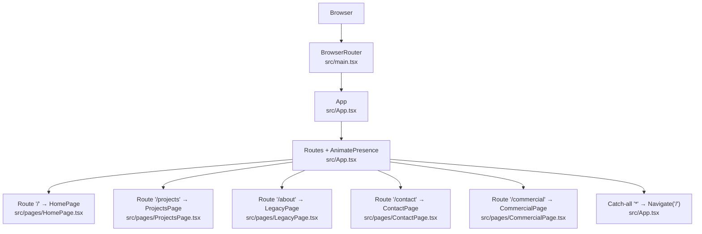
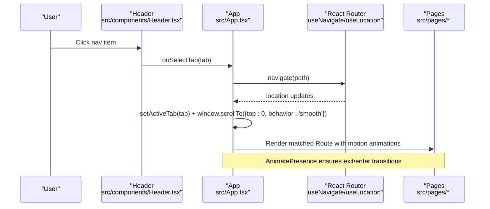
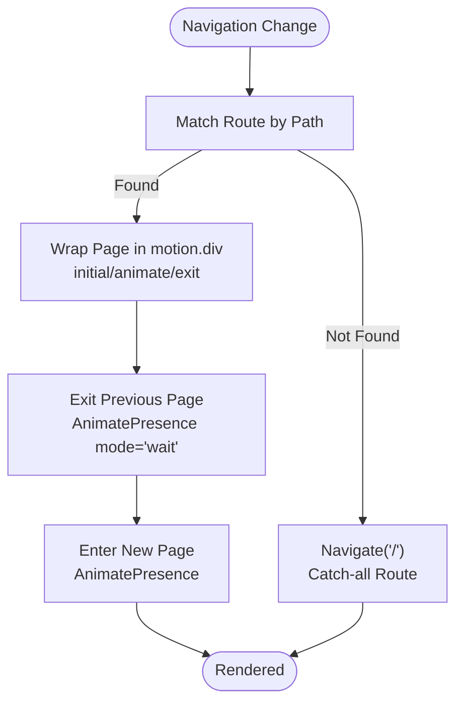
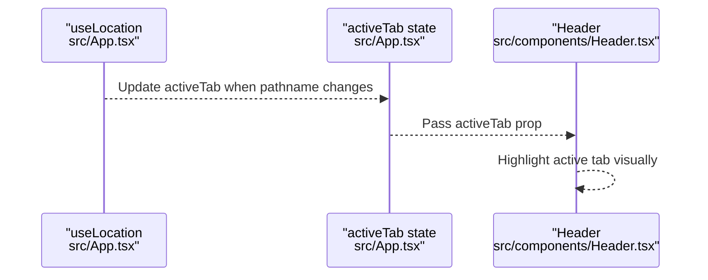
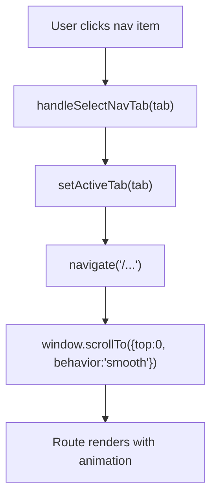
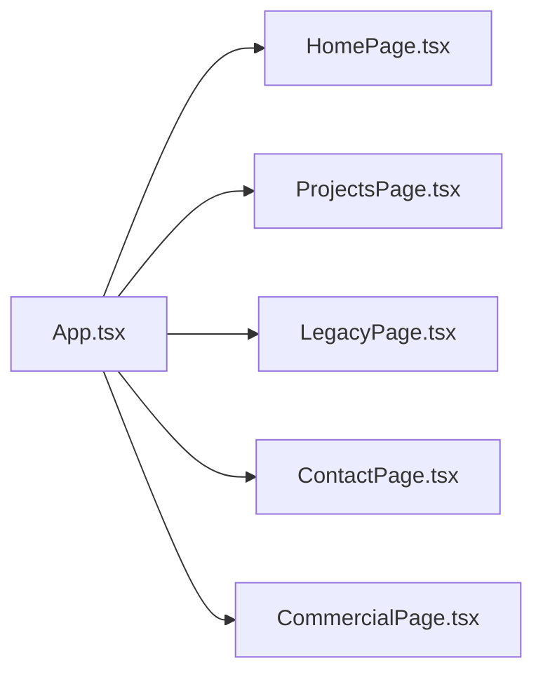
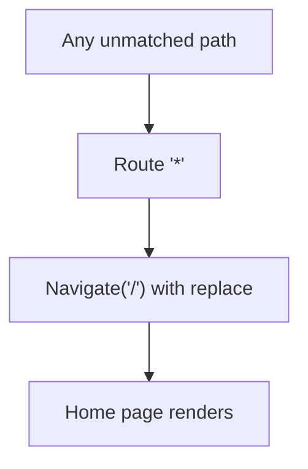
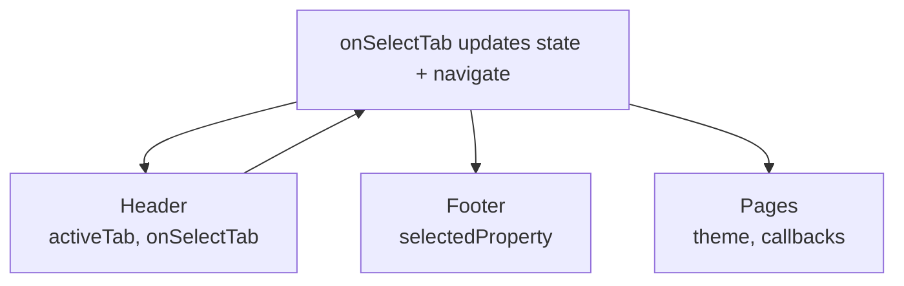
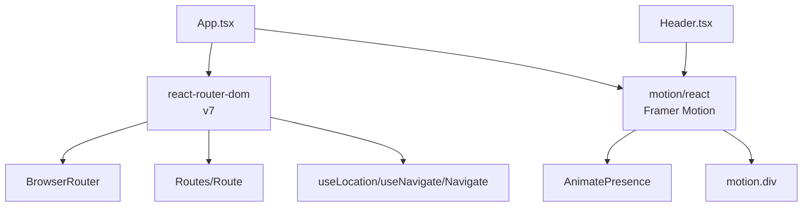

# Routing and Navigation Architecture

<cite>
**Referenced Files in This Document**
- [main.tsx](file://src/main.tsx)
- [App.tsx](file://src/App.tsx)
- [Header.tsx](file://src/components/Header.tsx)
- [HomePage.tsx](file://src/pages/HomePage.tsx)
- [ProjectsPage.tsx](file://src/pages/ProjectsPage.tsx)
- [LegacyPage.tsx](file://src/pages/LegacyPage.tsx)
- [ContactPage.tsx](file://src/pages/ContactPage.tsx)
- [CommercialPage.tsx](file://src/pages/CommercialPage.tsx)
- [types.ts](file://src/types.ts)
- [package.json](file://package.json)
</cite>

## Table of Contents
1. Introduction
2. Project Structure
3. Core Components
4. Architecture Overview
5. Detailed Component Analysis
6. Dependency Analysis
7. Performance Considerations
8. Troubleshooting Guide
9. Conclusion

## Introduction
This document explains the routing and navigation architecture implemented with React Router v7, animated page transitions using Framer Motion’s AnimatePresence (via motion/react), and how navigation state is synchronized with URL paths and active tab highlighting. It also covers programmatic navigation for smooth scrolling and tab switching, route-based code organization, dynamic page loading, default routes, error handling for undefined paths, and integration between routing and global state to deliver a consistent user experience.

## Project Structure
The application uses a single-page app structure with React Router v7 providing client-side routing. The root router is configured in the entry file, and the App component defines all routes with animated transitions. Pages are organized under src/pages and composed via Route elements.

**Diagram sources**
- [main.tsx:7-13](file://src/main.tsx#L7-L13)
- [App.tsx:106-228](file://src/App.tsx#L106-L228)

**Section sources**
- [main.tsx:1-14](file://src/main.tsx#L1-L14)
- [App.tsx:106-228](file://src/App.tsx#L106-L228)

## Core Components
- BrowserRouter: Provides routing context to the entire app.
- Routes and Route: Declarative route definitions keyed by path, each rendering a page wrapped in motion.div for enter/exit animations.
- AnimatePresence: Wraps Routes to animate page transitions with mode="wait" so exit completes before next enter begins.
- useLocation and useNavigate: Enable reading current path and performing programmatic navigation from anywhere in the component tree.
- Active Tab Sync: A useEffect maps URL paths to an activeTab state that drives header highlighting and behavior.
- Programmatic Navigation: handleSelectNavTab navigates to the correct path and scrolls to top smoothly.

Key responsibilities:
- Centralized route configuration and animation orchestration live in App.
- Header coordinates navigation actions and reflects active state.
- Each page component focuses on content and local interactions.

**Section sources**
- [App.tsx:15-85](file://src/App.tsx#L15-L85)
- [App.tsx:106-228](file://src/App.tsx#L106-L228)
- [Header.tsx:42-62](file://src/components/Header.tsx#L42-L62)

## Architecture Overview
The routing layer is centered around a single App component that owns:
- Theme and selected property state
- Active tab state synchronized with URL
- Modal states for brochure and visit scheduling
- Route definitions with per-route motion animations
- Catch-all redirect to home

**Diagram sources**
- [Header.tsx:42-62](file://src/components/Header.tsx#L42-L62)
- [App.tsx:51-85](file://src/App.tsx#L51-L85)
- [App.tsx:106-228](file://src/App.tsx#L106-L228)

## Detailed Component Analysis

### Route Configuration and Animated Transitions
- All routes are defined inside <AnimatePresence mode="wait"> to ensure sequential transitions.
- Each Route wraps its element in a motion.div with initial/animate/exit props for fade and vertical slide effects.
- key={location.pathname} on Routes forces re-render and restarts animations on navigation.

**Diagram sources**
- [App.tsx:106-228](file://src/App.tsx#L106-L228)

**Section sources**
- [App.tsx:106-228](file://src/App.tsx#L106-L228)

### Navigation State Synchronization and Active Tab Highlighting
- A useEffect watches location.pathname and sets activeTab based on the current path mapping.
- Header receives activeTab and highlights the corresponding tab; it also exposes onSelectTab to trigger navigation.
- When navigating programmatically, scrollTo top ensures consistent UX across pages.

**Diagram sources**
- [App.tsx:51-65](file://src/App.tsx#L51-L65)
- [Header.tsx:87-205](file://src/components/Header.tsx#L87-L205)

**Section sources**
- [App.tsx:51-85](file://src/App.tsx#L51-L85)
- [Header.tsx:87-205](file://src/components/Header.tsx#L87-L205)

### Programmatic Navigation and Smooth Scrolling
- handleSelectNavTab centralizes navigation logic: it updates activeTab, navigates to the appropriate path, and scrolls to the top with smooth behavior.
- This pattern ensures consistent scroll behavior and UI state after every navigation.

**Diagram sources**
- [App.tsx:67-85](file://src/App.tsx#L67-L85)

**Section sources**
- [App.tsx:67-85](file://src/App.tsx#L67-L85)

### Route-Based Code Organization and Dynamic Loading
- Pages are split into separate files under src/pages and imported directly into App.
- Each route mounts a lightweight page wrapper that composes feature components, keeping concerns separated and enabling lazy-loading patterns if needed in the future.

**Diagram sources**
- [App.tsx:8-12](file://src/App.tsx#L8-L12)
- [HomePage.tsx:1-47](file://src/pages/HomePage.tsx#L1-L47)
- [ProjectsPage.tsx:1-35](file://src/pages/ProjectsPage.tsx#L1-L35)
- [LegacyPage.tsx:1-16](file://src/pages/LegacyPage.tsx#L1-L16)
- [ContactPage.tsx:1-77](file://src/pages/ContactPage.tsx#L1-L77)
- [CommercialPage.tsx:1-32](file://src/pages/CommercialPage.tsx#L1-L32)

**Section sources**
- [App.tsx:8-12](file://src/App.tsx#L8-L12)
- [HomePage.tsx:1-47](file://src/pages/HomePage.tsx#L1-L47)
- [ProjectsPage.tsx:1-35](file://src/pages/ProjectsPage.tsx#L1-L35)
- [LegacyPage.tsx:1-16](file://src/pages/LegacyPage.tsx#L1-L16)
- [ContactPage.tsx:1-77](file://src/pages/ContactPage.tsx#L1-L77)
- [CommercialPage.tsx:1-32](file://src/pages/CommercialPage.tsx#L1-L32)

### Default Routes and Error Handling for Undefined Paths
- A catch-all route redirects unknown paths to the home page, ensuring users always land on a valid route.
- This acts as a simple guard against undefined or mistyped URLs.

**Diagram sources**
- [App.tsx:226-227](file://src/App.tsx#L226-L227)

**Section sources**
- [App.tsx:226-227](file://src/App.tsx#L226-L227)

### Integration Between Routing and Global State
- App holds theme, activeTab, selectedProperty, and modal states. These are passed down to Header and Footer and used by pages to maintain consistency across navigation.
- Navigation triggers update both URL and UI state (activeTab, scroll position), while pages consume shared state to render consistently.

**Diagram sources**
- [App.tsx:15-22](file://src/App.tsx#L15-L22)
- [App.tsx:94-104](file://src/App.tsx#L94-L104)
- [App.tsx:231-235](file://src/App.tsx#L231-L235)
- [Header.tsx:6-22](file://src/components/Header.tsx#L6-L22)

**Section sources**
- [App.tsx:15-22](file://src/App.tsx#L15-L22)
- [App.tsx:94-104](file://src/App.tsx#L94-L104)
- [App.tsx:231-235](file://src/App.tsx#L231-L235)
- [Header.tsx:6-22](file://src/components/Header.tsx#L6-L22)

## Dependency Analysis
- React Router v7 provides BrowserRouter, Routes, Route, useLocation, useNavigate, and Navigate.
- Framer Motion (via motion/react) supplies motion and AnimatePresence for page transitions.
- Types define NavTab and other domain models used across routing and UI.

**Diagram sources**
- [package.json:21-25](file://package.json#L21-L25)
- [main.tsx:3-11](file://src/main.tsx#L3-L11)
- [App.tsx:1-13](file://src/App.tsx#L1-L13)
- [Header.tsx:1-5](file://src/components/Header.tsx#L1-L5)

**Section sources**
- [package.json:13-25](file://package.json#L13-L25)
- [main.tsx:1-14](file://src/main.tsx#L1-L14)
- [App.tsx:1-13](file://src/App.tsx#L1-L13)
- [Header.tsx:1-5](file://src/components/Header.tsx#L1-L5)

## Performance Considerations
- AnimatePresence mode="wait" prevents overlapping animations, reducing jank during rapid navigation.
- Using key={location.pathname} on Routes ensures proper unmount/remount lifecycle for animations without stale state.
- Keep page bundles small; consider code splitting per route if the app grows significantly.
- Avoid heavy computations in route render paths; defer non-critical work until after mount.

[No sources needed since this section provides general guidance]

## Troubleshooting Guide
- Unexpected active tab: Ensure the useEffect mapping pathname to activeTab includes all expected paths. Verify that programmatic navigation calls match these mappings.
- Animations not triggering: Confirm AnimatePresence wraps Routes and that key changes on navigation.
- Redirect loops: Validate catch-all route only redirects to a safe default and does not create cycles.
- Scroll not resetting: Confirm programmatic navigation includes scrollTo({top:0, behavior:'smooth'}).

**Section sources**
- [App.tsx:51-85](file://src/App.tsx#L51-L85)
- [App.tsx:106-228](file://src/App.tsx#L106-L228)

## Conclusion
The routing architecture leverages React Router v7 for declarative routes and Framer Motion for polished page transitions. Navigation state is synchronized with the URL to keep the header active tab consistent, while programmatic navigation ensures smooth scrolling and predictable UX. A catch-all route handles undefined paths gracefully. Shared state in App ties together routing, UI, and modals for a cohesive experience.

[No sources needed since this section summarizes without analyzing specific files]