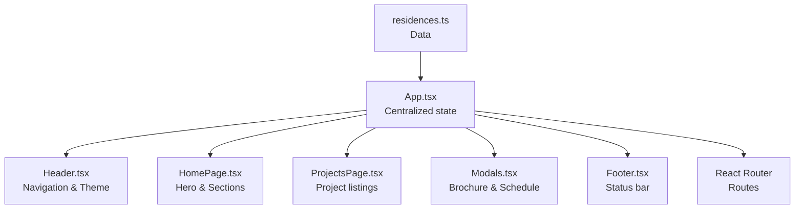
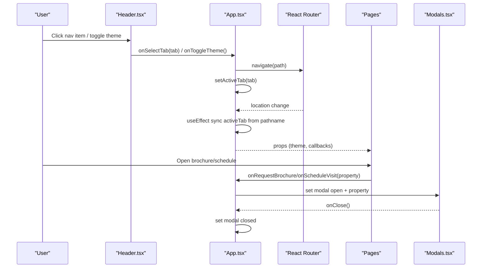
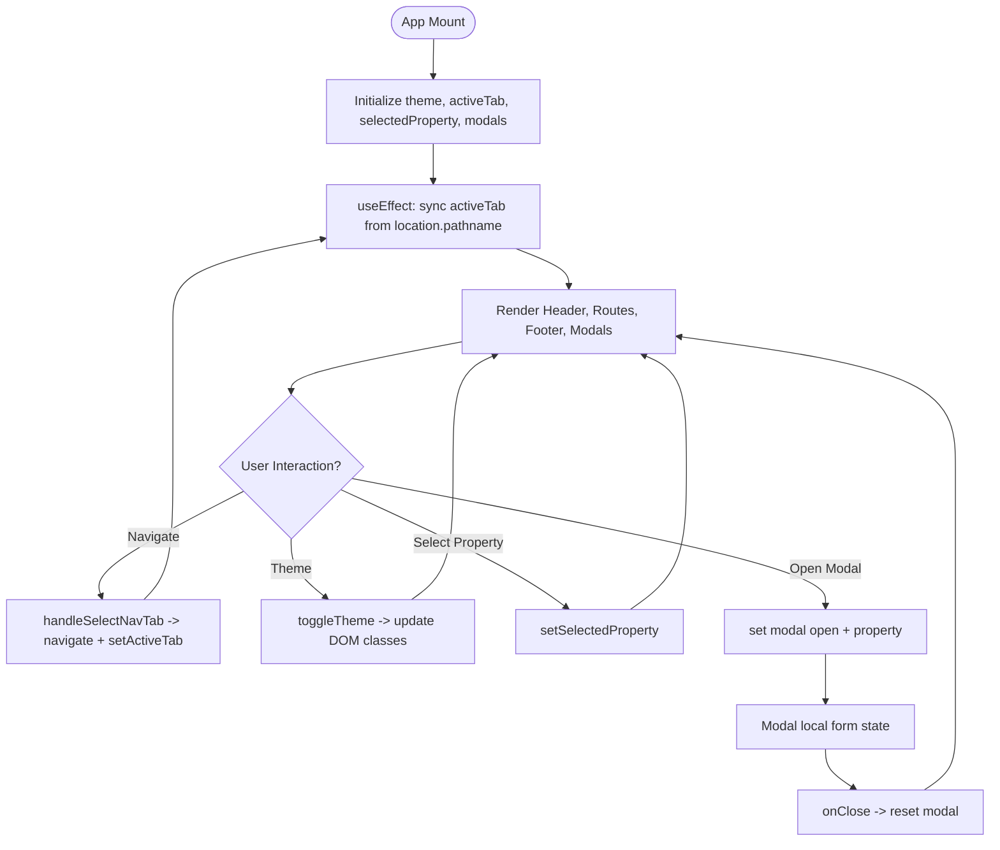
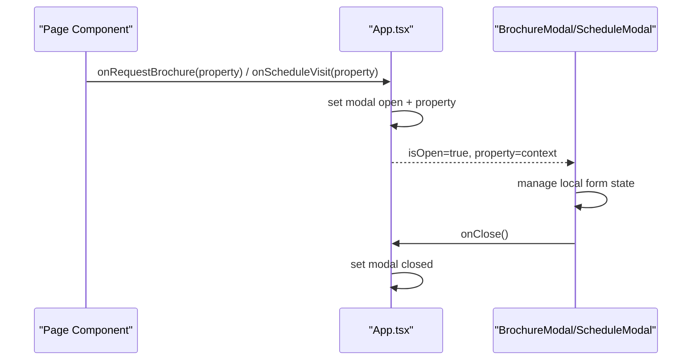
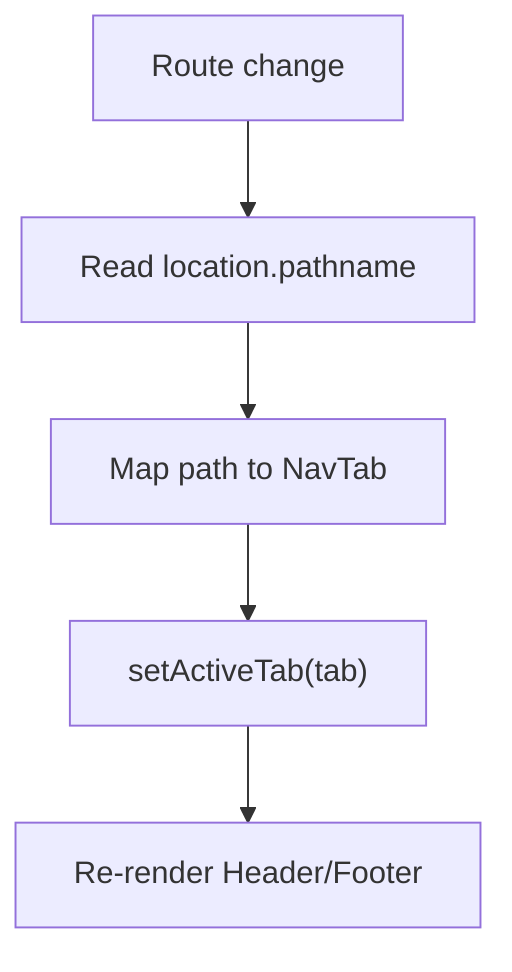
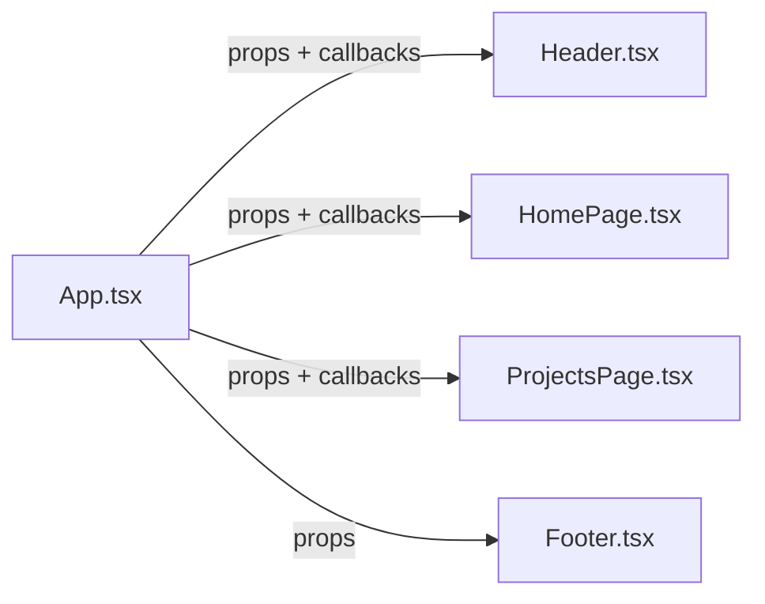
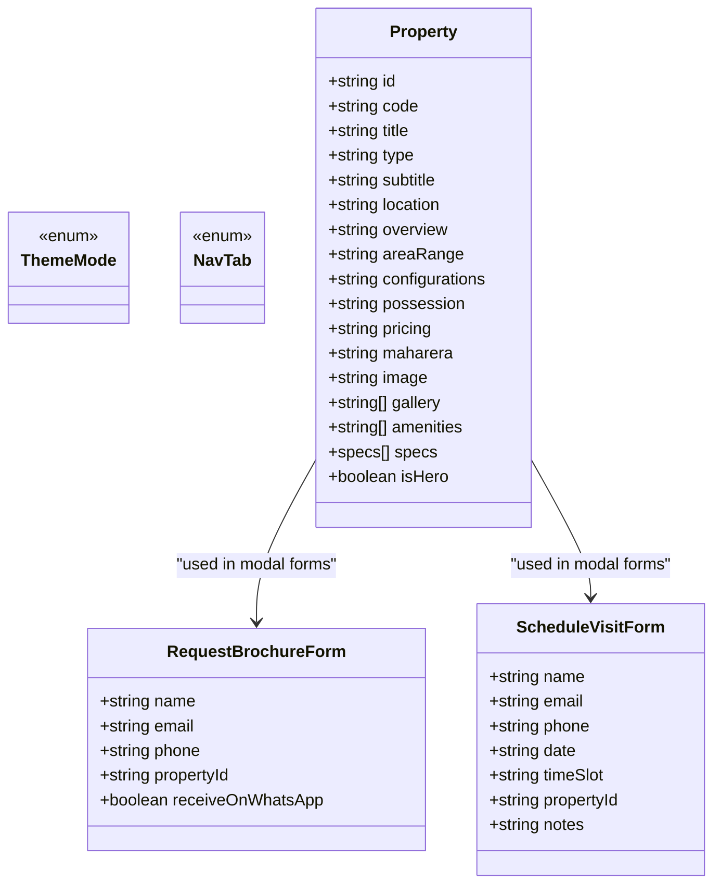
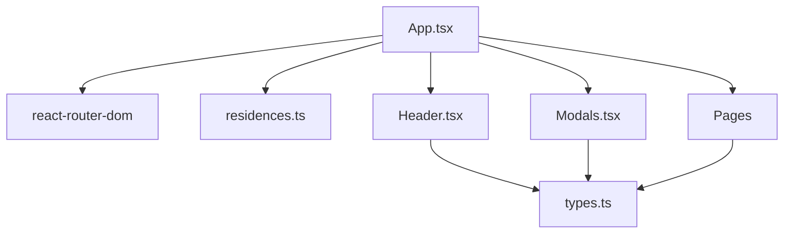

# State Management Strategy

<cite>
**Referenced Files in This Document**
- [App.tsx](file://src/App.tsx)
- [types.ts](file://src/types.ts)
- [Modals.tsx](file://src/components/Modals.tsx)
- [Header.tsx](file://src/components/Header.tsx)
- [HomePage.tsx](file://src/pages/HomePage.tsx)
- [ProjectsPage.tsx](file://src/pages/ProjectsPage.tsx)
- [residences.ts](file://src/data/residences.ts)
</cite>

## Table of Contents
1. Introduction
2. Project Structure
3. Core Components
4. Architecture Overview
5. Detailed Component Analysis
6. Dependency Analysis
7. Performance Considerations
8. Troubleshooting Guide
9. Conclusion

## Introduction
This document explains the state management strategy used in the N-Square application. The app uses a centralized, React-based approach with useState at the App level to manage theme, navigation, and property selection. It also documents how modal states for brochure requests and visit scheduling are managed, how URL routing is synchronized with active tab state, and how TypeScript interfaces ensure type safety across components. Best practices for avoiding unnecessary re-renders and managing complex interactions are included.

## Project Structure
The application follows a clear separation of concerns:
- App-level state (theme, active tab, selected property, modals) lives in the root component.
- Pages and UI components receive state via props and emit events upward through callbacks.
- Types define consistent data structures for properties, forms, and navigation tabs.

**Diagram sources**
- [App.tsx:15-250](file://src/App.tsx#L15-L250)
- [Header.tsx:15-328](file://src/components/Header.tsx#L15-L328)
- [HomePage.tsx:10-47](file://src/pages/HomePage.tsx#L10-L47)
- [ProjectsPage.tsx:5-35](file://src/pages/ProjectsPage.tsx#L5-L35)
- [Modals.tsx:5-312](file://src/components/Modals.tsx#L5-L312)
- [residences.ts:1-190](file://src/data/residences.ts#L1-L190)

**Section sources**
- [App.tsx:15-250](file://src/App.tsx#L15-L250)
- [types.ts:1-60](file://src/types.ts#L1-L60)

## Core Components
- App component holds global state:
  - Theme mode (light/dark)
  - Active navigation tab
  - Selected property
  - Modal visibility and associated property context
  - Project filter state
- Header receives theme, active tab, and callbacks to toggle theme, navigate, and open schedule modal.
- Pages act as thin wrappers that pass down props and forward user actions to App via callbacks.
- Modals encapsulate form state locally while relying on App-provided property context and close handlers.

Key responsibilities:
- Centralized state ownership at App
- Lifting state when cross-component communication is needed
- Synchronizing URL routes with active tab
- Managing modal lifecycle and form state within modals

**Section sources**
- [App.tsx:15-85](file://src/App.tsx#L15-L85)
- [Header.tsx:6-22](file://src/components/Header.tsx#L6-L22)
- [HomePage.tsx:10-24](file://src/pages/HomePage.tsx#L10-L24)
- [ProjectsPage.tsx:5-21](file://src/pages/ProjectsPage.tsx#L5-L21)
- [Modals.tsx:5-312](file://src/components/Modals.tsx#L5-L312)

## Architecture Overview
The application uses a top-down state flow with event-driven updates:
- App owns state and passes it down via props.
- Child components call back functions to update App state.
- Routing and active tab are synchronized using React Router hooks.
- Modals are controlled by boolean flags and associated property context.

**Diagram sources**
- [App.tsx:51-85](file://src/App.tsx#L51-L85)
- [App.tsx:120-160](file://src/App.tsx#L120-L160)
- [Header.tsx:55-62](file://src/components/Header.tsx#L55-L62)
- [Modals.tsx:24-32](file://src/components/Modals.tsx#L24-L32)
- [Modals.tsx:181-184](file://src/components/Modals.tsx#L181-L184)

## Detailed Component Analysis

### Centralized State at App Level
- Theme management:
  - State stored in App; applied to DOM classes via useEffect to switch between light and dark themes.
  - Toggle function flips theme and updates DOM accordingly.
- Navigation state:
  - Active tab is derived from URL path via useEffect and updated via handleSelectNavTab.
  - Navigation triggers route changes and smooth scrolling.
- Property selection:
  - Selected property is lifted to App so multiple pages can share context (e.g., footer displays Maharera info).
  - Selection is updated from page components via callbacks.
- Modal state:
  - Two modal instances use separate state variables for visibility and associated property.
  - Opening modals sets the current property context; closing resets visibility.

**Diagram sources**
- [App.tsx:15-45](file://src/App.tsx#L15-L45)
- [App.tsx:51-85](file://src/App.tsx#L51-L85)
- [App.tsx:120-160](file://src/App.tsx#L120-L160)
- [App.tsx:237-250](file://src/App.tsx#L237-L250)

**Section sources**
- [App.tsx:15-85](file://src/App.tsx#L15-L85)
- [App.tsx:120-160](file://src/App.tsx#L120-L160)
- [App.tsx:237-250](file://src/App.tsx#L237-L250)

### Modal State Management Pattern
- Brochure modal:
  - Controlled by a boolean flag and a property context passed from App.
  - Local form state manages inputs and submission feedback.
  - On submit, shows confirmation and allows direct download; reset closes modal.
- Schedule modal:
  - Similar pattern with date/time selection and confirmation state.
  - Uses property context to prefill form fields where applicable.

**Diagram sources**
- [App.tsx:120-160](file://src/App.tsx#L120-L160)
- [App.tsx:237-250](file://src/App.tsx#L237-L250)
- [Modals.tsx:24-32](file://src/components/Modals.tsx#L24-L32)
- [Modals.tsx:181-184](file://src/components/Modals.tsx#L181-L184)

**Section sources**
- [Modals.tsx:5-158](file://src/components/Modals.tsx#L5-L158)
- [Modals.tsx:160-312](file://src/components/Modals.tsx#L160-L312)

### URL Routing and Active Tab Synchronization
- Active tab is kept in sync with the current URL path:
  - useEffect listens to location changes and updates activeTab accordingly.
  - When user selects a tab, navigate updates the URL and scrollTo top.
- This ensures the header reflects the current page and vice versa.

**Diagram sources**
- [App.tsx:51-65](file://src/App.tsx#L51-L65)
- [App.tsx:67-85](file://src/App.tsx#L67-L85)

**Section sources**
- [App.tsx:51-85](file://src/App.tsx#L51-L85)

### Cross-Component Communication via Props and Callbacks
- Header communicates navigation and theme toggling via callbacks provided by App.
- Pages communicate property selection and modal triggers via callbacks.
- Footer reads selected property from App to display relevant details.

**Diagram sources**
- [App.tsx:94-104](file://src/App.tsx#L94-L104)
- [App.tsx:120-160](file://src/App.tsx#L120-L160)
- [App.tsx:231-235](file://src/App.tsx#L231-L235)

**Section sources**
- [Header.tsx:6-22](file://src/components/Header.tsx#L6-L22)
- [HomePage.tsx:10-24](file://src/pages/HomePage.tsx#L10-L24)
- [ProjectsPage.tsx:5-21](file://src/pages/ProjectsPage.tsx#L5-L21)
- [App.tsx:94-104](file://src/App.tsx#L94-L104)
- [App.tsx:231-235](file://src/App.tsx#L231-L235)

### Type-Safe State Management with TypeScript
- Shared types define consistent structures:
  - ThemeMode and NavTab constrain theme and navigation values.
  - Property defines all fields for real estate listings.
  - Form interfaces enforce structure for brochure and schedule forms.
- Using these types ensures compile-time checks and better developer experience.

**Diagram sources**
- [types.ts:1-60](file://src/types.ts#L1-L60)

**Section sources**
- [types.ts:1-60](file://src/types.ts#L1-L60)

## Dependency Analysis
- App depends on:
  - React Router for navigation and location synchronization
  - Data module for properties and hero slides
  - Header, pages, and modals for rendering and interaction
- Header depends on:
  - Types for theme and navigation
  - Framer Motion for animations
- Modals depend on:
  - Types for forms and theme
  - Icons for UI elements

**Diagram sources**
- [App.tsx:1-13](file://src/App.tsx#L1-L13)
- [Header.tsx:1-4](file://src/components/Header.tsx#L1-L4)
- [Modals.tsx:1-3](file://src/components/Modals.tsx#L1-L3)
- [residences.ts:1-2](file://src/data/residences.ts#L1-L2)

**Section sources**
- [App.tsx:1-13](file://src/App.tsx#L1-L13)
- [Header.tsx:1-4](file://src/components/Header.tsx#L1-L4)
- [Modals.tsx:1-3](file://src/components/Modals.tsx#L1-L3)
- [residences.ts:1-2](file://src/data/residences.ts#L1-L2)

## Performance Considerations
- Avoid unnecessary re-renders:
  - Memoize expensive computations or lists if they grow large.
  - Use stable callback references (e.g., useCallback) for handlers passed to child components to prevent prop churn.
- Minimize state scope:
  - Keep modal form state local to modals to avoid App-level bloat.
  - Lift only necessary state (e.g., selected property) to shared parents.
- Efficient routing updates:
  - Batch navigation and scroll behavior to reduce layout thrashing.
- Theme application:
  - Apply CSS classes once per theme change rather than repeatedly toggling styles inline.

[No sources needed since this section provides general guidance]

## Troubleshooting Guide
- Modal not closing:
  - Ensure onClose handler is correctly wired and resets modal state in App.
  - Verify modal isOpen prop reflects App state accurately.
- Active tab mismatch:
  - Check useEffect syncing logic against current routes.
  - Confirm handleSelectNavTab navigates to correct paths and updates activeTab.
- Property context missing in modals:
  - Validate that opening modals sets both visibility and property context.
  - Ensure fallback property handling when property is null.

**Section sources**
- [App.tsx:237-250](file://src/App.tsx#L237-L250)
- [App.tsx:51-85](file://src/App.tsx#L51-L85)
- [Modals.tsx:22-32](file://src/components/Modals.tsx#L22-L32)
- [Modals.tsx:179-184](file://src/components/Modals.tsx#L179-L184)

## Conclusion
N-Square employs a straightforward yet robust centralized state strategy using React’s useState at the App level. This approach simplifies cross-component communication, ensures consistent UI behavior, and maintains type safety through TypeScript interfaces. By lifting state where needed and synchronizing routing with active tab, the app delivers a cohesive user experience. Following best practices like memoization, minimal state scope, and efficient updates helps maintain performance as the application grows.

[No sources needed since this section summarizes without analyzing specific files]