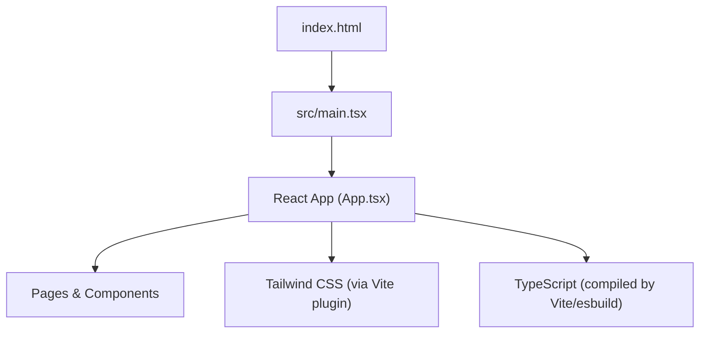
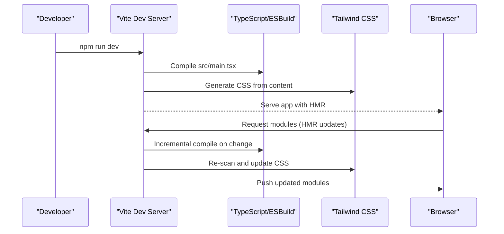
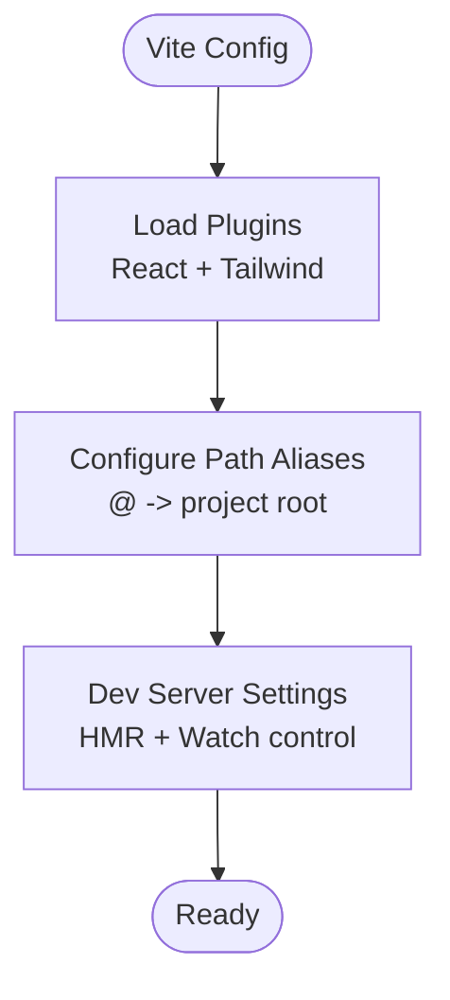
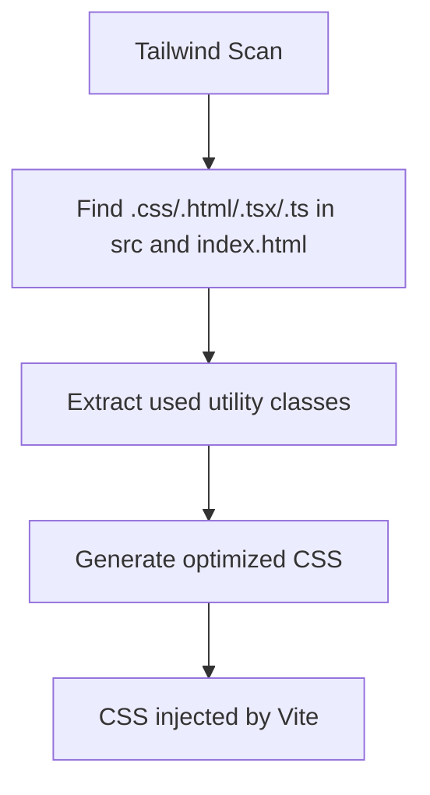
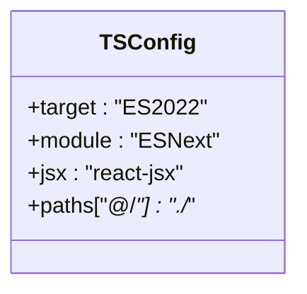
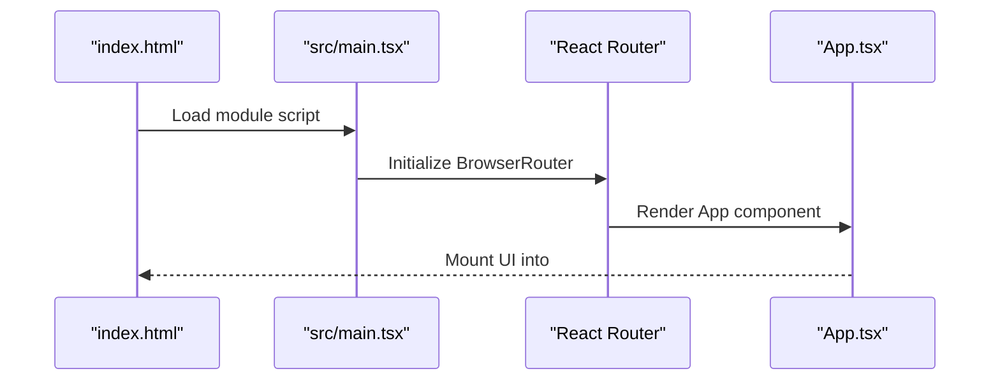
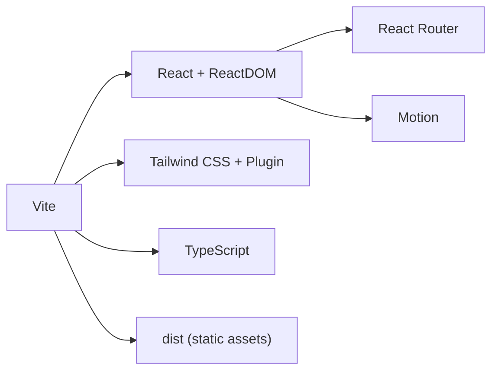

# Build and Deployment

<cite>
**Referenced Files in This Document**
- [vite.config.ts](file://vite.config.ts)
- [package.json](file://package.json)
- [tsconfig.json](file://tsconfig.json)
- [tailwind.config.cjs](file://tailwind.config.cjs)
- [index.html](file://index.html)
- [src/main.tsx](file://src/main.tsx)
- [.gitignore](file://.gitignore)
</cite>

## Table of Contents
1. [Introduction](#introduction)
2. [Project Structure](#project-structure)
3. [Core Components](#core-components)
4. [Architecture Overview](#architecture-overview)
5. [Detailed Component Analysis](#detailed-component-analysis)
6. [Dependency Analysis](#dependency-analysis)
7. [Performance Considerations](#performance-considerations)
8. [Troubleshooting Guide](#troubleshooting-guide)
9. [Conclusion](#conclusion)
10. [Appendices](#appendices)

## Introduction
This document provides comprehensive build and deployment guidance for the N-Square real estate website built with Vite, React, TypeScript, and Tailwind CSS. It covers development server configuration, production builds, asset processing, environment variables, bundle optimization, deployment preparation, CI/CD setup examples, monitoring integration, and troubleshooting strategies.

## Project Structure
The project is a modern Vite + React application:
- Entry point HTML defines the root element and loads the module entry script.
- The application bootstraps React via the main entry file and uses React Router for navigation.
- Styling is handled by Tailwind CSS with a custom theme extension.
- TypeScript is configured to target modern JavaScript and use bundler module resolution.
- Vite plugins include React and Tailwind CSS; an alias maps @ to the project root.

**Diagram sources**
- [index.html:1-17](file://index.html#L1-L17)
- [src/main.tsx:1-14](file://src/main.tsx#L1-L14)

**Section sources**
- [index.html:1-17](file://index.html#L1-L17)
- [src/main.tsx:1-14](file://src/main.tsx#L1-L14)
- [tailwind.config.cjs:1-15](file://tailwind.config.cjs#L1-L15)
- [tsconfig.json:1-27](file://tsconfig.json#L1-L27)
- [vite.config.ts:1-22](file://vite.config.ts#L1-L22)

## Core Components
- Development server:
  - Starts on port 3000 and binds to all interfaces for local network access.
  - Hot Module Replacement (HMR) can be disabled via an environment variable to reduce CPU usage.
- Production build:
  - Uses Vite’s default optimizations for React and modern browsers.
  - Outputs optimized assets into the dist directory.
- Asset processing:
  - Tailwind CSS scans source files to generate minimal CSS.
  - Fonts are preconnected from Google Fonts for faster loading.
- TypeScript:
  - Targets ES2022, uses bundler module resolution, and JSX transform via react-jsx.
  - Path aliases allow importing from @/* as relative paths.

**Section sources**
- [package.json:6-12](file://package.json#L6-L12)
- [vite.config.ts:6-21](file://vite.config.ts#L6-L21)
- [tailwind.config.cjs:1-15](file://tailwind.config.cjs#L1-L15)
- [tsconfig.json:1-27](file://tsconfig.json#L1-L27)
- [index.html:1-17](file://index.html#L1-L17)

## Architecture Overview
The build pipeline integrates Vite, React, Tailwind CSS, and TypeScript:
- Vite compiles TypeScript and JSX, bundles modules, and optimizes assets.
- Tailwind CSS generates scoped styles based on content patterns.
- The dev server supports HMR and configurable watching behavior.
- Production builds produce static assets suitable for any static hosting or CDN.

**Diagram sources**
- [vite.config.ts:6-21](file://vite.config.ts#L6-L21)
- [tailwind.config.cjs:1-15](file://tailwind.config.cjs#L1-L15)
- [package.json:6-12](file://package.json#L6-L12)

## Detailed Component Analysis

### Vite Configuration
- Plugins:
  - React plugin enables JSX transformation and fast refresh.
  - Tailwind CSS plugin processes styles during build and dev.
- Aliases:
  - Maps @ to the project root for cleaner imports.
- Development server:
  - HMR enabled by default; can be disabled via environment variable.
  - File watching can be disabled when HMR is off to save CPU.

**Diagram sources**
- [vite.config.ts:1-22](file://vite.config.ts#L1-L22)

**Section sources**
- [vite.config.ts:1-22](file://vite.config.ts#L1-L22)

### Tailwind CSS Integration
- Content scanning:
  - Scans index.html and all source files under src for class usage.
- Theme extensions:
  - Adds custom gold color palette used across the UI.
- Output:
  - Produces minimal CSS tailored to used classes.

**Diagram sources**
- [tailwind.config.cjs:1-15](file://tailwind.config.cjs#L1-L15)

**Section sources**
- [tailwind.config.cjs:1-15](file://tailwind.config.cjs#L1-L15)

### TypeScript Configuration
- Targeting:
  - Compiles to ES2022 for modern environments.
- Module resolution:
  - Uses bundler strategy compatible with Vite.
- JSX:
  - Uses react-jsx transform for efficient rendering.
- Paths:
  - Supports @/* alias matching Vite alias.

**Diagram sources**
- [tsconfig.json:1-27](file://tsconfig.json#L1-L27)

**Section sources**
- [tsconfig.json:1-27](file://tsconfig.json#L1-L27)

### Application Entry and Routing
- Bootstrapping:
  - Creates a React root and renders the app inside the root div.
- Routing:
  - Uses React Router to manage page navigation.
- Styling:
  - Imports global CSS which includes Tailwind directives.

**Diagram sources**
- [index.html:1-17](file://index.html#L1-L17)
- [src/main.tsx:1-14](file://src/main.tsx#L1-L14)

**Section sources**
- [index.html:1-17](file://index.html#L1-L17)
- [src/main.tsx:1-14](file://src/main.tsx#L1-L14)

## Dependency Analysis
Key dependencies and their roles:
- Vite: Build tool and dev server.
- React and ReactDOM: UI library and runtime.
- React Router: Client-side routing.
- Tailwind CSS and Vite plugin: Utility-first styling and build-time processing.
- Motion: Animation library used in components.
- Express and dotenv: Optional server utilities included but not required for static hosting.

**Diagram sources**
- [package.json:13-36](file://package.json#L13-L36)

**Section sources**
- [package.json:13-36](file://package.json#L13-L36)

## Performance Considerations
- Development performance:
  - Disable HMR and file watching via environment variable to reduce CPU usage when needed.
- Production bundle:
  - Vite automatically minifies and optimizes assets; ensure unused code is tree-shaken by avoiding large unused dependencies.
- CSS optimization:
  - Tailwind scans only necessary files to minimize CSS size.
- Fonts:
  - Preconnect to font providers reduces latency.
- Static hosting:
  - Deploy the dist folder to any static host or CDN for optimal delivery.

[No sources needed since this section provides general guidance]

## Troubleshooting Guide
Common issues and resolutions:
- HMR not working:
  - Ensure DISABLE_HMR is not set to true unintentionally.
  - Confirm the dev server is running and accessible at the expected port.
- Tailwind classes not applied:
  - Verify content paths include all relevant directories and file types.
  - Check that the Tailwind plugin is loaded in Vite config.
- TypeScript path alias errors:
  - Ensure tsconfig paths match Vite alias configuration.
- Environment variables:
  - Use .env files for local configuration; ensure they are ignored by version control.
- Large bundle sizes:
  - Remove unused dependencies and avoid heavy libraries unless necessary.
  - Leverage code splitting by lazy-loading routes and components where appropriate.

**Section sources**
- [vite.config.ts:14-19](file://vite.config.ts#L14-L19)
- [tailwind.config.cjs:1-15](file://tailwind.config.cjs#L1-L15)
- [tsconfig.json:18-22](file://tsconfig.json#L18-L22)
- [.gitignore:1-8](file://.gitignore#L1-L8)

## Conclusion
The N-Square website leverages Vite for fast development and optimized production builds. With Tailwind CSS for efficient styling, TypeScript for type safety, and React for interactivity, the project is well-suited for modern web deployment. By following the guidance in this document, you can confidently configure the development server, optimize builds, deploy to various platforms, integrate CI/CD, and monitor performance effectively.

[No sources needed since this section summarizes without analyzing specific files]

## Appendices

### Build Scripts and Commands
- Development:
  - Run the dev server with HMR and network access.
- Build:
  - Generate production-ready static assets.
- Preview:
  - Serve the built output locally for testing.
- Clean:
  - Remove build artifacts and temporary files.
- Lint:
  - Type-check TypeScript without emitting files.

**Section sources**
- [package.json:6-12](file://package.json#L6-L12)

### Environment Variables
- DISABLE_HMR:
  - Disables HMR and file watching when set to true.
- Local secrets:
  - Store sensitive values in .env files; ensure they are excluded from version control.

**Section sources**
- [vite.config.ts:14-19](file://vite.config.ts#L14-L19)
- [.gitignore:1-8](file://.gitignore#L1-L8)

### Deployment Preparation
- Build output:
  - The dist folder contains optimized static assets ready for deployment.
- Hosting options:
  - Static hosting platforms (e.g., Netlify, Vercel, GitHub Pages), CDNs, or cloud storage buckets.
- Base path:
  - If deploying under a subpath, configure base path in Vite accordingly.
- Security headers and caching:
  - Configure cache-control headers for long-term caching of static assets.

[No sources needed since this section provides general guidance]

### CI/CD Pipeline Setup Examples
- GitHub Actions:
  - Install dependencies, run lint/type checks, build, and upload artifacts.
- Netlify/Vercel:
  - Configure build command and publish directory to dist.
- Docker:
  - Use a multi-stage build to create a lightweight image serving static assets.

[No sources needed since this section provides general guidance]

### Monitoring Integration
- Analytics:
  - Integrate analytics scripts in index.html head section.
- Error tracking:
  - Add error boundary and reporting SDKs in the application entry.
- Performance monitoring:
  - Use browser APIs or third-party tools to measure Core Web Vitals.

[No sources needed since this section provides general guidance]