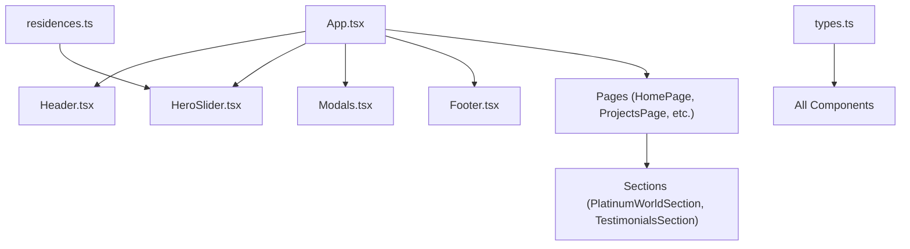
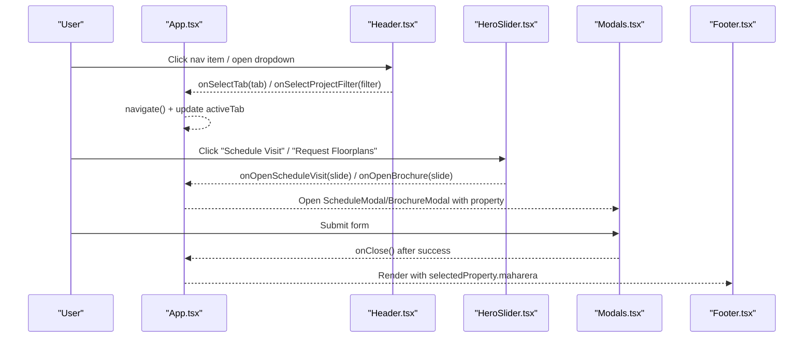
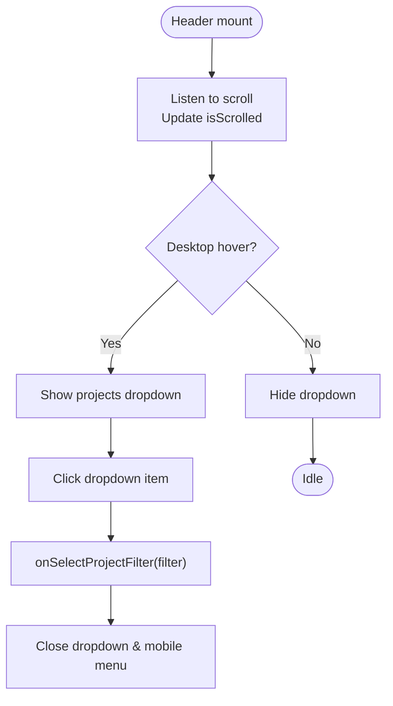
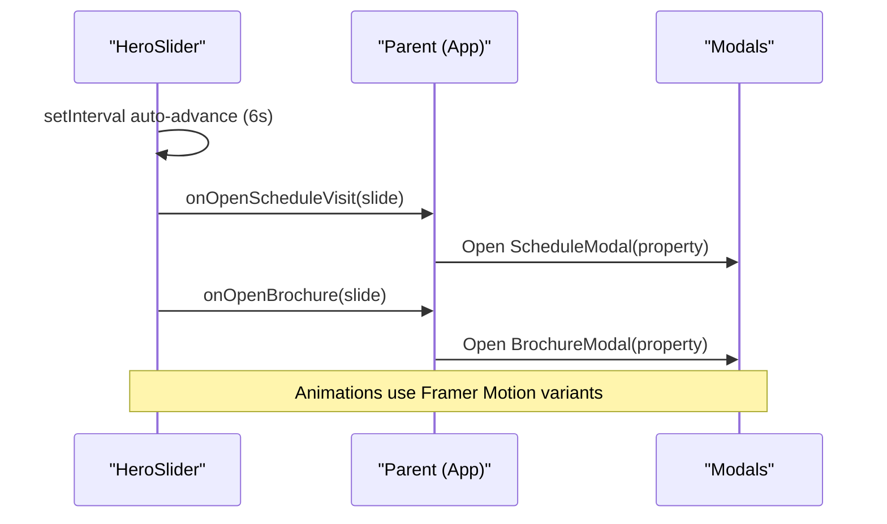
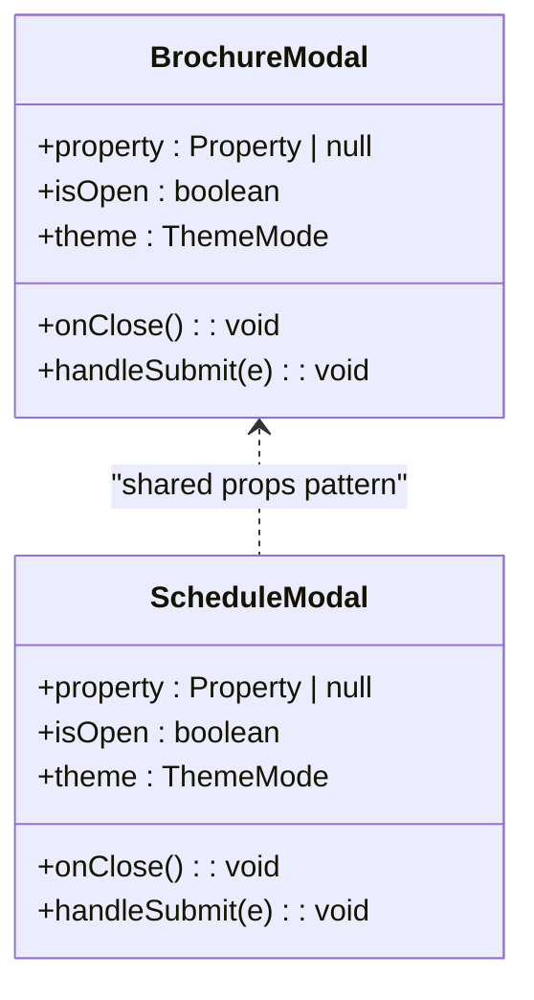
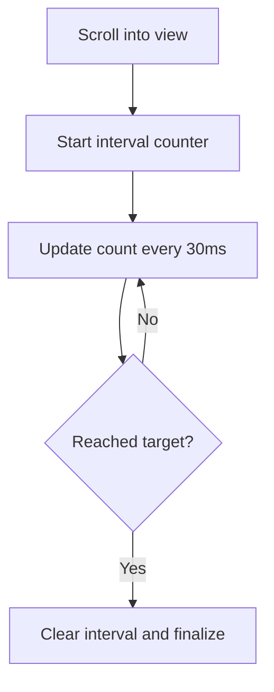
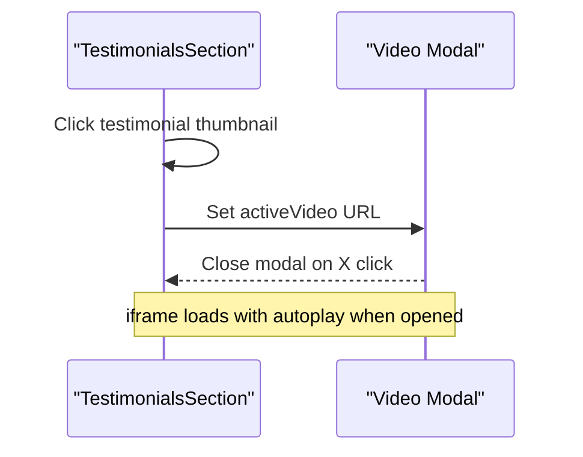
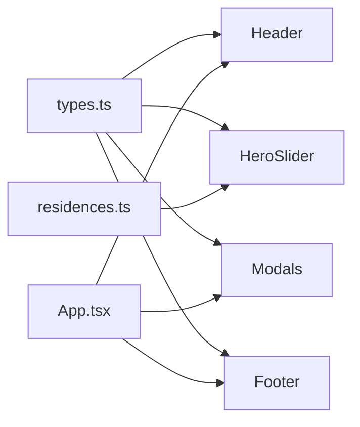

# Component Library

<cite>
**Referenced Files in This Document**
- [Header.tsx](file://src/components/Header.tsx)
- [HeroSlider.tsx](file://src/components/HeroSlider.tsx)
- [Modals.tsx](file://src/components/Modals.tsx)
- [Footer.tsx](file://src/components/Footer.tsx)
- [PlatinumWorldSection.tsx](file://src/components/PlatinumWorldSection.tsx)
- [TestimonialsSection.tsx](file://src/components/TestimonialsSection.tsx)
- [types.ts](file://src/types.ts)
- [residences.ts](file://src/data/residences.ts)
- [App.tsx](file://src/App.tsx)
</cite>

## Table of Contents
1. [Introduction](#introduction)
2. [Project Structure](#project-structure)
3. [Core Components](#core-components)
4. [Architecture Overview](#architecture-overview)
5. [Detailed Component Analysis](#detailed-component-analysis)
6. [Dependency Analysis](#dependency-analysis)
7. [Performance Considerations](#performance-considerations)
8. [Troubleshooting Guide](#troubleshooting-guide)
9. [Conclusion](#conclusion)
10. [Appendices](#appendices)

## Introduction
This document provides comprehensive documentation for the N-Square component library, focusing on reusable UI components and specialized sections used across pages. It covers props, events, customization options, usage patterns, responsive behavior, animations, accessibility, performance considerations, and guidelines for extending or creating new components following established patterns.

## Project Structure
The library is organized by feature with React components under src/components, shared types under src/types, and data under src/data. The application orchestrates routing and state in src/App.tsx, which composes Header, HeroSlider, Modals, Footer, and page-level components.

**Diagram sources**
- [App.tsx:1-255](file://src/App.tsx#L1-L255)
- [Header.tsx:1-328](file://src/components/Header.tsx#L1-L328)
- [HeroSlider.tsx:1-251](file://src/components/HeroSlider.tsx#L1-L251)
- [Modals.tsx:1-312](file://src/components/Modals.tsx#L1-L312)
- [Footer.tsx:1-68](file://src/components/Footer.tsx#L1-L68)
- [PlatinumWorldSection.tsx:151-306](file://src/components/PlatinumWorldSection.tsx#L151-L306)
- [TestimonialsSection.tsx:1-186](file://src/components/TestimonialsSection.tsx#L1-L186)
- [types.ts:1-60](file://src/types.ts#L1-L60)
- [residences.ts:1-190](file://src/data/residences.ts#L1-L190)

**Section sources**
- [App.tsx:1-255](file://src/App.tsx#L1-L255)
- [types.ts:1-60](file://src/types.ts#L1-L60)
- [residences.ts:1-190](file://src/data/residences.ts#L1-L190)

## Core Components
- Header: Fixed navigation with theme toggle, project dropdown, mobile menu, and call-to-action.
- HeroSlider: Full-screen image carousel with auto-advance, Ken Burns effect, animated typography, and CTAs.
- Modals: Brochure request and schedule visit modals with forms and confirmation states.
- Footer: Quick links, social icons, legal info, and optional Maharashtra RERA identifier.
- PlatinumWorldSection: Animated statistics counters with scroll-triggered reveal.
- TestimonialsSection: Carousel of testimonials with video modal playback.

**Section sources**
- [Header.tsx:1-328](file://src/components/Header.tsx#L1-L328)
- [HeroSlider.tsx:1-251](file://src/components/HeroSlider.tsx#L1-L251)
- [Modals.tsx:1-312](file://src/components/Modals.tsx#L1-L312)
- [Footer.tsx:1-68](file://src/components/Footer.tsx#L1-L68)
- [PlatinumWorldSection.tsx:151-306](file://src/components/PlatinumWorldSection.tsx#L151-L306)
- [TestimonialsSection.tsx:1-186](file://src/components/TestimonialsSection.tsx#L1-L186)

## Architecture Overview
The app uses React Router to switch between pages while maintaining global theme and active tab state. Components communicate via props and callbacks. Data flows from centralized data files into components through typed interfaces.

**Diagram sources**
- [App.tsx:15-104](file://src/App.tsx#L15-L104)
- [Header.tsx:42-62](file://src/components/Header.tsx#L42-L62)
- [HeroSlider.tsx:14-40](file://src/components/HeroSlider.tsx#L14-L40)
- [Modals.tsx:24-32](file://src/components/Modals.tsx#L24-L32)
- [Footer.tsx:11-12](file://src/components/Footer.tsx#L11-L12)

## Detailed Component Analysis

### Header
- Purpose: Global navigation, theme switching, project filtering, and scheduling entry point.
- Props:
  - theme: ThemeMode ('dark' | 'light')
  - onToggleTheme: () => void
  - activeTab: NavTab
  - onSelectTab: (tab: NavTab) => void
  - onOpenVisitModal: () => void
  - onSelectProjectFilter?: (filter: 'ongoing' | 'completed' | 'upcoming') => void
- Events:
  - Navigation selection triggers route changes via parent callback.
  - Dropdown items set project filter and close menus.
  - Mobile menu toggles visibility.
- Customization:
  - Scroll-aware background and padding transitions.
  - Desktop and mobile layouts with consistent spacing and typography.
  - Theme toggle with animated slider.
- Responsive behavior:
  - Hidden desktop nav on small screens; mobile menu overlay.
  - Adjusted sizes and spacing for different breakpoints.
- Accessibility:
  - Buttons have aria-labels where appropriate.
  - Keyboard focusable elements are native buttons.
- Performance:
  - Passive scroll listener.
  - AnimatePresence for smooth dropdown/menu transitions.
- Usage pattern:
  - Controlled by App state for activeTab and theme.
  - Integrates with routing and modal orchestration.

**Diagram sources**
- [Header.tsx:28-40](file://src/components/Header.tsx#L28-L40)
- [Header.tsx:91-168](file://src/components/Header.tsx#L91-L168)
- [Header.tsx:271-325](file://src/components/Header.tsx#L271-L325)

**Section sources**
- [Header.tsx:1-328](file://src/components/Header.tsx#L1-L328)
- [App.tsx:94-104](file://src/App.tsx#L94-L104)

### HeroSlider
- Purpose: Showcase hero slides with rich visuals and CTAs.
- Props:
  - slides: HeroSlide[]
  - theme: ThemeMode
  - onOpenBrochure: (slide: HeroSlide) => void
  - onOpenScheduleVisit: (slide: HeroSlide) => void
  - onSelectPropertyId?: (propertyId: string) => void
- Events:
  - Auto-advance every 6 seconds; resets on slide change.
  - Previous/Next navigation updates current index.
  - CTAs trigger parent handlers to open modals.
- Customization:
  - Staggered text reveal with blur and motion.
  - Ken Burns slow zoom on images.
  - Progress bar indicates timer duration.
- Responsive behavior:
  - Full viewport height; content reflows on smaller screens.
  - Right-side vertical controls stack vertically on mobile.
- Accessibility:
  - Buttons include aria-labels for prev/next and indicators.
  - Images have descriptive alt text.
- Performance:
  - AnimatePresence mode="wait" for crossfade.
  - Interval cleanup on unmount.
- Usage pattern:
  - Receives HERO_SLIDES from data file.
  - Maps slide.propertyId to Property via parent logic.

**Diagram sources**
- [HeroSlider.tsx:25-40](file://src/components/HeroSlider.tsx#L25-L40)
- [HeroSlider.tsx:202-215](file://src/components/HeroSlider.tsx#L202-L215)
- [App.tsx:120-135](file://src/App.tsx#L120-L135)

**Section sources**
- [HeroSlider.tsx:1-251](file://src/components/HeroSlider.tsx#L1-L251)
- [residences.ts:3-58](file://src/data/residences.ts#L3-L58)
- [App.tsx:120-135](file://src/App.tsx#L120-L135)

### Modals (BrochureModal, ScheduleModal)
- Purpose: Collect user information for brochure requests and site visits; show confirmation states.
- Shared props:
  - property: Property | null
  - isOpen: boolean
  - onClose: () => void
  - theme: ThemeMode
- BrochureModal specifics:
  - Form fields: name, email, phone, receiveOnWhatsApp.
  - On submit: shows success view with direct download link.
- ScheduleModal specifics:
  - Form fields: name, email, phone, date, timeSlot, notes.
  - On submit: shows confirmation with scheduled details.
- Events:
  - onClose resets state and hides modal.
  - Form submission triggers success state.
- Customization:
  - Glass-card styling adapts to theme.
  - Gold accent colors for actions and highlights.
- Accessibility:
  - Modal overlays trap focus contextually; close button available.
  - Inputs have labels and placeholders.
- Performance:
  - Conditional rendering when not open.
  - Minimal re-renders due to local state per modal.

**Diagram sources**
- [Modals.tsx:5-158](file://src/components/Modals.tsx#L5-L158)
- [Modals.tsx:160-312](file://src/components/Modals.tsx#L160-L312)

**Section sources**
- [Modals.tsx:1-312](file://src/components/Modals.tsx#L1-L312)
- [App.tsx:237-250](file://src/App.tsx#L237-L250)

### Footer
- Purpose: Provide quick navigation, project listings, help center links, social media, and legal info.
- Props:
  - theme: ThemeMode
  - maharera?: string
  - onSelectTab?: (tab: NavTab) => void
- Events:
  - Quick links trigger onSelectTab to navigate within the app.
- Customization:
  - Grid layout adapts to screen size.
  - Social icons with hover color transitions.
- Accessibility:
  - Links have aria-labels for screen readers.
- Performance:
  - Static content; no heavy computations.

**Section sources**
- [Footer.tsx:1-68](file://src/components/Footer.tsx#L1-L68)
- [App.tsx:230-235](file://src/App.tsx#L230-L235)

### PlatinumWorldSection
- Purpose: Display key company metrics with animated counters triggered on scroll.
- Props:
  - theme?: ThemeMode
- Behavior:
  - Uses scroll detection to start counting animation once.
  - Displays four stat cards with icons, values, units, and sublabels.
- Customization:
  - StatCounter accepts icon, value, suffix, unit, sublabel.
  - Styling uses neutral palette with gold accents.
- Accessibility:
  - Semantic section and headings; icons are decorative.
- Performance:
  - Intersection observer-based animation to avoid unnecessary work offscreen.

**Diagram sources**
- [PlatinumWorldSection.tsx:168-194](file://src/components/PlatinumWorldSection.tsx#L168-L194)

**Section sources**
- [PlatinumWorldSection.tsx:151-306](file://src/components/PlatinumWorldSection.tsx#L151-L306)

### TestimonialsSection
- Purpose: Showcase customer testimonials with images, quotes, and embedded videos.
- Props:
  - theme: ThemeMode
- Behavior:
  - Carousel displays two visible slides at a time.
  - Video modal opens with autoplay when thumbnail clicked.
- Customization:
  - Star rating display and badge.
  - Navigation arrows and dot indicators.
- Accessibility:
  - Buttons have aria-labels for prev/next and dots.
  - iframe includes title and allow attributes for media features.
- Performance:
  - Lazy load iframe only when modal is open.
  - AnimatePresence for smooth modal transitions.

**Diagram sources**
- [TestimonialsSection.tsx:37-55](file://src/components/TestimonialsSection.tsx#L37-L55)
- [TestimonialsSection.tsx:156-182](file://src/components/TestimonialsSection.tsx#L156-L182)

**Section sources**
- [TestimonialsSection.tsx:1-186](file://src/components/TestimonialsSection.tsx#L1-L186)

## Dependency Analysis
- Type dependencies:
  - ThemeMode, NavTab, HeroSlide, Property, ScheduleVisitForm, RequestBrochureForm defined in types.ts.
- Data dependencies:
  - HeroSlider consumes HERO_SLIDES from residences.ts.
  - App maps slide.propertyId to Property for modals.
- Component coupling:
  - Header depends on App for routing and modal control.
  - Modals depend on Property type for context.
  - Footer optionally depends on onSelectTab for navigation.

**Diagram sources**
- [types.ts:1-60](file://src/types.ts#L1-L60)
- [residences.ts:1-190](file://src/data/residences.ts#L1-L190)
- [App.tsx:1-255](file://src/App.tsx#L1-L255)

**Section sources**
- [types.ts:1-60](file://src/types.ts#L1-L60)
- [residences.ts:1-190](file://src/data/residences.ts#L1-L190)
- [App.tsx:1-255](file://src/App.tsx#L1-L255)

## Performance Considerations
- Use passive event listeners for scroll to improve scrolling performance.
- Leverage AnimatePresence for efficient enter/exit animations.
- Avoid heavy computations inside render loops; compute derived values outside or memoize if needed.
- Defer loading of heavy resources (e.g., iframes) until interaction.
- Keep intervals scoped and cleaned up to prevent memory leaks.

[No sources needed since this section provides general guidance]

## Troubleshooting Guide
- Header dropdown not closing:
  - Ensure onMouseLeave handlers reset dropdown state.
  - Verify mobile menu close logic on item click.
- HeroSlider not auto-advancing:
  - Check that slides array length > 0 and interval is set.
  - Confirm cleanup on unmount.
- Modals not opening:
  - Verify parent sets modal property and isOpen flag correctly.
  - Ensure onClose resets state to hide modal.
- Footer navigation not working:
  - Confirm onSelectTab prop is passed and navigates to correct routes.
- Testimonials video not playing:
  - Ensure iframe URL includes autoplay parameter and modal is mounted.
  - Check browser permissions for autoplay.

**Section sources**
- [Header.tsx:91-168](file://src/components/Header.tsx#L91-L168)
- [Header.tsx:271-325](file://src/components/Header.tsx#L271-L325)
- [HeroSlider.tsx:25-40](file://src/components/HeroSlider.tsx#L25-L40)
- [Modals.tsx:24-32](file://src/components/Modals.tsx#L24-L32)
- [Footer.tsx:16-24](file://src/components/Footer.tsx#L16-L24)
- [TestimonialsSection.tsx:156-182](file://src/components/TestimonialsSection.tsx#L156-L182)

## Conclusion
The N-Square component library provides a cohesive set of reusable UI components with strong typing, responsive design, and accessible interactions. Components are well-structured, leveraging modern animation libraries and clear prop contracts. Following the documented patterns ensures consistency and maintainability when extending or adding new components.

[No sources needed since this section summarizes without analyzing specific files]

## Appendices

### Component Prop Reference Summary
- Header
  - theme: ThemeMode
  - onToggleTheme: () => void
  - activeTab: NavTab
  - onSelectTab: (tab: NavTab) => void
  - onOpenVisitModal: () => void
  - onSelectProjectFilter?: (filter: 'ongoing' | 'completed' | 'upcoming') => void
- HeroSlider
  - slides: HeroSlide[]
  - theme: ThemeMode
  - onOpenBrochure: (slide: HeroSlide) => void
  - onOpenScheduleVisit: (slide: HeroSlide) => void
  - onSelectPropertyId?: (propertyId: string) => void
- Modals
  - property: Property | null
  - isOpen: boolean
  - onClose: () => void
  - theme: ThemeMode
- Footer
  - theme: ThemeMode
  - maharera?: string
  - onSelectTab?: (tab: NavTab) => void
- PlatinumWorldSection
  - theme?: ThemeMode
- TestimonialsSection
  - theme: ThemeMode

**Section sources**
- [Header.tsx:6-13](file://src/components/Header.tsx#L6-L13)
- [HeroSlider.tsx:6-12](file://src/components/HeroSlider.tsx#L6-L12)
- [Modals.tsx:5-10](file://src/components/Modals.tsx#L5-L10)
- [Modals.tsx:160-165](file://src/components/Modals.tsx#L160-L165)
- [Footer.tsx:5-9](file://src/components/Footer.tsx#L5-L9)
- [PlatinumWorldSection.tsx:156-158](file://src/components/PlatinumWorldSection.tsx#L156-L158)
- [TestimonialsSection.tsx:6-8](file://src/components/TestimonialsSection.tsx#L6-L8)
- [types.ts:1-60](file://src/types.ts#L1-L60)

### Usage Examples (by reference)
- Compose Header with App state for theme and navigation:
  - See [App.tsx:94-104](file://src/App.tsx#L94-L104)
- Render HeroSlider with slides and callbacks:
  - See [App.tsx:120-135](file://src/App.tsx#L120-L135)
- Open Modals from Header or HeroSlider:
  - See [App.tsx:237-250](file://src/App.tsx#L237-L250)
- Include Footer with optional navigation and RERA info:
  - See [App.tsx:230-235](file://src/App.tsx#L230-L235)

**Section sources**
- [App.tsx:94-104](file://src/App.tsx#L94-L104)
- [App.tsx:120-135](file://src/App.tsx#L120-L135)
- [App.tsx:230-250](file://src/App.tsx#L230-L250)

### Guidelines for Extending Components
- Follow prop-driven architecture: keep state minimal and lift it to parent when necessary.
- Use TypeScript interfaces for all props to ensure type safety.
- Maintain consistent naming conventions for callbacks (onXxx).
- Implement responsive designs using utility classes and conditional rendering.
- Add accessibility attributes (aria-label, role) to interactive elements.
- Prefer motion libraries for performant animations with proper cleanup.
- Isolate side effects in useEffect with explicit dependencies and cleanup functions.

[No sources needed since this section provides general guidance]