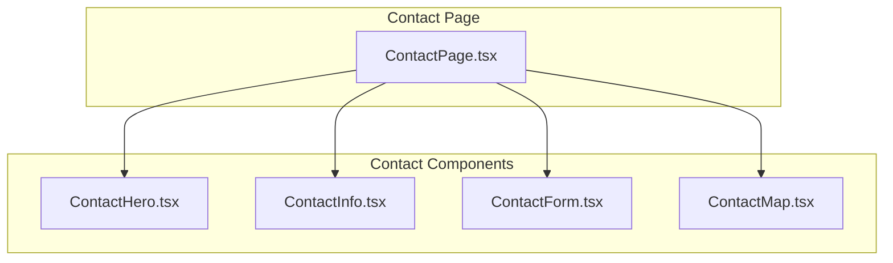
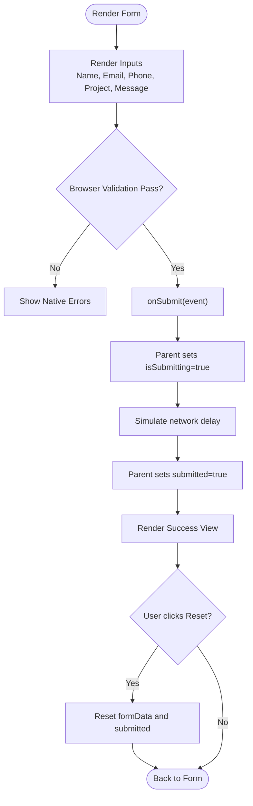
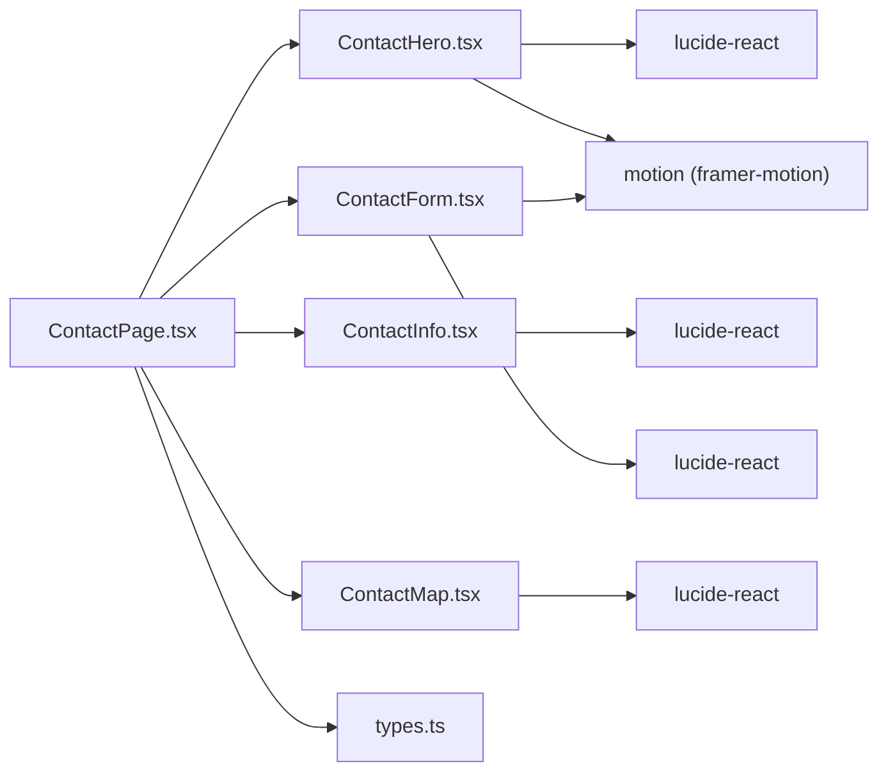

# Contact Components

<cite>
**Referenced Files in This Document**
- [ContactForm.tsx](file://src/components/contact/ContactForm.tsx)
- [ContactHero.tsx](file://src/components/contact/ContactHero.tsx)
- [ContactInfo.tsx](file://src/components/contact/ContactInfo.tsx)
- [ContactMap.tsx](file://src/components/contact/ContactMap.tsx)
- [index.ts](file://src/components/contact/index.ts)
- [ContactPage.tsx](file://src/pages/ContactPage.tsx)
- [types.ts](file://src/types.ts)
- [package.json](file://package.json)
</cite>

## Table of Contents
1. [Introduction](#introduction)
2. [Project Structure](#project-structure)
3. [Core Components](#core-components)
4. [Architecture Overview](#architecture-overview)
5. [Detailed Component Analysis](#detailed-component-analysis)
6. [Dependency Analysis](#dependency-analysis)
7. [Performance Considerations](#performance-considerations)
8. [Troubleshooting Guide](#troubleshooting-guide)
9. [Conclusion](#conclusion)
10. [Appendices](#appendices)

## Introduction
This document provides comprehensive documentation for the contact-related components: ContactForm, ContactHero, ContactInfo, and ContactMap. It explains how the contact form is implemented with validation and submission handling, how success states are presented, and how the contact information display, map integration, and hero section layout work together to deliver a cohesive user experience. It also includes guidance on customizing form fields, handling submissions, integrating with backend services, accessibility considerations, error handling strategies, and responsive design patterns used throughout the contact section.

## Project Structure
The contact functionality is organized under src/components/contact with a dedicated page that composes these components. The ContactPage orchestrates state for the form (data, submitting, submitted), wires up event handlers, and renders the full contact experience including the hero, info panel, form, and map.



**Diagram sources**
- [ContactPage.tsx:40-74](file://src/pages/ContactPage.tsx#L40-L74)
- [ContactHero.tsx:5-40](file://src/components/contact/ContactHero.tsx#L5-L40)
- [ContactInfo.tsx:4-55](file://src/components/contact/ContactInfo.tsx#L4-L55)
- [ContactForm.tsx:22-145](file://src/components/contact/ContactForm.tsx#L22-L145)
- [ContactMap.tsx:4-29](file://src/components/contact/ContactMap.tsx#L4-L29)

**Section sources**
- [ContactPage.tsx:1-77](file://src/pages/ContactPage.tsx#L1-L77)
- [index.ts:1-5](file://src/components/contact/index.ts#L1-L5)

## Core Components
- ContactHero: A visually rich hero section with an image background, overlay gradient, and animated text introducing the contact experience.
- ContactInfo: Displays corporate office address, phone number, and email in a clean, icon-led layout.
- ContactForm: A controlled React form with required fields, project selection, message input, submit button with loading state, and a success view after submission.
- ContactMap: Embeds Google Maps via an iframe to show the corporate headquarters location.

Key responsibilities:
- State management and orchestration live in ContactPage.
- UI rendering and interactions are encapsulated in each component.
- External dependencies include Framer Motion for animations and Lucide icons for visual cues.

**Section sources**
- [ContactHero.tsx:1-41](file://src/components/contact/ContactHero.tsx#L1-L41)
- [ContactInfo.tsx:1-56](file://src/components/contact/ContactInfo.tsx#L1-L56)
- [ContactForm.tsx:1-146](file://src/components/contact/ContactForm.tsx#L1-L146)
- [ContactMap.tsx:1-31](file://src/components/contact/ContactMap.tsx#L1-L31)
- [ContactPage.tsx:1-77](file://src/pages/ContactPage.tsx#L1-L77)

## Architecture Overview
The ContactPage acts as the composition root for the contact section. It maintains form state and lifecycle flags, passes props down to child components, and handles submission flow.

```mermaid
sequenceDiagram
participant U as "User"
participant P as "ContactPage.tsx"
participant F as "ContactForm.tsx"
participant H as "ContactHero.tsx"
participant I as "ContactInfo.tsx"
participant M as "ContactMap.tsx"
U->>P : Navigate to Contact
P->>H : Render Hero
P->>I : Render Info
P->>F : Render Form with props
P->>M : Render Map
U->>F : Fill fields and click Submit
F->>P : onSubmit(event)
P->>P : setIsSubmitting(true)
P->>P : setTimeout(() => { setIsSubmitting(false); setSubmitted(true) })
P-->>F : Re-render with submitted=true
F-->>U : Show success view
U->>F : Click "Submit Another Inquiry"
F->>P : onReset()
P->>P : Reset formData and submitted
P-->>F : Re-render form
```

**Diagram sources**
- [ContactPage.tsx:17-38](file://src/pages/ContactPage.tsx#L17-L38)
- [ContactForm.tsx:22-145](file://src/components/contact/ContactForm.tsx#L22-L145)
- [ContactHero.tsx:5-40](file://src/components/contact/ContactHero.tsx#L5-L40)
- [ContactInfo.tsx:4-55](file://src/components/contact/ContactInfo.tsx#L4-L55)
- [ContactMap.tsx:4-29](file://src/components/contact/ContactMap.tsx#L4-L29)

## Detailed Component Analysis

### ContactForm
Responsibilities:
- Renders a controlled form with name, email, phone, project, and message fields.
- Enforces required inputs using native HTML validation attributes.
- Provides a project dropdown with predefined options.
- Handles phone input by filtering non-numeric characters at the UI layer.
- Shows a loading state while submitting and transitions to a success view upon completion.
- Offers a reset action to start over.

Validation and submission:
- Validation is handled by browser-native required checks on inputs and select.
- Submission is delegated to the parent via onSubmit; the parent toggles submitting and then sets a success flag after a simulated delay.

Success state:
- When submitted is true, the component renders a success message with an option to reset.

Customization points:
- Add or remove fields by extending the ContactFormData interface and updating the form UI accordingly.
- Replace the hardcoded project list with dynamic data passed from props.
- Integrate real backend calls inside the parent’s handleSubmit to send data to your API.

Accessibility highlights:
- Inputs have associated labels and use semantic types (email, tel).
- Required fields are marked with required attributes.
- Buttons are disabled during submission to prevent duplicate submissions.

Responsive behavior:
- Uses a grid layout that adapts from single-column on small screens to two columns on larger screens.

Error handling:
- No explicit error messages are shown; rely on browser validation feedback for invalid inputs. You can extend this by adding custom validation and error messaging in the parent or within the form.

Integration example:
- Replace the setTimeout-based simulation with an async call to your backend service. On success, set submitted to true; on failure, clear isSubmitting and show an error state.

**Section sources**
- [ContactForm.tsx:5-20](file://src/components/contact/ContactForm.tsx#L5-L20)
- [ContactForm.tsx:22-145](file://src/components/contact/ContactForm.tsx#L22-L145)
- [ContactPage.tsx:17-38](file://src/pages/ContactPage.tsx#L17-L38)

#### ContactForm Flowchart


**Diagram sources**
- [ContactForm.tsx:22-145](file://src/components/contact/ContactForm.tsx#L22-L145)
- [ContactPage.tsx:26-38](file://src/pages/ContactPage.tsx#L26-L38)

### ContactHero
Responsibilities:
- Displays a full-width hero with a background image, gradient overlay, and centered content.
- Uses motion animations for entrance effects.
- Communicates the purpose of the page with a headline and descriptive paragraph.

Layout and responsiveness:
- Height adjusts across breakpoints.
- Text scales appropriately on mobile vs desktop.

Accessibility:
- Image includes an alt attribute describing the scene.
- Semantic heading hierarchy is maintained.

Customization:
- Swap the background image URL and alt text.
- Adjust copy to match brand voice.
- Modify animation timings or add additional decorative elements.

**Section sources**
- [ContactHero.tsx:1-41](file://src/components/contact/ContactHero.tsx#L1-L41)

### ContactInfo
Responsibilities:
- Presents direct contact details: corporate office address, phone, and email.
- Uses consistent styling with icons and subtle backgrounds for clarity.

Accessibility:
- Clear headings and concise descriptions improve readability.
- Icons are paired with textual labels for context.

Customization:
- Update contact details to reflect current information.
- Extend with additional channels (e.g., WhatsApp link) if needed.

**Section sources**
- [ContactInfo.tsx:1-56](file://src/components/contact/ContactInfo.tsx#L1-L56)

### ContactMap
Responsibilities:
- Embeds Google Maps via an iframe to show the corporate headquarters location.
- Includes a styled header bar with title and location tag.

Integration:
- The iframe src contains an embed URL pointing to the desired location.
- Loading is lazy for performance.

Accessibility:
- The iframe has a descriptive title for screen readers.

Customization:
- Change the embedded location by updating the iframe src.
- Adjust height and container styles to fit different layouts.

**Section sources**
- [ContactMap.tsx:1-31](file://src/components/contact/ContactMap.tsx#L1-L31)

### ContactPage Composition
Responsibilities:
- Manages form state (formData, isSubmitting, submitted).
- Wires up change handlers and submission logic.
- Composes the hero, info, form, and map into a cohesive page.

Submission handling:
- Prevents default form submission.
- Sets submitting state, simulates a delay, then marks the form as submitted.

Reset behavior:
- Resets form data and clears the submitted state when requested.

Extensibility:
- Replace the simulated delay with a real API call.
- Add server-side validation responses and surface errors to the user.

**Section sources**
- [ContactPage.tsx:1-77](file://src/pages/ContactPage.tsx#L1-L77)

## Dependency Analysis
- ContactPage depends on all four contact components and imports their types.
- ContactForm depends on motion for animations and lucide-react icons.
- ContactHero uses motion and lucide-react.
- ContactInfo and ContactMap use lucide-react.
- Shared types like ThemeMode are defined in types.ts and used by ContactPage.



**Diagram sources**
- [ContactPage.tsx:1-77](file://src/pages/ContactPage.tsx#L1-L77)
- [ContactForm.tsx:1-4](file://src/components/contact/ContactForm.tsx#L1-L4)
- [ContactHero.tsx:1-3](file://src/components/contact/ContactHero.tsx#L1-L3)
- [ContactInfo.tsx:1-2](file://src/components/contact/ContactInfo.tsx#L1-L2)
- [ContactMap.tsx:1-2](file://src/components/contact/ContactMap.tsx#L1-L2)
- [types.ts:1-3](file://src/types.ts#L1-L3)

**Section sources**
- [package.json:13-25](file://package.json#L13-L25)
- [types.ts:1-3](file://src/types.ts#L1-L3)

## Performance Considerations
- Lazy loading: The map iframe uses lazy loading to defer offscreen resources.
- Animations: Use motion sparingly; keep durations reasonable to avoid jank on low-end devices.
- Images: Ensure hero images are optimized and served with appropriate formats and sizes.
- Network calls: In production, replace the simulated delay with efficient fetch calls, consider retries, timeouts, and caching where applicable.

[No sources needed since this section provides general guidance]

## Troubleshooting Guide
Common issues and resolutions:
- Form does not submit:
  - Ensure onSubmit is attached and prevents default behavior.
  - Verify required fields are filled; browser validation will block submission otherwise.
- Submitting appears stuck:
  - Confirm isSubmitting is reset after the simulated delay or actual API call completes.
- Success view not appearing:
  - Check that submitted state is set to true after submission completes.
- Map not loading:
  - Verify the iframe src is valid and accessible; check network tab for blocked requests.
- Accessibility concerns:
  - Ensure all inputs have associated labels and proper types.
  - Provide meaningful alt text for images and titles for iframes.

Extension ideas:
- Add client-side validation beyond required fields (e.g., email format, phone length).
- Surface server-side validation errors back to the form fields.
- Implement retry logic and user-friendly error messages for failed submissions.

**Section sources**
- [ContactForm.tsx:53-143](file://src/components/contact/ContactForm.tsx#L53-L143)
- [ContactPage.tsx:26-38](file://src/pages/ContactPage.tsx#L26-L38)
- [ContactMap.tsx:19-27](file://src/components/contact/ContactMap.tsx#L19-L27)

## Conclusion
The contact section is composed of focused, reusable components that together provide a polished user experience. ContactForm handles controlled inputs, validation, submission, and success states. ContactHero sets the tone and context, ContactInfo presents essential contact details, and ContactMap integrates location navigation. ContactPage orchestrates state and flows, making it straightforward to integrate with backend services and extend functionality such as advanced validation and error handling.

[No sources needed since this section summarizes without analyzing specific files]

## Appendices

### Customizing Form Fields
- To add a new field:
  - Extend the ContactFormData interface with the new property.
  - Add a corresponding input/select/textarea in ContactForm and bind it to onChange.
  - Update initial form data in ContactPage to include the new field.
- To make a field optional or required:
  - Toggle the required attribute on the input element.
  - Optionally implement custom validation in the parent’s handleSubmit before sending data.

**Section sources**
- [ContactForm.tsx:5-20](file://src/components/contact/ContactForm.tsx#L5-L20)
- [ContactForm.tsx:53-143](file://src/components/contact/ContactForm.tsx#L53-L143)
- [ContactPage.tsx:5-11](file://src/pages/ContactPage.tsx#L5-L11)

### Handling Form Submissions
- Current behavior:
  - Prevent default submission, set isSubmitting, simulate a delay, then mark submitted.
- Backend integration:
  - Replace the timeout with an async call to your API endpoint.
  - On success, set submitted to true; on failure, clear isSubmitting and show an error message.
  - Consider debouncing rapid submissions and handling network errors gracefully.

**Section sources**
- [ContactPage.tsx:26-38](file://src/pages/ContactPage.tsx#L26-L38)

### Integrating With Backend Services
- Steps:
  - Create an async function to POST form data to your endpoint.
  - Handle response status codes and parse error payloads.
  - Update isSubmitting and submitted states based on outcomes.
  - Optionally store tokens or session data if required by your backend.

[No sources needed since this section provides general guidance]

### Accessibility Features
- Labels and semantics:
  - Inputs have associated labels and appropriate type attributes.
  - Required fields are marked with required.
- Visual feedback:
  - Disabled submit button during submission to prevent duplicate actions.
  - Success view clearly indicates completion.
- Screen reader support:
  - Descriptive alt text for images and titles for iframes.

**Section sources**
- [ContactForm.tsx:53-143](file://src/components/contact/ContactForm.tsx#L53-L143)
- [ContactHero.tsx:13-17](file://src/components/contact/ContactHero.tsx#L13-L17)
- [ContactMap.tsx:19-27](file://src/components/contact/ContactMap.tsx#L19-L27)

### Responsive Design Patterns
- Grid layouts adapt from single column on small screens to multi-column on larger screens.
- Typography and spacing scale across breakpoints for readability.
- Hero height and content adjust for mobile and desktop contexts.

**Section sources**
- [ContactForm.tsx:53-143](file://src/components/contact/ContactForm.tsx#L53-L143)
- [ContactHero.tsx:5-40](file://src/components/contact/ContactHero.tsx#L5-L40)