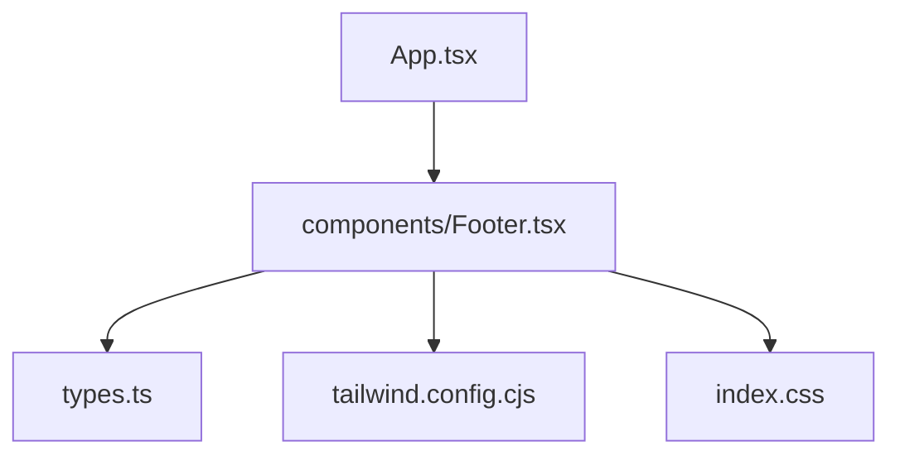
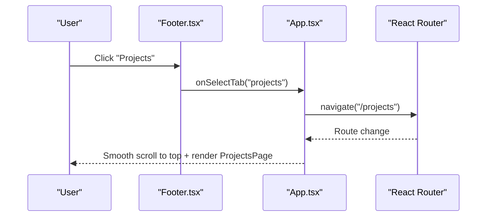
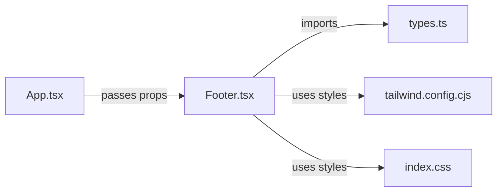

# Footer Component

<cite>
**Referenced Files in This Document**
- [Footer.tsx](file://src/components/Footer.tsx)
- [App.tsx](file://src/App.tsx)
- [types.ts](file://src/types.ts)
- [index.css](file://src/index.css)
- [tailwind.config.cjs](file://tailwind.config.cjs)
</cite>

## Table of Contents
1. [Introduction](#introduction)
2. [Project Structure](#project-structure)
3. [Core Components](#core-components)
4. [Architecture Overview](#architecture-overview)
5. [Detailed Component Analysis](#detailed-component-analysis)
6. [Dependency Analysis](#dependency-analysis)
7. [Performance Considerations](#performance-considerations)
8. [Troubleshooting Guide](#troubleshooting-guide)
9. [Conclusion](#conclusion)
10. [Appendices](#appendices)

## Introduction
This document provides comprehensive documentation for the Footer component used across the application. It explains the layout structure, contact information display, social media integration, responsive design patterns, link organization, branding elements, and accessibility considerations. It also includes guidance on customizing footer content, adding new sections, maintaining consistent styling, and SEO best practices for footer links and content.

## Project Structure
The Footer is a React component located under src/components and is integrated into the root App layout. It uses Tailwind CSS for styling and Lucide icons for social media links. The component receives theme and navigation props from the parent App to ensure consistent behavior and theming.

**Diagram sources**
- [App.tsx:231-235](file://src/App.tsx#L231-L235)
- [Footer.tsx:1-11](file://src/components/Footer.tsx#L1-L11)
- [types.ts:1-3](file://src/types.ts#L1-L3)
- [tailwind.config.cjs:4-11](file://tailwind.config.cjs#L4-L11)
- [index.css:5-21](file://src/index.css#L5-L21)

**Section sources**
- [App.tsx:231-235](file://src/App.tsx#L231-L235)
- [Footer.tsx:1-11](file://src/components/Footer.tsx#L1-L11)
- [types.ts:1-3](file://src/types.ts#L1-L3)
- [tailwind.config.cjs:4-11](file://tailwind.config.cjs#L4-L11)
- [index.css:5-21](file://src/index.css#L5-L21)

## Core Components
- Footer component: Renders a four-column grid with Quick Links, Ongoing Projects, Help Center, and Follow Us sections, plus a bottom bar with copyright and credits.
- Props:
  - theme: Controls visual context (light/dark).
  - maharera: Optional property identifier passed through; not rendered directly in the current implementation but available for future use.
  - onSelectTab: Callback to navigate between tabs/pages via the parent’s routing logic.

Key responsibilities:
- Provide site-wide navigation shortcuts.
- Display ongoing projects list.
- Link to legal pages (Terms & Conditions, Privacy Policy).
- Integrate social media profiles with accessible icons.
- Show corporate office address text.
- Render dynamic copyright year and developer credit line.

**Section sources**
- [Footer.tsx:5-11](file://src/components/Footer.tsx#L5-L11)
- [Footer.tsx:12-65](file://src/components/Footer.tsx#L12-L65)
- [App.tsx:231-235](file://src/App.tsx#L231-L235)

## Architecture Overview
The Footer integrates with the app’s routing by delegating navigation to the parent App via onSelectTab. The parent handles tab-to-route mapping and smooth scrolling. Styling is handled by Tailwind utility classes and project-specific color tokens.

**Diagram sources**
- [Footer.tsx:18-23](file://src/components/Footer.tsx#L18-L23)
- [App.tsx:67-85](file://src/App.tsx#L67-L85)
- [App.tsx:231-235](file://src/App.tsx#L231-L235)

## Detailed Component Analysis

### Layout Structure
- Container: Full-width footer with dark background and subtle top border.
- Grid: Responsive grid that stacks to one column on small screens and expands to four columns on medium+ screens.
- Sections:
  - Quick Links: Navigation buttons mapped to app tabs.
  - Ongoing Projects: Static list of project names.
  - Help Center: Links to Terms & Conditions and Privacy Policy.
  - Follow Us: Social media icons with external links and corporate office address.
- Bottom Bar: Copyright year and developer credit, stacked on mobile and row-aligned on larger screens.

Responsive behavior:
- Mobile-first single column layout using grid-cols-1.
- Medium breakpoint switches to md:grid-cols-4 for desktop-like layout.
- Bottom bar uses flex-col on mobile and md:flex-row on larger screens.

**Section sources**
- [Footer.tsx:13-14](file://src/components/Footer.tsx#L13-L14)
- [Footer.tsx:15-58](file://src/components/Footer.tsx#L15-L58)
- [Footer.tsx:61-64](file://src/components/Footer.tsx#L61-L64)

### Contact Information Display
- Corporate office address is displayed as plain text within the Follow Us section.
- No phone or email fields are present in the Footer; users can navigate to the Contact page via Quick Links.

Accessibility:
- Address text is semantic and readable by screen readers.
- External social links include aria-label attributes for icon-only links.

**Section sources**
- [Footer.tsx:49-58](file://src/components/Footer.tsx#L49-L58)

### Social Media Integration
- Icons: Facebook, Instagram, YouTube, LinkedIn from lucide-react.
- Links: Open in new tabs with rel="noreferrer".
- Styling: White/gray base with hover gold accent; consistent sizing.

SEO considerations:
- External links open in new tabs; consider adding rel="noopener noreferrer" for security if needed.
- Ensure href values are canonical and up-to-date.

**Section sources**
- [Footer.tsx:50-56](file://src/components/Footer.tsx#L50-L56)

### Branding Elements
- Color palette: Uses project-defined gold token for headings and hover states.
- Typography: Uppercase, wide letter-spacing for section headers; small font sizes for link lists.
- Background: Dark footer background with subtle border and spacing.

Consistency:
- Gold color defined in Tailwind config and used via utility class.
- Global transition rules provide smooth color changes across components.

**Section sources**
- [tailwind.config.cjs:4-11](file://tailwind.config.cjs#L4-L11)
- [index.css:5-21](file://src/index.css#L5-L21)
- [Footer.tsx:13-16](file://src/components/Footer.tsx#L13-L16)

### Accessibility Features
- Semantic HTML: Uses <footer>, <button>, and <a> appropriately.
- Keyboard interaction: Buttons are focusable and operable via keyboard.
- Screen reader support: aria-label on icon-only social links.
- Contrast: Light text on dark background; hover states improve visibility.

Recommendations:
- Consider adding skip-to-content link at the top of the page for improved keyboard navigation.
- Ensure all interactive elements have visible focus indicators.

**Section sources**
- [Footer.tsx:17-23](file://src/components/Footer.tsx#L17-L23)
- [Footer.tsx:51-56](file://src/components/Footer.tsx#L51-L56)

### SEO Considerations
- Internal navigation: Use meaningful link text (e.g., “Projects”, “Contact Us”) which is already implemented.
- External links: Add rel="noopener noreferrer" for security when opening in new tabs.
- Legal links: Ensure Terms & Conditions and Privacy Policy point to valid routes or pages.
- Metadata: Footer content alone does not affect meta tags; ensure page-level metadata is set elsewhere.

**Section sources**
- [Footer.tsx:42-46](file://src/components/Footer.tsx#L42-L46)
- [Footer.tsx:51-56](file://src/components/Footer.tsx#L51-L56)

## Dependency Analysis
- Parent integration: Footer receives theme and onSelectTab from App, enabling unified navigation and theming.
- Type definitions: Uses ThemeMode and NavTab types for type safety.
- Styling dependencies: Tailwind utilities and project-specific colors; global transitions in index.css.

**Diagram sources**
- [App.tsx:231-235](file://src/App.tsx#L231-L235)
- [Footer.tsx:1-3](file://src/components/Footer.tsx#L1-L3)
- [types.ts:1-3](file://src/types.ts#L1-L3)
- [tailwind.config.cjs:4-11](file://tailwind.config.cjs#L4-L11)
- [index.css:5-21](file://src/index.css#L5-L21)

**Section sources**
- [App.tsx:231-235](file://src/App.tsx#L231-L235)
- [Footer.tsx:1-11](file://src/components/Footer.tsx#L1-L11)
- [types.ts:1-3](file://src/types.ts#L1-L3)
- [tailwind.config.cjs:4-11](file://tailwind.config.cjs#L4-L11)
- [index.css:5-21](file://src/index.css#L5-L21)

## Performance Considerations
- Lightweight component: Minimal DOM nodes and no heavy libraries beyond icons.
- Efficient updates: Only re-renders when props change; no internal state.
- Styling performance: Relies on Tailwind utilities; avoid excessive inline styles.

Optimization tips:
- If adding many links, consider lazy-loading non-critical assets.
- Keep icon sets minimal; only import required icons.

[No sources needed since this section provides general guidance]

## Troubleshooting Guide
Common issues and resolutions:
- Links do not navigate:
  - Verify onSelectTab is provided and correctly wired in App.
  - Check that the target tab maps to a valid route in App.
- Social icons not visible:
  - Ensure lucide-react icons are installed and imported.
  - Confirm Tailwind is processing the classes and gold color is defined.
- Inconsistent styling:
  - Confirm index.css imports Tailwind and defines gold tokens.
  - Check that global transitions do not interfere with hover states.

Debugging steps:
- Inspect element to verify computed styles and class names.
- Test keyboard navigation and screen reader announcements.
- Validate external links’ hrefs and rel attributes.

**Section sources**
- [App.tsx:67-85](file://src/App.tsx#L67-L85)
- [Footer.tsx:51-56](file://src/components/Footer.tsx#L51-L56)
- [index.css:5-21](file://src/index.css#L5-L21)
- [tailwind.config.cjs:4-11](file://tailwind.config.cjs#L4-L11)

## Conclusion
The Footer component provides a clean, responsive, and accessible foundation for site-wide navigation, project highlights, legal links, and social media presence. Its integration with the parent App ensures consistent routing and theming. By following the customization guidelines and accessibility recommendations, teams can extend and maintain the Footer effectively while preserving brand consistency and user experience.

[No sources needed since this section summarizes without analyzing specific files]

## Appendices

### Customization Examples

- Add a new section:
  - Insert a new grid column div with a header and list items.
  - Use existing typography and spacing classes for consistency.
  - Reference section sources for similar structures.

- Customize link behavior:
  - Replace button onClick handlers with direct anchor links if needed.
  - Ensure accessibility attributes remain intact.

- Update social media links:
  - Modify href values and aria-labels accordingly.
  - Maintain consistent icon sizes and hover effects.

- Adjust branding:
  - Change gold color in Tailwind config to update all instances.
  - Modify global transitions in index.css if needed.

- Maintain responsive design:
  - Keep grid-cols-1 and md:grid-cols-4 pattern for scalability.
  - Use flex-col/md:flex-row for bottom bar alignment.

**Section sources**
- [Footer.tsx:14-58](file://src/components/Footer.tsx#L14-L58)
- [tailwind.config.cjs:4-11](file://tailwind.config.cjs#L4-L11)
- [index.css:5-21](file://src/index.css#L5-L21)