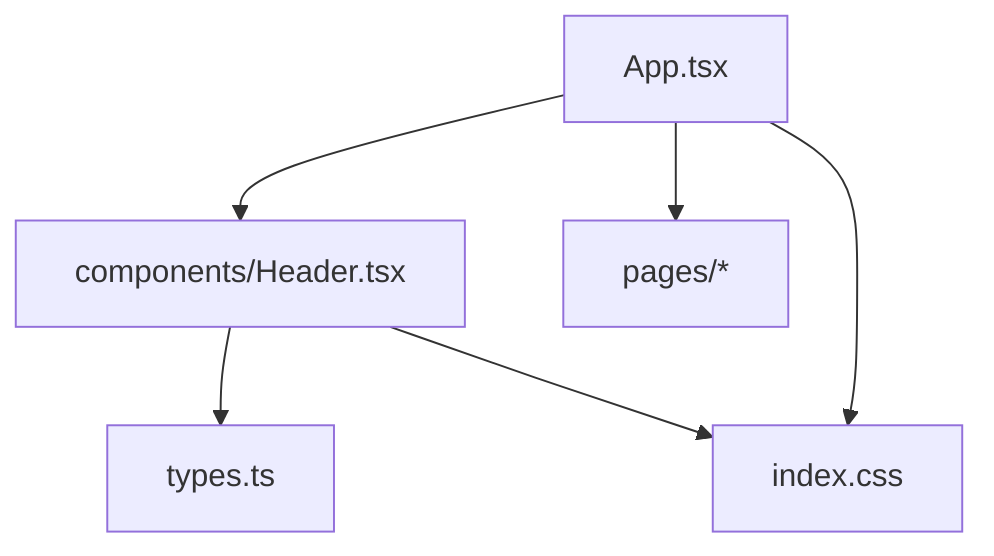
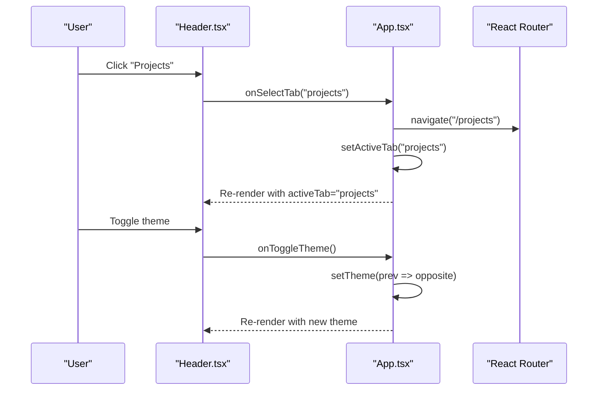

# Header Component

<cite>
**Referenced Files in This Document**
- [Header.tsx](file://src/components/Header.tsx)
- [App.tsx](file://src/App.tsx)
- [types.ts](file://src/types.ts)
- [index.css](file://src/index.css)
</cite>

## Table of Contents
1. [Introduction](#introduction)
2. [Project Structure](#project-structure)
3. [Core Components](#core-components)
4. [Architecture Overview](#architecture-overview)
5. [Detailed Component Analysis](#detailed-component-analysis)
6. [Dependency Analysis](#dependency-analysis)
7. [Performance Considerations](#performance-considerations)
8. [Troubleshooting Guide](#troubleshooting-guide)
9. [Conclusion](#conclusion)
10. [Appendices](#appendices)

## Introduction
The Header component is the main navigation surface for the application. It provides:
- Responsive design with desktop and mobile layouts
- Theme switching (light/dark) with animated toggle
- Animated dropdown menu under Projects
- Scroll-aware styling that changes appearance on scroll
- Accessibility-friendly controls and labels
- Integration with routing via callbacks to navigate between pages

It is a presentational and interaction-focused component that delegates state management and routing to its parent (App).

## Project Structure
The Header lives under components and is consumed by the root App, which manages theme, active tab, and routing. Types define shared contracts such as ThemeMode and NavTab. Global CSS defines theme classes and transitions.

**Diagram sources**
- [App.tsx:94-104](file://src/App.tsx#L94-L104)
- [Header.tsx:1-22](file://src/components/Header.tsx#L1-L22)
- [types.ts:1-3](file://src/types.ts#L1-L3)
- [index.css:27-44](file://src/index.css#L27-L44)

**Section sources**
- [App.tsx:1-104](file://src/App.tsx#L1-L104)
- [Header.tsx:1-328](file://src/components/Header.tsx#L1-L328)
- [types.ts:1-60](file://src/types.ts#L1-L60)
- [index.css:1-105](file://src/index.css#L1-L105)

## Core Components
- Header: Renders fixed top navigation, logo, nav links, dropdown, theme switcher, call-to-action, and mobile menu overlay.
- App: Owns theme state, active tab, project filter, and routes; passes props to Header and handles navigation.
- Types: Define ThemeMode and NavTab used across the app.
- CSS: Provides dark/light theme classes and smooth transitions.

Key responsibilities:
- Header: UI interactions (open/close dropdown, open mobile menu), scroll detection, accessibility attributes, and calling back to parent for navigation and theme toggling.
- App: State ownership, URL synchronization, and modal triggers.

**Section sources**
- [Header.tsx:6-22](file://src/components/Header.tsx#L6-L22)
- [App.tsx:15-104](file://src/App.tsx#L15-L104)
- [types.ts:1-3](file://src/types.ts#L1-L3)
- [index.css:27-44](file://src/index.css#L27-L44)

## Architecture Overview
The Header is a controlled component: it receives theme and activeTab from App and emits events via callbacks. Routing is handled centrally in App using React Router. The Header uses framer-motion for animations and lucide-react icons.

**Diagram sources**
- [Header.tsx:87-108](file://src/components/Header.tsx#L87-L108)
- [App.tsx:67-85](file://src/App.tsx#L67-L85)
- [App.tsx:35-37](file://src/App.tsx#L35-L37)

## Detailed Component Analysis

### Props and Contract
- theme: Current theme mode ('dark' | 'light'). Used to render the correct visual state and toggle indicator position.
- onToggleTheme: Callback invoked when user clicks the theme switcher.
- activeTab: Currently active navigation tab. Drives highlighting and active states.
- onSelectTab: Callback to navigate and update active tab in App.
- onOpenVisitModal: Opens the schedule visit modal in App.
- onSelectProjectFilter?: Optional callback to filter projects when a dropdown item is selected.

Usage in App:
- App passes theme, onToggleTheme, activeTab, onSelectTab, onOpenVisitModal, and onSelectProjectFilter to Header.
- onSelectTab navigates to the corresponding route and scrolls to top.

**Section sources**
- [Header.tsx:6-22](file://src/components/Header.tsx#L6-L22)
- [App.tsx:94-104](file://src/App.tsx#L94-L104)
- [App.tsx:67-85](file://src/App.tsx#L67-L85)

### Navigation and Active Tab Handling
- Desktop nav items include Home, Projects (with dropdown), About Us, Contact Us.
- Active tab is highlighted via comparison with activeTab prop.
- Hovered tab shows an animated vertical line indicator and bold text.
- Clicking a non-dropdown item calls onSelectTab with the corresponding NavTab.

Routing integration:
- onSelectTab maps tabs to routes:
  - residences -> "/"
  - legacy -> "/about"
  - projects -> "/projects"
  - contact -> "/contact"
  - commercial -> "/commercial"
- After navigation, App scrolls to top smoothly.

**Section sources**
- [Header.tsx:42-47](file://src/components/Header.tsx#L42-L47)
- [Header.tsx:87-205](file://src/components/Header.tsx#L87-L205)
- [App.tsx:51-85](file://src/App.tsx#L51-L85)

### Animated Dropdown Menu (Projects)
- Triggered by hover or click on the Projects nav item.
- Uses AnimatePresence and motion for fade/scale/translate transitions.
- Contains three filters: Ongoing, Completed, Upcoming.
- Selecting a filter:
  - Navigates to Projects page
  - Calls onSelectProjectFilter with the chosen filter
  - Closes dropdown and mobile menu

Accessibility:
- Buttons are interactive elements with clear labels.
- Icons indicate expand/collapse state.

**Section sources**
- [Header.tsx:49-62](file://src/components/Header.tsx#L49-L62)
- [Header.tsx:91-169](file://src/components/Header.tsx#L91-L169)

### Mobile Menu Implementation
- On small screens, a hamburger button toggles a full-screen overlay menu.
- Overlay includes all nav items and nested dropdown items for Projects.
- Selecting a non-dropdown item closes the menu automatically.
- Includes a “Schedule Private Visit” action that opens the modal and closes the menu.

Responsive behavior:
- Desktop nav is hidden on mobile; mobile controls show theme switcher, phone icon, and menu toggle.

**Section sources**
- [Header.tsx:237-325](file://src/components/Header.tsx#L237-L325)

### Scroll-Aware Styling
- Detects window scroll position and applies a compact, blurred, shadowed header style after scrolling past a threshold.
- Uses passive event listener for performance.

Visual effect:
- Transparent background at top; becomes semi-transparent black with blur and shadow on scroll.

**Section sources**
- [Header.tsx:28-40](file://src/components/Header.tsx#L28-L40)
- [Header.tsx:65-69](file://src/components/Header.tsx#L65-L69)

### Theme Switcher
- Sliding dual-icon toggle with animated knob indicating current theme.
- Updates theme via onToggleTheme passed from App.
- Both desktop and mobile variants exist; mobile variant is smaller.

Global theme application:
- App toggles a class on documentElement and sets body styles for light/dark themes.
- CSS defines .dark-theme and .light-theme with smooth transitions.

**Section sources**
- [Header.tsx:217-234](file://src/components/Header.tsx#L217-L234)
- [Header.tsx:237-254](file://src/components/Header.tsx#L237-L254)
- [App.tsx:24-37](file://src/App.tsx#L24-L37)
- [index.css:27-44](file://src/index.css#L27-L44)

### Accessibility Features
- Descriptive aria-label on the concierge button.
- Title attributes on theme switcher for screen readers and tooltips.
- Keyboard-focusable buttons throughout.
- Clear visual states for active/hovered tabs.

Recommendations for further enhancement:
- Add role="navigation" and aria-current="page" to active nav items.
- Ensure focus management when opening/closing mobile menu.
- Provide keyboard support to open/close dropdowns without mouse hover.

**Section sources**
- [Header.tsx:207-215](file://src/components/Header.tsx#L207-L215)
- [Header.tsx:217-234](file://src/components/Header.tsx#L217-L234)

### Integration Patterns with Routing
- Header does not import routing directly; it delegates to App via onSelectTab.
- App centralizes navigation logic and ensures consistent scroll behavior.
- Projects dropdown can also set a filter via onSelectProjectFilter, enabling deep-linking/filtering within the Projects page.

Example usage pattern:
- Pass onSelectTab to Header; map each tab to a route in App.
- Use onSelectProjectFilter to pre-filter Projects content when navigating from Header.

**Section sources**
- [App.tsx:67-85](file://src/App.tsx#L67-L85)
- [App.tsx:94-104](file://src/App.tsx#L94-L104)

## Dependency Analysis
- External libraries:
  - framer-motion: Animations for dropdown, mobile menu, and theme toggle.
  - lucide-react: Icons for sun, moon, menu, close, phone, chevron.
- Internal dependencies:
  - types.ts: ThemeMode and NavTab types.
  - App.tsx: Parent component providing state and callbacks.
  - index.css: Theme classes and transitions.

Coupling:
- Header is decoupled from routing and global state; it only depends on props and callbacks.
- App owns state and coordinates Header with routing and modals.

Potential circular dependencies:
- None observed; Header imports types only.

**Section sources**
- [Header.tsx:1-4](file://src/components/Header.tsx#L1-L4)
- [Header.tsx:6-22](file://src/components/Header.tsx#L6-L22)
- [App.tsx:1-13](file://src/App.tsx#L1-L13)
- [index.css:27-44](file://src/index.css#L27-L44)

## Performance Considerations
- Passive scroll listener improves scroll performance.
- Conditional rendering of mobile menu and dropdown reduces unnecessary DOM updates.
- Motion animations use GPU-friendly transforms where possible.
- Consider memoizing expensive computations if nav items grow significantly.

Optimization opportunities:
- Extract navItems and dropdown items into constants outside the component to avoid recreation on renders.
- Debounce scroll handler if additional heavy work is added.
- Use IntersectionObserver for advanced scroll-based effects if needed.

[No sources needed since this section provides general guidance]

## Troubleshooting Guide
Common issues and resolutions:
- Dropdown not closing on selection:
  - Ensure handleDropdownItemClick calls onSelectTab and closes both dropdown and mobile menu.
  - Verify onSelectProjectFilter is provided when needed.
- Theme not applying globally:
  - Confirm App toggles documentElement class and body styles on theme change.
  - Check CSS classes .dark-theme and .light-theme are applied correctly.
- Mobile menu not closing:
  - Ensure non-dropdown items call onClose or setMobileMenuOpen(false).
  - Verify onClick handlers are attached to menu items.
- Inconsistent active tab:
  - Ensure App syncs activeTab with URL pathname and onSelectTab updates activeTab.

**Section sources**
- [Header.tsx:55-62](file://src/components/Header.tsx#L55-L62)
- [Header.tsx:271-325](file://src/components/Header.tsx#L271-L325)
- [App.tsx:24-37](file://src/App.tsx#L24-L37)
- [App.tsx:51-85](file://src/App.tsx#L51-L85)

## Conclusion
The Header component delivers a polished, responsive navigation experience with animated interactions, accessible controls, and clean separation of concerns. It relies on App for state and routing, making it easy to customize and extend while maintaining consistency across the application.

[No sources needed since this section summarizes without analyzing specific files]

## Appendices

### Usage Examples and Customization
- Basic integration:
  - Import Header and pass theme, onToggleTheme, activeTab, onSelectTab, onOpenVisitModal, and optional onSelectProjectFilter from App.
- Customizing navigation:
  - Modify navItems array in Header to add/remove tabs or adjust labels.
  - Extend projectDropdownItems to add more filters.
- Styling:
  - Adjust Tailwind classes for colors, spacing, and typography.
  - Leverage .dark-theme and .light-theme for global theme overrides.

Integration patterns:
- Route mapping in App should align with NavTab values.
- Use onSelectProjectFilter to drive filtering state in the Projects page.

**Section sources**
- [Header.tsx:42-53](file://src/components/Header.tsx#L42-L53)
- [App.tsx:67-85](file://src/App.tsx#L67-L85)
- [index.css:27-44](file://src/index.css#L27-L44)