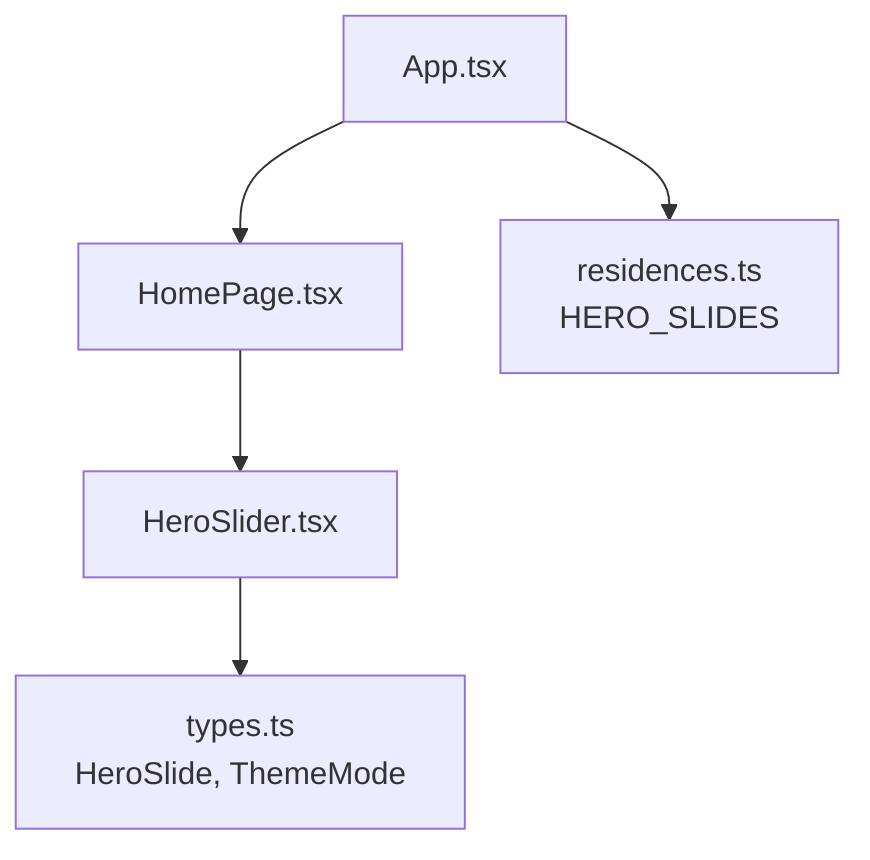
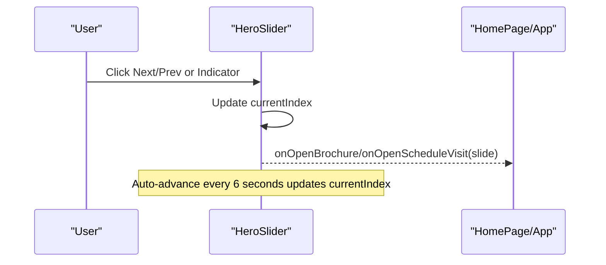
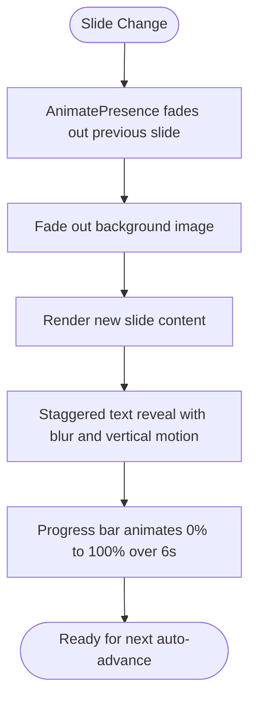
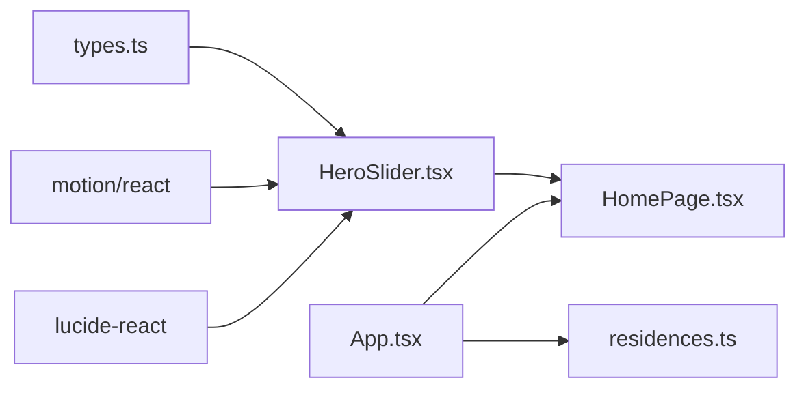

# Hero Slider Component

<cite>
**Referenced Files in This Document**
- [HeroSlider.tsx](file://src/components/HeroSlider.tsx)
- [types.ts](file://src/types.ts)
- [HomePage.tsx](file://src/pages/HomePage.tsx)
- [App.tsx](file://src/App.tsx)
- [residences.ts](file://src/data/residences.ts)
</cite>

## Table of Contents
1. [Introduction](#introduction)
2. [Project Structure](#project-structure)
3. [Core Components](#core-components)
4. [Architecture Overview](#architecture-overview)
5. [Detailed Component Analysis](#detailed-component-analysis)
6. [Dependency Analysis](#dependency-analysis)
7. [Performance Considerations](#performance-considerations)
8. [Troubleshooting Guide](#troubleshooting-guide)
9. [Conclusion](#conclusion)
10. [Appendices](#appendices)

## Introduction
This document provides comprehensive documentation for the HeroSlider component, focusing on its auto-play behavior, manual controls, animation transitions, slide data structure, configuration options, performance optimizations, and accessibility features. It also explains how the component integrates with Framer Motion (via motion/react) for smooth transitions and responsive image handling, and shows how to customize content and navigation behavior through props and parent handlers.

## Project Structure
The HeroSlider is a React component that renders a full-screen hero carousel with:
- A background image with subtle Ken Burns scaling and crossfade transitions
- Staggered typography animations for title, subtitle, and location
- Manual navigation via arrows and diamond indicators
- An auto-advance timer with a visual progress bar
- Action buttons that trigger callbacks to open modals or navigate

**Diagram sources**
- [App.tsx:120-135](file://src/App.tsx#L120-L135)
- [HomePage.tsx:28-34](file://src/pages/HomePage.tsx#L28-L34)
- [HeroSlider.tsx:1-12](file://src/components/HeroSlider.tsx#L1-L12)
- [residences.ts:3-37](file://src/data/residences.ts#L3-L37)

**Section sources**
- [HeroSlider.tsx:1-251](file://src/components/HeroSlider.tsx#L1-L251)
- [types.ts:1-60](file://src/types.ts#L1-L60)
- [HomePage.tsx:1-47](file://src/pages/HomePage.tsx#L1-L47)
- [App.tsx:1-255](file://src/App.tsx#L1-L255)
- [residences.ts:1-37](file://src/data/residences.ts#L1-L37)

## Core Components
- HeroSlider: The main carousel component responsible for rendering slides, managing state, auto-advancing, and providing navigation and actions.
- HeroSlide type: Defines the shape of each slide’s data used by the component.
- Parent integration: HomePage passes slides and callbacks; App wires up event handlers to open modals and select properties.

Key responsibilities:
- Manage current slide index and auto-advance timing
- Render animated backgrounds and text with Framer Motion
- Provide accessible navigation controls
- Expose callbacks for brochure and visit scheduling

**Section sources**
- [HeroSlider.tsx:6-23](file://src/components/HeroSlider.tsx#L6-L23)
- [types.ts:5-13](file://src/types.ts#L5-L13)
- [HomePage.tsx:10-34](file://src/pages/HomePage.tsx#L10-L34)
- [App.tsx:120-135](file://src/App.tsx#L120-L135)

## Architecture Overview
The HeroSlider receives an array of slide objects and renders them with motion-based transitions. Auto-advance is implemented with a timer that updates the current index. Navigation controls update the index directly. Callbacks are passed from parent components to handle user actions like opening modals.

**Diagram sources**
- [HeroSlider.tsx:25-40](file://src/components/HeroSlider.tsx#L25-L40)
- [HeroSlider.tsx:125-171](file://src/components/HeroSlider.tsx#L125-L171)
- [HeroSlider.tsx:203-215](file://src/components/HeroSlider.tsx#L203-L215)
- [App.tsx:120-135](file://src/App.tsx#L120-L135)

## Detailed Component Analysis

### Slide Data Structure
Each slide is defined by the HeroSlide interface with the following fields:
- id: Unique identifier for transition keying
- title: Main headline text
- subtitle: Supporting tagline
- code: Property code string
- location: Displayed location
- image: Background image URL
- propertyId: Identifier linked to a property record

Usage example reference:
- See the HERO_SLIDES array for concrete slide definitions.

**Section sources**
- [types.ts:5-13](file://src/types.ts#L5-L13)
- [residences.ts:3-37](file://src/data/residences.ts#L3-L37)

### Configuration Options (Props)
- slides: Array of HeroSlide objects defining the carousel content
- theme: Theme mode (not actively used within the component but accepted)
- onOpenBrochure: Callback invoked when “Request Floorplans” is clicked
- onOpenScheduleVisit: Callback invoked when “Schedule A Visit” is clicked
- onSelectPropertyId: Optional callback to handle property selection

These props enable customization of behavior without modifying the component internals.

**Section sources**
- [HeroSlider.tsx:6-12](file://src/components/HeroSlider.tsx#L6-L12)
- [HomePage.tsx:10-34](file://src/pages/HomePage.tsx#L10-L34)
- [App.tsx:120-135](file://src/App.tsx#L120-L135)

### Auto-Play Functionality
- The component uses a timer to advance to the next slide every 6 seconds.
- The timer resets when the slide count or current index changes.
- A visual progress bar animates linearly over 6 seconds to indicate time until the next slide.

Behavioral notes:
- Auto-advance continues while the component is mounted.
- Manual navigation interrupts the cycle by updating the index, which restarts the timer due to dependency changes.

**Section sources**
- [HeroSlider.tsx:25-32](file://src/components/HeroSlider.tsx#L25-L32)
- [HeroSlider.tsx:229-246](file://src/components/HeroSlider.tsx#L229-L246)

### Manual Controls
- Previous/Next arrows: Navigate backward/forward with wrap-around logic.
- Diamond indicators: Clickable dots representing each slide; active indicator highlights the current slide.
- All controls are keyboard-accessible buttons with appropriate aria-labels.

**Section sources**
- [HeroSlider.tsx:34-40](file://src/components/HeroSlider.tsx#L34-L40)
- [HeroSlider.tsx:123-171](file://src/components/HeroSlider.tsx#L123-L171)

### Touch/Swipe Support
- There is no explicit touch/swipe gesture handling implemented in the component.
- Users can still interact via keyboard and mouse/touch on visible controls (arrows and indicators).

Recommendation:
- If swipe support is required, integrate a gesture library or implement pointer events to detect horizontal swipes and call existing prev/next handlers.

[No sources needed since this section describes absence of feature]

### Animation Transitions (Framer Motion Integration)
- Background images use AnimatePresence with fade-in/out transitions keyed by slide id.
- Images apply a slow Ken Burns scale effect during display.
- Typography reveals use staggered variants for title words and subtitle with blur-to-sharp effects and easing curves.
- Progress bar animates width from 0% to 100% over 6 seconds per slide.

**Diagram sources**
- [HeroSlider.tsx:92-112](file://src/components/HeroSlider.tsx#L92-L112)
- [HeroSlider.tsx:45-85](file://src/components/HeroSlider.tsx#L45-L85)
- [HeroSlider.tsx:229-246](file://src/components/HeroSlider.tsx#L229-L246)

**Section sources**
- [HeroSlider.tsx:45-85](file://src/components/HeroSlider.tsx#L45-L85)
- [HeroSlider.tsx:92-112](file://src/components/HeroSlider.tsx#L92-L112)
- [HeroSlider.tsx:229-246](file://src/components/HeroSlider.tsx#L229-L246)

### Responsive Image Handling
- Background images are set to cover the viewport with object-cover and centered alignment.
- Gradients overlay improve readability of text over images.
- The image scales slightly over time for a cinematic effect.

Best practices observed:
- Use high-quality images optimized for web delivery.
- Ensure aspect ratios align with typical hero dimensions to avoid cropping issues.

**Section sources**
- [HeroSlider.tsx:101-111](file://src/components/HeroSlider.tsx#L101-L111)

### Accessibility Features
- Navigation buttons include aria-label attributes for screen readers.
- Indicators are buttons with descriptive labels indicating slide numbers.
- Keyboard users can focus and activate controls using standard browser behaviors.

Notes:
- No explicit focus management or live region announcements are present; consider adding aria-live regions if you need to announce slide changes to assistive technologies.

**Section sources**
- [HeroSlider.tsx:125-171](file://src/components/HeroSlider.tsx#L125-L171)

### Customizing Slide Content
- Modify the HERO_SLIDES array to change titles, subtitles, locations, images, and property links.
- Each slide maps to a property via propertyId; ensure IDs match your property dataset.

Example references:
- See HERO_SLIDES for sample entries and field usage.

**Section sources**
- [residences.ts:3-37](file://src/data/residences.ts#L3-L37)

### Adjusting Autoplay Timing
- The auto-advance interval is currently hardcoded to 6 seconds.
- To adjust timing, modify the interval duration and corresponding progress bar duration so they remain synchronized.

Implementation guidance:
- Update the setInterval delay and the progress bar transition duration to the same value.

**Section sources**
- [HeroSlider.tsx:25-32](file://src/components/HeroSlider.tsx#L25-L32)
- [HeroSlider.tsx:229-246](file://src/components/HeroSlider.tsx#L229-L246)

### Implementing Custom Navigation Controls
- You can replace or augment the built-in controls by wrapping the HeroSlider or by extending it with additional props.
- For custom external controls, manage currentIndex in a parent component and pass down prev/next handlers or controlled index via props.

Current behavior:
- Internal state manages currentIndex; external control would require refactoring to accept a controlled index prop.

[No sources needed since this section proposes future enhancements]

### Integration With Modals and Property Selection
- Clicking action buttons triggers callbacks that open modals or select properties in the parent.
- The parent resolves the property based on the slide’s propertyId and opens the appropriate modal.

**Section sources**
- [HeroSlider.tsx:203-215](file://src/components/HeroSlider.tsx#L203-L215)
- [App.tsx:120-135](file://src/App.tsx#L120-L135)

## Dependency Analysis
- HeroSlider depends on:
  - types.ts for HeroSlide and ThemeMode
  - motion/react for animations and presence management
  - lucide-react icons for UI elements
- Parent components depend on HeroSlider to render the hero section and wire up interactions.

**Diagram sources**
- [HeroSlider.tsx:1-4](file://src/components/HeroSlider.tsx#L1-L4)
- [HomePage.tsx:1-8](file://src/pages/HomePage.tsx#L1-L8)
- [App.tsx:1-13](file://src/App.tsx#L1-L13)
- [residences.ts:1-2](file://src/data/residences.ts#L1-L2)

**Section sources**
- [HeroSlider.tsx:1-4](file://src/components/HeroSlider.tsx#L1-L4)
- [HomePage.tsx:1-8](file://src/pages/HomePage.tsx#L1-L8)
- [App.tsx:1-13](file://src/App.tsx#L1-L13)
- [residences.ts:1-2](file://src/data/residences.ts#L1-L2)

## Performance Considerations
- Auto-advance timer: Uses setInterval; ensure cleanup on unmount to prevent memory leaks.
- Animations: Heavy use of motion and gradients; keep images optimized and consider lazy loading if many slides exist.
- Re-renders: State changes trigger re-renders; minimize unnecessary dependencies in useEffect to reduce churn.
- Progress bar: Animated width may cause layout recalculations; prefer transform-based animations where possible for smoother performance.

Optimization suggestions:
- Extract animation variants outside the render function to avoid recreating them on each render.
- Consider debouncing rapid user interactions if adding more controls.
- Use memoization for expensive computations if added later.

[No sources needed since this section provides general guidance]

## Troubleshooting Guide
Common issues and resolutions:
- Slides not advancing: Verify that slides array length is greater than zero and that the component is mounted.
- Timer not resetting: Ensure dependencies in useEffect include slides.length and currentIndex to restart the interval appropriately.
- Images not displaying: Check image URLs and network requests; ensure CORS and valid paths.
- Accessibility gaps: Add aria-live regions to announce slide changes if needed for screen reader users.

**Section sources**
- [HeroSlider.tsx:25-32](file://src/components/HeroSlider.tsx#L25-L32)
- [HeroSlider.tsx:125-171](file://src/components/HeroSlider.tsx#L125-L171)

## Conclusion
The HeroSlider delivers a polished, animated hero carousel with auto-advance, manual controls, and accessible navigation. It leverages Framer Motion for smooth transitions and integrates seamlessly with parent components to handle user actions. While there is no built-in swipe support, the component is well-structured for extension. Careful attention to performance and accessibility will further enhance the user experience.

## Appendices

### API Reference: Props
- slides: Array of HeroSlide objects
- theme: Theme mode string (accepted but unused internally)
- onOpenBrochure: Callback(slide)
- onOpenScheduleVisit: Callback(slide)
- onSelectPropertyId: Optional callback(propertyId)

**Section sources**
- [HeroSlider.tsx:6-12](file://src/components/HeroSlider.tsx#L6-L12)

### Example Usage References
- Passing slides and callbacks from parent:
  - [HomePage.tsx:28-34](file://src/pages/HomePage.tsx#L28-L34)
  - [App.tsx:120-135](file://src/App.tsx#L120-L135)
- Slide data examples:
  - [residences.ts:3-37](file://src/data/residences.ts#L3-L37)