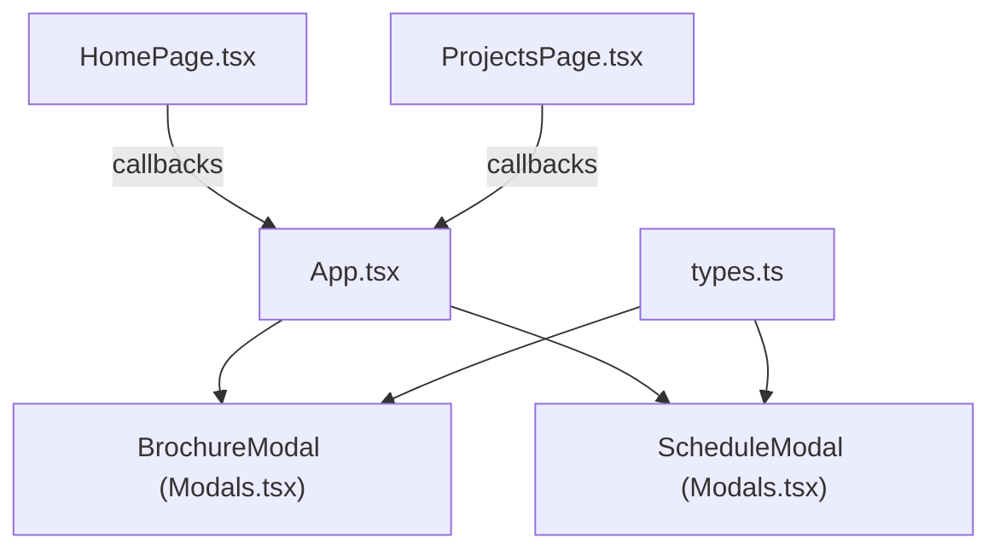
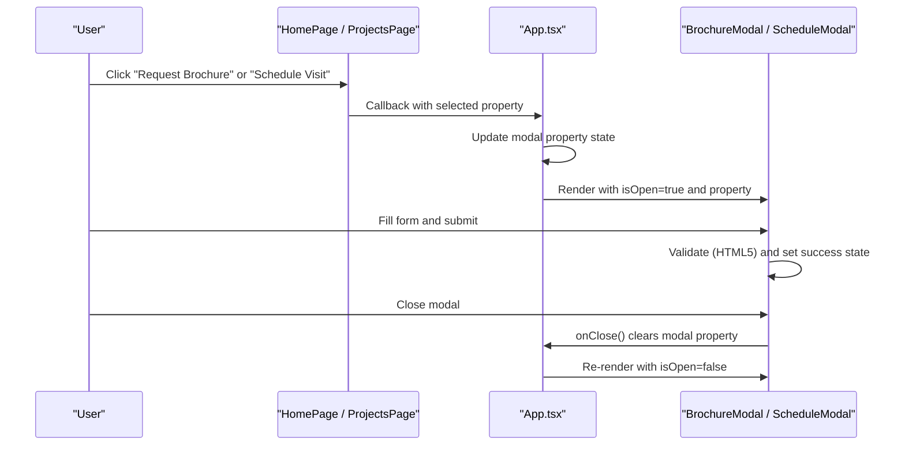
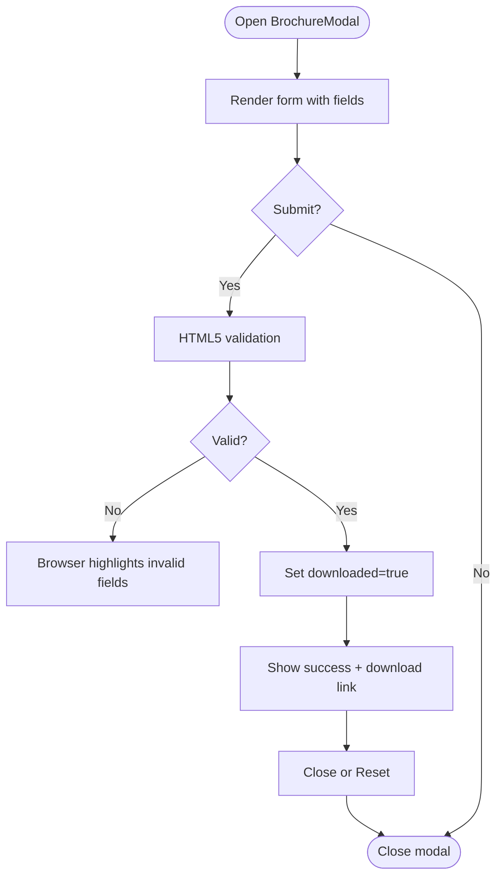
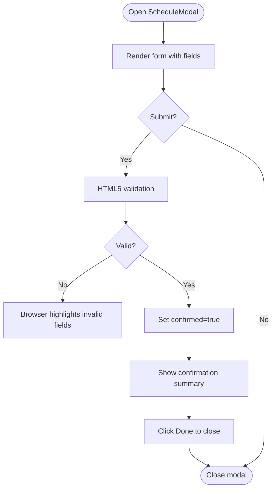
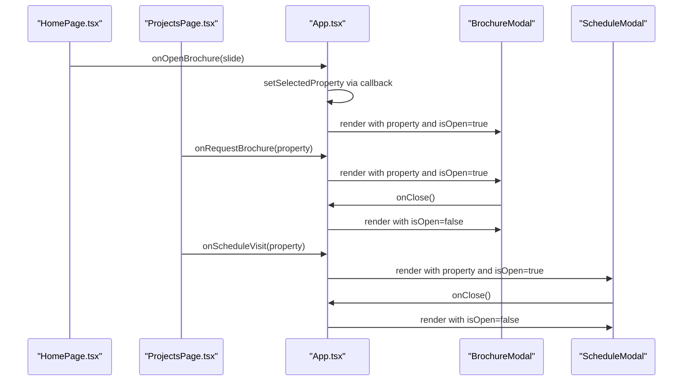
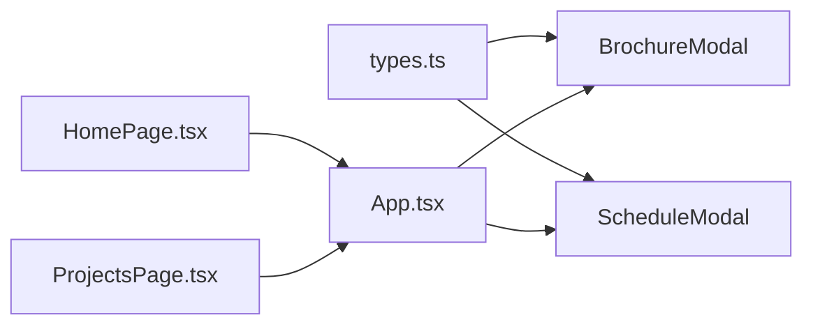

# Modal System

<cite>
**Referenced Files in This Document**
- [Modals.tsx](file://src/components/Modals.tsx)
- [App.tsx](file://src/App.tsx)
- [types.ts](file://src/types.ts)
- [HomePage.tsx](file://src/pages/HomePage.tsx)
- [ProjectsPage.tsx](file://src/components/ProjectsPage.tsx)
</cite>

## Table of Contents
1. [Introduction](#introduction)
2. [Project Structure](#project-structure)
3. [Core Components](#core-components)
4. [Architecture Overview](#architecture-overview)
5. [Detailed Component Analysis](#detailed-component-analysis)
6. [Dependency Analysis](#dependency-analysis)
7. [Performance Considerations](#performance-considerations)
8. [Troubleshooting Guide](#troubleshooting-guide)
9. [Conclusion](#conclusion)
10. [Appendices](#appendices)

## Introduction
This document explains the Modal system used for brochure requests and visit scheduling across the application. It covers modal state management, form validation patterns, user interaction flows, backdrop behavior, keyboard navigation considerations, accessibility features, and guidance for creating new modal types and integrating with the application’s state.

## Project Structure
The modal system is implemented as reusable React components that are rendered conditionally based on application-level state. The key files involved are:
- Modal components: BrochureModal and ScheduleModal
- Application state and routing: App component
- Data types for forms and properties
- Page components that trigger modals via callbacks

**Diagram sources**
- [App.tsx:15-45](file://src/App.tsx#L15-L45)
- [App.tsx:237-250](file://src/App.tsx#L237-L250)
- [Modals.tsx:12-158](file://src/components/Modals.tsx#L12-L158)
- [Modals.tsx:167-311](file://src/components/Modals.tsx#L167-L311)
- [types.ts:20-59](file://src/types.ts#L20-L59)

**Section sources**
- [App.tsx:15-45](file://src/App.tsx#L15-L45)
- [App.tsx:237-250](file://src/App.tsx#L237-L250)
- [Modals.tsx:12-158](file://src/components/Modals.tsx#L12-L158)
- [Modals.tsx:167-311](file://src/components/Modals.tsx#L167-L311)
- [types.ts:20-59](file://src/types.ts#L20-L59)

## Core Components
- BrochureModal: Presents a form to request a digital brochure for a selected property and shows a success state after submission.
- ScheduleModal: Presents a form to schedule a site visit with date/time selection and shows a confirmation state after submission.
- Both modals receive:
  - property: the target property context
  - isOpen: visibility control
  - onClose: callback to close the modal
  - theme: visual mode (dark/light)

Form data structures:
- RequestBrochureForm: name, email, phone, propertyId, receiveOnWhatsApp
- ScheduleVisitForm: name, email, phone, date, timeSlot, propertyId, notes

Validation approach:
- HTML5 required attributes enforce basic input presence
- Email type ensures browser-level email format validation
- Date inputs use native date pickers; time slots are constrained via select options

State management:
- Each modal maintains local form state and a success flag
- Parent App holds the currently selected property for each modal and controls visibility

**Section sources**
- [Modals.tsx:12-158](file://src/components/Modals.tsx#L12-L158)
- [Modals.tsx:167-311](file://src/components/Modals.tsx#L167-L311)
- [types.ts:43-59](file://src/types.ts#L43-L59)

## Architecture Overview
The modal lifecycle is driven by App-level state and passed down to modal components. Pages trigger actions via callbacks that update App state, which then renders the appropriate modal.

**Diagram sources**
- [App.tsx:39-45](file://src/App.tsx#L39-L45)
- [App.tsx:237-250](file://src/App.tsx#L237-L250)
- [Modals.tsx:24-32](file://src/components/Modals.tsx#L24-L32)
- [Modals.tsx:181-184](file://src/components/Modals.tsx#L181-L184)

## Detailed Component Analysis

### BrochureModal
Responsibilities:
- Display a form to collect contact details and preferences for brochure delivery
- Provide immediate feedback upon successful submission
- Support closing via close button and reset flow

Key behaviors:
- Conditional rendering based on isOpen and property presence
- Local form state updates via controlled inputs
- Success state toggles UI to show confirmation and download option
- Reset handler clears success and closes modal

Accessibility and UX:
- Uses labels and required fields for basic accessibility
- Focus styling is present via focus border changes
- No explicit focus trapping or ARIA dialog attributes are implemented in this component

Backdrop handling:
- Full-screen overlay with blur effect
- No background click-to-close logic in this component

Keyboard navigation:
- Escape key handling not implemented here
- Tab order follows natural DOM order within the modal

**Diagram sources**
- [Modals.tsx:24-32](file://src/components/Modals.tsx#L24-L32)
- [Modals.tsx:46-75](file://src/components/Modals.tsx#L46-L75)
- [Modals.tsx:77-153](file://src/components/Modals.tsx#L77-L153)

**Section sources**
- [Modals.tsx:12-158](file://src/components/Modals.tsx#L12-L158)

### ScheduleModal
Responsibilities:
- Collect visitor details and preferred appointment date/time
- Confirm scheduling and provide a summary view
- Allow closing after confirmation

Key behaviors:
- Controlled inputs for name, email, phone, date, time slot
- Native date picker and predefined time slots ensure valid selections
- On submit, sets confirmed state to show confirmation UI
- Confirmation button resets state and closes modal

Accessibility and UX:
- Labels and required attributes support screen readers and validation
- Focus styles indicate active inputs
- No explicit ARIA dialog role or focus trap

Backdrop handling:
- Full-screen overlay with blur effect
- No background click-to-close logic in this component

Keyboard navigation:
- Escape key handling not implemented here
- Tab order follows natural DOM order within the modal

**Diagram sources**
- [Modals.tsx:181-184](file://src/components/Modals.tsx#L181-L184)
- [Modals.tsx:198-216](file://src/components/Modals.tsx#L198-L216)
- [Modals.tsx:218-307](file://src/components/Modals.tsx#L218-L307)

**Section sources**
- [Modals.tsx:167-311](file://src/components/Modals.tsx#L167-L311)

### App Integration and State Management
Responsibilities:
- Maintain selected property for each modal
- Provide open/close handlers to pages and modals
- Render modals conditionally based on state

Key behaviors:
- handleOpenBrochure and handleOpenScheduleVisit set the respective modal property
- Modals receive isOpen derived from whether a property is set
- onClose clears the modal property, effectively closing the modal

Integration points:
- HomePage passes slide-based callbacks to open modals
- ProjectsPage maps project interactions to property-based callbacks

**Diagram sources**
- [App.tsx:39-45](file://src/App.tsx#L39-L45)
- [App.tsx:237-250](file://src/App.tsx#L237-L250)
- [HomePage.tsx:18-34](file://src/pages/HomePage.tsx#L18-L34)
- [ProjectsPage.tsx:1187-1222](file://src/components/ProjectsPage.tsx#L1187-L1222)

**Section sources**
- [App.tsx:15-45](file://src/App.tsx#L15-L45)
- [App.tsx:237-250](file://src/App.tsx#L237-L250)
- [HomePage.tsx:18-34](file://src/pages/HomePage.tsx#L18-L34)
- [ProjectsPage.tsx:1187-1222](file://src/components/ProjectsPage.tsx#L1187-L1222)

## Dependency Analysis
- Types dependency:
  - Both modals depend on Property, ThemeMode, and form types defined in types.ts
- App dependency:
  - App imports and renders both modals, passing props and managing state
- Page dependencies:
  - HomePage and ProjectsPage call into App via callbacks to open modals

**Diagram sources**
- [types.ts:20-59](file://src/types.ts#L20-L59)
- [Modals.tsx:1-3](file://src/components/Modals.tsx#L1-L3)
- [App.tsx:1-13](file://src/App.tsx#L1-L13)
- [HomePage.tsx:1-16](file://src/pages/HomePage.tsx#L1-L16)
- [ProjectsPage.tsx:1187-1222](file://src/components/ProjectsPage.tsx#L1187-L1222)

**Section sources**
- [types.ts:20-59](file://src/types.ts#L20-L59)
- [Modals.tsx:1-3](file://src/components/Modals.tsx#L1-L3)
- [App.tsx:1-13](file://src/App.tsx#L1-L13)
- [HomePage.tsx:1-16](file://src/pages/HomePage.tsx#L1-L16)
- [ProjectsPage.tsx:1187-1222](file://src/components/ProjectsPage.tsx#L1187-L1222)

## Performance Considerations
- Conditional rendering:
  - Modals return null when not open, minimizing unnecessary DOM and re-renders
- Local state:
  - Each modal manages its own form state, reducing prop drilling complexity
- Backdrop rendering:
  - Overlays are lightweight but should be avoided when closed
- Future optimizations:
  - Consider lazy-loading modal content if forms grow complex
  - Debounce heavy operations during form submissions if integrated with APIs

[No sources needed since this section provides general guidance]

## Troubleshooting Guide
Common issues and resolutions:
- Modal does not close:
  - Ensure onClose is called and App state is cleared
  - Verify isOpen is tied to App state correctly
- Form submits but no feedback:
  - Check that submit handler prevents default and sets success state
  - Confirm success UI path is reachable
- Validation errors persist:
  - Rely on HTML5 validation; ensure required and type attributes are set
  - For custom validation, add error states and messages
- Accessibility gaps:
  - Add ARIA roles and attributes for dialogs
  - Implement focus trapping and restore focus on close
  - Handle Escape key to close modals

**Section sources**
- [Modals.tsx:24-32](file://src/components/Modals.tsx#L24-L32)
- [Modals.tsx:181-184](file://src/components/Modals.tsx#L181-L184)
- [App.tsx:237-250](file://src/App.tsx#L237-L250)

## Conclusion
The Modal system provides two focused experiences—brochure requests and visit scheduling—implemented as simple, state-driven components. They integrate cleanly with App-level state and page callbacks. While current implementations rely on HTML5 validation and do not include advanced accessibility features like focus trapping or ARIA dialog semantics, they offer a solid foundation. Extending them with robust accessibility, keyboard navigation, and optional API integrations will improve usability and compliance.

[No sources needed since this section summarizes without analyzing specific files]

## Appendices

### Creating a New Modal Type
Steps:
- Define a new TypeScript interface for form data in types.ts
- Create a new modal component in Modals.tsx with:
  - Props: property, isOpen, onClose, theme
  - Local form state and success state
  - Controlled inputs bound to form state
  - Submit handler that validates and transitions to success
  - Close/reset handlers that call onClose
- In App.tsx:
  - Add state for the new modal’s selected property
  - Add open/close handlers
  - Render the new modal conditionally
- Wire up triggers in relevant pages via callbacks

**Section sources**
- [types.ts:43-59](file://src/types.ts#L43-L59)
- [Modals.tsx:12-158](file://src/components/Modals.tsx#L12-L158)
- [Modals.tsx:167-311](file://src/components/Modals.tsx#L167-L311)
- [App.tsx:15-45](file://src/App.tsx#L15-L45)
- [App.tsx:237-250](file://src/App.tsx#L237-L250)

### Handling Form Submissions
Patterns observed:
- Prevent default form submission
- Set a success flag to switch UI to confirmation
- Optionally expose a direct download or next action
- Reset state and close modal on user action

**Section sources**
- [Modals.tsx:24-32](file://src/components/Modals.tsx#L24-L32)
- [Modals.tsx:181-184](file://src/components/Modals.tsx#L181-L184)

### Integrating With Application State
- Use App-level state to hold the selected property for each modal
- Pass isOpen derived from whether a property is set
- Provide onClose to clear state and hide the modal
- Pages trigger opens via callbacks that update App state

**Section sources**
- [App.tsx:39-45](file://src/App.tsx#L39-L45)
- [App.tsx:237-250](file://src/App.tsx#L237-L250)

### Accessibility Features and Recommendations
Current implementation:
- Uses labels and required attributes for basic accessibility
- Focus styles are present for interactive elements
- No explicit ARIA dialog role, focus trapping, or Escape key handling

Recommended enhancements:
- Wrap modal content in a container with role="dialog" and aria-modal="true"
- Manage focus:
  - Move focus to the first focusable element on open
  - Trap focus within the modal while open
  - Return focus to the trigger element on close
- Keyboard navigation:
  - Handle Escape key to close the modal
  - Ensure logical tab order inside the modal
- Screen reader compatibility:
  - Associate labels with inputs
  - Announce success states using aria-live regions where appropriate

**Section sources**
- [Modals.tsx:39-44](file://src/components/Modals.tsx#L39-L44)
- [Modals.tsx:191-196](file://src/components/Modals.tsx#L191-L196)