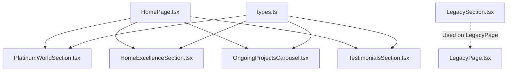
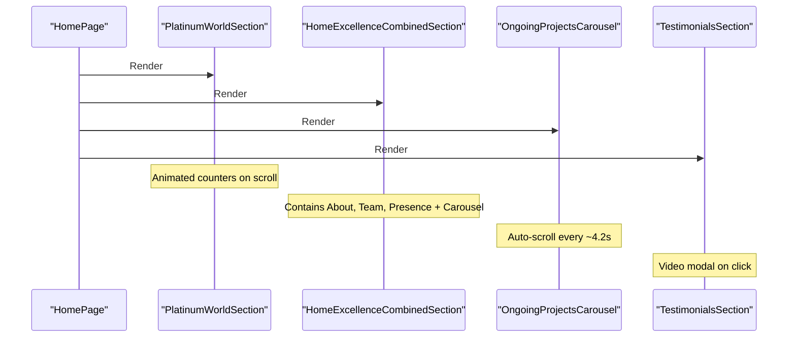
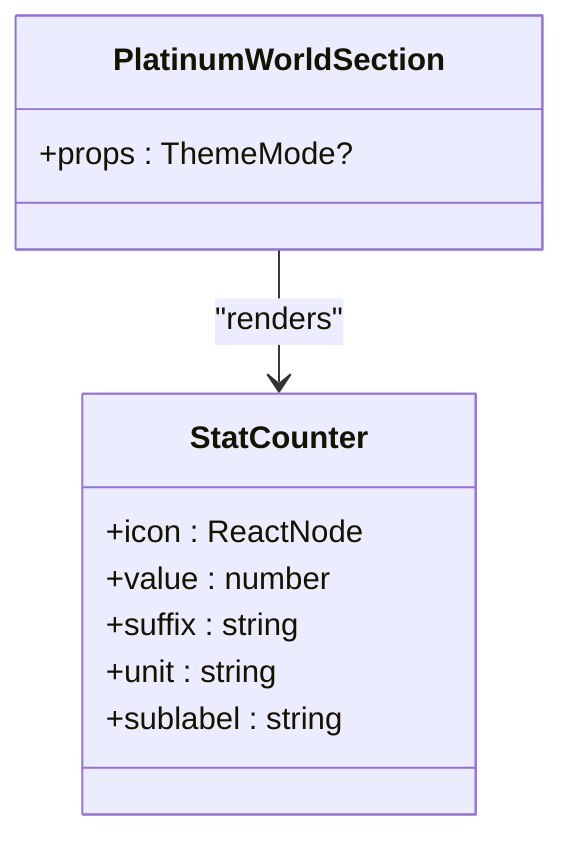
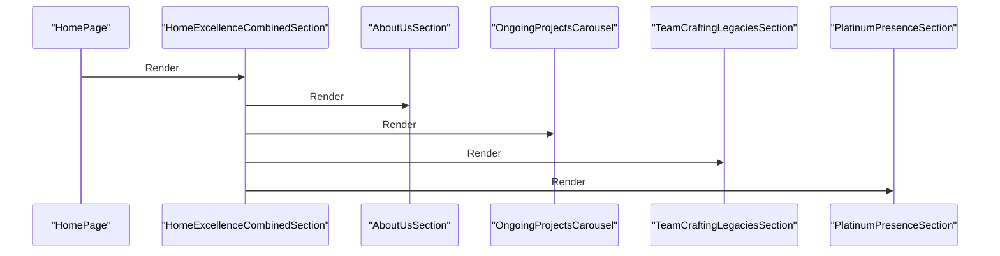
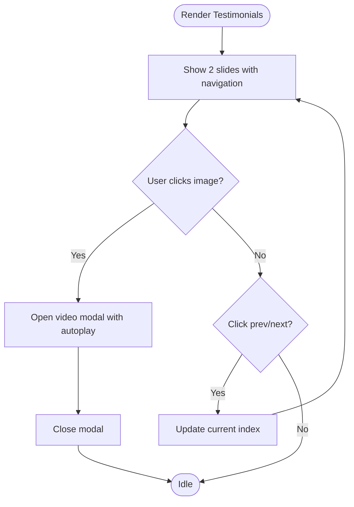
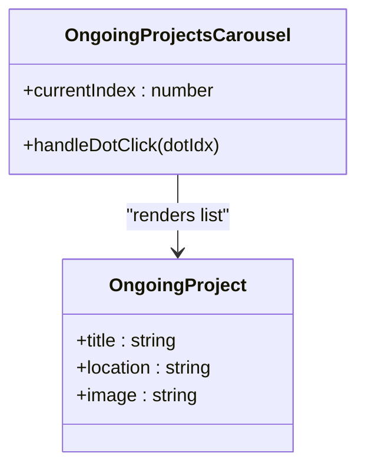
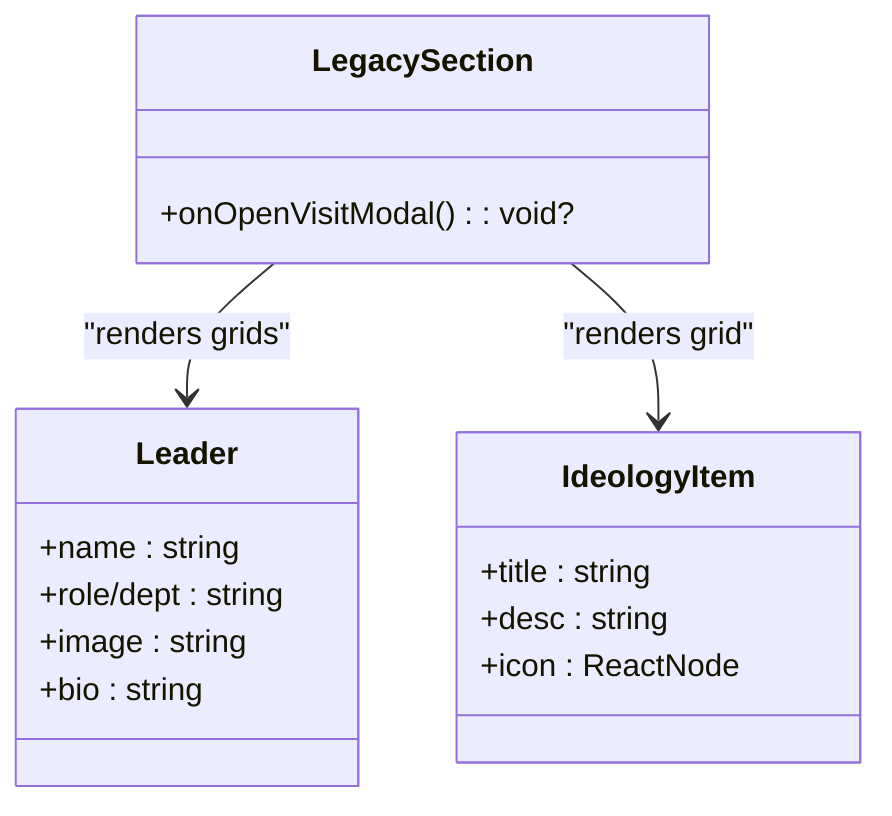
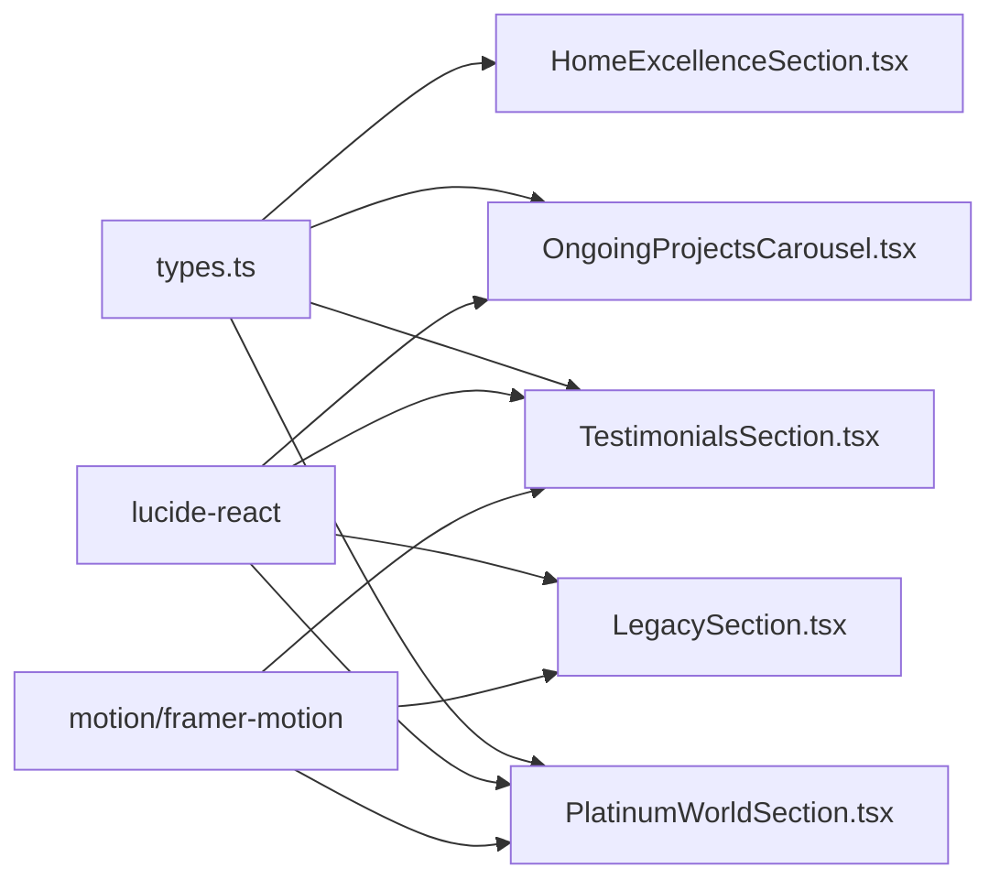

# Specialized Sections

<cite>
**Referenced Files in This Document**
- [PlatinumWorldSection.tsx](file://src/components/PlatinumWorldSection.tsx)
- [HomeExcellenceSection.tsx](file://src/components/HomeExcellenceSection.tsx)
- [TestimonialsSection.tsx](file://src/components/TestimonialsSection.tsx)
- [OngoingProjectsCarousel.tsx](file://src/components/OngoingProjectsCarousel.tsx)
- [LegacySection.tsx](file://src/components/LegacySection.tsx)
- [HomePage.tsx](file://src/pages/HomePage.tsx)
- [types.ts](file://src/types.ts)
</cite>

## Table of Contents
1. [Introduction](#introduction)
2. [Project Structure](#project-structure)
3. [Core Components](#core-components)
4. [Architecture Overview](#architecture-overview)
5. [Detailed Component Analysis](#detailed-component-analysis)
6. [Dependency Analysis](#dependency-analysis)
7. [Performance Considerations](#performance-considerations)
8. [Troubleshooting Guide](#troubleshooting-guide)
9. [Conclusion](#conclusion)

## Introduction
This document provides comprehensive documentation for specialized section components used across the application: PlatinumWorldSection, HomeExcellenceSection (combined), TestimonialsSection, OngoingProjectsCarousel, and LegacySection. It explains each component’s purpose, data structure, presentation logic, integration points with the page layout, customization options, responsive behavior, animations, interactions, and data fetching patterns.

## Project Structure
These sections are implemented as React components under src/components and composed into pages such as HomePage. The types used by these components are centralized in src/types.ts.

**Diagram sources**
- [HomePage.tsx:1-46](file://src/pages/HomePage.tsx#L1-L46)
- [PlatinumWorldSection.tsx:150-306](file://src/components/PlatinumWorldSection.tsx#L150-L306)
- [HomeExcellenceSection.tsx:1537-1564](file://src/components/HomeExcellenceSection.tsx#L1537-L1564)
- [OngoingProjectsCarousel.tsx:1-172](file://src/components/OngoingProjectsCarousel.tsx#L1-L172)
- [TestimonialsSection.tsx:1-186](file://src/components/TestimonialsSection.tsx#L1-L186)
- [LegacySection.tsx:1-337](file://src/components/LegacySection.tsx#L1-L337)
- [types.ts:1-60](file://src/types.ts#L1-L60)

**Section sources**
- [HomePage.tsx:1-46](file://src/pages/HomePage.tsx#L1-L46)
- [types.ts:1-60](file://src/types.ts#L1-L60)

## Core Components
- PlatinumWorldSection: Displays key company milestones using animated counters and a vertical side label.
- HomeExcellenceSection (combined): Orchestrates multiple sub-sections including About Us, Team, and Presence; also integrates an ongoing projects carousel within its flow.
- TestimonialsSection: Presents customer testimonials with image cards, quotes, star rating, navigation controls, and an embedded video modal.
- OngoingProjectsCarousel: Auto-scrolling carousel showcasing ongoing projects with project images, titles, locations, and a “View All Projects” call-to-action panel.
- LegacySection: A multi-part legacy page section covering hero banner, first and second generation leaders, vision/mission/belief, ideology grid, and a consultation trigger.

**Section sources**
- [PlatinumWorldSection.tsx:150-306](file://src/components/PlatinumWorldSection.tsx#L150-L306)
- [HomeExcellenceSection.tsx:1537-1564](file://src/components/HomeExcellenceSection.tsx#L1537-L1564)
- [TestimonialsSection.tsx:1-186](file://src/components/TestimonialsSection.tsx#L1-L186)
- [OngoingProjectsCarousel.tsx:1-172](file://src/components/OngoingProjectsCarousel.tsx#L1-L172)
- [LegacySection.tsx:1-337](file://src/components/LegacySection.tsx#L1-L337)

## Architecture Overview
The home page composes these sections in a specific order to guide the user through brand storytelling, achievements, ongoing work, and social proof. Each section is self-contained with internal state and uses motion libraries for animations.

**Diagram sources**
- [HomePage.tsx:25-44](file://src/pages/HomePage.tsx#L25-L44)
- [PlatinumWorldSection.tsx:168-233](file://src/components/PlatinumWorldSection.tsx#L168-L233)
- [HomeExcellenceSection.tsx:1555-1564](file://src/components/HomeExcellenceSection.tsx#L1555-L1564)
- [OngoingProjectsCarousel.tsx:59-77](file://src/components/OngoingProjectsCarousel.tsx#L59-L77)
- [TestimonialsSection.tsx:37-55](file://src/components/TestimonialsSection.tsx#L37-L55)

## Detailed Component Analysis

### PlatinumWorldSection
Purpose:
- Showcase key metrics (years, completed area, ongoing projects, homes delivered) with animated counters and elegant typography.

Data structure:
- Props: optional theme (ThemeMode).
- Internal StatCounter props: icon (ReactNode), value (number), suffix (string), unit (string), sublabel (string).

Presentation logic:
- Uses motion hooks to animate counters when scrolled into view.
- Layout includes a vertical side label and a responsive grid of four stat items.

Customization:
- Update values, units, suffixes, and sublabels per metric.
- Replace icons via lucide-react icons.
- Adjust colors and spacing via Tailwind classes.

Responsive behavior:
- Single column on small screens; multi-column grid on larger breakpoints.
- Typography scales with responsive utilities.

Animations and interactions:
- Counters animate from 0 to target value when visible.
- Fade-in and slide-up transitions for each stat item.

Integration:
- Imported and rendered directly in HomePage.

**Section sources**
- [PlatinumWorldSection.tsx:150-306](file://src/components/PlatinumWorldSection.tsx#L150-L306)
- [HomePage.tsx:37-39](file://src/pages/HomePage.tsx#L37-L39)

#### Class Diagram

**Diagram sources**
- [PlatinumWorldSection.tsx:156-233](file://src/components/PlatinumWorldSection.tsx#L156-L233)

### HomeExcellenceSection (Combined)
Purpose:
- Provide a cohesive narrative combining About Us, Team, and Presence sections, plus an integrated ongoing projects carousel.

Data structure:
- Props: optional theme (ThemeMode).
- Internally renders sub-sections: AboutUsSection, OngoingProjectsCarousel, TeamCraftingLegaciesSection, PlatinumPresenceSection.

Presentation logic:
- Renders sections in a fixed order to ensure consistent storytelling flow.
- Sub-sections include rich imagery, text blocks, and interactive elements like accordions and map pins.

Customization:
- Modify content arrays for projects, team members, and presence locations within sub-sections.
- Adjust copy, images, and calls-to-action.

Responsive behavior:
- Grid layouts adapt from single-column to multi-column based on screen size.
- Image columns bleed and overlap at larger breakpoints for visual impact.

Animations and interactions:
- Motion-based entrance animations for cards and lists.
- Accordion expand/collapse for project categories.
- Interactive map pins that highlight selected locations.

Integration:
- Exported as HomeExcellenceCombinedSection and used in HomePage.

**Section sources**
- [HomeExcellenceSection.tsx:1537-1564](file://src/components/HomeExcellenceSection.tsx#L1537-L1564)
- [HomePage.tsx:41-41](file://src/pages/HomePage.tsx#L41-L41)

#### Sequence Diagram

**Diagram sources**
- [HomeExcellenceSection.tsx:1555-1564](file://src/components/HomeExcellenceSection.tsx#L1555-L1564)

### TestimonialsSection
Purpose:
- Display customer testimonials with photos, quotes, ratings, and embedded video experiences.

Data structure:
- Local array TESTIMONIALS with fields: id, name, project, image, videoUrl, quote.
- Props: theme (ThemeMode).

Presentation logic:
- Two-slide window with prev/next navigation and dot indicators.
- Clicking a testimonial image opens a full-screen video modal with autoplay.

Customization:
- Add or edit testimonials in the local array.
- Change rating display and copy.
- Swap images and video URLs.

Responsive behavior:
- Single column on mobile; two-column grid on medium and up.
- Modal adapts to viewport with appropriate padding and aspect ratio.

Animations and interactions:
- Slide transitions with motion.
- Modal fade-in/out with AnimatePresence.
- Hover effects on play button and images.

Integration:
- Rendered in HomePage after other sections.

**Section sources**
- [TestimonialsSection.tsx:1-186](file://src/components/TestimonialsSection.tsx#L1-L186)
- [HomePage.tsx:43-43](file://src/pages/HomePage.tsx#L43-L43)

#### Flowchart

**Diagram sources**
- [TestimonialsSection.tsx:37-55](file://src/components/TestimonialsSection.tsx#L37-L55)
- [TestimonialsSection.tsx:156-182](file://src/components/TestimonialsSection.tsx#L156-L182)

### OngoingProjectsCarousel
Purpose:
- Showcase ongoing projects in a visually engaging carousel with auto-rotation and a “View All Projects” panel.

Data structure:
- Local array ONGOING_ITEMS with fields: title, location, image.
- Props: optional theme (ThemeMode).

Presentation logic:
- Horizontal sliding panel with motion-driven x-axis translation.
- Auto-advance every ~4.2 seconds; supports dot navigation.
- Right panel acts as a call-to-action with background image overlay.

Customization:
- Edit project entries (title, location, image).
- Adjust auto-rotate interval and slide width calculations.
- Customize “View All Projects” link destination.

Responsive behavior:
- Two-card visible width on desktop; stacks appropriately on smaller screens.
- Side panel collapses or resizes based on breakpoint.

Animations and interactions:
- Smooth slide transitions with easing.
- Hover scale effect on project images.
- Dot indicators update active state.

Integration:
- Rendered in HomePage and also included within HomeExcellenceCombinedSection.

**Section sources**
- [OngoingProjectsCarousel.tsx:1-172](file://src/components/OngoingProjectsCarousel.tsx#L1-L172)
- [HomePage.tsx:42-42](file://src/pages/HomePage.tsx#L42-L42)
- [HomeExcellenceSection.tsx:1555-1564](file://src/components/HomeExcellenceSection.tsx#L1555-L1564)

#### Class Diagram

**Diagram sources**
- [OngoingProjectsCarousel.tsx:6-14](file://src/components/OngoingProjectsCarousel.tsx#L6-L14)
- [OngoingProjectsCarousel.tsx:59-77](file://src/components/OngoingProjectsCarousel.tsx#L59-L77)

### LegacySection
Purpose:
- Present the company’s legacy story across multiple parts: hero banner, first and second generation leaders, vision/mission/belief, ideology grid, and a consultation trigger.

Data structure:
- Local arrays for FIRST_GEN_LEADERS, SECOND_GEN_LEADERS, IDEOLOGY_ITEMS.
- Props: optional theme (ThemeMode), optional onOpenVisitModal callback.

Presentation logic:
- Full-width hero with gradient overlay and side label.
- Overlapping beige intro card for narrative context.
- Grid layouts for leader profiles and ideology items.
- Optional footer block with a call-to-action button invoking onOpenVisitModal.

Customization:
- Update leader bios, departments, and images.
- Modify ideology items (titles, descriptions, icons).
- Toggle visibility of consultation footer via prop.

Responsive behavior:
- Hero height constrained with min/max heights.
- Grids shift from single to multi-column based on breakpoints.
- Side labels hidden on small screens.

Animations and interactions:
- Scroll-triggered fade-in and slide-up for leader cards.
- Backdrop-blur cards for vision/mission/belief.
- Button hover states for consultation trigger.

Integration:
- Typically used on LegacyPage; can be imported elsewhere if needed.

**Section sources**
- [LegacySection.tsx:1-337](file://src/components/LegacySection.tsx#L1-L337)

#### Class Diagram

**Diagram sources**
- [LegacySection.tsx:6-9](file://src/components/LegacySection.tsx#L6-L9)
- [LegacySection.tsx:21-72](file://src/components/LegacySection.tsx#L21-L72)
- [LegacySection.tsx:141-227](file://src/components/LegacySection.tsx#L141-L227)
- [LegacySection.tsx:299-313](file://src/components/LegacySection.tsx#L299-L313)

## Dependency Analysis
- Shared types: ThemeMode and related interfaces are defined in types.ts and referenced by components where applicable.
- Icons: lucide-react icons are used consistently across sections for visual cues.
- Animation: motion/react and framer-motion are used for scroll-triggered and transition animations.
- Routing: Some sub-sections may use react-router-dom for navigation (e.g., “Know More” buttons), though not all sections rely on routing.

**Diagram sources**
- [types.ts:1-60](file://src/types.ts#L1-L60)
- [PlatinumWorldSection.tsx:150-154](file://src/components/PlatinumWorldSection.tsx#L150-L154)
- [OngoingProjectsCarousel.tsx:1-4](file://src/components/OngoingProjectsCarousel.tsx#L1-L4)
- [TestimonialsSection.tsx:1-4](file://src/components/TestimonialsSection.tsx#L1-L4)
- [LegacySection.tsx:1-4](file://src/components/LegacySection.tsx#L1-L4)

**Section sources**
- [types.ts:1-60](file://src/types.ts#L1-L60)

## Performance Considerations
- Avoid excessive re-renders: Keep static data arrays (TESTIMONIALS, ONGOING_ITEMS, leader lists) outside component functions to prevent recreation on each render.
- Optimize images: Use appropriately sized images and consider lazy loading for off-screen assets.
- Debounce or throttle heavy animations: Ensure motion animations do not cause layout thrashing; prefer transform-based animations.
- Memoize expensive computations: If adding derived data (e.g., filtered project lists), memoize with useMemo.
- Limit modal overhead: Ensure video modals unmount when closed to free resources.

[No sources needed since this section provides general guidance]

## Troubleshooting Guide
- Counters not animating: Verify that the element enters the viewport and that motion hooks are correctly configured. Check for missing refs or incorrect viewport settings.
- Carousel not auto-advancing: Confirm setInterval is set up and cleared properly; ensure maxIndex calculation accounts for the number of items.
- Video modal not closing: Ensure the close handler clears the activeVideo state and unmounts the iframe to stop playback.
- Responsive layout issues: Inspect Tailwind breakpoints and ensure container widths and grids are set appropriately for different screen sizes.
- Navigation links not working: If using react-router-dom, verify routes are configured and navigate calls are correct.

**Section sources**
- [PlatinumWorldSection.tsx:168-233](file://src/components/PlatinumWorldSection.tsx#L168-L233)
- [OngoingProjectsCarousel.tsx:59-77](file://src/components/OngoingProjectsCarousel.tsx#L59-L77)
- [TestimonialsSection.tsx:156-182](file://src/components/TestimonialsSection.tsx#L156-L182)

## Conclusion
These specialized sections provide a structured, visually compelling way to present brand narrative, achievements, ongoing work, and social proof. They integrate seamlessly into the page layout, leverage motion for engaging interactions, and offer clear customization points for content and styling. By following the guidelines and best practices outlined here, you can extend and maintain these components effectively while ensuring performance and responsiveness across devices.

[No sources needed since this section summarizes without analyzing specific files]