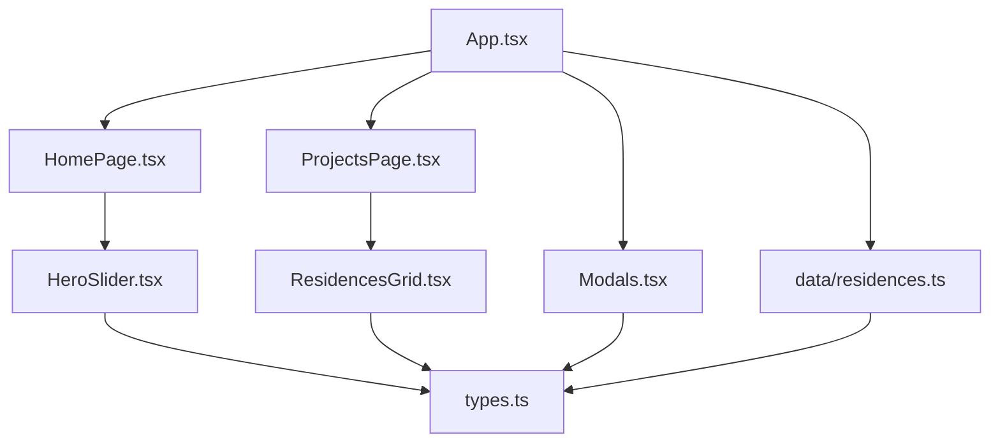
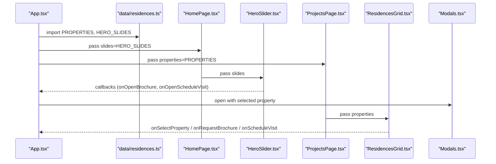
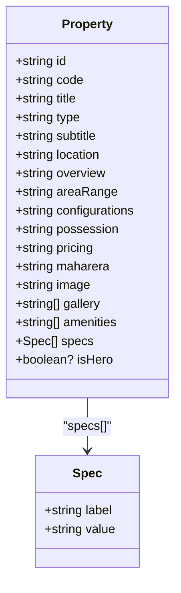
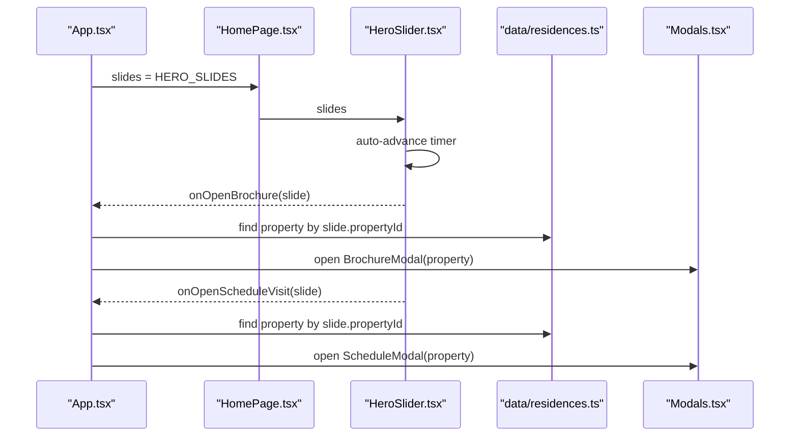
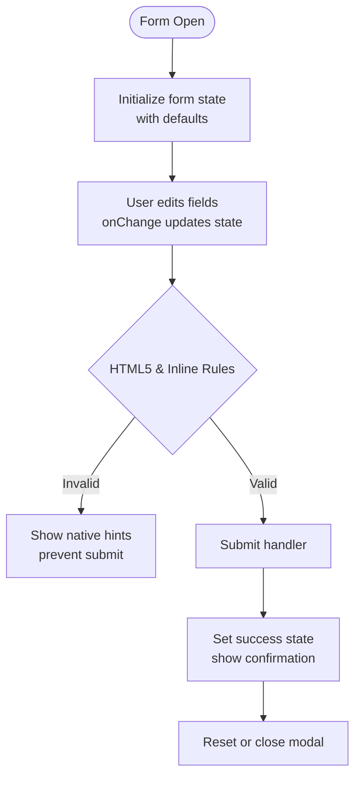
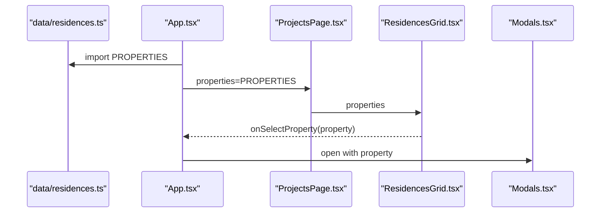
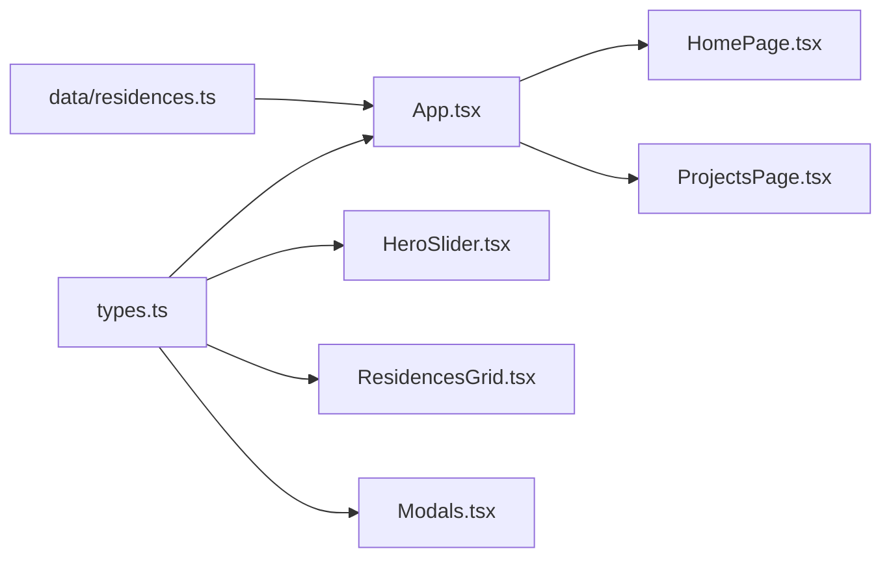

# Data Management

<cite>
**Referenced Files in This Document**
- [types.ts](file://src/types.ts)
- [residences.ts](file://src/data/residences.ts)
- [HeroSlider.tsx](file://src/components/HeroSlider.tsx)
- [ResidencesGrid.tsx](file://src/components/ResidencesGrid.tsx)
- [ContactForm.tsx](file://src/components/contact/ContactForm.tsx)
- [Modals.tsx](file://src/components/Modals.tsx)
- [HomePage.tsx](file://src/pages/HomePage.tsx)
- [ProjectsPage.tsx](file://src/pages/ProjectsPage.tsx)
- [App.tsx](file://src/App.tsx)
</cite>

## Table of Contents
1. Introduction
2. Project Structure
3. Core Components
4. Architecture Overview
5. Detailed Component Analysis
6. Dependency Analysis
7. Performance Considerations
8. Troubleshooting Guide
9. Conclusion

## Introduction
This document explains the data model and data flow for the N-Square real estate website. It focuses on:
- Property data structure and interfaces for properties, hero slides, and form data
- Centralized static data management using TypeScript files
- Type safety patterns and validation strategies
- How data models connect to UI components and how data flows from static sources to dynamic displays
- Extension patterns for adding new properties or content
- Best practices for maintaining consistency across the application

## Project Structure
The project organizes data and types centrally and consumes them via typed props in components:
- Types are defined in a single file for reuse across the app
- Static datasets (properties and hero slides) live under a dedicated data module
- Pages and components receive data through strongly-typed props, ensuring type safety at compile time
- Modals encapsulate form state and submission flows with typed forms

**Diagram sources**
- [App.tsx:1-255](file://src/App.tsx#L1-L255)
- [HomePage.tsx:1-47](file://src/pages/HomePage.tsx#L1-L47)
- [ProjectsPage.tsx:1-35](file://src/pages/ProjectsPage.tsx#L1-L35)
- [HeroSlider.tsx:1-251](file://src/components/HeroSlider.tsx#L1-L251)
- [ResidencesGrid.tsx:1-151](file://src/components/ResidencesGrid.tsx#L1-L151)
- [Modals.tsx:1-312](file://src/components/Modals.tsx#L1-L312)
- [residences.ts:1-190](file://src/data/residences.ts#L1-L190)
- [types.ts:1-60](file://src/types.ts#L1-L60)

**Section sources**
- [App.tsx:1-255](file://src/App.tsx#L1-L255)
- [HomePage.tsx:1-47](file://src/pages/HomePage.tsx#L1-L47)
- [ProjectsPage.tsx:1-35](file://src/pages/ProjectsPage.tsx#L1-L35)
- [HeroSlider.tsx:1-251](file://src/components/HeroSlider.tsx#L1-L251)
- [ResidencesGrid.tsx:1-151](file://src/components/ResidencesGrid.tsx#L1-L151)
- [Modals.tsx:1-312](file://src/components/Modals.tsx#L1-L312)
- [residences.ts:1-190](file://src/data/residences.ts#L1-L190)
- [types.ts:1-60](file://src/types.ts#L1-L60)

## Core Components
This section documents the core data models and their usage across the application.

- Property model
  - Represents a real estate asset with fields such as id, code, title, type, subtitle, location, overview, areaRange, configurations, possession, pricing, maharera, image, gallery, amenities, specs, and an optional isHero flag
  - Used by pages and components to render property cards, filter portfolios, and drive modal actions

- HeroSlide model
  - Represents a hero carousel slide with id, title, subtitle, code, location, image, and propertyId
  - Consumed by the hero slider component to display rich marketing content and link back to a specific property

- Form models
  - ScheduleVisitForm: name, email, phone, date, timeSlot, propertyId, notes
  - RequestBrochureForm: name, email, phone, propertyId, receiveOnWhatsApp
  - ContactFormData: name, email, phone, project, message (used by the contact page form)

- Centralized static data
  - HERO_SLIDES and PROPERTIES arrays provide all runtime data for the site
  - These are imported into App and passed down to pages and components

**Section sources**
- [types.ts:5-59](file://src/types.ts#L5-L59)
- [residences.ts:3-189](file://src/data/residences.ts#L3-L189)
- [HeroSlider.tsx:1-251](file://src/components/HeroSlider.tsx#L1-L251)
- [ResidencesGrid.tsx:1-151](file://src/components/ResidencesGrid.tsx#L1-L151)
- [Modals.tsx:1-312](file://src/components/Modals.tsx#L1-L312)
- [ContactForm.tsx:1-146](file://src/components/contact/ContactForm.tsx#L1-L146)
- [App.tsx:1-255](file://src/App.tsx#L1-L255)

## Architecture Overview
Data originates from static TypeScript modules and flows downward through React’s prop system to presentational components. The root App orchestrates routing and global state while passing data to pages.

**Diagram sources**
- [App.tsx:1-255](file://src/App.tsx#L1-L255)
- [residences.ts:1-190](file://src/data/residences.ts#L1-L190)
- [HomePage.tsx:1-47](file://src/pages/HomePage.tsx#L1-L47)
- [HeroSlider.tsx:1-251](file://src/components/HeroSlider.tsx#L1-L251)
- [ProjectsPage.tsx:1-35](file://src/pages/ProjectsPage.tsx#L1-L35)
- [ResidencesGrid.tsx:1-151](file://src/components/ResidencesGrid.tsx#L1-L151)
- [Modals.tsx:1-312](file://src/components/Modals.tsx#L1-L312)

## Detailed Component Analysis

### Property Model and Usage
- Definition and fields
  - The Property interface defines the canonical shape for all real estate assets, including identifiers, marketing copy, specifications, media, and compliance info
- Consumption
  - ResidencesGrid renders a portfolio grid, filters by type, and exposes actions to select a property, request brochure, or schedule a visit
  - App routes and pages pass filtered subsets (e.g., Commercial) to specialized views

**Diagram sources**
- [types.ts:20-41](file://src/types.ts#L20-L41)

**Section sources**
- [types.ts:20-41](file://src/types.ts#L20-L41)
- [ResidencesGrid.tsx:1-151](file://src/components/ResidencesGrid.tsx#L1-L151)
- [App.tsx:200-224](file://src/App.tsx#L200-L224)

### Hero Slide Model and Carousel Flow
- Definition and fields
  - HeroSlide includes id, title, subtitle, code, location, image, and propertyId to link the slide to a property
- Carousel behavior
  - HeroSlider auto-advances, supports manual navigation, and triggers callbacks to open modals or select a property
- Data binding
  - App passes HERO_SLIDES to HomePage, which forwards them to HeroSlider
  - Callbacks resolve the corresponding property by propertyId and open appropriate modals

**Diagram sources**
- [residences.ts:3-58](file://src/data/residences.ts#L3-L58)
- [HeroSlider.tsx:1-251](file://src/components/HeroSlider.tsx#L1-L251)
- [App.tsx:119-135](file://src/App.tsx#L119-L135)
- [Modals.tsx:1-312](file://src/components/Modals.tsx#L1-L312)

**Section sources**
- [types.ts:5-13](file://src/types.ts#L5-L13)
- [residences.ts:3-58](file://src/data/residences.ts#L3-L58)
- [HeroSlider.tsx:1-251](file://src/components/HeroSlider.tsx#L1-L251)
- [App.tsx:119-135](file://src/App.tsx#L119-L135)

### Form Models and Validation Patterns
- ScheduleVisitForm and RequestBrochureForm
  - Strongly typed shapes ensure consistent field names and types across modals
  - Default values are set when opening modals (e.g., default date/time slots)
- ContactFormData
  - Separate form shape used by the contact page component
- Validation approach
  - HTML5 required attributes enforce presence
  - Input constraints (e.g., numeric-only phone input) applied inline
  - Controlled components update local state via onChange handlers
  - Submission toggles success states within modals

**Diagram sources**
- [types.ts:43-59](file://src/types.ts#L43-L59)
- [Modals.tsx:13-32](file://src/components/Modals.tsx#L13-L32)
- [Modals.tsx:167-184](file://src/components/Modals.tsx#L167-L184)
- [ContactForm.tsx:5-11](file://src/components/contact/ContactForm.tsx#L5-L11)

**Section sources**
- [types.ts:43-59](file://src/types.ts#L43-L59)
- [Modals.tsx:1-312](file://src/components/Modals.tsx#L1-L312)
- [ContactForm.tsx:1-146](file://src/components/contact/ContactForm.tsx#L1-L146)

### Data Flow: From Static Sources to Dynamic Displays
- Static source
  - PROPERTIES and HERO_SLIDES are exported from a single module
- Routing and pages
  - App imports these arrays and passes them to pages based on route
  - Pages forward data to child components via props
- Filtering and selection
  - Components like ResidencesGrid filter by type and expose callbacks
  - App handles selection and opens modals with the chosen property

**Diagram sources**
- [residences.ts:60-189](file://src/data/residences.ts#L60-L189)
- [App.tsx:140-164](file://src/App.tsx#L140-L164)
- [ProjectsPage.tsx:1-35](file://src/pages/ProjectsPage.tsx#L1-L35)
- [ResidencesGrid.tsx:1-151](file://src/components/ResidencesGrid.tsx#L1-L151)
- [Modals.tsx:1-312](file://src/components/Modals.tsx#L1-L312)

**Section sources**
- [residences.ts:60-189](file://src/data/residences.ts#L60-L189)
- [App.tsx:140-164](file://src/App.tsx#L140-L164)
- [ProjectsPage.tsx:1-35](file://src/pages/ProjectsPage.tsx#L1-L35)
- [ResidencesGrid.tsx:1-151](file://src/components/ResidencesGrid.tsx#L1-L151)
- [Modals.tsx:1-312](file://src/components/Modals.tsx#L1-L312)

## Dependency Analysis
- Centralized types
  - All components depend on types.ts for shared interfaces
- Static data dependency
  - App depends on residences.ts for initial dataset
- Component coupling
  - Pages depend on components for rendering; components depend on types for props
- External libraries
  - Animation and icons are used but do not affect data model integrity

**Diagram sources**
- [types.ts:1-60](file://src/types.ts#L1-L60)
- [residences.ts:1-190](file://src/data/residences.ts#L1-L190)
- [App.tsx:1-255](file://src/App.tsx#L1-L255)
- [HeroSlider.tsx:1-251](file://src/components/HeroSlider.tsx#L1-L251)
- [ResidencesGrid.tsx:1-151](file://src/components/ResidencesGrid.tsx#L1-L151)
- [Modals.tsx:1-312](file://src/components/Modals.tsx#L1-L312)
- [HomePage.tsx:1-47](file://src/pages/HomePage.tsx#L1-L47)
- [ProjectsPage.tsx:1-35](file://src/pages/ProjectsPage.tsx#L1-L35)

**Section sources**
- [types.ts:1-60](file://src/types.ts#L1-L60)
- [residences.ts:1-190](file://src/data/residences.ts#L1-L190)
- [App.tsx:1-255](file://src/App.tsx#L1-L255)

## Performance Considerations
- Static data loading
  - Importing arrays once and reusing them avoids repeated network calls
- Rendering efficiency
  - Use stable keys (e.g., property.id) for lists to minimize re-renders
- Image handling
  - Ensure images are optimized; consider lazy loading if needed
- Filtering
  - Keep filtering logic simple and memoize where necessary to avoid unnecessary recalculations

[No sources needed since this section provides general guidance]

## Troubleshooting Guide
- Missing or mismatched propertyId
  - If a hero slide references a non-existent propertyId, the callback resolution may fall back to a default; verify that every slide has a valid propertyId
- Form validation issues
  - Required fields must be filled; ensure inputs use correct types (email, tel, date) and that onChange handlers update state correctly
- Type errors
  - Adding new fields requires updating both the interface and any consumers; keep types.ts as the single source of truth
- Inconsistent data entries
  - Maintain consistent naming for codes, titles, and locations; validate against allowed enums (e.g., Property.type)

**Section sources**
- [types.ts:20-41](file://src/types.ts#L20-L41)
- [residences.ts:3-58](file://src/data/residences.ts#L3-L58)
- [Modals.tsx:13-32](file://src/components/Modals.tsx#L13-L32)
- [Modals.tsx:167-184](file://src/components/Modals.tsx#L167-L184)
- [ContactForm.tsx:5-11](file://src/components/contact/ContactForm.tsx#L5-L11)

## Conclusion
The N-Square website uses a clear, centralized data model strategy:
- Single source of truth for types and static data
- Strong typing ensures consistency between data and UI
- Clean separation of concerns: data in static modules, presentation in components, orchestration in App
- Extensible design: add new properties or slides by extending the static arrays and optionally expanding types if needed
Following these patterns will help maintain data consistency, improve developer experience, and support future growth of the application.