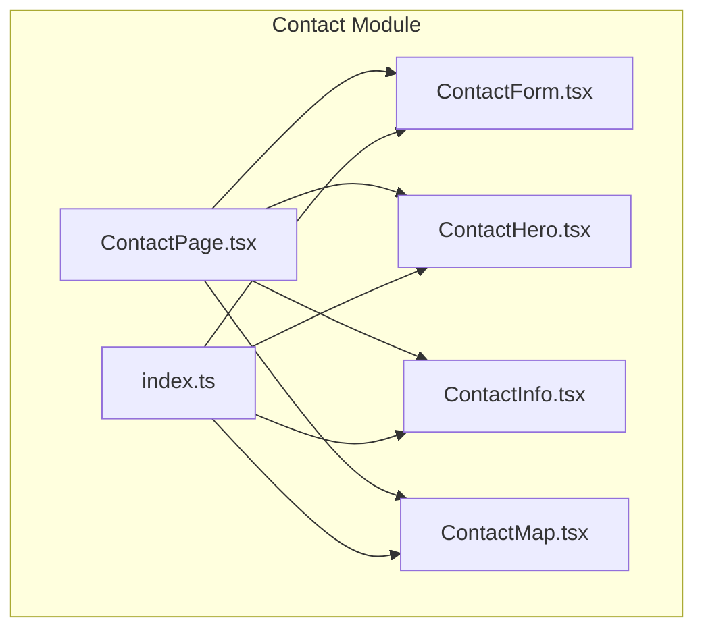
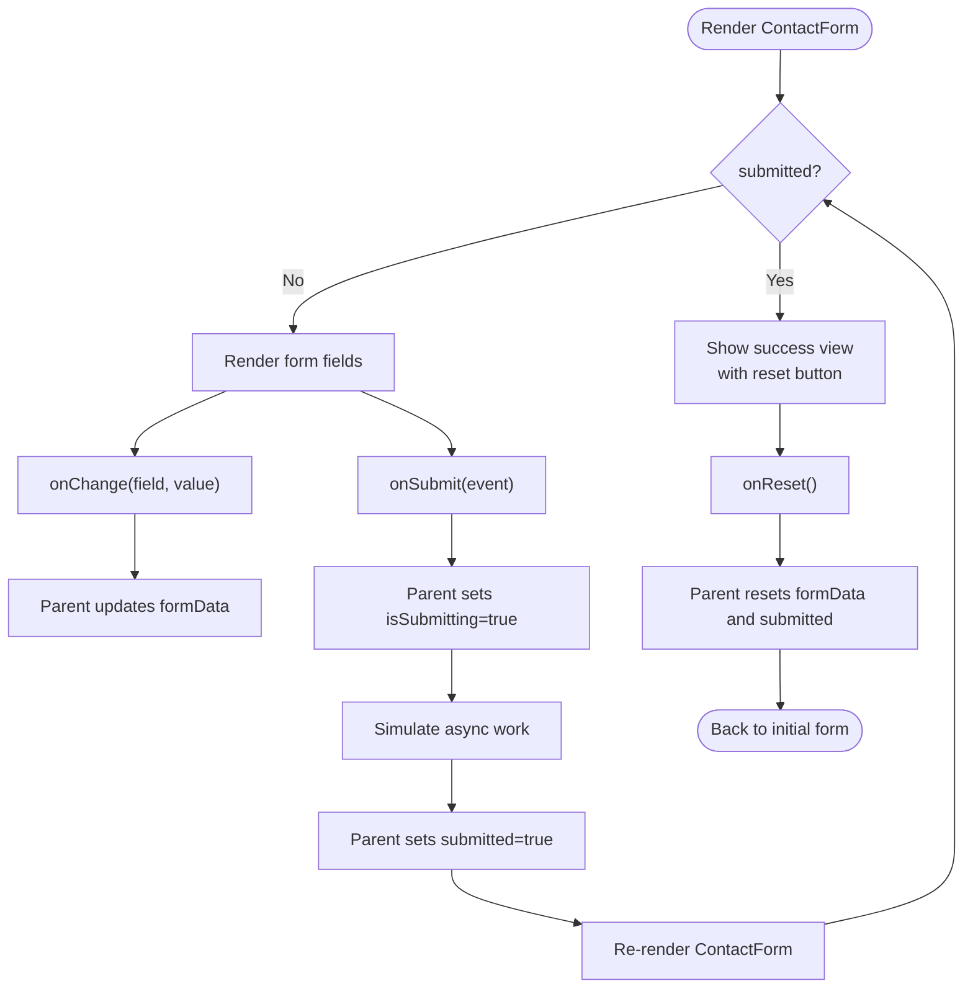
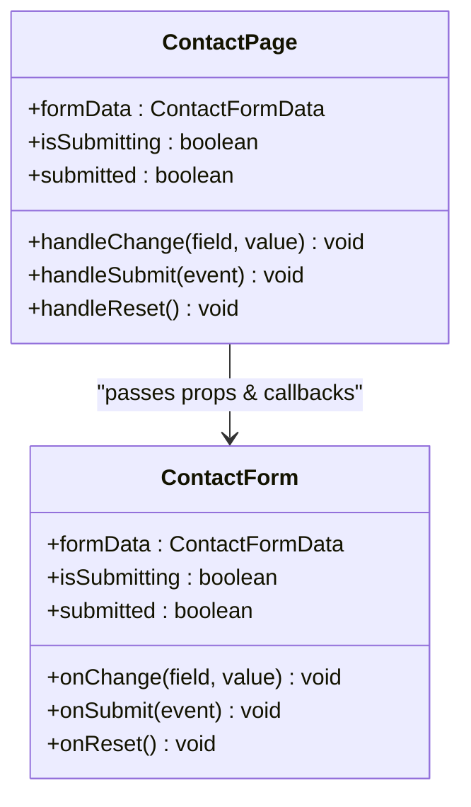
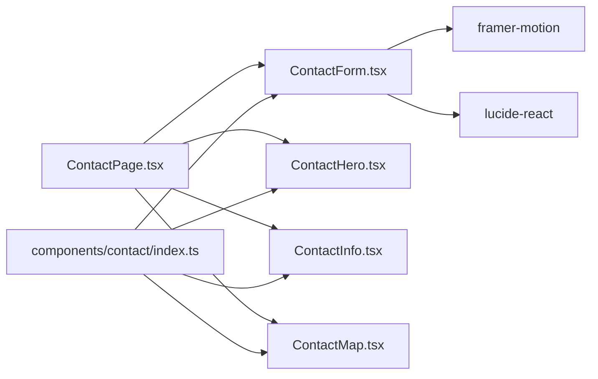

# Contact Form System

<cite>
**Referenced Files in This Document**
- [ContactForm.tsx](file://src/components/contact/ContactForm.tsx)
- [ContactPage.tsx](file://src/pages/ContactPage.tsx)
- [index.ts](file://src/components/contact/index.ts)
- [types.ts](file://src/types.ts)
- [ContactHero.tsx](file://src/components/contact/ContactHero.tsx)
- [ContactInfo.tsx](file://src/components/contact/ContactInfo.tsx)
- [ContactMap.tsx](file://src/components/contact/ContactMap.tsx)
</cite>

## Table of Contents
1. [Introduction](#introduction)
2. [Project Structure](#project-structure)
3. [Core Components](#core-components)
4. [Architecture Overview](#architecture-overview)
5. [Detailed Component Analysis](#detailed-component-analysis)
6. [Dependency Analysis](#dependency-analysis)
7. [Performance Considerations](#performance-considerations)
8. [Troubleshooting Guide](#troubleshooting-guide)
9. [Conclusion](#conclusion)
10. [Appendices](#appendices)

## Introduction
This document explains the contact form system implemented in the application, focusing on the ContactForm component architecture, form state management, validation rules, user input handling, and integration with parent components. It also covers the submission workflow (loading states, success feedback, reset), accessibility features present in the implementation, and guidance for extending the form or customizing validation.

## Project Structure
The contact feature is organized under a dedicated folder with related UI pieces and a page that orchestrates them:
- Page-level container: ContactPage manages form state and lifecycle
- Form component: ContactForm renders fields and handles local interactions
- Supporting components: ContactHero, ContactInfo, ContactMap provide context and layout
- Exports: index.ts centralizes public exports for the contact module
- Shared types: types.ts defines shared type definitions used across the app



**Diagram sources**
- [ContactPage.tsx:1-77](file://src/pages/ContactPage.tsx#L1-L77)
- [ContactForm.tsx:1-146](file://src/components/contact/ContactForm.tsx#L1-L146)
- [ContactHero.tsx:1-41](file://src/components/contact/ContactHero.tsx#L1-L41)
- [ContactInfo.tsx:1-56](file://src/components/contact/ContactInfo.tsx#L1-L56)
- [ContactMap.tsx:1-31](file://src/components/contact/ContactMap.tsx#L1-L31)
- [index.ts:1-5](file://src/components/contact/index.ts#L1-L5)

**Section sources**
- [ContactPage.tsx:1-77](file://src/pages/ContactPage.tsx#L1-L77)
- [ContactForm.tsx:1-146](file://src/components/contact/ContactForm.tsx#L1-L146)
- [index.ts:1-5](file://src/components/contact/index.ts#L1-L5)

## Core Components
- ContactForm: Renders the contact form fields, handles local input changes, displays success state, and exposes props for parent-driven state and submission.
- ContactPage: Owns form state (formData, isSubmitting, submitted), wires up change handlers, submission flow, and reset behavior.
- Supporting components: ContactHero (header), ContactInfo (contact details), ContactMap (location map).

Key responsibilities:
- ContactForm:
  - Controlled inputs bound to formData via onChange
  - Native HTML validation using required attributes and input types
  - Success view with reset button
  - Loading state reflected on submit button
- ContactPage:
  - State initialization and updates
  - Submission simulation with loading and success transitions
  - Reset logic to clear form and hide success view

**Section sources**
- [ContactForm.tsx:5-20](file://src/components/contact/ContactForm.tsx#L5-L20)
- [ContactForm.tsx:22-146](file://src/components/contact/ContactForm.tsx#L22-L146)
- [ContactPage.tsx:5-38](file://src/pages/ContactPage.tsx#L5-L38)
- [ContactPage.tsx:40-77](file://src/pages/ContactPage.tsx#L40-L77)

## Architecture Overview
The form follows a controlled component pattern where the parent owns state and passes it down to the child via props. The child raises events through callbacks to update state and trigger side effects.

```mermaid
sequenceDiagram
participant User as "User"
participant Page as "ContactPage"
participant Form as "ContactForm"
User->>Form : Type into fields
Form->>Page : onChange(field, value)
Page->>Page : setFormData(prev => updated)
Note over Page : formData updated in parent
User->>Form : Click Submit
Form->>Page : onSubmit(event)
Page->>Page : setIsSubmitting(true)
Page->>Page : setTimeout(() => { setIsSubmitting(false); setSubmitted(true) })
Page-->>Form : re-render with submitted=true
Form-->>User : Show success message + Reset button
User->>Form : Click Reset
Form->>Page : onReset()
Page->>Page : setFormData(INITIAL_FORM_DATA), setSubmitted(false)
```

**Diagram sources**
- [ContactPage.tsx:17-38](file://src/pages/ContactPage.tsx#L17-L38)
- [ContactForm.tsx:22-146](file://src/components/contact/ContactForm.tsx#L22-L146)

## Detailed Component Analysis

### ContactForm Component
- Props interface:
  - formData: current field values
  - onChange: callback to update a specific field
  - onSubmit: form submission handler
  - isSubmitting: boolean to disable submit and show processing state
  - submitted: boolean to switch to success view
  - onReset: callback to reset form state
- Fields:
  - name (text, required)
  - email (email, required)
  - phone (tel, required; digits-only input normalization)
  - project (select, required; predefined options)
  - message (textarea, optional)
- Validation:
  - Uses native HTML validation (required, type="email", type="tel")
  - Phone input normalizes to digits only at input time
- Accessibility:
  - Each input has an associated label element
  - Semantic form structure with proper input types
  - Button disabled state during submission improves focus management
- UX:
  - Success view with confirmation message and reset action
  - Submit button shows processing indicator while submitting



**Diagram sources**
- [ContactForm.tsx:22-146](file://src/components/contact/ContactForm.tsx#L22-L146)
- [ContactPage.tsx:17-38](file://src/pages/ContactPage.tsx#L17-L38)

**Section sources**
- [ContactForm.tsx:5-20](file://src/components/contact/ContactForm.tsx#L5-L20)
- [ContactForm.tsx:52-146](file://src/components/contact/ContactForm.tsx#L52-L146)

### ContactPage Integration
- State:
  - formData: initialized to empty values
  - isSubmitting: toggled during submission
  - submitted: toggled after successful submission
- Handlers:
  - handleChange: updates a single field immutably
  - handleSubmit: prevents default, simulates async submission, then shows success
  - handleReset: clears form data and hides success view
- Rendering:
  - Passes formData and callbacks to ContactForm
  - Composes ContactHero, ContactInfo, ContactMap around the form



**Diagram sources**
- [ContactPage.tsx:17-38](file://src/pages/ContactPage.tsx#L17-L38)
- [ContactForm.tsx:13-20](file://src/components/contact/ContactForm.tsx#L13-L20)

**Section sources**
- [ContactPage.tsx:5-38](file://src/pages/ContactPage.tsx#L5-L38)
- [ContactPage.tsx:40-77](file://src/pages/ContactPage.tsx#L40-L77)

### Data Model: ContactFormData
- Fields:
  - name: string
  - email: string
  - phone: string
  - project: string
  - message: string
- Purpose:
  - Strongly typed contract between ContactPage and ContactForm
  - Ensures consistent shape for form state and callbacks

**Section sources**
- [ContactForm.tsx:5-11](file://src/components/contact/ContactForm.tsx#L5-L11)

### Supporting Components
- ContactHero: Provides header section with title and description
- ContactInfo: Displays corporate address, phone, and email
- ContactMap: Embeds Google Maps iframe for location display

These components are composed by ContactPage to create a cohesive contact experience.

**Section sources**
- [ContactHero.tsx:1-41](file://src/components/contact/ContactHero.tsx#L1-L41)
- [ContactInfo.tsx:1-56](file://src/components/contact/ContactInfo.tsx#L1-L56)
- [ContactMap.tsx:1-31](file://src/components/contact/ContactMap.tsx#L1-L31)

## Dependency Analysis
- ContactPage depends on:
  - ContactForm (and its exported type ContactFormData)
  - ContactHero, ContactInfo, ContactMap for layout and content
- ContactForm depends on:
  - React, framer-motion for animations
  - lucide-react icons for visual cues
- index.ts centralizes exports for the contact module, simplifying imports



**Diagram sources**
- [ContactPage.tsx:1-77](file://src/pages/ContactPage.tsx#L1-L77)
- [ContactForm.tsx:1-146](file://src/components/contact/ContactForm.tsx#L1-L146)
- [index.ts:1-5](file://src/components/contact/index.ts#L1-L5)

**Section sources**
- [index.ts:1-5](file://src/components/contact/index.ts#L1-L5)
- [ContactPage.tsx:1-77](file://src/pages/ContactPage.tsx#L1-L77)

## Performance Considerations
- Controlled inputs: Each keystroke triggers a parent state update. For large forms or heavy validation, consider memoization or debounced updates if needed.
- Simulation delay: The current submission uses a fixed timeout. Replace with real async operations (e.g., API calls) and manage error states accordingly.
- Animations: framer-motion is used sparingly; ensure animations do not block critical interactions.
- Accessibility: Using native HTML validation reduces extra JS overhead and improves browser-native UX.

[No sources needed since this section provides general guidance]

## Troubleshooting Guide
Common issues and resolutions:
- Form does not submit:
  - Ensure all required fields are filled; native validation will prevent submission otherwise.
  - Verify that onSubmit is correctly wired from ContactPage to ContactForm.
- Submit button remains disabled:
  - Check that isSubmitting is reset after the simulated delay or actual async operation completes.
- Success view does not reset:
  - Confirm onReset is called and that it resets both formData and submitted state in the parent.
- Phone input accepts non-digits:
  - The input normalizes to digits only; verify onChange handler is applied to the phone field.

**Section sources**
- [ContactForm.tsx:84-97](file://src/components/contact/ContactForm.tsx#L84-L97)
- [ContactForm.tsx:135-143](file://src/components/contact/ContactForm.tsx#L135-L143)
- [ContactPage.tsx:26-38](file://src/pages/ContactPage.tsx#L26-L38)

## Conclusion
The contact form system uses a clean, controlled component pattern with strong typing and native validation. ContactPage owns state and lifecycle, while ContactForm focuses on rendering and local interactions. The design supports easy extension (adding fields or validation) and customization (styling, behavior) while maintaining accessibility and a smooth user experience.

[No sources needed since this section summarizes without analyzing specific files]

## Appendices

### Extending the Form
- Add a new field:
  - Extend ContactFormData with the new property
  - Add corresponding input/select/textarea in ContactForm
  - Wire onChange to update the new field
  - Update any validation or submission logic in ContactPage
- Customize validation:
  - Use additional HTML attributes (pattern, min/max) for simple cases
  - For complex validation, add client-side checks in handleChange or before onSubmit in ContactPage
- Improve error handling:
  - Introduce per-field error messages in ContactPage state
  - Display errors near relevant fields in ContactForm
  - Handle network errors in onSubmit when replacing the simulated delay with real API calls

[No sources needed since this section provides general guidance]