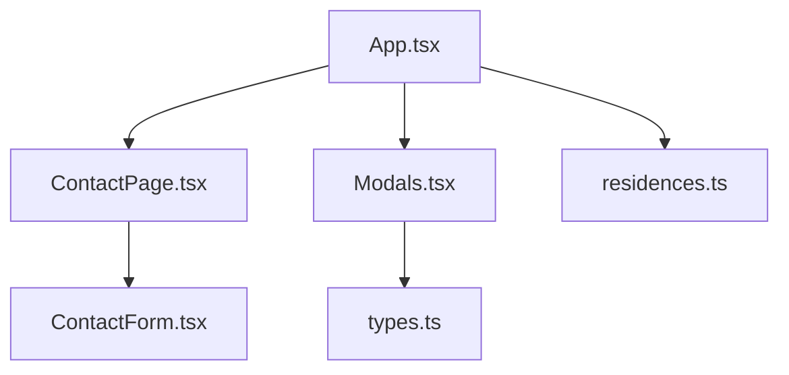
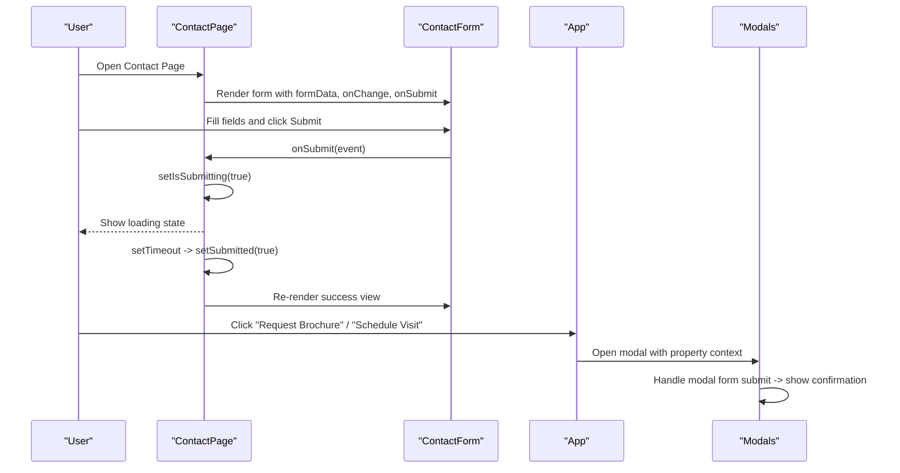
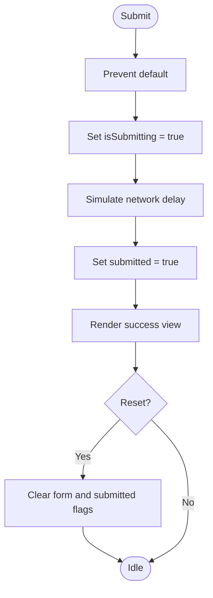
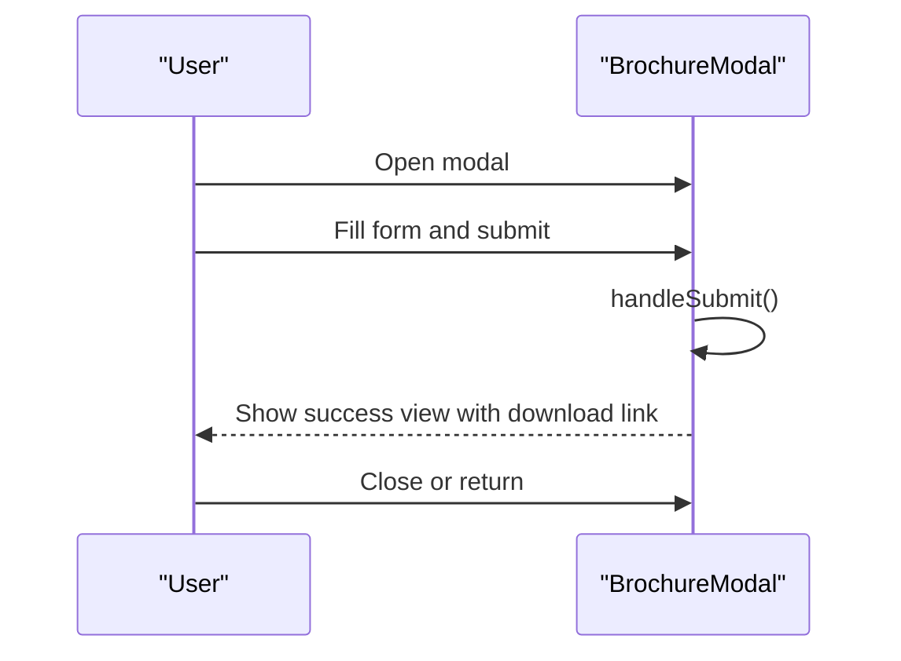
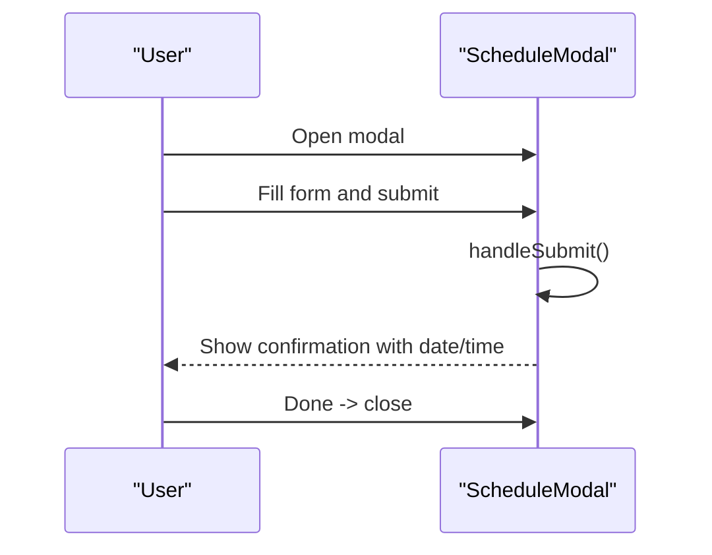
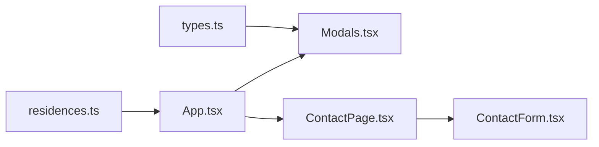

# Forms and User Interactions

<cite>
**Referenced Files in This Document**
- [ContactForm.tsx](file://src/components/contact/ContactForm.tsx)
- [ContactPage.tsx](file://src/pages/ContactPage.tsx)
- [Modals.tsx](file://src/components/Modals.tsx)
- [App.tsx](file://src/App.tsx)
- [types.ts](file://src/types.ts)
- [residences.ts](file://src/data/residences.ts)
</cite>

## Table of Contents
1. Introduction
2. Project Structure
3. Core Components
4. Architecture Overview
5. Detailed Component Analysis
6. Dependency Analysis
7. Performance Considerations
8. Troubleshooting Guide
9. Conclusion

## Introduction
This document explains the forms and user interaction patterns in the N-Square application with a focus on:
- Contact form implementation, including validation, state management, and submission handling
- Modal system for brochure requests and visit scheduling, including form handling within modals and user feedback
- Interaction patterns such as hover effects, click handlers, and form state transitions
- Validation rules, error handling strategies, and accessibility considerations
- Integration points for backend form submission and analytics tracking

The goal is to provide both technical depth and accessible guidance for developers and product teams working on forms and interactions.

## Project Structure
Forms and modal-driven interactions are implemented across a few key files:
- Contact page orchestrates the contact form state and renders the contact UI
- Contact form component renders inputs, handles local input changes, and delegates submission to the parent
- Modals encapsulate brochure request and visit scheduling flows with their own internal state and success feedback
- App coordinates modal visibility and passes property context into modals
- Types define shared interfaces for form data and properties

**Diagram sources**
- [App.tsx:15-250](file://src/App.tsx#L15-L250)
- [ContactPage.tsx:17-76](file://src/pages/ContactPage.tsx#L17-L76)
- [ContactForm.tsx:22-145](file://src/components/contact/ContactForm.tsx#L22-L145)
- [Modals.tsx:12-312](file://src/components/Modals.tsx#L12-L312)
- [types.ts:20-59](file://src/types.ts#L20-L59)
- [residences.ts:3-58](file://src/data/residences.ts#L3-L58)

**Section sources**
- [App.tsx:15-250](file://src/App.tsx#L15-L250)
- [ContactPage.tsx:17-76](file://src/pages/ContactPage.tsx#L17-L76)
- [ContactForm.tsx:22-145](file://src/components/contact/ContactForm.tsx#L22-L145)
- [Modals.tsx:12-312](file://src/components/Modals.tsx#L12-L312)
- [types.ts:20-59](file://src/types.ts#L20-L59)
- [residences.ts:3-58](file://src/data/residences.ts#L3-L58)

## Core Components
- ContactForm: Renders a controlled form with required fields, project selection, and message. It uses native HTML validation attributes and provides immediate visual feedback via focus states and submit button disabled state during processing. On successful submission, it shows a success view with an option to reset.
- ContactPage: Owns the contact form state (form data, submitting flag, submitted flag), exposes change handler, and simulates submission with a timeout before marking the form as submitted.
- Modals: Two modal components:
  - BrochureModal: Collects name, email, phone, WhatsApp preference, and displays a success state with a direct download link.
  - ScheduleModal: Collects name, email, phone, preferred date/time slot, and displays a confirmation summary.
- App: Manages global modal visibility and selected property context; wires up open/close handlers from pages and routes.

Key responsibilities:
- State ownership resides at the page or modal level; child components receive props/callbacks for updates and submissions
- Validation relies primarily on HTML5 required attributes and type hints; additional constraints can be added as needed
- Submission flow currently simulates network delay and then transitions to success states

**Section sources**
- [ContactForm.tsx:22-145](file://src/components/contact/ContactForm.tsx#L22-L145)
- [ContactPage.tsx:17-76](file://src/pages/ContactPage.tsx#L17-L76)
- [Modals.tsx:12-312](file://src/components/Modals.tsx#L12-L312)
- [App.tsx:39-45](file://src/App.tsx#L39-L45)

## Architecture Overview
The application separates concerns between pages and reusable components:
- Pages manage high-level state and orchestrate navigation and modals
- Components render UI and handle local interactions
- Modals encapsulate complex workflows with self-contained state and clear success feedback

**Diagram sources**
- [ContactPage.tsx:22-38](file://src/pages/ContactPage.tsx#L22-L38)
- [ContactForm.tsx:52-143](file://src/components/contact/ContactForm.tsx#L52-L143)
- [App.tsx:39-45](file://src/App.tsx#L39-L45)
- [Modals.tsx:24-32](file://src/components/Modals.tsx#L24-L32)
- [Modals.tsx:181-184](file://src/components/Modals.tsx#L181-L184)

## Detailed Component Analysis

### Contact Form: Validation, State, and Submission
- Controlled inputs: Each field is bound to formData via onChange, ensuring single source of truth in ContactPage
- Validation:
  - Required fields enforced by HTML5 required attribute
  - Email and tel types leverage browser-native validation
  - Phone input restricts non-digit characters at input time
- Submission:
  - Parent prevents default and sets submitting state
  - Simulated async delay transitions to submitted state
  - Success view includes a reset action to return to initial state
- Accessibility:
  - Labels associated with inputs
  - Focus styles for keyboard navigation
  - Clear success messaging and actionable reset button

**Diagram sources**
- [ContactPage.tsx:26-38](file://src/pages/ContactPage.tsx#L26-L38)
- [ContactForm.tsx:52-143](file://src/components/contact/ContactForm.tsx#L52-L143)

**Section sources**
- [ContactForm.tsx:5-20](file://src/components/contact/ContactForm.tsx#L5-L20)
- [ContactForm.tsx:52-143](file://src/components/contact/ContactForm.tsx#L52-L143)
- [ContactPage.tsx:5-38](file://src/pages/ContactPage.tsx#L5-L38)

### Brochure Request Modal
- State: Local form state for name, email, phone, propertyId, and WhatsApp preference; downloaded flag for success state
- Submission: Prevents default and transitions to success view with a direct download link
- UX:
  - Clear header and contextual property info
  - Input icons for clarity
  - Success state with prominent call-to-action and return option

**Diagram sources**
- [Modals.tsx:12-32](file://src/components/Modals.tsx#L12-L32)
- [Modals.tsx:77-153](file://src/components/Modals.tsx#L77-L153)

**Section sources**
- [Modals.tsx:12-32](file://src/components/Modals.tsx#L12-L32)
- [Modals.tsx:77-153](file://src/components/Modals.tsx#L77-L153)

### Visit Scheduling Modal
- State: Local form state for name, email, phone, date, timeSlot, propertyId, notes; confirmed flag for success state
- Submission: Prevents default and transitions to confirmation view summarizing details
- UX:
  - Two-column layout for compact inputs
  - Time slot selection via dropdown
  - Confirmation view highlights key details and closes on done

**Diagram sources**
- [Modals.tsx:167-184](file://src/components/Modals.tsx#L167-L184)
- [Modals.tsx:218-306](file://src/components/Modals.tsx#L218-L306)

**Section sources**
- [Modals.tsx:167-184](file://src/components/Modals.tsx#L167-L184)
- [Modals.tsx:218-306](file://src/components/Modals.tsx#L218-L306)

### Interaction Patterns
- Hover effects: Buttons and links use hover color transitions for affordance
- Click handlers: All interactive elements wired to appropriate handlers (submit, close, reset)
- Focus management: Inputs have visible focus outlines; modals include close buttons
- Animations: Framer Motion used for subtle entrance animations and tap scaling on submit button

Examples:
- Submit button disabled while submitting to prevent duplicate submissions
- Success states replace forms to reduce cognitive load post-submission
- Modal backdrop and close button provide consistent exit patterns

**Section sources**
- [ContactForm.tsx:135-143](file://src/components/contact/ContactForm.tsx#L135-L143)
- [Modals.tsx:34-44](file://src/components/Modals.tsx#L34-L44)
- [Modals.tsx:186-196](file://src/components/Modals.tsx#L186-L196)

## Dependency Analysis
- ContactPage depends on ContactForm and manages its state
- App owns modal visibility and passes property context to modals
- Modals depend on types for form structures and Property interface
- Data module supplies property metadata used throughout the app

**Diagram sources**
- [types.ts:20-59](file://src/types.ts#L20-L59)
- [residences.ts:3-58](file://src/data/residences.ts#L3-L58)
- [App.tsx:15-250](file://src/App.tsx#L15-L250)
- [ContactPage.tsx:17-76](file://src/pages/ContactPage.tsx#L17-L76)
- [Modals.tsx:12-312](file://src/components/Modals.tsx#L12-L312)

**Section sources**
- [types.ts:20-59](file://src/types.ts#L20-L59)
- [residences.ts:3-58](file://src/data/residences.ts#L3-L58)
- [App.tsx:15-250](file://src/App.tsx#L15-L250)
- [ContactPage.tsx:17-76](file://src/pages/ContactPage.tsx#L17-L76)
- [Modals.tsx:12-312](file://src/components/Modals.tsx#L12-L312)

## Performance Considerations
- Controlled inputs: Keep state minimal and avoid heavy computations in onChange; current usage is lightweight
- Avoid unnecessary re-renders: Lift only necessary state to parents; keep modal-local state isolated
- Debounce or throttle if adding real-time server-side validation later
- Use React.memo for pure presentational components if performance becomes a concern
- Prefer client-side validation where possible to reduce round-trips

[No sources needed since this section provides general guidance]

## Troubleshooting Guide
Common issues and resolutions:
- Form not submitting: Ensure the parent prevents default and handles async submission correctly
- Duplicate submissions: Disable submit button while submitting; ensure state resets after success
- Modal not closing: Verify onClose is called on success actions and backdrop clicks
- Validation errors: Rely on HTML5 validation first; add custom messages if needed
- Accessibility gaps: Confirm labels exist for all inputs and that focus order is logical

Integration points to implement:
- Backend submission: Replace simulated delays with fetch/axios calls in ContactPage and modal handlers
- Error handling: Display inline errors or toast notifications for failed submissions
- Analytics tracking: Emit events on form start, field changes (optional), submit attempts, and success/failure outcomes
- Consent and compliance: Capture explicit consent for WhatsApp communications when applicable

**Section sources**
- [ContactPage.tsx:26-38](file://src/pages/ContactPage.tsx#L26-L38)
- [Modals.tsx:24-32](file://src/components/Modals.tsx#L24-L32)
- [Modals.tsx:181-184](file://src/components/Modals.tsx#L181-L184)

## Conclusion
The N-Square application implements a clean separation of concerns for forms and interactions:
- ContactPage owns contact form state and simulates submission
- ContactForm focuses on presentation and basic validation
- Modals encapsulate brochure and scheduling flows with clear success feedback
- App coordinates modal visibility and property context

To productionize:
- Add robust backend integration with proper error handling
- Implement comprehensive validation and user-facing error messages
- Integrate analytics events for key interactions
- Enhance accessibility with ARIA attributes and screen reader-friendly messaging

[No sources needed since this section summarizes without analyzing specific files]