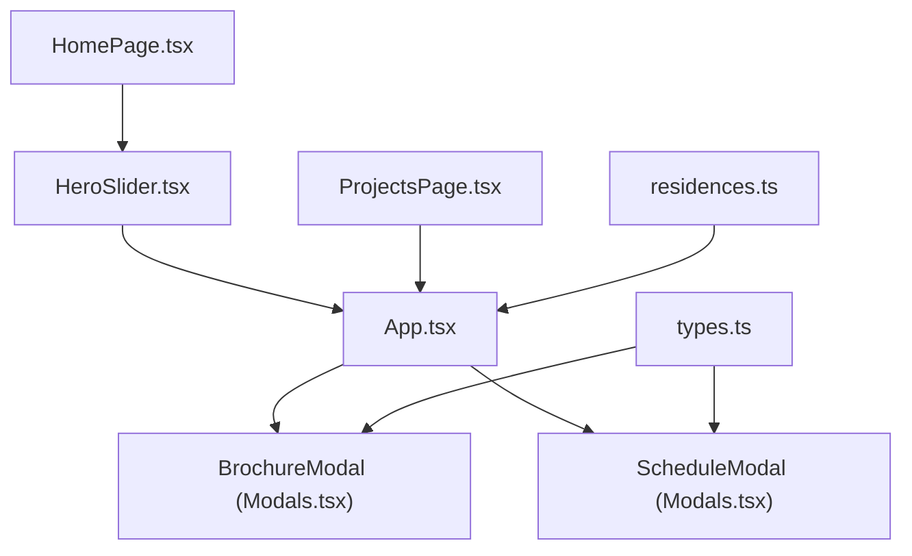
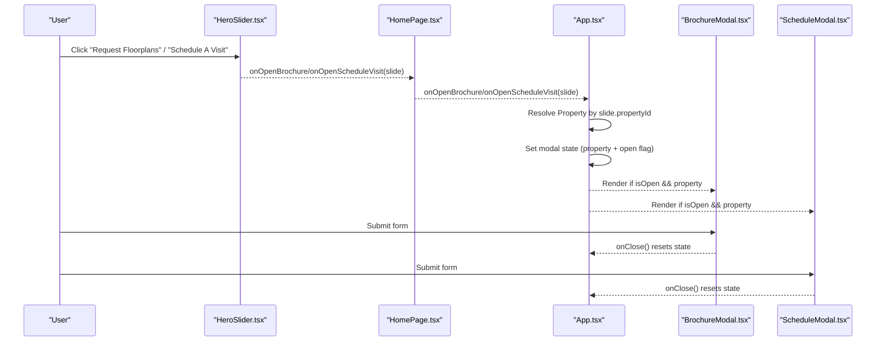
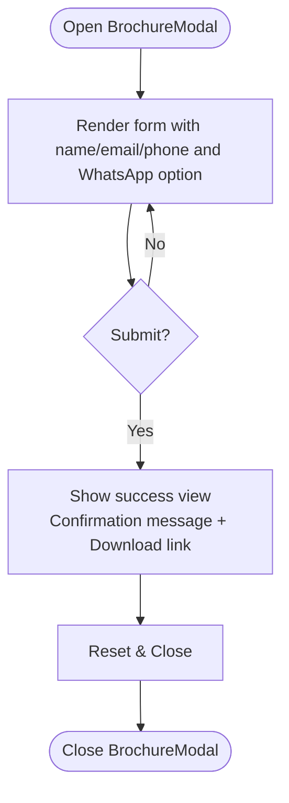
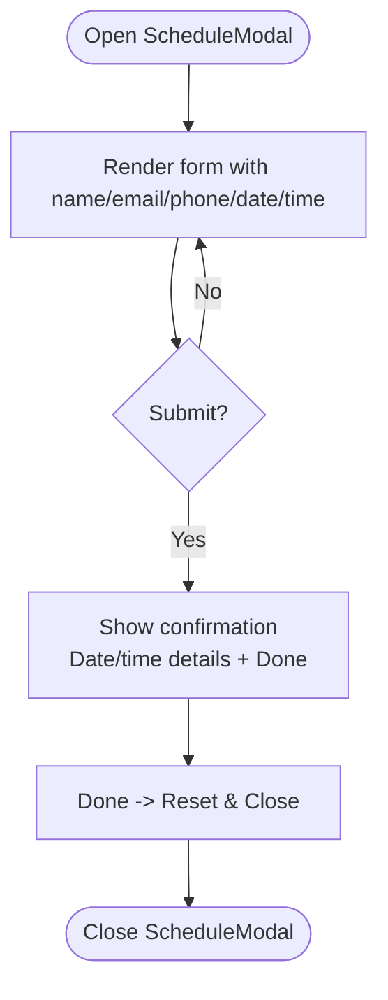
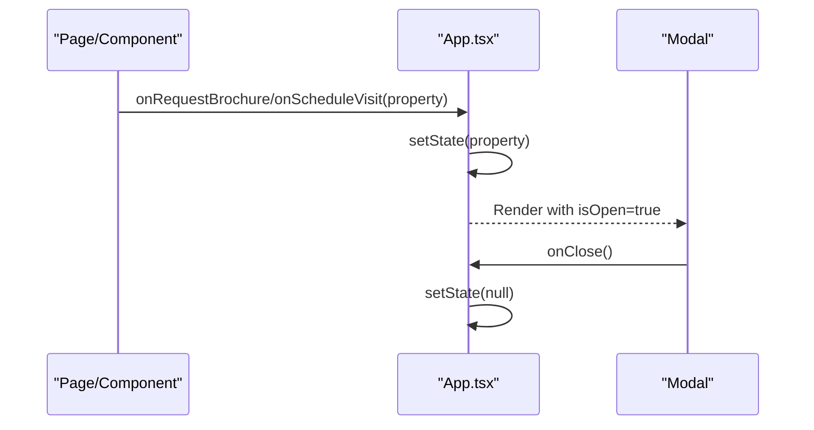
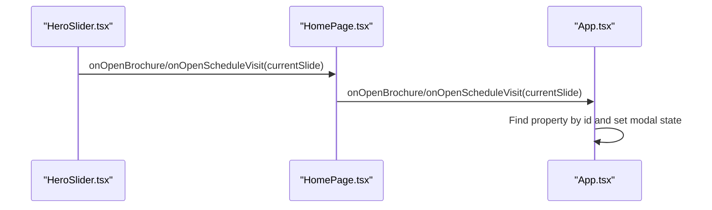
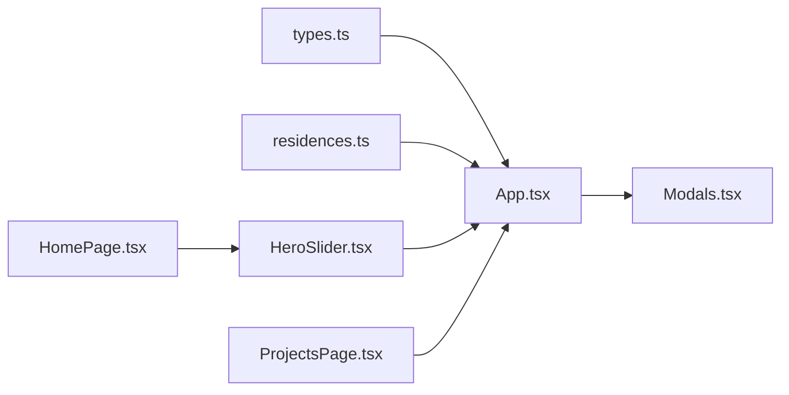

# Modal System

<cite>
**Referenced Files in This Document**
- [Modals.tsx](file://src/components/Modals.tsx)
- [App.tsx](file://src/App.tsx)
- [types.ts](file://src/types.ts)
- [residences.ts](file://src/data/residences.ts)
- [HeroSlider.tsx](file://src/components/HeroSlider.tsx)
- [HomePage.tsx](file://src/pages/HomePage.tsx)
- [ProjectsPage.tsx](file://src/pages/ProjectsPage.tsx)
- [main.tsx](file://src/main.tsx)
</cite>

## Table of Contents
1. Introduction
2. Project Structure
3. Core Components
4. Architecture Overview
5. Detailed Component Analysis
6. Dependency Analysis
7. Performance Considerations
8. Troubleshooting Guide
9. Conclusion
10. Appendices

## Introduction
This document explains the modal system implementation for brochure request and visit scheduling modals. It covers modal state management, opening/closing mechanisms, form handling within modals, component architecture (including backdrop behavior), integration with the main application state for multiple modal instances, validation and submission flows, user feedback, customization options, and accessibility considerations.

## Project Structure
The modal system is implemented as two React components (BrochureModal and ScheduleModal) rendered from the root App component. State that controls which modal is open and which property is selected lives in App.tsx. Pages and subcomponents trigger modals via callback props passed down from App.

**Diagram sources**
- [App.tsx:15-45](file://src/App.tsx#L15-L45)
- [App.tsx:237-250](file://src/App.tsx#L237-L250)
- [Modals.tsx:12-312](file://src/components/Modals.tsx#L12-L312)
- [HeroSlider.tsx:202-215](file://src/components/HeroSlider.tsx#L202-L215)
- [HomePage.tsx:18-34](file://src/pages/HomePage.tsx#L18-L34)
- [ProjectsPage.tsx:14-31](file://src/pages/ProjectsPage.tsx#L14-L31)
- [types.ts:20-59](file://src/types.ts#L20-L59)
- [residences.ts:60-189](file://src/data/residences.ts#L60-L189)

**Section sources**
- [App.tsx:15-45](file://src/App.tsx#L15-L45)
- [App.tsx:237-250](file://src/App.tsx#L237-L250)
- [Modals.tsx:12-312](file://src/components/Modals.tsx#L12-L312)
- [HeroSlider.tsx:202-215](file://src/components/HeroSlider.tsx#L202-L215)
- [HomePage.tsx:18-34](file://src/pages/HomePage.tsx#L18-L34)
- [ProjectsPage.tsx:14-31](file://src/pages/ProjectsPage.tsx#L14-L31)
- [types.ts:20-59](file://src/types.ts#L20-L59)
- [residences.ts:60-189](file://src/data/residences.ts#L60-L189)

## Core Components
- BrochureModal: Renders a form to request a digital brochure and shows a success state after submission.
- ScheduleModal: Renders a form to schedule a site visit and shows a confirmation state after submission.
- App: Holds modal state (which property is active for each modal), provides open/close handlers, and renders both modals conditionally based on state.

Key responsibilities:
- State ownership: App stores the currently selected property for each modal and whether they are open.
- Event propagation: Child components call callbacks to open modals; App updates state accordingly.
- Rendering: Modals render only when their isOpen prop is true and a valid property is provided.

**Section sources**
- [App.tsx:15-45](file://src/App.tsx#L15-L45)
- [App.tsx:237-250](file://src/App.tsx#L237-L250)
- [Modals.tsx:12-312](file://src/components/Modals.tsx#L12-L312)

## Architecture Overview
The modal system follows a unidirectional data flow:
- User actions in pages/components trigger callbacks.
- App receives callbacks and updates local state for the corresponding modal.
- App passes props to modals to control visibility and content.
- Modals manage internal UI state (form values, success states) and call back to close themselves.

**Diagram sources**
- [HeroSlider.tsx:202-215](file://src/components/HeroSlider.tsx#L202-L215)
- [HomePage.tsx:18-34](file://src/pages/HomePage.tsx#L18-L34)
- [App.tsx:39-45](file://src/App.tsx#L39-L45)
- [App.tsx:123-130](file://src/App.tsx#L123-L130)
- [App.tsx:237-250](file://src/App.tsx#L237-L250)
- [Modals.tsx:24-32](file://src/components/Modals.tsx#L24-L32)
- [Modals.tsx:181-184](file://src/components/Modals.tsx#L181-L184)

## Detailed Component Analysis

### BrochureModal
- Purpose: Collect user details to dispatch a digital brochure and provide immediate feedback.
- Props:
  - property: The target property context for the brochure.
  - isOpen: Controls visibility.
  - onClose: Resets modal state in parent.
  - theme: Applies light/dark styling.
- Internal state:
  - Form fields bound to RequestBrochureForm type.
  - downloaded boolean to switch between form and success view.
- Submission flow:
  - Prevent default form submission.
  - Switch to success view showing confirmation message and optional direct download link.
  - Resetting clears success state and closes modal via onClose.
- Backdrop behavior:
  - Full-screen overlay with blur effect; clicking the close button triggers onClose.
- Accessibility notes:
  - Close button is present but lacks explicit aria attributes in current code.
  - No focus trapping or keyboard navigation is implemented.

**Diagram sources**
- [Modals.tsx:12-32](file://src/components/Modals.tsx#L12-L32)
- [Modals.tsx:24-32](file://src/components/Modals.tsx#L24-L32)
- [Modals.tsx:46-75](file://src/components/Modals.tsx#L46-L75)

**Section sources**
- [Modals.tsx:12-158](file://src/components/Modals.tsx#L12-L158)

### ScheduleModal
- Purpose: Collect visit details and confirm an appointment.
- Props: Same as BrochureModal.
- Internal state:
  - Form fields bound to ScheduleVisitForm type.
  - confirmed boolean to switch between form and confirmation view.
- Submission flow:
  - Prevent default form submission.
  - Show confirmation view with date/time details and a Done button to reset and close.
- Backdrop behavior:
  - Full-screen overlay with blur effect; close button triggers onClose.
- Accessibility notes:
  - Close button is present but lacks explicit aria attributes in current code.
  - No focus trapping or keyboard navigation is implemented.

**Diagram sources**
- [Modals.tsx:167-184](file://src/components/Modals.tsx#L167-L184)
- [Modals.tsx:181-184](file://src/components/Modals.tsx#L181-L184)
- [Modals.tsx:198-216](file://src/components/Modals.tsx#L198-L216)

**Section sources**
- [Modals.tsx:160-312](file://src/components/Modals.tsx#L160-L312)

### App Integration and State Management
- Modal state:
  - Two separate properties track the active property for each modal.
  - Visibility is derived from whether the property is non-null.
- Opening modals:
  - handleOpenBrochure and handleOpenScheduleVisit set the respective property.
  - Various pages pass callbacks to open modals with the correct property context.
- Closing modals:
  - Each modal calls onClose to clear its property, effectively closing itself.

**Diagram sources**
- [App.tsx:39-45](file://src/App.tsx#L39-L45)
- [App.tsx:123-130](file://src/App.tsx#L123-L130)
- [App.tsx:237-250](file://src/App.tsx#L237-L250)
- [Modals.tsx:24-32](file://src/components/Modals.tsx#L24-L32)
- [Modals.tsx:181-184](file://src/components/Modals.tsx#L181-L184)

**Section sources**
- [App.tsx:15-45](file://src/App.tsx#L15-L45)
- [App.tsx:123-130](file://src/App.tsx#L123-L130)
- [App.tsx:237-250](file://src/App.tsx#L237-L250)

### Data Types and Forms
- RequestBrochureForm: name, email, phone, propertyId, receiveOnWhatsApp.
- ScheduleVisitForm: name, email, phone, date, timeSlot, propertyId, notes.
- Property: Used to populate modal headers, locations, and links.

These types ensure consistent form structures across modals and enable TypeScript validation.

**Section sources**
- [types.ts:20-59](file://src/types.ts#L20-L59)

### Triggering Modals from Pages
- HeroSlider exposes onOpenBrochure and onOpenScheduleVisit callbacks bound to the current slide’s propertyId.
- HomePage forwards these callbacks to App.
- ProjectsPage passes onRequestBrochure and onScheduleVisit to its content component.

**Diagram sources**
- [HeroSlider.tsx:202-215](file://src/components/HeroSlider.tsx#L202-L215)
- [HomePage.tsx:18-34](file://src/pages/HomePage.tsx#L18-L34)
- [App.tsx:123-130](file://src/App.tsx#L123-L130)

**Section sources**
- [HeroSlider.tsx:202-215](file://src/components/HeroSlider.tsx#L202-L215)
- [HomePage.tsx:18-34](file://src/pages/HomePage.tsx#L18-L34)
- [ProjectsPage.tsx:14-31](file://src/pages/ProjectsPage.tsx#L14-L31)

## Dependency Analysis
- App depends on:
  - types.ts for shared interfaces.
  - residences.ts for property data used to resolve slides to properties.
  - Modals.tsx for rendering modals.
  - Page components for triggering modal opens.
- Modals depend on:
  - types.ts for form and property types.
  - lucide-react icons for UI elements.

**Diagram sources**
- [types.ts:20-59](file://src/types.ts#L20-L59)
- [residences.ts:60-189](file://src/data/residences.ts#L60-L189)
- [App.tsx:15-45](file://src/App.tsx#L15-L45)
- [App.tsx:237-250](file://src/App.tsx#L237-L250)
- [HeroSlider.tsx:202-215](file://src/components/HeroSlider.tsx#L202-L215)
- [HomePage.tsx:18-34](file://src/pages/HomePage.tsx#L18-L34)
- [ProjectsPage.tsx:14-31](file://src/pages/ProjectsPage.tsx#L14-L31)

**Section sources**
- [App.tsx:15-45](file://src/App.tsx#L15-L45)
- [App.tsx:237-250](file://src/App.tsx#L237-L250)
- [Modals.tsx:12-312](file://src/components/Modals.tsx#L12-L312)
- [types.ts:20-59](file://src/types.ts#L20-L59)
- [residences.ts:60-189](file://src/data/residences.ts#L60-L189)
- [HeroSlider.tsx:202-215](file://src/components/HeroSlider.tsx#L202-L215)
- [HomePage.tsx:18-34](file://src/pages/HomePage.tsx#L18-L34)
- [ProjectsPage.tsx:14-31](file://src/pages/ProjectsPage.tsx#L14-L31)

## Performance Considerations
- Conditional rendering: Modals render only when isOpen is true and a property is provided, minimizing unnecessary DOM overhead.
- Local state: Each modal manages its own form and success state, avoiding re-renders in unrelated parts of the app.
- Styling: Tailwind classes are applied directly; consider extracting reusable modal styles if further customization is needed.

[No sources needed since this section provides general guidance]

## Troubleshooting Guide
Common issues and resolutions:
- Modal does not open:
  - Ensure the callback sets the appropriate property in App state.
  - Verify that the page passes the correct handler to the child component.
- Wrong property shown:
  - Confirm that the property resolution logic uses the slide’s propertyId correctly.
- Form submission not resetting:
  - Check that onClose is called after submission to clear modal state.
- Styling inconsistencies:
  - Ensure theme prop is passed consistently to modals.

**Section sources**
- [App.tsx:39-45](file://src/App.tsx#L39-L45)
- [App.tsx:123-130](file://src/App.tsx#L123-L130)
- [Modals.tsx:24-32](file://src/components/Modals.tsx#L24-L32)
- [Modals.tsx:181-184](file://src/components/Modals.tsx#L181-L184)

## Conclusion
The modal system uses a simple, effective pattern: App owns modal visibility and context, while modals encapsulate form and success states. This separation keeps the codebase clean and scalable. To enhance accessibility and UX, consider adding focus trapping, keyboard support, and ARIA attributes. For advanced use cases, centralize modal state in a context or store to support multiple concurrent instances.

[No sources needed since this section summarizes without analyzing specific files]

## Appendices

### Customization Options
- Styling:
  - Theme-aware borders and text colors via theme prop.
  - Glass-card styling and backdrop blur for overlays.
- Behavior:
  - Open/close controlled by props; extend to support stacking or queueing.
- Content composition:
  - Property-driven titles, locations, and links; add more dynamic fields as needed.

**Section sources**
- [Modals.tsx:34-38](file://src/components/Modals.tsx#L34-L38)
- [Modals.tsx:186-190](file://src/components/Modals.tsx#L186-L190)

### Accessibility Considerations
Current implementation:
- Close buttons exist but lack explicit aria-labels and roles.
- No focus trapping or keyboard navigation is implemented.
- Screen reader announcements for success states are not explicitly handled.

Recommended improvements:
- Add role="dialog" and aria-modal="true" to modal containers.
- Add aria-label to close buttons.
- Implement focus trapping within modals and restore focus on close.
- Announce success messages using aria-live regions.

[No sources needed since this section provides general guidance]