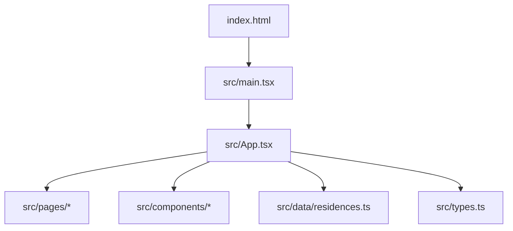
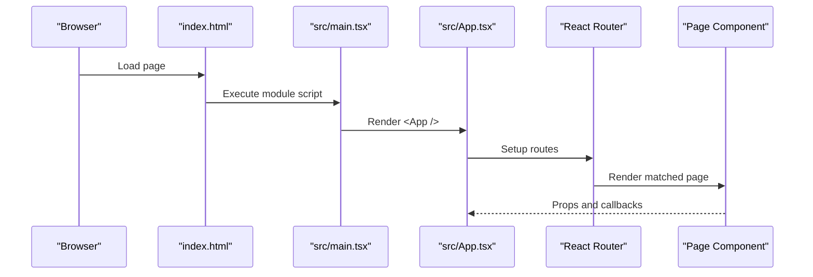
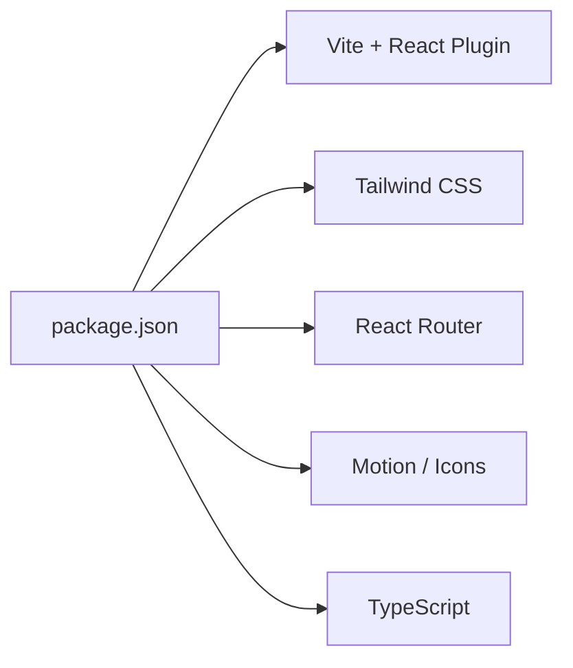

# Getting Started

<cite>
**Referenced Files in This Document**
- [README.md](file://README.md)
- [package.json](file://package.json)
- [vite.config.ts](file://vite.config.ts)
- [tsconfig.json](file://tsconfig.json)
- [tailwind.config.cjs](file://tailwind.config.cjs)
- [index.html](file://index.html)
- [src/main.tsx](file://src/main.tsx)
- [src/App.tsx](file://src/App.tsx)
- [src/types.ts](file://src/types.ts)
- [src/data/residences.ts](file://src/data/residences.ts)
</cite>

## Table of Contents
1. Introduction
2. Project Structure
3. Core Components
4. Architecture Overview
5. Detailed Component Analysis
6. Dependency Analysis
7. Performance Considerations
8. Troubleshooting Guide
9. Conclusion
10. Appendices

## Introduction
This guide helps you set up and run the N-Square real estate website locally. You will install Node.js, configure your environment, install dependencies, and start the development server. The project uses React with TypeScript, Vite for building and serving, Tailwind CSS for styling, and React Router for navigation.

## Project Structure
At a high level:
- Entry point: index.html loads the app via src/main.tsx
- App shell: src/App.tsx defines routes and global state (theme, active tab, modals)
- Pages: src/pages/* implement top-level views (Home, Projects, Legacy, Contact, Commercial)
- Components: src/components/* provide reusable UI pieces (Header, Footer, HeroSlider, etc.)
- Data: src/data/residences.ts contains property data and hero slides
- Types: src/types.ts defines shared interfaces and enums
- Configuration: vite.config.ts, tsconfig.json, tailwind.config.cjs, package.json

**Diagram sources**
- [index.html:1-17](file://index.html#L1-L17)
- [src/main.tsx:1-14](file://src/main.tsx#L1-L14)
- [src/App.tsx:1-255](file://src/App.tsx#L1-L255)
- [src/data/residences.ts:1-190](file://src/data/residences.ts#L1-L190)
- [src/types.ts:1-60](file://src/types.ts#L1-L60)

**Section sources**
- [index.html:1-17](file://index.html#L1-L17)
- [src/main.tsx:1-14](file://src/main.tsx#L1-L14)
- [src/App.tsx:1-255](file://src/App.tsx#L1-L255)
- [src/data/residences.ts:1-190](file://src/data/residences.ts#L1-L190)
- [src/types.ts:1-60](file://src/types.ts#L1-L60)

## Core Components
- Application shell: src/App.tsx manages routing, theme switching, and modal states
- Routing: React Router is configured to render pages based on URL paths
- Data layer: src/data/residences.ts provides property listings and hero slide content
- Shared types: src/types.ts defines core interfaces used across components and pages

Key responsibilities:
- Theme management: toggles between light and dark modes and applies classes to document elements
- Navigation: syncs active tabs with URL paths and navigates between pages
- Modals: controls brochure and schedule visit modals bound to selected properties

**Section sources**
- [src/App.tsx:1-255](file://src/App.tsx#L1-L255)
- [src/data/residences.ts:1-190](file://src/data/residences.ts#L1-L190)
- [src/types.ts:1-60](file://src/types.ts#L1-L60)

## Architecture Overview
The app boots from index.html, which mounts the React root in main.tsx. The App component sets up routing and renders page components. Data flows from src/data/residences.ts into pages and components through props. Styling is handled by Tailwind CSS with custom theme colors defined in tailwind.config.cjs.

**Diagram sources**
- [index.html:1-17](file://index.html#L1-L17)
- [src/main.tsx:1-14](file://src/main.tsx#L1-L14)
- [src/App.tsx:1-255](file://src/App.tsx#L1-L255)

## Detailed Component Analysis

### Development Server and Build Configuration
- Dev server: npm run dev starts Vite on port 3000 and binds to all network interfaces
- HMR: Hot Module Replacement can be disabled via an environment variable if needed
- Build: npm run build produces optimized production assets
- Preview: npm run preview serves the built output locally

Configuration highlights:
- Vite plugins: React and Tailwind are enabled
- Path alias: @ resolves to the project root for cleaner imports
- TypeScript: Target ES2022 with JSX support and path mapping for @

**Section sources**
- [package.json:6-12](file://package.json#L6-L12)
- [vite.config.ts:1-22](file://vite.config.ts#L1-L22)
- [tsconfig.json:1-27](file://tsconfig.json#L1-L27)

### Routing and Pages
- Routes: Home (/), Projects (/projects), About/Legacy (/about), Contact (/contact), Commercial (/commercial)
- Active tab synchronization: The app updates the header’s active tab based on the current URL
- Transitions: Page transitions use motion for smooth entry/exit animations

**Section sources**
- [src/App.tsx:47-85](file://src/App.tsx#L47-L85)
- [src/App.tsx:106-227](file://src/App.tsx#L106-L227)

### Data Model and Content
- Property model: Includes fields like id, title, type, location, area range, configurations, pricing, amenities, specs, and media
- Hero slides: Array of slides with titles, subtitles, locations, images, and associated property IDs
- Usage: Pages consume this data to render carousels, grids, and detail sections

**Section sources**
- [src/types.ts:5-41](file://src/types.ts#L5-L41)
- [src/data/residences.ts:3-58](file://src/data/residences.ts#L3-L58)
- [src/data/residences.ts:60-189](file://src/data/residences.ts#L60-L189)

### Styling and Theme
- Tailwind configuration: Custom gold color palette extended in tailwind.config.cjs
- Theme toggle: Light/dark mode applied by adding/removing classes on the document element
- Global styles: Base styles and fonts are loaded via index.html and CSS files

**Section sources**
- [tailwind.config.cjs:1-15](file://tailwind.config.cjs#L1-L15)
- [src/App.tsx:24-33](file://src/App.tsx#L24-L33)
- [index.html:1-17](file://index.html#L1-L17)

## Dependency Analysis
Core runtime and tooling dependencies:
- Frontend framework: React and ReactDOM
- Routing: React Router DOM
- Build tool: Vite with React plugin
- Styling: Tailwind CSS with Vite integration
- Utilities: Motion for animations, Lucide icons, Express (for potential backend usage), dotenv for environment variables
- TypeScript tooling: TypeScript compiler and types for Node and Express

Development workflow scripts:
- dev: Start development server with HMR
- build: Create production build
- preview: Serve production build locally
- lint: Type-check without emitting files

**Diagram sources**
- [package.json:13-36](file://package.json#L13-L36)

**Section sources**
- [package.json:1-38](file://package.json#L1-L38)

## Performance Considerations
- Use HMR during development for fast feedback; disable file watching via environment variable if CPU usage is high
- Keep asset sizes small; prefer optimized images and lazy loading where appropriate
- Avoid unnecessary re-renders by memoizing expensive computations or components when scaling features
- Production builds are optimized automatically by Vite; ensure unused code is tree-shaken by keeping imports clean

[No sources needed since this section provides general guidance]

## Troubleshooting Guide
Common setup issues and resolutions:
- Node.js not installed or wrong version: Install a recent LTS version of Node.js. Verify installation using your terminal.
- Port 3000 already in use: The dev server runs on port 3000 by default. If it fails, stop other processes using that port or change the port in the dev script.
- Dependencies not installed: Run the dependency installation command before starting the dev server.
- TypeScript errors blocking startup: Run the type check script to identify and fix type issues.
- Tailwind styles not appearing: Ensure Tailwind is enabled in the Vite config and that your source files are included in the Tailwind content paths.
- HMR not working: Check for network restrictions or firewall settings. You can disable HMR via an environment variable if necessary.

Verification steps after successful setup:
- Open http://localhost:3000 in your browser
- Confirm the home page loads with hero slider and sections
- Navigate to /projects, /about, /contact, and /commercial to verify routing
- Toggle theme to confirm light/dark mode works
- Inspect console for errors and resolve any warnings

**Section sources**
- [package.json:6-12](file://package.json#L6-L12)
- [vite.config.ts:14-19](file://vite.config.ts#L14-L19)
- [tailwind.config.cjs:1-15](file://tailwind.config.cjs#L1-L15)

## Conclusion
You now have everything needed to set up, run, and develop the N-Square real estate website locally. Use the provided scripts to start the development server, explore the routing and components, and iterate quickly with HMR. Refer to the troubleshooting section if you encounter common setup issues.

[No sources needed since this section summarizes without analyzing specific files]

## Appendices

### Prerequisites
- Node.js: Required to run the project and manage dependencies
- Terminal: To execute commands for installing dependencies and running the app

### Installation Steps
1. Install dependencies:
   - Command: npm install
2. Start the development server:
   - Command: npm run dev
3. Open the app:
   - URL: http://localhost:3000

### Initial Development Workflow
- Edit files under src/ to update UI and behavior
- Save changes to see live updates via HMR
- Use npm run build to create a production bundle
- Use npm run preview to serve the production build locally
- Use npm run lint to type-check your code

### Key Configuration Files
- package.json: Scripts and dependencies
- vite.config.ts: Vite plugins, aliases, and server options
- tsconfig.json: TypeScript compiler options and path mappings
- tailwind.config.cjs: Tailwind theme extensions and content paths
- index.html: Entry HTML that mounts the React app

**Section sources**
- [package.json:1-38](file://package.json#L1-L38)
- [vite.config.ts:1-22](file://vite.config.ts#L1-L22)
- [tsconfig.json:1-27](file://tsconfig.json#L1-L27)
- [tailwind.config.cjs:1-15](file://tailwind.config.cjs#L1-L15)
- [index.html:1-17](file://index.html#L1-L17)
- [README.md:1-16](file://README.md#L1-L16)