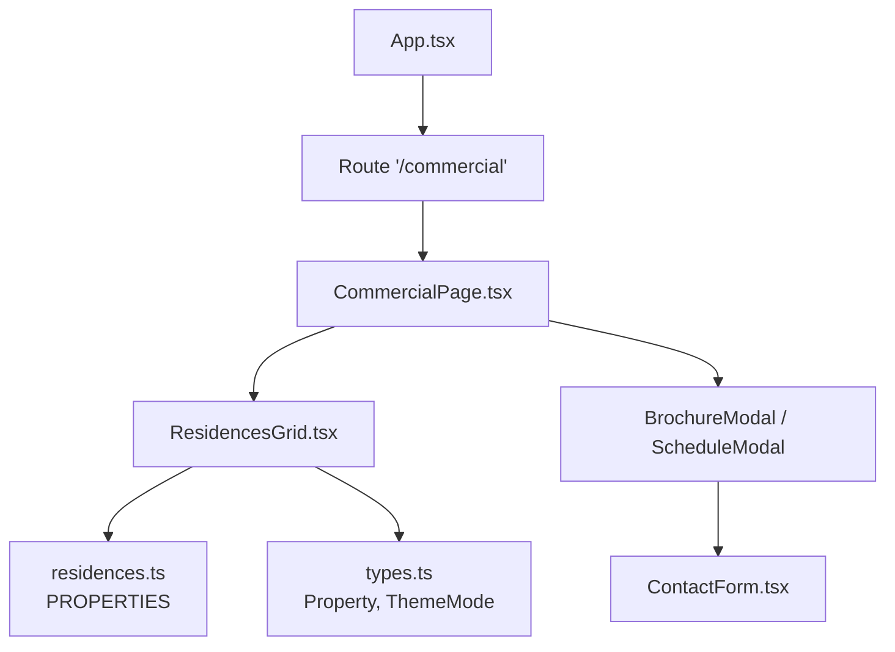
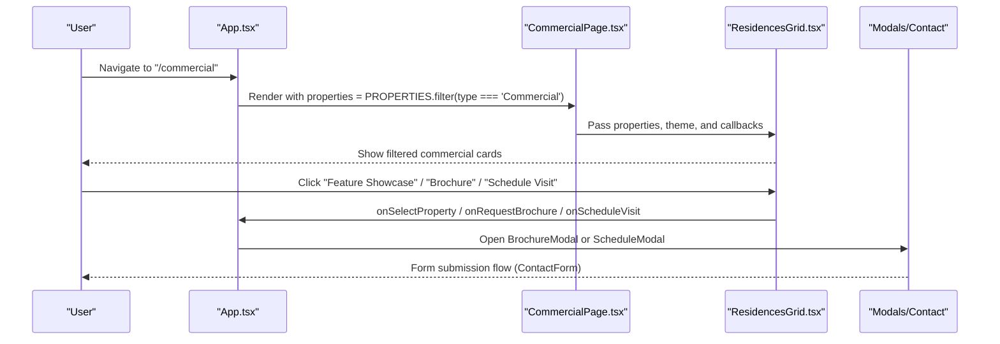
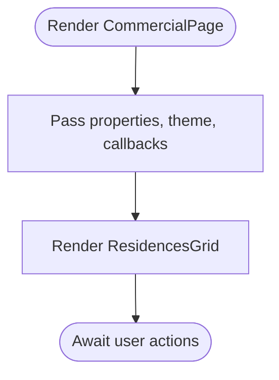
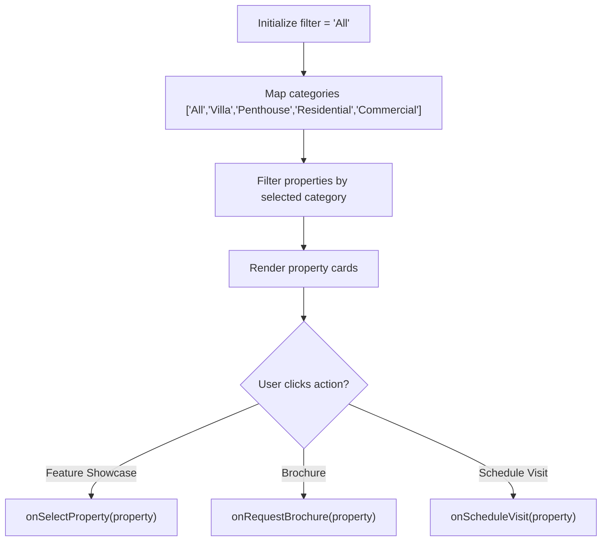
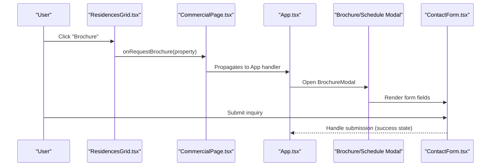
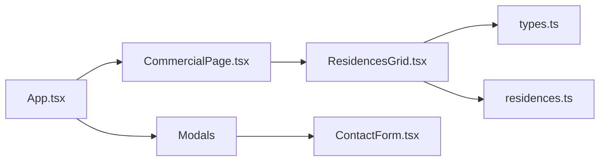

# Commercial Page Component

<cite>
**Referenced Files in This Document**
- [CommercialPage.tsx](file://src/pages/CommercialPage.tsx)
- [ResidencesGrid.tsx](file://src/components/ResidencesGrid.tsx)
- [residences.ts](file://src/data/residences.ts)
- [types.ts](file://src/types.ts)
- [App.tsx](file://src/App.tsx)
- [ContactForm.tsx](file://src/components/contact/ContactForm.tsx)
</cite>

## Table of Contents
1. [Introduction](#introduction)
2. [Project Structure](#project-structure)
3. [Core Components](#core-components)
4. [Architecture Overview](#architecture-overview)
5. [Detailed Component Analysis](#detailed-component-analysis)
6. [Dependency Analysis](#dependency-analysis)
7. [Performance Considerations](#performance-considerations)
8. [Troubleshooting Guide](#troubleshooting-guide)
9. [Conclusion](#conclusion)
10. [Appendices](#appendices)

## Introduction
This document explains the CommercialPage component and its role in showcasing commercial properties, filtering logic, and lead generation interactions. It covers how commercial property data is sourced from residences.ts, how properties are categorized and displayed, and how user actions integrate with contact forms and modals for brochure requests and visit scheduling.

## Project Structure
The CommercialPage is a lightweight page that delegates presentation and interaction to shared components:
- CommercialPage renders ResidencesGrid with filtered commercial properties.
- ResidencesGrid provides category-based filtering (including Commercial) and displays property cards with key details and action buttons.
- App routes to /commercial and passes only commercial-type properties to CommercialPage.
- Property data and types are centralized in residences.ts and types.ts.
- Lead generation flows open modals or navigate to contact forms.

**Diagram sources**
- [App.tsx:201-224](file://src/App.tsx#L201-L224)
- [CommercialPage.tsx:13-31](file://src/pages/CommercialPage.tsx#L13-L31)
- [ResidencesGrid.tsx:13-25](file://src/components/ResidencesGrid.tsx#L13-L25)
- [residences.ts:60-157](file://src/data/residences.ts#L60-L157)
- [types.ts:20-41](file://src/types.ts#L20-L41)
- [ContactForm.tsx:22-146](file://src/components/contact/ContactForm.tsx#L22-L146)

**Section sources**
- [App.tsx:201-224](file://src/App.tsx#L201-L224)
- [CommercialPage.tsx:13-31](file://src/pages/CommercialPage.tsx#L13-L31)
- [ResidencesGrid.tsx:13-25](file://src/components/ResidencesGrid.tsx#L13-L25)
- [residences.ts:60-157](file://src/data/residences.ts#L60-L157)
- [types.ts:20-41](file://src/types.ts#L20-L41)
- [ContactForm.tsx:22-146](file://src/components/contact/ContactForm.tsx#L22-L146)

## Core Components
- CommercialPage: A presentational wrapper that receives theme, properties, and callbacks for selection, brochure request, and visit scheduling. It renders ResidencesGrid with those props.
- ResidencesGrid: Implements category filtering (All, Villa, Penthouse, Residential, Commercial), renders a responsive grid of property cards, and exposes actions for feature showcase, brochure request, and schedule visit.
- Property data model: Defined in types.ts; includes fields like type, areaRange, configurations, possession, pricing, amenities, specs, and images.
- Property dataset: Centralized in residences.ts under PROPERTIES; includes at least one commercial entry used by the CommercialPage.

Key responsibilities:
- Filtering: Client-side filter by property.type via state in ResidencesGrid.
- Display: Consistent card layout showing image, code, type, title, location, overview, specs summary, and actions.
- Lead generation: Triggers modals or navigation to contact flows via callbacks passed from App.

**Section sources**
- [CommercialPage.tsx:13-31](file://src/pages/CommercialPage.tsx#L13-L31)
- [ResidencesGrid.tsx:20-25](file://src/components/ResidencesGrid.tsx#L20-L25)
- [types.ts:20-41](file://src/types.ts#L20-L41)
- [residences.ts:127-157](file://src/data/residences.ts#L127-L157)

## Architecture Overview
At runtime:
- App mounts the /commercial route and filters PROPERTIES to include only Commercial entries.
- CommercialPage receives these filtered properties and forwards them to ResidencesGrid.
- ResidencesGrid allows users to further filter by category (including Commercial).
- User actions on property cards trigger callbacks to open modals or navigate to other pages.

**Diagram sources**
- [App.tsx:201-224](file://src/App.tsx#L201-L224)
- [CommercialPage.tsx:20-28](file://src/pages/CommercialPage.tsx#L20-L28)
- [ResidencesGrid.tsx:62-146](file://src/components/ResidencesGrid.tsx#L62-L146)
- [ContactForm.tsx:22-146](file://src/components/contact/ContactForm.tsx#L22-L146)

## Detailed Component Analysis

### CommercialPage
- Purpose: Present commercial properties using a shared grid component.
- Props: theme, properties (filtered to Commercial), and three callbacks for selection, brochure request, and visit scheduling.
- Behavior: Delegates all rendering and interaction to ResidencesGrid.

**Diagram sources**
- [CommercialPage.tsx:13-31](file://src/pages/CommercialPage.tsx#L13-L31)

**Section sources**
- [CommercialPage.tsx:13-31](file://src/pages/CommercialPage.tsx#L13-L31)

### ResidencesGrid (Filtering and Display)
- Filtering: Maintains local state for active category filter. Filters properties array by type when not set to All.
- Display: Renders a two-column grid on medium screens and above; each card shows image, code, type, subtitle, title, location, overview, specs summary (area range, configurations, possession, pricing), and action buttons.
- Actions: 
  - Feature Showcase triggers onSelectProperty callback.
  - Brochure triggers onRequestBrochure callback.
  - Schedule Visit triggers onScheduleVisit callback (button exists in interface; usage may be elsewhere or added later).

**Diagram sources**
- [ResidencesGrid.tsx:20-25](file://src/components/ResidencesGrid.tsx#L20-L25)
- [ResidencesGrid.tsx:40-57](file://src/components/ResidencesGrid.tsx#L40-L57)
- [ResidencesGrid.tsx:62-146](file://src/components/ResidencesGrid.tsx#L62-L146)

**Section sources**
- [ResidencesGrid.tsx:20-25](file://src/components/ResidencesGrid.tsx#L20-L25)
- [ResidencesGrid.tsx:40-57](file://src/components/ResidencesGrid.tsx#L40-L57)
- [ResidencesGrid.tsx:62-146](file://src/components/ResidencesGrid.tsx#L62-L146)

### Property Data Model and Dataset
- Type definition: Property includes id, code, title, type, subtitle, location, overview, areaRange, configurations, possession, pricing, maharera, image, gallery, amenities, specs, and optional isHero.
- Dataset: PROPERTIES contains multiple entries; at least one has type 'Commercial' suitable for the CommercialPage.

Examples of commercial property specifications (from dataset):
- Title: Platinum Pinnacle Towers
- Type: Commercial
- Location: BKC, Mumbai
- Area Range: 8,500 — 25,000 sq ft
- Configurations: Full Floor / Duplex
- Possession: March 2026
- Pricing: Upon Request
- Amenities: LEED Platinum Green Building, Biometric & RFID Turnstiles, 100% Power Backup & Fiber Optic, Private Executive Dining & Lounge
- Specs: Efficiency, HVAC, Parking, Security

These fields drive the card display and detail sections.

**Section sources**
- [types.ts:20-41](file://src/types.ts#L20-L41)
- [residences.ts:127-157](file://src/data/residences.ts#L127-L157)

### Lead Generation Integration
- Brochure Request: Triggered via onRequestBrochure; typically opens a modal that uses form inputs similar to ContactForm.
- Schedule Visit: Triggered via onScheduleVisit; typically opens a modal for scheduling.
- Contact Form: ContactForm provides a reusable form UI with name, email, phone, project selection, and message fields, plus submission states and success feedback.

Integration pattern:
- CommercialPage passes callbacks to ResidencesGrid.
- ResidencesGrid invokes callbacks on user actions.
- App handles callbacks to open modals or navigate to contact flows.

**Diagram sources**
- [ResidencesGrid.tsx:128-146](file://src/components/ResidencesGrid.tsx#L128-L146)
- [App.tsx:39-45](file://src/App.tsx#L39-L45)
- [ContactForm.tsx:22-146](file://src/components/contact/ContactForm.tsx#L22-L146)

**Section sources**
- [ResidencesGrid.tsx:128-146](file://src/components/ResidencesGrid.tsx#L128-L146)
- [App.tsx:39-45](file://src/App.tsx#L39-L45)
- [ContactForm.tsx:22-146](file://src/components/contact/ContactForm.tsx#L22-L146)

## Dependency Analysis
- CommercialPage depends on ResidencesGrid and types.
- ResidencesGrid depends on types and renders UI based on Property objects.
- App composes routing and passes filtered properties to CommercialPage.
- Property data is imported from residences.ts; types define contracts.
- Lead generation integrates with modals and ContactForm.

**Diagram sources**
- [App.tsx:201-224](file://src/App.tsx#L201-L224)
- [CommercialPage.tsx:13-31](file://src/pages/CommercialPage.tsx#L13-L31)
- [ResidencesGrid.tsx:13-25](file://src/components/ResidencesGrid.tsx#L13-L25)
- [residences.ts:60-157](file://src/data/residences.ts#L60-L157)
- [types.ts:20-41](file://src/types.ts#L20-L41)
- [ContactForm.tsx:22-146](file://src/components/contact/ContactForm.tsx#L22-L146)

**Section sources**
- [App.tsx:201-224](file://src/App.tsx#L201-L224)
- [CommercialPage.tsx:13-31](file://src/pages/CommercialPage.tsx#L13-L31)
- [ResidencesGrid.tsx:13-25](file://src/components/ResidencesGrid.tsx#L13-L25)
- [residences.ts:60-157](file://src/data/residences.ts#L60-L157)
- [types.ts:20-41](file://src/types.ts#L20-L41)
- [ContactForm.tsx:22-146](file://src/components/contact/ContactForm.tsx#L22-L146)

## Performance Considerations
- Filtering is client-side and runs over a small dataset; negligible performance impact.
- Images are loaded per card; consider lazy loading if the number of properties grows significantly.
- Avoid re-filtering on every render by memoizing filtered results if needed.
- Keep property list stable to prevent unnecessary re-renders.

[No sources needed since this section provides general guidance]

## Troubleshooting Guide
- No commercial properties shown:
  - Verify that PROPERTIES includes entries with type 'Commercial'.
  - Confirm App filters properties correctly before passing to CommercialPage.
- Filter not working:
  - Ensure filter state updates and comparison against property.type are correct.
- Action buttons do nothing:
  - Check that callbacks (onSelectProperty, onRequestBrochure, onScheduleVisit) are provided and wired in App.
- Contact form issues:
  - Validate required fields and ensure submission handlers update submitted state appropriately.

**Section sources**
- [App.tsx:201-224](file://src/App.tsx#L201-L224)
- [ResidencesGrid.tsx:20-25](file://src/components/ResidencesGrid.tsx#L20-L25)
- [ContactForm.tsx:22-146](file://src/components/contact/ContactForm.tsx#L22-L146)

## Conclusion
CommercialPage provides a focused view for commercial properties by leveraging a shared grid component with robust filtering and consistent presentation. The integration with modals and contact forms enables seamless lead capture for commercial inquiries. The architecture keeps concerns separated: data in residences.ts, types in types.ts, presentation in CommercialPage and ResidencesGrid, and orchestration in App.

[No sources needed since this section summarizes without analyzing specific files]

## Appendices

### Property Display Format
- Card header: Image with overlay showing code and type.
- Card body: Subtitle, title, location, overview snippet, specs summary (area range, configurations, possession, pricing).
- Actions: Feature Showcase, Brochure, and optional Schedule Visit.

**Section sources**
- [ResidencesGrid.tsx:62-146](file://src/components/ResidencesGrid.tsx#L62-L146)

### Commercial-Specific Information Presentation
- Emphasizes commercial attributes such as area range, full-floor/duplex configurations, possession timeline, and pricing model (e.g., upon request).
- Highlights amenities relevant to commercial tenants (green building certification, security, power backup, executive facilities).
- Specs focus on efficiency, HVAC, parking, and security.

**Section sources**
- [residences.ts:127-157](file://src/data/residences.ts#L127-L157)

### Inquiry Handling Examples
- Brochure request: Opens modal with form fields similar to ContactForm; collects name, email, phone, project, and message; submits and shows confirmation.
- Schedule visit: Opens modal to collect date/time preferences and notes; submits and confirms appointment.

**Section sources**
- [App.tsx:39-45](file://src/App.tsx#L39-L45)
- [ContactForm.tsx:22-146](file://src/components/contact/ContactForm.tsx#L22-L146)