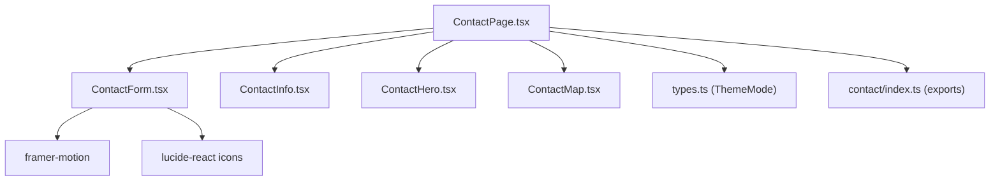
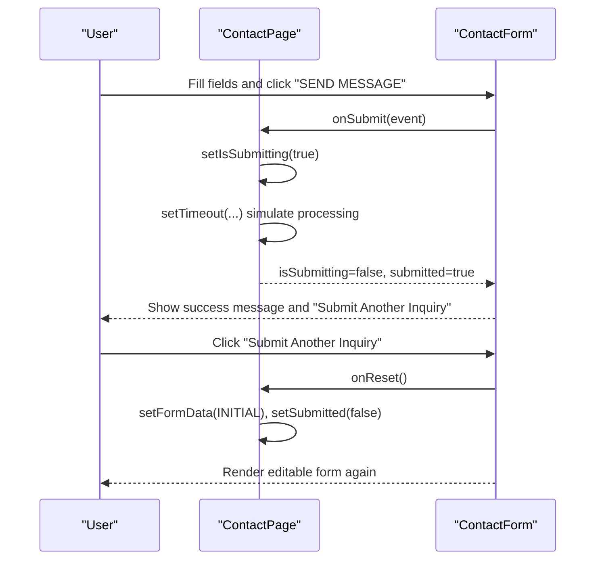
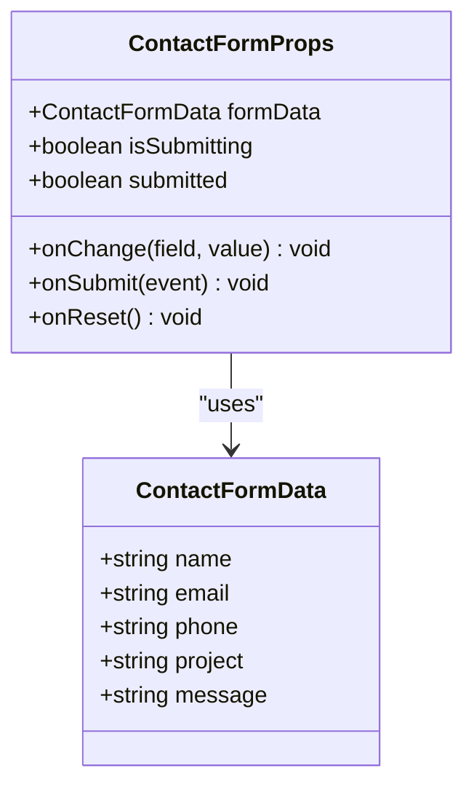

# Contact Form Component

<cite>
**Referenced Files in This Document**
- [ContactForm.tsx](file://src/components/contact/ContactForm.tsx)
- [ContactPage.tsx](file://src/pages/ContactPage.tsx)
- [index.ts](file://src/components/contact/index.ts)
- [types.ts](file://src/types.ts)
- [ContactInfo.tsx](file://src/components/contact/ContactInfo.tsx)
- [ContactHero.tsx](file://src/components/contact/ContactHero.tsx)
- [ContactMap.tsx](file://src/components/contact/ContactMap.tsx)
</cite>

## Table of Contents
1. [Introduction](#introduction)
2. [Project Structure](#project-structure)
3. [Core Components](#core-components)
4. [Architecture Overview](#architecture-overview)
5. [Detailed Component Analysis](#detailed-component-analysis)
6. [Dependency Analysis](#dependency-analysis)
7. [Performance Considerations](#performance-considerations)
8. [Troubleshooting Guide](#troubleshooting-guide)
9. [Conclusion](#conclusion)
10. [Appendices](#appendices)

## Introduction
This document provides comprehensive documentation for the ContactForm component and its integration within the contact page. It explains form fields, validation behavior, error handling, submission flow with loading states, success feedback, accessibility considerations, and guidance for customization and backend integration.

## Project Structure
The contact feature is organized under a dedicated folder with related components and a page that orchestrates state and renders the form alongside supporting sections (hero, info, map).

**Diagram sources**
- [ContactPage.tsx:1-77](file://src/pages/ContactPage.tsx#L1-L77)
- [ContactForm.tsx:1-146](file://src/components/contact/ContactForm.tsx#L1-L146)
- [ContactInfo.tsx:1-56](file://src/components/contact/ContactInfo.tsx#L1-L56)
- [ContactHero.tsx:1-41](file://src/components/contact/ContactHero.tsx#L1-L41)
- [ContactMap.tsx:1-31](file://src/components/contact/ContactMap.tsx#L1-L31)
- [index.ts:1-5](file://src/components/contact/index.ts#L1-L5)
- [types.ts:1-60](file://src/types.ts#L1-L60)

**Section sources**
- [ContactPage.tsx:1-77](file://src/pages/ContactPage.tsx#L1-L77)
- [ContactForm.tsx:1-146](file://src/components/contact/ContactForm.tsx#L1-L146)
- [index.ts:1-5](file://src/components/contact/index.ts#L1-L5)
- [types.ts:1-60](file://src/types.ts#L1-L60)

## Core Components
- ContactForm: Renders the form UI, handles field inputs, and delegates submission to the parent via props. It also shows a success view after submission and supports resetting the form.
- ContactPage: Owns form state (formData, isSubmitting, submitted), wires event handlers, and composes the contact layout with hero, info, and map sections.

Key responsibilities:
- Field rendering and controlled input updates
- Submission lifecycle with loading and success states
- Resetting form data and visibility toggling

**Section sources**
- [ContactForm.tsx:5-20](file://src/components/contact/ContactForm.tsx#L5-L20)
- [ContactForm.tsx:22-146](file://src/components/contact/ContactForm.tsx#L22-L146)
- [ContactPage.tsx:5-38](file://src/pages/ContactPage.tsx#L5-L38)
- [ContactPage.tsx:40-77](file://src/pages/ContactPage.tsx#L40-L77)

## Architecture Overview
The contact page manages state and passes it down to the form component. The form uses native HTML validation attributes and controlled inputs. On submit, the page sets a loading state, simulates processing, then marks the form as submitted. A success view is shown until reset.

**Diagram sources**
- [ContactPage.tsx:17-38](file://src/pages/ContactPage.tsx#L17-L38)
- [ContactForm.tsx:22-146](file://src/components/contact/ContactForm.tsx#L22-L146)

## Detailed Component Analysis

### ContactForm Component
- Fields: name, email, phone, project, message
- Validation:
  - Required fields enforced via HTML required attribute
  - Email type ensures basic browser validation
  - Phone input restricts non-digit characters at runtime
  - Project selection requires choosing an option
- State and UI:
  - Controlled inputs bound to formData and onChange
  - Submit button disabled while isSubmitting
  - Success view rendered when submitted; includes reset action
- Accessibility:
  - Each input has a corresponding label element
  - Proper input types (email, tel) aid assistive technologies
  - Focus styles provide visible focus indicators
  - Button text changes to indicate processing state

Customization points:
- Add or remove fields by extending the interface and updating render logic
- Adjust validation rules by adding constraints or custom checks before submission
- Replace placeholder content and messages to match brand voice

Submission flow:
- Parent handles onSubmit, prevents default, sets loading, simulates delay, then flips submitted flag
- Success view displays confirmation and allows reset

Error handling:
- No explicit error state is managed in this component; errors should be handled by the parent if needed (e.g., network failures)

Accessibility notes:
- Labels are present for all inputs
- Keyboard navigation works via standard form controls
- Screen readers will announce labels and input types appropriately

**Section sources**
- [ContactForm.tsx:5-20](file://src/components/contact/ContactForm.tsx#L5-L20)
- [ContactForm.tsx:52-146](file://src/components/contact/ContactForm.tsx#L52-L146)

#### Class-like structure overview

**Diagram sources**
- [ContactForm.tsx:5-20](file://src/components/contact/ContactForm.tsx#L5-L20)

### ContactPage Integration
- Manages initial form data and state transitions
- Provides handleChange to update specific fields immutably
- Implements handleSubmit to prevent default, show loading, simulate async work, then mark submitted
- Resets form via handleReset to clear data and hide success view
- Composes ContactForm with other contact sections

State management summary:
- formData: object with all fields initialized to empty strings
- isSubmitting: boolean to disable submit and show processing
- submitted: boolean to toggle success view

Integration with other components:
- Uses ContactHero, ContactInfo, ContactMap to build the full page layout
- Exports ThemeMode from shared types

**Section sources**
- [ContactPage.tsx:5-38](file://src/pages/ContactPage.tsx#L5-L38)
- [ContactPage.tsx:40-77](file://src/pages/ContactPage.tsx#L40-L77)
- [types.ts:1-60](file://src/types.ts#L1-L60)

### Supporting Components
- ContactHero: Displays header section with background image and call-to-action text
- ContactInfo: Shows corporate address, phone, and email details
- ContactMap: Embeds a Google Maps iframe for location display

These components do not directly affect form logic but contribute to the overall user experience and context around the form.

**Section sources**
- [ContactHero.tsx:1-41](file://src/components/contact/ContactHero.tsx#L1-L41)
- [ContactInfo.tsx:1-56](file://src/components/contact/ContactInfo.tsx#L1-L56)
- [ContactMap.tsx:1-31](file://src/components/contact/ContactMap.tsx#L1-L31)

## Dependency Analysis
- ContactForm depends on:
  - React for component model
  - framer-motion for subtle animations
  - lucide-react for icons used in success and submit states
- ContactPage depends on:
  - ContactForm and related contact components via index exports
  - Shared types for theme mode

External libraries:
- framer-motion: animation utilities
- lucide-react: icon library

No circular dependencies observed between these modules.

**Section sources**
- [ContactForm.tsx:1-4](file://src/components/contact/ContactForm.tsx#L1-L4)
- [ContactPage.tsx:1-4](file://src/pages/ContactPage.tsx#L1-L4)
- [index.ts:1-5](file://src/components/contact/index.ts#L1-L5)

## Performance Considerations
- Controlled inputs: Each keystroke triggers a state update in the parent. For very large forms, consider memoization or debounced updates.
- Animations: framer-motion adds minimal overhead; ensure animations are lightweight and avoid unnecessary re-renders.
- Simulated delay: The current implementation uses a fixed timeout. In production, replace with actual API calls and proper loading/error states.

[No sources needed since this section provides general guidance]

## Troubleshooting Guide
Common issues and resolutions:
- Form does not submit:
  - Ensure onSubmit handler is passed and prevents default behavior
  - Verify required fields are filled; browser validation will block submission otherwise
- Loading state not appearing:
  - Confirm isSubmitting prop is correctly wired and button is disabled during submission
- Success view not resetting:
  - Ensure onReset clears both formData and submitted flags in the parent
- Phone input accepts letters:
  - Check that the input’s onChange filters non-digit characters
- Accessibility concerns:
  - Verify each input has a label and appropriate type
  - Test keyboard navigation and screen reader announcements

If integrating with a backend:
- Replace the simulated timeout with a real fetch/axios call
- Handle network errors by setting an error state and displaying user-friendly messages
- Keep isSubmitting true until the request completes, then set submitted based on response

[No sources needed since this section provides general guidance]

## Conclusion
The ContactForm component provides a clean, accessible, and animated user experience for collecting inquiries. It relies on native HTML validation and controlled inputs, with submission and success flows managed by the parent page. Customization is straightforward through props and by extending the form data interface. For production use, integrate a real backend API and enhance error handling to improve robustness.

[No sources needed since this section summarizes without analyzing specific files]

## Appendices

### Field Reference and Validation Rules
- Name: Required; free-form text
- Email: Required; validated by browser as email type
- Phone: Required; restricted to digits only at input time
- Project: Required; select from predefined options
- Message: Optional; free-form text area

**Section sources**
- [ContactForm.tsx:55-133](file://src/components/contact/ContactForm.tsx#L55-L133)

### Submission Flow Details
- Prevent default form submission
- Set loading state
- Simulate processing delay
- Mark as submitted and show success view
- Allow reset to return to editable form

**Section sources**
- [ContactPage.tsx:26-38](file://src/pages/ContactPage.tsx#L26-L38)
- [ContactForm.tsx:30-49](file://src/components/contact/ContactForm.tsx#L30-L49)
- [ContactForm.tsx:135-143](file://src/components/contact/ContactForm.tsx#L135-L143)

### Accessibility Checklist
- All inputs have associated labels
- Input types are semantically correct (email, tel)
- Focus styles are visible
- Buttons convey state (processing vs send)
- Success message includes clear status and action

**Section sources**
- [ContactForm.tsx:55-143](file://src/components/contact/ContactForm.tsx#L55-L143)

### Backend Integration Example Outline
- Replace setTimeout with an API call in handleSubmit
- Handle success by setting submitted to true
- Handle errors by setting an error state and showing a message
- Maintain isSubmitting throughout the request lifecycle

[No sources needed since this section provides general guidance]