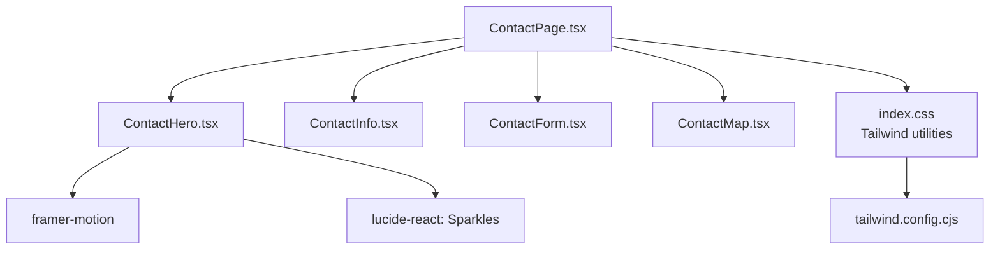
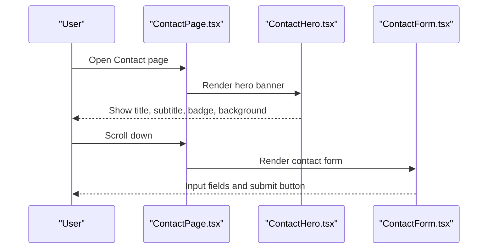
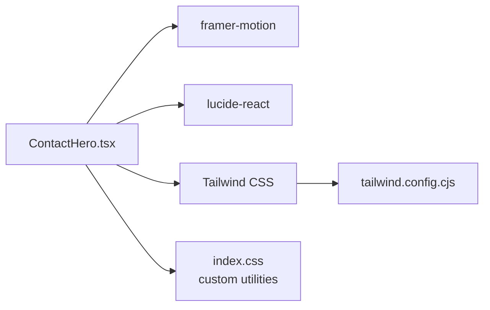

# Contact Hero Component

<cite>
**Referenced Files in This Document**
- [ContactHero.tsx](file://src/components/contact/ContactHero.tsx)
- [ContactPage.tsx](file://src/pages/ContactPage.tsx)
- [index.ts](file://src/components/contact/index.ts)
- [ContactForm.tsx](file://src/components/contact/ContactForm.tsx)
- [ContactInfo.tsx](file://src/components/contact/ContactInfo.tsx)
- [index.css](file://src/index.css)
- [tailwind.config.cjs](file://tailwind.config.cjs)
</cite>

## Table of Contents
1. Introduction
2. Project Structure
3. Core Components
4. Architecture Overview
5. Detailed Component Analysis
6. Dependency Analysis
7. Performance Considerations
8. Troubleshooting Guide
9. Conclusion
10. Appendices

## Introduction
The ContactHero component is the introductory hero section of the contact page. It sets the visual and contextual tone for reaching out to the team, establishes a premium brand feel with imagery, gradients, and typography, and guides users toward the contact form below. It uses motion-based entrance animations, responsive sizing, and accessible markup to ensure clarity across devices and assistive technologies.

## Project Structure
The ContactHero lives within the contact feature folder and is composed into the Contact page. The page orchestrates layout and passes state to sibling components (form, info, map).

**Diagram sources**
- [ContactPage.tsx:1-77](file://src/pages/ContactPage.tsx#L1-L77)
- [ContactHero.tsx:1-41](file://src/components/contact/ContactHero.tsx#L1-L41)
- [index.css:1-105](file://src/index.css#L1-L105)
- [tailwind.config.cjs:1-15](file://tailwind.config.cjs#L1-L15)

**Section sources**
- [ContactPage.tsx:1-77](file://src/pages/ContactPage.tsx#L1-L77)
- [index.ts:1-5](file://src/components/contact/index.ts#L1-L5)

## Core Components
- ContactHero: Renders the hero banner with background image, gradient overlay, animated entrance, badge, heading, and descriptive paragraph. It visually introduces the contact context and leads attention downward to the form.
- ContactPage: Hosts the hero at the top, then arranges ContactInfo and ContactForm side-by-side on larger screens, and includes ContactMap at the bottom.
- ContactForm: Provides the inquiry form that the hero directs users to complete.
- ContactInfo: Displays direct contact details (address, phone, email) aligned with the page’s theme.

Key responsibilities:
- Establish context: Clear headline and supportive copy explain the purpose of the section.
- Visual hierarchy: Badge, large serif heading, and muted subtext guide reading order.
- Motion cues: Subtle fade/scale and slide-up transitions draw attention without distraction.
- Responsive behavior: Height and typography scale across breakpoints; content remains centered and readable.
- Theme integration: Uses Tailwind classes and custom utility classes from index.css; aligns with gold accent palette defined in tailwind config.

**Section sources**
- [ContactHero.tsx:1-41](file://src/components/contact/ContactHero.tsx#L1-L41)
- [ContactPage.tsx:1-77](file://src/pages/ContactPage.tsx#L1-L77)
- [ContactForm.tsx:1-146](file://src/components/contact/ContactForm.tsx#L1-L146)
- [ContactInfo.tsx:1-56](file://src/components/contact/ContactInfo.tsx#L1-L56)
- [index.css:1-105](file://src/index.css#L1-L105)
- [tailwind.config.cjs:1-15](file://tailwind.config.cjs#L1-L15)

## Architecture Overview
The Contact page composes multiple components. ContactHero sits at the top as a full-width banner, followed by a two-column section containing ContactInfo and ContactForm, and finally ContactMap. Styling is primarily via Tailwind utility classes and custom CSS utilities for fonts and accents.

**Diagram sources**
- [ContactPage.tsx:1-77](file://src/pages/ContactPage.tsx#L1-L77)
- [ContactHero.tsx:1-41](file://src/components/contact/ContactHero.tsx#L1-L41)
- [ContactForm.tsx:1-146](file://src/components/contact/ContactForm.tsx#L1-L146)

## Detailed Component Analysis

### ContactHero Component
Purpose:
- Introduce the contact page with a strong visual header.
- Communicate the call-to-action through clear typography and supportive text.
- Use subtle motion to enhance perceived quality without impacting performance.

Visual design patterns:
- Background image with a dark gradient overlay for contrast and readability.
- Centered content block with generous spacing and max-width constraints.
- Small uppercase badge with an icon to signal “Get In Touch.”
- Large serif heading for brand elegance and high legibility.
- Muted supporting paragraph to set expectations and direct users to the form.

Typography choices:
- Serif font for the main heading to convey sophistication.
- Sans-serif body text for readability.
- Uppercase, wide letter-spacing for badges and labels to create a refined look.

Layout structure:
- Full-width section with fixed height that scales on medium+ screens.
- Flexbox centering ensures content remains vertically and horizontally aligned.
- Gradient overlay ensures text contrast over any background image.

Motion:
- Background image container fades in and scales slightly for a cinematic entrance.
- Content slides up and fades in with a short delay for layered reveal.

Accessibility considerations:
- Semantic section element provides landmark context.
- Descriptive alt text on the background image supports screen readers.
- Proper heading hierarchy with h1 for the primary message.
- Sufficient color contrast between text and overlay.

SEO optimization:
- Single h1 communicates the page topic clearly to search engines.
- Meaningful alt text improves image indexing and accessibility.
- Concise, keyword-relevant copy reinforces the contact intent.

Responsive behavior:
- Height increases on md+ screens for more impact.
- Typography scales up on larger viewports for better readability.
- Padding adjusts to maintain comfortable spacing on mobile.

Integration with page theme:
- Uses Tailwind colors and spacing utilities.
- Aligns with the site’s gold accent palette and neutral tones.
- Works seamlessly with global font utilities defined in index.css.

Customization examples:
- Change the headline or supporting copy to match campaign messaging.
- Swap the background image URL to reflect seasonal or project-specific visuals.
- Adjust badge label or icon to highlight different calls to action.
- Modify heights and padding to fit different brand guidelines.

Performance notes:
- Image loading is handled by the browser; consider lazy-loading or optimizing image size if needed.
- Motion durations are short to avoid blocking initial paint.

**Section sources**
- [ContactHero.tsx:1-41](file://src/components/contact/ContactHero.tsx#L1-L41)
- [index.css:1-105](file://src/index.css#L1-L105)
- [tailwind.config.cjs:1-15](file://tailwind.config.cjs#L1-L15)

### ContactPage Integration
Role:
- Places ContactHero at the top of the page.
- Organizes ContactInfo and ContactForm in a responsive grid.
- Includes ContactMap below the form area.

Flow:
- Renders hero first to establish context.
- Presents contact details and form side-by-side on larger screens.
- Guides users to fill out the form after reading the hero message.

**Section sources**
- [ContactPage.tsx:1-77](file://src/pages/ContactPage.tsx#L1-L77)

### ContactForm and ContactInfo
ContactForm:
- Accepts user input and handles submission states.
- Mirrors the page’s styling language and gold accent interactions.

ContactInfo:
- Displays address, phone, and email with consistent icons and styling.
- Reinforces trust and provides alternative contact channels.

**Section sources**
- [ContactForm.tsx:1-146](file://src/components/contact/ContactForm.tsx#L1-L146)
- [ContactInfo.tsx:1-56](file://src/components/contact/ContactInfo.tsx#L1-L56)

## Dependency Analysis
External libraries and utilities used:
- framer-motion: Animations for hero background and content entrance.
- lucide-react: Icons (Sparkles in hero; others in related components).
- Tailwind CSS: Utility-first styling for layout, spacing, colors, and responsiveness.
- Custom CSS utilities: Font families and accent colors defined in index.css.
- Tailwind config: Extends color tokens for gold accents.

**Diagram sources**
- [ContactHero.tsx:1-41](file://src/components/contact/ContactHero.tsx#L1-L41)
- [index.css:1-105](file://src/index.css#L1-L105)
- [tailwind.config.cjs:1-15](file://tailwind.config.cjs#L1-L15)

**Section sources**
- [ContactHero.tsx:1-41](file://src/components/contact/ContactHero.tsx#L1-L41)
- [index.css:1-105](file://src/index.css#L1-L105)
- [tailwind.config.cjs:1-15](file://tailwind.config.cjs#L1-L15)

## Performance Considerations
- Keep hero image optimized (appropriate dimensions and format) to reduce load time.
- Motion durations are short; avoid adding heavy effects that could impact scroll performance.
- Ensure images have proper alt attributes to improve accessibility and SEO without affecting performance.
- Leverage browser caching for static assets like images and fonts.

[No sources needed since this section provides general guidance]

## Troubleshooting Guide
Common issues and resolutions:
- Text not readable over background: Verify gradient overlay opacity and ensure sufficient contrast between text and background.
- Animation feels laggy: Reduce animation complexity or duration; ensure no heavy computations run during mount.
- Image not loading: Check the image URL and network status; consider providing a fallback or placeholder.
- Mobile layout cramped: Confirm responsive classes are applied correctly and viewport meta tag is present in the HTML.
- Theme mismatch: Ensure global theme classes and Tailwind configuration are correctly set up in index.css and tailwind.config.cjs.

**Section sources**
- [ContactHero.tsx:1-41](file://src/components/contact/ContactHero.tsx#L1-L41)
- [index.css:1-105](file://src/index.css#L1-L105)
- [tailwind.config.cjs:1-15](file://tailwind.config.cjs#L1-L15)

## Conclusion
The ContactHero component effectively introduces the contact experience with a polished visual design, clear typography, and subtle motion. It establishes context, reinforces brand aesthetics, and smoothly guides users to the form below. With thoughtful accessibility and SEO practices, it serves as a strong entry point for user engagement on the contact page.

[No sources needed since this section summarizes without analyzing specific files]

## Appendices

### Accessibility Checklist for ContactHero
- Use semantic landmarks (section) and proper heading hierarchy (h1).
- Provide descriptive alt text for background images.
- Maintain sufficient color contrast between text and overlays.
- Ensure keyboard navigability and focus management remain unaffected by animations.

**Section sources**
- [ContactHero.tsx:1-41](file://src/components/contact/ContactHero.tsx#L1-L41)

### SEO Best Practices for ContactHero
- Include a single, meaningful h1 that reflects the page’s purpose.
- Write concise, relevant copy that includes natural keywords related to contacting support or sales.
- Optimize image filenames and alt text for discoverability.
- Avoid blocking resources that delay initial render.

**Section sources**
- [ContactHero.tsx:1-41](file://src/components/contact/ContactHero.tsx#L1-L41)