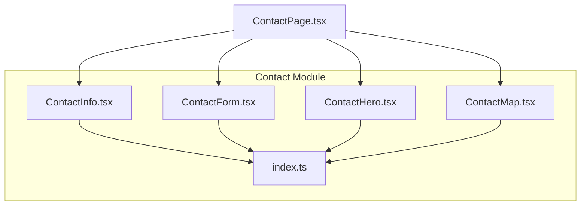
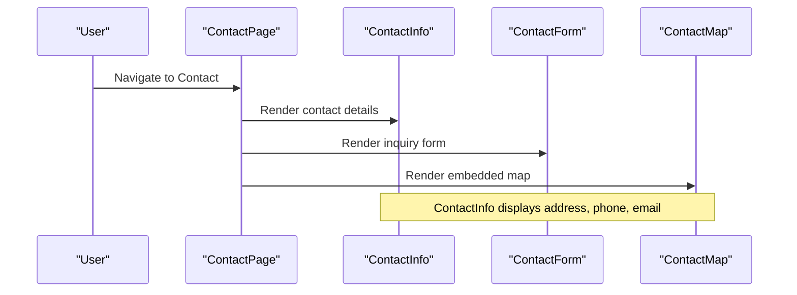
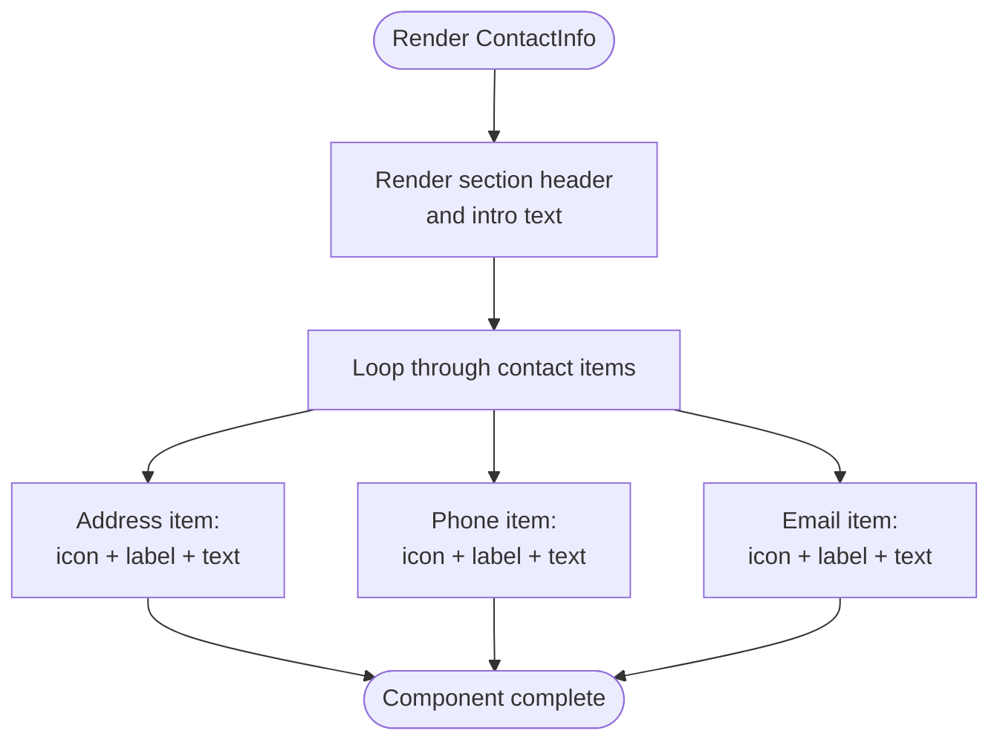
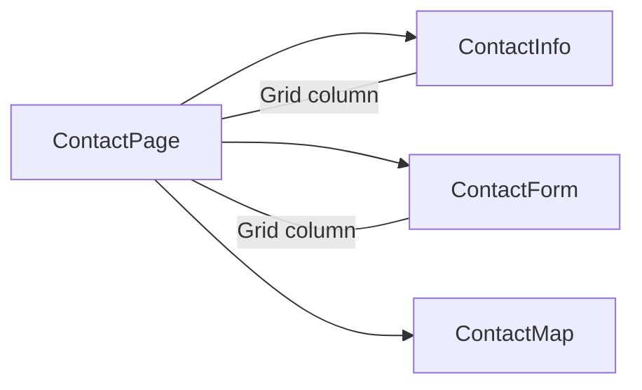
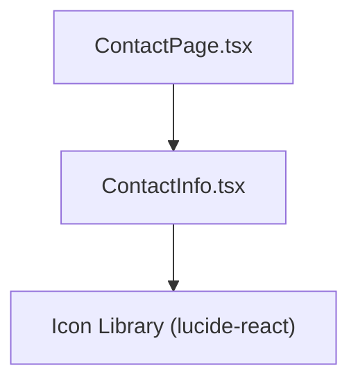

# Contact Information Component

<cite>
**Referenced Files in This Document**
- [ContactInfo.tsx](file://src/components/contact/ContactInfo.tsx)
- [index.ts](file://src/components/contact/index.ts)
- [ContactPage.tsx](file://src/pages/ContactPage.tsx)
- [ContactForm.tsx](file://src/components/contact/ContactForm.tsx)
- [ContactHero.tsx](file://src/components/contact/ContactHero.tsx)
- [ContactMap.tsx](file://src/components/contact/ContactMap.tsx)
</cite>

## Table of Contents
1. [Introduction](#introduction)
2. [Project Structure](#project-structure)
3. [Core Components](#core-components)
4. [Architecture Overview](#architecture-overview)
5. [Detailed Component Analysis](#detailed-component-analysis)
6. [Dependency Analysis](#dependency-analysis)
7. [Performance Considerations](#performance-considerations)
8. [Troubleshooting Guide](#troubleshooting-guide)
9. [Conclusion](#conclusion)
10. [Appendices](#appendices)

## Introduction
This document provides detailed documentation for the ContactInfo component, which displays contact details including address, phone numbers, and email addresses. It explains the information hierarchy, visual presentation patterns, responsive layout behavior, accessibility considerations, and practical examples for updating contact information, adding new contact methods, and customizing display formats. The component is part of a cohesive contact experience that includes a hero section, form, and map.

## Project Structure
The ContactInfo component resides within the contact module and is consumed by the Contact page. Related components include the contact form, hero banner, and map integration.

**Diagram sources**
- [ContactInfo.tsx:1-56](file://src/components/contact/ContactInfo.tsx#L1-L56)
- [ContactForm.tsx:1-146](file://src/components/contact/ContactForm.tsx#L1-L146)
- [ContactHero.tsx:1-41](file://src/components/contact/ContactHero.tsx#L1-L41)
- [ContactMap.tsx:1-31](file://src/components/contact/ContactMap.tsx#L1-L31)
- [index.ts:1-5](file://src/components/contact/index.ts#L1-L5)
- [ContactPage.tsx:1-77](file://src/pages/ContactPage.tsx#L1-L77)

**Section sources**
- [ContactInfo.tsx:1-56](file://src/components/contact/ContactInfo.tsx#L1-L56)
- [ContactPage.tsx:40-74](file://src/pages/ContactPage.tsx#L40-L74)
- [index.ts:1-5](file://src/components/contact/index.ts#L1-L5)

## Core Components
- ContactInfo: Displays corporate office address, phone number, and email with consistent iconography and styling.
- ContactForm: Captures user inquiries and manages submission states.
- ContactHero: Provides contextual header and messaging for the contact section.
- ContactMap: Embeds a map to show the corporate location.

Key responsibilities:
- ContactInfo focuses on presenting static contact details in a clear, accessible, and visually consistent manner.
- ContactPage orchestrates layout and composes these components into a cohesive page.

**Section sources**
- [ContactInfo.tsx:1-56](file://src/components/contact/ContactInfo.tsx#L1-L56)
- [ContactForm.tsx:1-146](file://src/components/contact/ContactForm.tsx#L1-L146)
- [ContactHero.tsx:1-41](file://src/components/contact/ContactHero.tsx#L1-L41)
- [ContactMap.tsx:1-31](file://src/components/contact/ContactMap.tsx#L1-L31)
- [ContactPage.tsx:40-74](file://src/pages/ContactPage.tsx#L40-L74)

## Architecture Overview
At runtime, ContactPage renders ContactInfo alongside ContactForm and ContactMap. ContactInfo is a presentational component with no external state dependencies; it receives no props and renders hardcoded contact details.

**Diagram sources**
- [ContactPage.tsx:40-74](file://src/pages/ContactPage.tsx#L40-L74)
- [ContactInfo.tsx:1-56](file://src/components/contact/ContactInfo.tsx#L1-L56)
- [ContactForm.tsx:1-146](file://src/components/contact/ContactForm.tsx#L1-L146)
- [ContactMap.tsx:1-31](file://src/components/contact/ContactMap.tsx#L1-L31)

## Detailed Component Analysis

### ContactInfo Component
Purpose:
- Present corporate contact details (address, phone, email) with a consistent visual style and clear hierarchy.

Information hierarchy:
- Section label: “DIRECT CONCIERGE” establishes context.
- Introductory line: Brief message inviting users to reach out.
- Contact items: Each item groups an icon, a labeled heading, and the detail text.

Visual presentation patterns:
- Iconography: Location pin, phone, and mail icons provide quick recognition.
- Styling: Small uppercase labels, subtle gold accent color, neutral backgrounds, and compact typography create a refined look.
- Spacing: Vertical stacking with consistent padding and margins ensures readability.

Responsive layout behavior:
- The component uses vertical stacking and flexible spacing. On smaller screens, content remains readable due to small font sizes and tight spacing. The parent grid in ContactPage controls overall column behavior.

Accessibility considerations:
- Use semantic headings for each contact item to convey structure.
- Ensure sufficient color contrast between text and background.
- Provide descriptive labels for any interactive elements if added later (e.g., clickable phone/email).
- Keep icon-only elements paired with visible labels (already present via headings).

Examples and customization:
- Updating contact information: Edit the text nodes for address, phone, and email directly in the component file.
- Adding a new contact method: Duplicate an existing contact item block, replace the icon and label, and insert the new detail.
- Customizing display format: Adjust Tailwind classes for colors, spacing, and typography to match brand guidelines.

**Diagram sources**
- [ContactInfo.tsx:5-53](file://src/components/contact/ContactInfo.tsx#L5-L53)

**Section sources**
- [ContactInfo.tsx:5-53](file://src/components/contact/ContactInfo.tsx#L5-L53)

### Integration with ContactPage
Layout and composition:
- ContactPage arranges ContactInfo and ContactForm in a responsive grid. On large screens, ContactInfo occupies a portion of the row, separated by a decorative divider from the form. On smaller screens, they stack vertically.

Responsiveness:
- Grid switches from single-column on mobile to multi-column on larger breakpoints.
- Padding and spacing adapt to screen size for optimal readability.

**Diagram sources**
- [ContactPage.tsx:44-69](file://src/pages/ContactPage.tsx#L44-L69)

**Section sources**
- [ContactPage.tsx:44-69](file://src/pages/ContactPage.tsx#L44-L69)

### Related Components Context
- ContactForm: Handles user input and submission feedback; complements ContactInfo by providing an alternative channel to reach out.
- ContactHero: Sets the tone and context for the contact section.
- ContactMap: Shows the physical location referenced by the address in ContactInfo.

**Section sources**
- [ContactForm.tsx:1-146](file://src/components/contact/ContactForm.tsx#L1-L146)
- [ContactHero.tsx:1-41](file://src/components/contact/ContactHero.tsx#L1-L41)
- [ContactMap.tsx:1-31](file://src/components/contact/ContactMap.tsx#L1-L31)

## Dependency Analysis
- ContactInfo has no props or external data dependencies; it renders static content.
- It imports icons from a shared icon library for visual consistency.
- ContactPage composes ContactInfo and other contact-related components.

**Diagram sources**
- [ContactInfo.tsx:1-56](file://src/components/contact/ContactInfo.tsx#L1-L56)
- [ContactPage.tsx:1-77](file://src/pages/ContactPage.tsx#L1-L77)

**Section sources**
- [ContactInfo.tsx:1-56](file://src/components/contact/ContactInfo.tsx#L1-L56)
- [ContactPage.tsx:1-77](file://src/pages/ContactPage.tsx#L1-L77)

## Performance Considerations
- Static rendering: ContactInfo renders lightweight markup with minimal DOM nodes, resulting in fast paint times.
- No network calls: As a presentational component, it does not trigger network requests.
- CSS efficiency: Uses utility classes for styling; ensure consistent class usage to avoid redundant styles.

[No sources needed since this section provides general guidance]

## Troubleshooting Guide
Common issues and resolutions:
- Incorrect or outdated contact details: Update the text nodes in the component file to reflect current information.
- Inconsistent styling: Verify that Tailwind classes are applied consistently across contact items to maintain visual harmony.
- Accessibility gaps: Ensure all labels are descriptive and that any future interactive elements (e.g., links) have appropriate roles and keyboard support.
- Responsive misalignment: Check the parent grid in ContactPage to ensure columns and dividers behave correctly at different breakpoints.

**Section sources**
- [ContactInfo.tsx:5-53](file://src/components/contact/ContactInfo.tsx#L5-L53)
- [ContactPage.tsx:44-69](file://src/pages/ContactPage.tsx#L44-L69)

## Conclusion
The ContactInfo component delivers a clean, accessible, and responsive presentation of key contact details. Its simple structure makes it easy to update and extend. When combined with ContactForm, ContactHero, and ContactMap, it forms a comprehensive contact experience that guides users to multiple ways of reaching the business.

[No sources needed since this section summarizes without analyzing specific files]

## Appendices

### A. How to Update Contact Information
- Locate the relevant text nodes for address, phone, and email within the component file and edit them to reflect current details.
- Validate formatting and ensure consistent typography and spacing.

**Section sources**
- [ContactInfo.tsx:15-52](file://src/components/contact/ContactInfo.tsx#L15-L52)

### B. How to Add a New Contact Method
- Duplicate an existing contact item block.
- Replace the icon with a suitable one for the new method.
- Update the label and detail text accordingly.
- Maintain consistent spacing and styling.

**Section sources**
- [ContactInfo.tsx:15-52](file://src/components/contact/ContactInfo.tsx#L15-L52)

### C. How to Customize Display Format
- Adjust Tailwind classes for colors, fonts, and spacing to align with brand guidelines.
- Consider adding borders, shadows, or hover states for enhanced interactivity if needed.

**Section sources**
- [ContactInfo.tsx:5-53](file://src/components/contact/ContactInfo.tsx#L5-L53)

### D. Accessibility Checklist for Contact Information
- Semantic headings per contact item to define structure.
- Sufficient color contrast for text and accents.
- Descriptive labels for any interactive elements (e.g., clickable phone/email).
- Keyboard navigability and focus management if interactivity is introduced.

**Section sources**
- [ContactInfo.tsx:15-52](file://src/components/contact/ContactInfo.tsx#L15-L52)

### E. Mobile Responsiveness Patterns
- Vertical stacking ensures readability on small screens.
- Compact typography and spacing optimize space usage.
- Parent grid in ContactPage controls column behavior across breakpoints.

**Section sources**
- [ContactPage.tsx:44-69](file://src/pages/ContactPage.tsx#L44-L69)
- [ContactInfo.tsx:5-53](file://src/components/contact/ContactInfo.tsx#L5-L53)