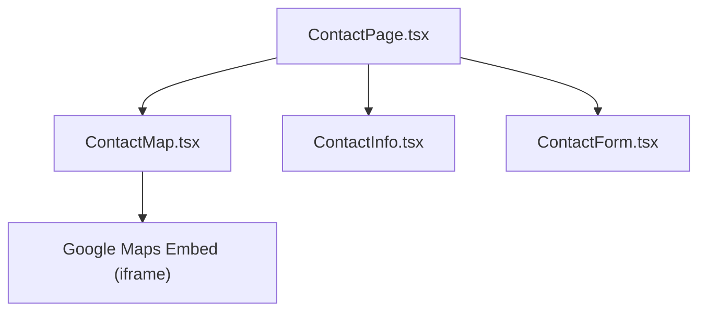
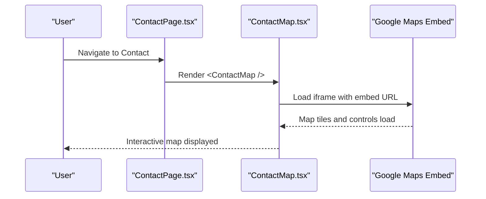
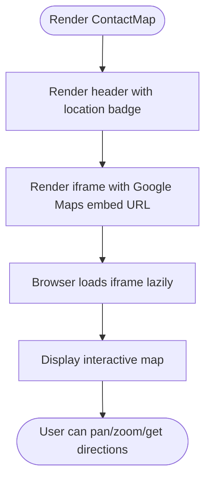
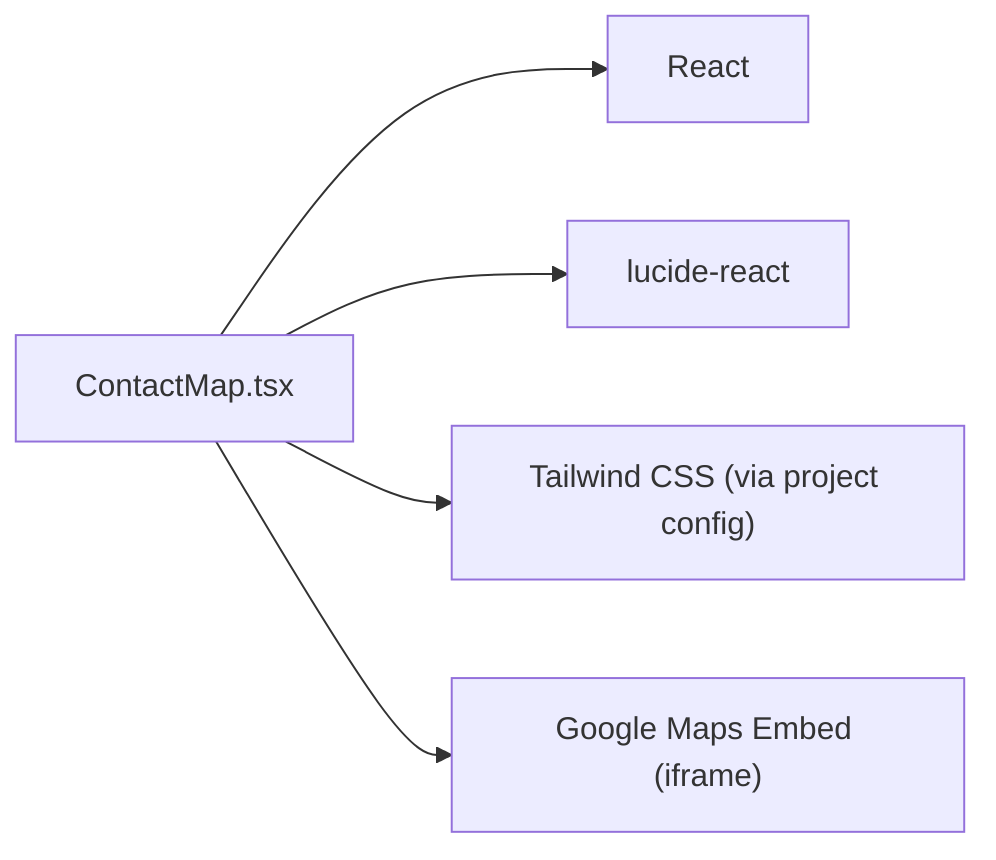

# Contact Map Component

<cite>
**Referenced Files in This Document**
- [ContactMap.tsx](file://src/components/contact/ContactMap.tsx)
- [ContactPage.tsx](file://src/pages/ContactPage.tsx)
- [index.ts](file://src/components/contact/index.ts)
- [package.json](file://package.json)
</cite>

## Table of Contents
1. [Introduction](#introduction)
2. [Project Structure](#project-structure)
3. [Core Components](#core-components)
4. [Architecture Overview](#architecture-overview)
5. [Detailed Component Analysis](#detailed-component-analysis)
6. [Dependency Analysis](#dependency-analysis)
7. [Performance Considerations](#performance-considerations)
8. [Troubleshooting Guide](#troubleshooting-guide)
9. [Conclusion](#conclusion)
10. [Appendices](#appendices)

## Introduction
This document provides comprehensive documentation for the ContactMap component used on the Contact page to display a map of the Platinum Corporate Headquarters location. It explains how the map is integrated, how to configure and customize it, how to handle loading states and fallbacks, and how to optimize performance and mobile experience. The current implementation uses an embedded Google Maps iframe for simplicity and reliability.

## Project Structure
The ContactMap component lives under the contact components folder and is exported via the contact index barrel file. It is rendered at the bottom of the Contact page alongside other contact-related sections.

**Diagram sources**
- [ContactPage.tsx:40-74](file://src/pages/ContactPage.tsx#L40-L74)
- [ContactMap.tsx:4-29](file://src/components/contact/ContactMap.tsx#L4-L29)

**Section sources**
- [ContactPage.tsx:40-74](file://src/pages/ContactPage.tsx#L40-L74)
- [index.ts:1-5](file://src/components/contact/index.ts#L1-L5)

## Core Components
- ContactMap: Renders a styled container with a header bar and an embedded Google Maps iframe showing the headquarters location. It includes accessibility attributes and responsive styling.

Key responsibilities:
- Display a branded header with location context
- Embed a Google Maps iframe for navigation and viewing
- Provide accessible title and safe loading behavior

**Section sources**
- [ContactMap.tsx:4-29](file://src/components/contact/ContactMap.tsx#L4-L29)

## Architecture Overview
At runtime, the Contact page renders ContactMap as part of its layout. The component itself does not manage state; it delegates all map rendering to Google’s embed service via an iframe.

**Diagram sources**
- [ContactPage.tsx:40-74](file://src/pages/ContactPage.tsx#L40-L74)
- [ContactMap.tsx:19-27](file://src/components/contact/ContactMap.tsx#L19-L27)

## Detailed Component Analysis

### ContactMap Implementation
- Layout and Styling: Uses a responsive container with padding and a max-width for large screens. The card has a border and shadow for visual depth.
- Header Bar: Displays a building icon, a label indicating “Google Maps Navigation,” and a badge with the location text.
- Map Integration: An iframe loads a Google Maps embed URL pointing to the headquarters coordinates. Attributes include:
  - Accessible title
  - Full width and fixed height
  - No border
  - Lazy loading
  - Referrer policy for privacy and performance

**Diagram sources**
- [ContactMap.tsx:4-29](file://src/components/contact/ContactMap.tsx#L4-L29)

**Section sources**
- [ContactMap.tsx:4-29](file://src/components/contact/ContactMap.tsx#L4-L29)

### Usage in Contact Page
- The Contact page imports and renders ContactMap after the form section.
- The page provides a consistent background and spacing around the map section.

**Section sources**
- [ContactPage.tsx:40-74](file://src/pages/ContactPage.tsx#L40-L74)

### Export and Re-export
- ContactMap is re-exported from the contact module index for clean imports across the app.

**Section sources**
- [index.ts:1-5](file://src/components/contact/index.ts#L1-L5)

## Dependency Analysis
- React: Used for component definition and JSX rendering.
- Lucide React: Provides the building icon used in the header.
- Tailwind CSS: Utility classes drive responsive layout and styling.
- External Service: Google Maps via an iframe embed URL.

**Diagram sources**
- [ContactMap.tsx:1-2](file://src/components/contact/ContactMap.tsx#L1-L2)
- [package.json:13-25](file://package.json#L13-L25)

**Section sources**
- [package.json:13-25](file://package.json#L13-L25)

## Performance Considerations
- Lazy Loading: The iframe uses lazy loading to defer off-screen map resources until needed.
- Fixed Height: A fixed height prevents layout shifts while the map loads.
- Responsive Width: The iframe width is set to 100% to adapt to container size.
- Minimal DOM: The component keeps markup minimal to reduce render cost.
- Network Requests: The heavy work (map tiles, styles, scripts) is handled by Google’s servers; your app only loads the iframe once visible.

Recommendations when extending:
- Keep the iframe src stable to avoid cache invalidation.
- Avoid frequent re-renders that would recreate the iframe.
- Consider adding a skeleton or spinner if you later implement dynamic map loading.

[No sources needed since this section provides general guidance]

## Troubleshooting Guide
Common issues and resolutions:
- Map not loading:
  - Check network connectivity and ad blockers.
  - Verify the embed URL is valid and not blocked by CORS or referrer policies.
  - Ensure the iframe is within the viewport so lazy loading triggers.
- Incorrect location:
  - Update the embed URL parameters to point to the desired coordinates or place ID.
- Accessibility:
  - Ensure the iframe retains an accessible title describing the map content.
- Mobile experience:
  - Confirm the container allows full width and adequate height on small screens.
  - Test pinch-to-zoom and tap interactions on target devices.

[No sources needed since this section provides general guidance]

## Conclusion
The ContactMap component provides a simple, reliable, and accessible way to display a Google Maps embed for the headquarters location. It leverages an iframe for zero-config integration, includes responsive styling, and maintains good performance through lazy loading. For advanced customization or alternative providers, extend the component with configuration props and conditional rendering logic.

[No sources needed since this section summarizes without analyzing specific files]

## Appendices

### How to Configure the Map Location
- Change the destination by updating the Google Maps embed URL in the iframe src attribute to a new place or coordinates.
- Use Google Maps’ “Share” > “Embed a map” workflow to generate a fresh URL for the desired location.

**Section sources**
- [ContactMap.tsx:19-27](file://src/components/contact/ContactMap.tsx#L19-L27)

### Customize Appearance
- Container styling: Adjust padding, borders, shadows, and colors using utility classes in the outer wrapper.
- Header branding: Modify the icon, labels, and badge text to match brand guidelines.
- Map dimensions: Adjust the iframe height to fit different layouts or aspect ratios.

**Section sources**
- [ContactMap.tsx:4-29](file://src/components/contact/ContactMap.tsx#L4-L29)

### Handle Map Loading States and Fallbacks
Current behavior:
- The iframe loads lazily and displays the map when ready.

Suggested enhancements:
- Add a loading indicator behind the iframe while the first frame paints.
- Implement a timeout-based fallback UI if the iframe fails to load (e.g., show a static image or a link to open Google Maps).
- Wrap the iframe in a container that shows a placeholder until the iframe reports load success.

[No sources needed since this section provides general guidance]

### Alternative Map Services
To switch providers:
- Replace the Google Maps iframe with an embed from another provider (for example, OpenStreetMap, Mapbox, or Apple Maps).
- Ensure the new provider supports embedding and meets your privacy and performance requirements.
- Update the iframe src accordingly and test cross-browser behavior.

[No sources needed since this section provides general guidance]

### Event Handling and Interactivity
Current behavior:
- Interactions are provided by the embedded map (pan, zoom, get directions).

Suggested enhancements:
- Listen to iframe load events to trigger analytics or post-load actions.
- Expose props to control initial zoom level or centering if switching to a programmatic map SDK.
- Add keyboard navigation support for the surrounding container if needed.

[No sources needed since this section provides general guidance]

### Mobile Optimization Checklist
- Ensure the container allows full width on small screens.
- Set an appropriate iframe height for mobile readability.
- Test touch gestures (pinch, swipe) and confirm they work as expected.
- Validate that the header and badges remain readable on narrow viewports.

[No sources needed since this section provides general guidance]