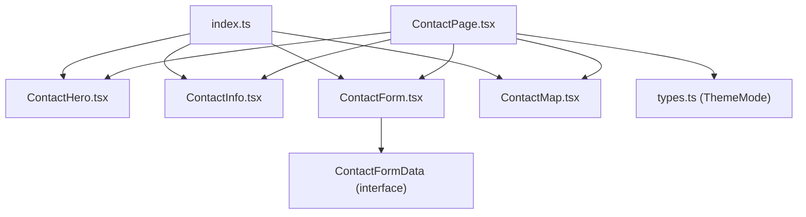
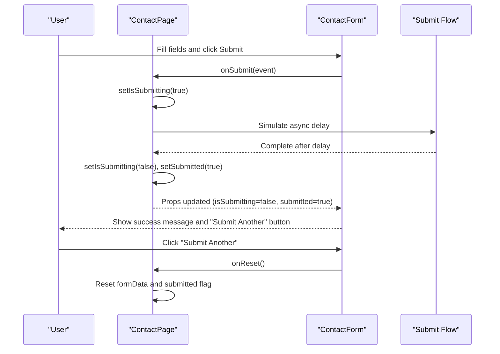
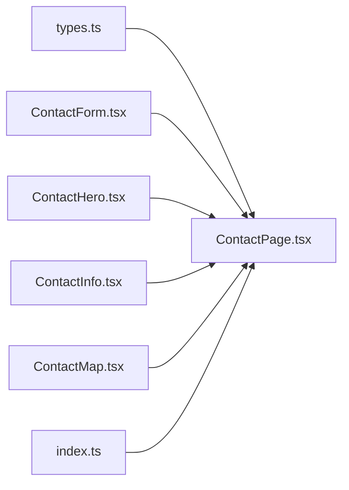

# Contact Page Component

<cite>
**Referenced Files in This Document**
- [ContactPage.tsx](file://src/pages/ContactPage.tsx)
- [ContactForm.tsx](file://src/components/contact/ContactForm.tsx)
- [ContactHero.tsx](file://src/components/contact/ContactHero.tsx)
- [ContactInfo.tsx](file://src/components/contact/ContactInfo.tsx)
- [ContactMap.tsx](file://src/components/contact/ContactMap.tsx)
- [index.ts](file://src/components/contact/index.ts)
- [types.ts](file://src/types.ts)
</cite>

## Table of Contents
1. [Introduction](#introduction)
2. [Project Structure](#project-structure)
3. [Core Components](#core-components)
4. [Architecture Overview](#architecture-overview)
5. [Detailed Component Analysis](#detailed-component-analysis)
6. [Dependency Analysis](#dependency-analysis)
7. [Performance Considerations](#performance-considerations)
8. [Troubleshooting Guide](#troubleshooting-guide)
9. [Conclusion](#conclusion)
10. [Appendices](#appendices)

## Introduction
This document provides comprehensive documentation for the Contact page and its sub-components: ContactHero, ContactInfo, ContactForm, and ContactMap. It explains how form data is handled and validated, how submission states are managed, and how user feedback is presented. It also covers accessibility considerations and responsive design patterns used across the components.

## Project Structure
The contact feature is organized under src/components/contact with a single page component that composes these sub-components. The index file re-exports them for clean imports.

**Diagram sources**
- [ContactPage.tsx:1-77](file://src/pages/ContactPage.tsx#L1-L77)
- [ContactForm.tsx:1-146](file://src/components/contact/ContactForm.tsx#L1-L146)
- [ContactHero.tsx:1-41](file://src/components/contact/ContactHero.tsx#L1-L41)
- [ContactInfo.tsx:1-56](file://src/components/contact/ContactInfo.tsx#L1-L56)
- [ContactMap.tsx:1-31](file://src/components/contact/ContactMap.tsx#L1-L31)
- [index.ts:1-5](file://src/components/contact/index.ts#L1-L5)
- [types.ts:1-60](file://src/types.ts#L1-L60)

**Section sources**
- [ContactPage.tsx:1-77](file://src/pages/ContactPage.tsx#L1-L77)
- [index.ts:1-5](file://src/components/contact/index.ts#L1-L5)

## Core Components
- ContactPage: Orchestrates state for form data, submission, and success; renders hero, info, form, and map sections.
- ContactForm: Renders fields, handles change events, manages submit flow, and shows success state with reset option.
- ContactHero: Displays a hero banner with background image, overlay, and messaging.
- ContactInfo: Shows corporate address, phone, and email in a consistent card layout.
- ContactMap: Embeds Google Maps iframe with a branded header bar.

Key responsibilities and interactions:
- Data handling: ContactPage maintains formData and passes it down to ContactForm via props.
- Submission: ContactPage controls isSubmitting and submitted states; ContactForm disables submit during processing and shows success UI when submitted.
- Reset: ContactPage resets formData and submitted flags on user request.

**Section sources**
- [ContactPage.tsx:5-38](file://src/pages/ContactPage.tsx#L5-L38)
- [ContactForm.tsx:5-20](file://src/components/contact/ContactForm.tsx#L5-L20)
- [ContactForm.tsx:22-146](file://src/components/contact/ContactForm.tsx#L22-L146)

## Architecture Overview
High-level flow from user interaction to feedback:

**Diagram sources**
- [ContactPage.tsx:17-38](file://src/pages/ContactPage.tsx#L17-L38)
- [ContactForm.tsx:22-146](file://src/components/contact/ContactForm.tsx#L22-L146)

## Detailed Component Analysis

### ContactPage
- State management:
  - formData: Controlled input values for name, email, phone, project, message.
  - isSubmitting: Disables submit button and indicates processing.
  - submitted: Switches form view to success state.
- Event handlers:
  - handleChange: Updates a specific field in formData.
  - handleSubmit: Prevents default, sets submitting, simulates async work, then marks submitted.
  - handleReset: Resets form data and clears submitted state.
- Layout:
  - Composes ContactHero at top.
  - Grid layout with ContactInfo on left and ContactForm on right (desktop); stacks on mobile.
  - ContactMap at bottom.

Validation approach:
- Uses HTML5 required attributes on inputs for basic validation.
- Phone input restricts to numeric characters only.
- No custom error messages or server-side validation in this implementation.

Accessibility highlights:
- Inputs have associated labels.
- Form uses semantic elements (form, input, select, textarea).
- Success state includes an icon and clear heading.

Responsive behavior:
- Single column on small screens; two-column grid on large screens.
- Hero height adapts between mobile and desktop.

**Section sources**
- [ContactPage.tsx:5-38](file://src/pages/ContactPage.tsx#L5-L38)
- [ContactPage.tsx:40-74](file://src/pages/ContactPage.tsx#L40-L74)

### ContactForm
- Fields:
  - Full Name (required text)
  - Email ID (required email)
  - Phone Number (required tel; restricted to digits)
  - Select Project (required dropdown with predefined options)
  - Message (optional textarea)
- Interaction:
  - Controlled by formData and onChange from parent.
  - Submit disabled while isSubmitting.
  - On submitted, shows success UI with CheckCircle icon, thank you message, and reset button.
- Styling:
  - Consistent label styling and focus ring color.
  - Button transitions and micro-interaction on tap.

Validation rules:
- Required fields enforced via HTML5 required.
- Numeric-only phone input enforced client-side.

Accessibility:
- Labels explicitly associated with inputs.
- Semantic roles and native browser validation.

**Section sources**
- [ContactForm.tsx:5-20](file://src/components/contact/ContactForm.tsx#L5-L20)
- [ContactForm.tsx:22-146](file://src/components/contact/ContactForm.tsx#L22-L146)

### ContactHero
- Visual structure:
  - Background image with gradient overlay.
  - Badge with sparkle icon and tagline.
  - Headline and descriptive paragraph.
- Animation:
  - Subtle scale and fade-in on mount.
  - Staggered entrance for content.

Accessibility:
- Image has alt text describing the scene.
- Clear hierarchy with h1 for main title.

**Section sources**
- [ContactHero.tsx:1-41](file://src/components/contact/ContactHero.tsx#L1-L41)

### ContactInfo
- Displays:
  - Corporate office address with pin icon.
  - Phone number with phone icon.
  - Email address with mail icon.
- Design:
  - Card-like items with subtle background and consistent spacing.
  - Accent color used for labels and icons.

Accessibility:
- Icons are decorative but paired with meaningful text labels.
- Semantic headings for each contact method.

**Section sources**
- [ContactInfo.tsx:1-56](file://src/components/contact/ContactInfo.tsx#L1-L56)

### ContactMap
- Embeds Google Maps using an iframe with:
  - Descriptive title attribute.
  - Lazy loading for performance.
  - Referrer policy for privacy.
- Header bar:
  - Branded title and location badge.

Accessibility:
- iframe has a descriptive title for screen readers.

**Section sources**
- [ContactMap.tsx:1-31](file://src/components/contact/ContactMap.tsx#L1-L31)

## Dependency Analysis
- ContactPage depends on:
  - ThemeMode type from types.ts.
  - ContactFormData interface exported from ContactForm via index.ts.
  - Sub-components: ContactHero, ContactInfo, ContactForm, ContactMap.
- ContactForm depends on:
  - ContactFormData interface (local definition).
  - External libraries: framer-motion for animations, lucide-react for icons.
- ContactHero and ContactMap depend on external images/iframes and lucide-react icons.
- ContactInfo depends on lucide-react icons.

**Diagram sources**
- [ContactPage.tsx:1-77](file://src/pages/ContactPage.tsx#L1-L77)
- [ContactForm.tsx:1-146](file://src/components/contact/ContactForm.tsx#L1-L146)
- [ContactHero.tsx:1-41](file://src/components/contact/ContactHero.tsx#L1-L41)
- [ContactInfo.tsx:1-56](file://src/components/contact/ContactInfo.tsx#L1-L56)
- [ContactMap.tsx:1-31](file://src/components/contact/ContactMap.tsx#L1-L31)
- [index.ts:1-5](file://src/components/contact/index.ts#L1-L5)
- [types.ts:1-60](file://src/types.ts#L1-L60)

**Section sources**
- [ContactPage.tsx:1-77](file://src/pages/ContactPage.tsx#L1-L77)
- [index.ts:1-5](file://src/components/contact/index.ts#L1-L5)
- [types.ts:1-60](file://src/types.ts#L1-L60)

## Performance Considerations
- Map iframe lazy loading reduces initial payload.
- Animations use lightweight motion primitives; avoid overuse on low-end devices.
- Images are loaded from external CDN; consider caching strategies if self-hosting.
- Form inputs are controlled; keep handler functions stable to prevent unnecessary re-renders.

[No sources needed since this section provides general guidance]

## Troubleshooting Guide
Common issues and resolutions:
- Form not submitting:
  - Ensure onSubmit is passed to ContactForm and prevents default behavior.
  - Verify isSubmitting toggles correctly and submitted state updates.
- Success state not resetting:
  - Confirm onReset clears both formData and submitted flags.
- Phone input accepts non-digits:
  - Validate onChange logic filters non-numeric characters.
- Accessibility concerns:
  - Ensure all inputs have associated labels.
  - Provide descriptive titles for iframes and alt text for images.

**Section sources**
- [ContactPage.tsx:17-38](file://src/pages/ContactPage.tsx#L17-L38)
- [ContactForm.tsx:22-146](file://src/components/contact/ContactForm.tsx#L22-L146)

## Conclusion
The Contact page integrates a cohesive set of components to deliver a polished user experience: a visually engaging hero, accessible contact information, a robust form with validation and feedback, and an embedded map for navigation. The architecture separates concerns clearly, enabling maintainability and scalability. Future enhancements could include richer validation, server integration, and enhanced accessibility features such as aria-live regions for dynamic status updates.

[No sources needed since this section summarizes without analyzing specific files]

## Appendices

### Form Validation Rules Summary
- Required fields: name, email, phone, project.
- Email format validated by browser via type="email".
- Phone input restricted to numeric characters only.
- Optional message field for additional details.

**Section sources**
- [ContactForm.tsx:54-133](file://src/components/contact/ContactForm.tsx#L54-L133)

### Map Integration Setup
- Uses an iframe with a Google Maps embed URL.
- Includes a descriptive title and lazy loading.
- Styled with a branded header bar indicating location.

**Section sources**
- [ContactMap.tsx:4-31](file://src/components/contact/ContactMap.tsx#L4-L31)

### Responsive Design Patterns
- Grid layout switches from single column to multi-column on larger screens.
- Hero height adapts based on viewport size.
- Spacing and typography scale appropriately across breakpoints.

**Section sources**
- [ContactPage.tsx:40-74](file://src/pages/ContactPage.tsx#L40-L74)
- [ContactHero.tsx:5-39](file://src/components/contact/ContactHero.tsx#L5-L39)