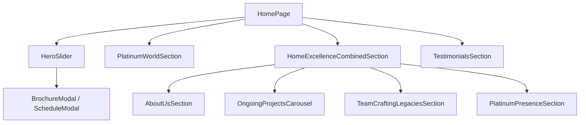
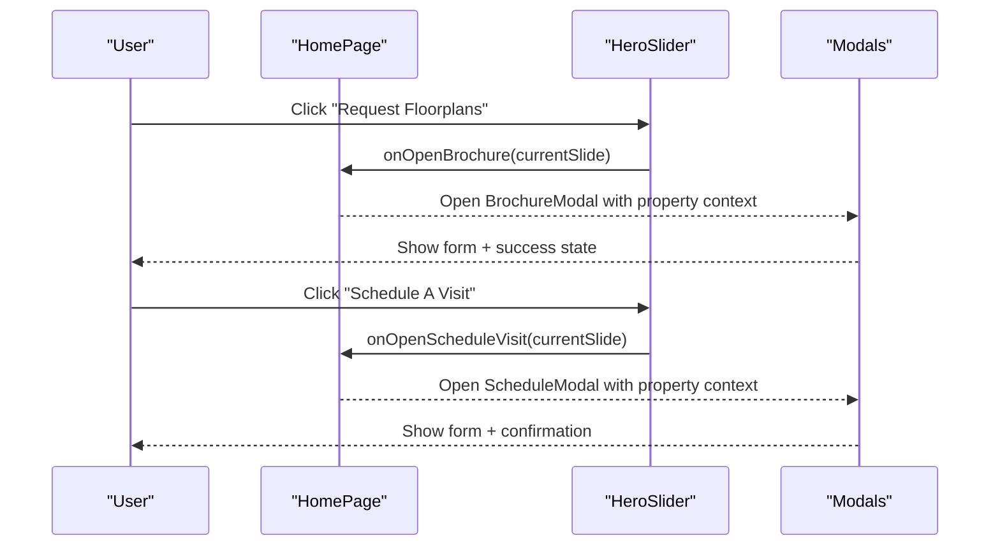
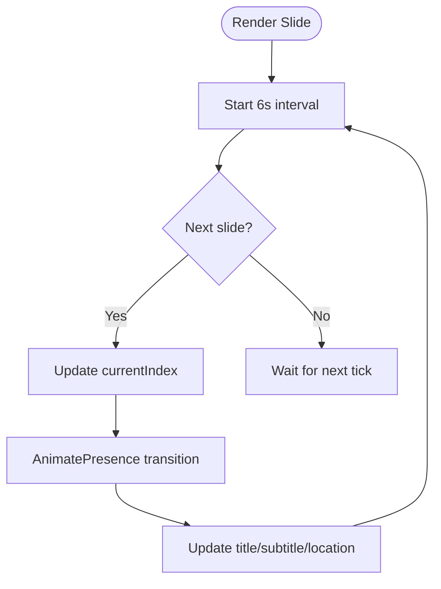
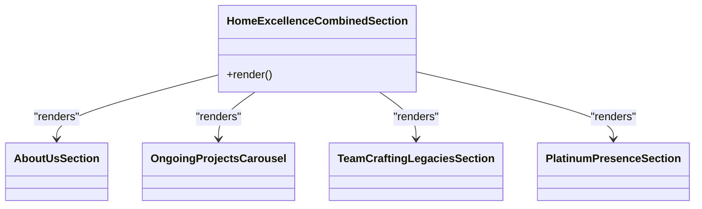
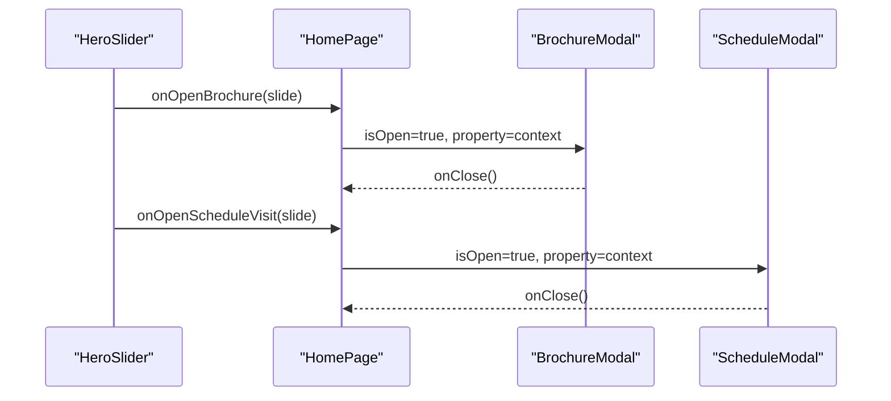
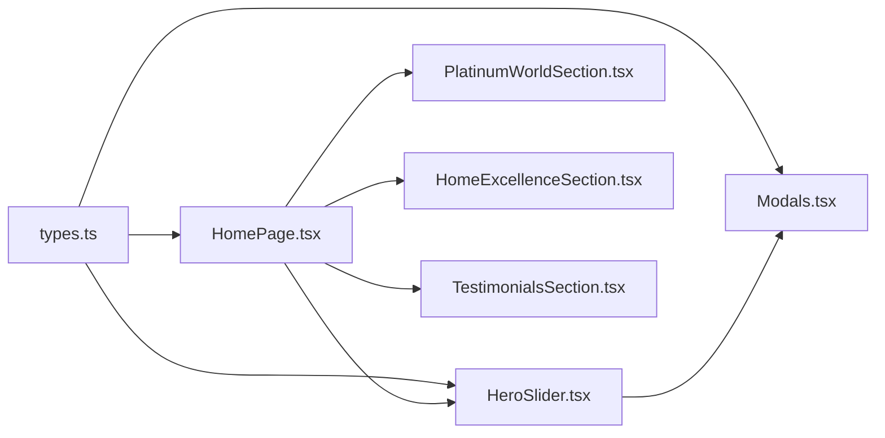

# Home Page Component

<cite>
**Referenced Files in This Document**
- [HomePage.tsx](file://src/pages/HomePage.tsx)
- [HeroSlider.tsx](file://src/components/HeroSlider.tsx)
- [PlatinumWorldSection.tsx](file://src/components/PlatinumWorldSection.tsx)
- [HomeExcellenceSection.tsx](file://src/components/HomeExcellenceSection.tsx)
- [OngoingProjectsCarousel.tsx](file://src/components/OngoingProjectsCarousel.tsx)
- [TestimonialsSection.tsx](file://src/components/TestimonialsSection.tsx)
- [Modals.tsx](file://src/components/Modals.tsx)
- [types.ts](file://src/types.ts)
</cite>

## Table of Contents
1. Introduction
2. Project Structure
3. Core Components
4. Architecture Overview
5. Detailed Component Analysis
6. Dependency Analysis
7. Performance Considerations
8. Troubleshooting Guide
9. Conclusion

## Introduction
The HomePage component is the main landing page that orchestrates multiple sections to present a cohesive, animated user experience for a real estate showcase. It composes:
- HeroSlider: A full-screen hero with auto-advancing slides and call-to-action buttons
- PlatinumWorldSection: Company highlights and milestone counters
- HomeExcellenceCombinedSection: A combined block containing About Us, Ongoing Projects carousel, Team, and Presence sections
- TestimonialsSection: Customer stories with video playback modal

It manages theme propagation, slide data handling, and event handlers for brochure requests and visit scheduling, while delegating complex interactions to child components.

## Project Structure
At a high level, the home page is a thin composition layer that wires up child components and passes shared props (theme, slide data, and callbacks). Each section encapsulates its own UI, state, and animations.

**Diagram sources**
- [HomePage.tsx:10-44](file://src/pages/HomePage.tsx#L10-L44)
- [HeroSlider.tsx:6-20](file://src/components/HeroSlider.tsx#L6-L20)
- [HomeExcellenceSection.tsx:1555-1564](file://src/components/HomeExcellenceSection.tsx#L1555-L1564)
- [Modals.tsx:12-312](file://src/components/Modals.tsx#L12-L312)

**Section sources**
- [HomePage.tsx:10-44](file://src/pages/HomePage.tsx#L10-L44)

## Core Components
- HomePage: Orchestrates layout and event wiring; uses motion.div for container animation; passes theme and slide-related props down.
- HeroSlider: Manages slide index, auto-advance timer, Ken Burns background effect, typography reveal, and CTAs that open modals or navigate to property selection.
- PlatinumWorldSection: Displays company stats with animated counters triggered by viewport visibility.
- HomeExcellenceCombinedSection: Aggregates four sub-sections in a fixed order: About Us, Ongoing Projects Carousel, Team, and Presence.
- OngoingProjectsCarousel: Auto-scrolling carousel with dot navigation and “View All” link.
- TestimonialsSection: Two-slide testimonial view with prev/next controls and a video modal overlay.

Key props surface:
- Theme management via ThemeMode prop passed through all sections.
- Slide data via HeroSlide[] passed to HeroSlider.
- Event handlers onOpenBrochure, onOpenScheduleVisit, onSelectPropertyId for cross-component interaction.

**Section sources**
- [HomePage.tsx:10-44](file://src/pages/HomePage.tsx#L10-L44)
- [HeroSlider.tsx:6-20](file://src/components/HeroSlider.tsx#L6-L20)
- [types.ts:5-13](file://src/types.ts#L5-L13)

## Architecture Overview
The page follows a composition pattern where the parent holds global state (e.g., current slide, theme) and exposes callbacks. Child components manage local state (slide index, counters, carousel position, testimonial slider). Animations are implemented using Framer Motion (motion/react), including staggered text reveals, progress bars, and presence transitions.

**Diagram sources**
- [HeroSlider.tsx:202-215](file://src/components/HeroSlider.tsx#L202-L215)
- [Modals.tsx:12-158](file://src/components/Modals.tsx#L12-L158)
- [Modals.tsx:167-312](file://src/components/Modals.tsx#L167-L312)

## Detailed Component Analysis

### HomePage
- Role: Main landing page orchestrator.
- Props:
  - theme: ThemeMode applied across sections.
  - slides: HeroSlide[] used by HeroSlider.
  - onOpenBrochure(slide): Opens brochure modal with property context.
  - onOpenScheduleVisit(slide): Opens schedule modal with property context.
  - onSelectPropertyId(id): Optional handler for property selection flow.
- Composition: Renders HeroSlider, PlatinumWorldSection, HomeExcellenceCombinedSection, and TestimonialsSection in sequence.
- Animation: Wraps content in motion.div for consistent entrance behavior.

Example usage patterns:
- Property selection flow: When a user selects a property from any section, the parent can route them to a detail page using onSelectPropertyId.
- Modal integration: The HeroSlider triggers onOpenBrochure/onOpenScheduleVisit which the parent resolves to open corresponding modals.

**Section sources**
- [HomePage.tsx:10-44](file://src/pages/HomePage.tsx#L10-L44)

### HeroSlider
- Responsibilities:
  - Manage current slide index and auto-advance every 6 seconds.
  - Render Ken Burns-style background image with crossfade transitions.
  - Display location badge, slide indicators, and CTAs.
  - Provide staggered typography reveal for title, subtitle, and metadata.
- Interactions:
  - “Schedule A Visit” calls onOpenScheduleVisit(currentSlide).
  - “Request Floorplans” calls onOpenBrochure(currentSlide).
  - Optional onSelectPropertyId(propertyId) for direct property routing.
- Animations:
  - AnimatePresence for slide transitions.
  - Staggered variants for text elements.
  - Progress bar animates width over 6 seconds per slide.

**Diagram sources**
- [HeroSlider.tsx:21-32](file://src/components/HeroSlider.tsx#L21-L32)
- [HeroSlider.tsx:92-112](file://src/components/HeroSlider.tsx#L92-L112)
- [HeroSlider.tsx:176-217](file://src/components/HeroSlider.tsx#L176-L217)
- [HeroSlider.tsx:229-246](file://src/components/HeroSlider.tsx#L229-L246)

**Section sources**
- [HeroSlider.tsx:6-20](file://src/components/HeroSlider.tsx#L6-L20)
- [HeroSlider.tsx:21-32](file://src/components/HeroSlider.tsx#L21-L32)
- [HeroSlider.tsx:92-112](file://src/components/HeroSlider.tsx#L92-L112)
- [HeroSlider.tsx:176-217](file://src/components/HeroSlider.tsx#L176-L217)
- [HeroSlider.tsx:229-246](file://src/components/HeroSlider.tsx#L229-L246)

### PlatinumWorldSection
- Responsibilities:
  - Present key milestones (years, completed area, ongoing projects, homes delivered).
  - Use animated counters that trigger when scrolled into view.
- Animations:
  - Counters animate from 0 to target value with a timed interval.
  - Fade-in and slide-up on viewport entry.

**Section sources**
- [PlatinumWorldSection.tsx:168-233](file://src/components/PlatinumWorldSection.tsx#L168-L233)
- [PlatinumWorldSection.tsx:235-304](file://src/components/PlatinumWorldSection.tsx#L235-L304)

### HomeExcellenceCombinedSection
- Responsibilities:
  - Aggregate four sections in a fixed order: About Us, Ongoing Projects Carousel, Team, Presence.
  - Ensure consistent rendering without requiring parent to manage ordering.
- Subsections:
  - AboutUsSection: Brand narrative with image bleed and decorative line.
  - OngoingProjectsCarousel: Dark-themed carousel showcasing active projects.
  - TeamCraftingLegaciesSection: Team story with imagery and copy.
  - PlatinumPresenceSection: Interactive map with project lists and location pins.

**Diagram sources**
- [HomeExcellenceSection.tsx:1555-1564](file://src/components/HomeExcellenceSection.tsx#L1555-L1564)

**Section sources**
- [HomeExcellenceSection.tsx:1555-1564](file://src/components/HomeExcellenceSection.tsx#L1555-L1564)
- [HomeExcellenceSection.tsx:1566-1633](file://src/components/HomeExcellenceSection.tsx#L1566-L1633)
- [HomeExcellenceSection.tsx:1657-1784](file://src/components/HomeExcellenceSection.tsx#L1657-L1784)
- [HomeExcellenceSection.tsx:1789-1830](file://src/components/HomeExcellenceSection.tsx#L1789-L1830)
- [HomeExcellenceSection.tsx:1835-2080](file://src/components/HomeExcellenceSection.tsx#L1835-L2080)

### OngoingProjectsCarousel
- Responsibilities:
  - Auto-rotate through project cards every ~4.2 seconds.
  - Dot-based navigation to jump to specific positions.
  - “View All Projects” navigates to the projects page.
- Data:
  - Local array of project items with title, location, and image.

**Section sources**
- [OngoingProjectsCarousel.tsx:6-57](file://src/components/OngoingProjectsCarousel.tsx#L6-L57)
- [OngoingProjectsCarousel.tsx:59-172](file://src/components/OngoingProjectsCarousel.tsx#L59-L172)

### TestimonialsSection
- Responsibilities:
  - Display two testimonials at a time with prev/next controls.
  - Provide a video modal overlay for customer stories.
- State:
  - Active video URL for modal.
  - Current index for sliding testimonials.

**Section sources**
- [TestimonialsSection.tsx:6-35](file://src/components/TestimonialsSection.tsx#L6-L35)
- [TestimonialsSection.tsx:37-186](file://src/components/TestimonialsSection.tsx#L37-L186)

### Modals (Brochure and Schedule)
- Responsibilities:
  - BrochureModal: Collects contact details and confirms dispatch; supports direct download.
  - ScheduleModal: Collects visit details and confirms appointment; shows confirmation state.
- Integration:
  - Triggered by HeroSlider callbacks; receives property context to personalize messaging.

**Diagram sources**
- [HeroSlider.tsx:202-215](file://src/components/HeroSlider.tsx#L202-L215)
- [Modals.tsx:12-158](file://src/components/Modals.tsx#L12-L158)
- [Modals.tsx:167-312](file://src/components/Modals.tsx#L167-L312)

**Section sources**
- [Modals.tsx:12-158](file://src/components/Modals.tsx#L12-L158)
- [Modals.tsx:167-312](file://src/components/Modals.tsx#L167-L312)

## Dependency Analysis
- Type contracts:
  - ThemeMode: 'dark' | 'light'
  - HeroSlide: id, title, subtitle, code, location, image, propertyId
  - Property: detailed property model used by modals
  - Form models: ScheduleVisitForm, RequestBrochureForm
- Cross-component coupling:
  - HomePage depends on all child components and provides shared props.
  - HeroSlider depends on types and triggers events handled by parent.
  - Modals depend on Property and form types to render contextual forms.

**Diagram sources**
- [types.ts:1-60](file://src/types.ts#L1-L60)
- [HomePage.tsx:1-44](file://src/pages/HomePage.tsx#L1-L44)
- [HeroSlider.tsx:1-20](file://src/components/HeroSlider.tsx#L1-L20)
- [Modals.tsx:1-3](file://src/components/Modals.tsx#L1-L3)

**Section sources**
- [types.ts:1-60](file://src/types.ts#L1-L60)

## Performance Considerations
- Auto-advance timers:
  - HeroSlider uses a 6-second interval; ensure cleanup on unmount to avoid memory leaks.
  - OngoingProjectsCarousel uses a ~4.2-second interval; also cleaned up on unmount.
- Animations:
  - Framer Motion’s AnimatePresence and staggered variants provide smooth transitions; keep durations reasonable to avoid jank.
- Image loading:
  - Large hero images benefit from lazy loading and appropriate sizing; consider adding loading states or placeholders.
- Counter animations:
  - StatCounter uses setInterval; ensure it clears properly when not in view or unmounted.

[No sources needed since this section provides general guidance]

## Troubleshooting Guide
- Slides not advancing:
  - Verify that slides.length > 0 and that the interval is set/cleared correctly.
- Modals not opening:
  - Ensure onOpenBrochure/onOpenScheduleVisit are wired in HomePage and passed to HeroSlider.
  - Confirm that property context is available when opening modals.
- Carousel stuck:
  - Check maxIndex calculation and interval dependencies; ensure proper cleanup.
- Video modal not closing:
  - Verify setActiveVideo(null) is called on close button click.

**Section sources**
- [HeroSlider.tsx:21-32](file://src/components/HeroSlider.tsx#L21-L32)
- [HeroSlider.tsx:202-215](file://src/components/HeroSlider.tsx#L202-L215)
- [OngoingProjectsCarousel.tsx:59-77](file://src/components/OngoingProjectsCarousel.tsx#L59-L77)
- [TestimonialsSection.tsx:37-55](file://src/components/TestimonialsSection.tsx#L37-L55)
- [TestimonialsSection.tsx:156-182](file://src/components/TestimonialsSection.tsx#L156-L182)

## Conclusion
The HomePage serves as a central orchestration point for a rich, animated real estate showcase. It delegates specialized responsibilities to focused components while maintaining a clean interface for theme, slide data, and user actions. The use of Framer Motion enhances interactivity and visual appeal, and the modular design allows easy extension or replacement of individual sections.

[No sources needed since this section summarizes without analyzing specific files]