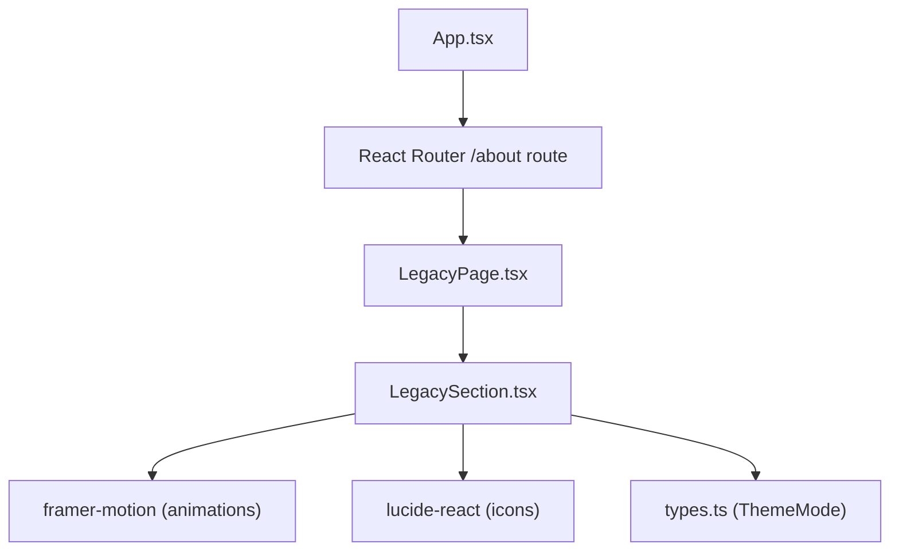
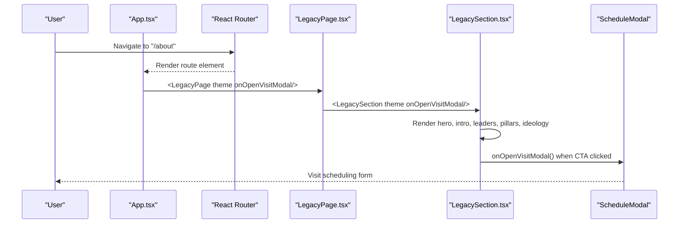
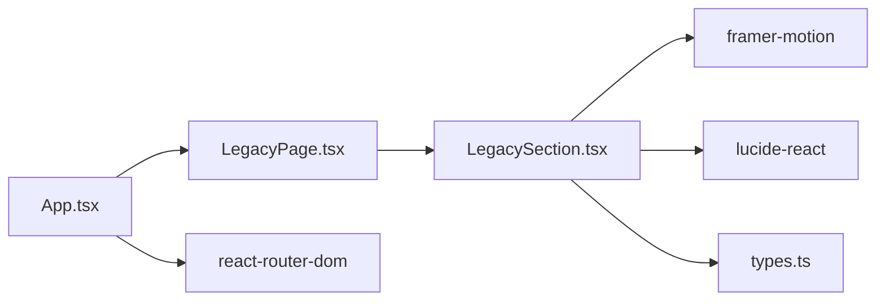

# Legacy Page Component

<cite>
**Referenced Files in This Document**
- [LegacyPage.tsx](file://src/pages/LegacyPage.tsx)
- [LegacySection.tsx](file://src/components/LegacySection.tsx)
- [App.tsx](file://src/App.tsx)
- [types.ts](file://src/types.ts)
</cite>

## Table of Contents
1. [Introduction](#introduction)
2. [Project Structure](#project-structure)
3. [Core Components](#core-components)
4. [Architecture Overview](#architecture-overview)
5. [Detailed Component Analysis](#detailed-component-analysis)
6. [Dependency Analysis](#dependency-analysis)
7. [Performance Considerations](#performance-considerations)
8. [Troubleshooting Guide](#troubleshooting-guide)
9. [Conclusion](#conclusion)

## Introduction
This document explains the LegacyPage component and its brand storytelling functionality powered by the LegacySection component. It covers how company history, leadership milestones, values, and achievements are presented through a structured, visually engaging layout with responsive design patterns. The page uses scroll-triggered animations, layered backgrounds, and consistent typography to tell a cohesive brand narrative.

## Project Structure
The Legacy experience is composed of:
- A page-level wrapper that renders the main content area and passes theme and modal triggers down.
- A comprehensive section component that contains all brand storytelling blocks: hero banner, introduction card, first-generation leaders, second-generation leaders, vision/mission/belief pillars, ideology grid, and a call-to-action footer.

**Diagram sources**
- [App.tsx:166-183](file://src/App.tsx#L166-L183)
- [LegacyPage.tsx:10-16](file://src/pages/LegacyPage.tsx#L10-L16)
- [LegacySection.tsx:1-10](file://src/components/LegacySection.tsx#L1-L10)

**Section sources**
- [App.tsx:166-183](file://src/App.tsx#L166-L183)
- [LegacyPage.tsx:10-16](file://src/pages/LegacyPage.tsx#L10-L16)

## Core Components
- LegacyPage: Minimal page shell that sets background styling and mounts LegacySection. It receives theme and an onOpenVisitModal callback for scheduling visits from the CTA.
- LegacySection: Implements the full brand story with multiple sections:
  - Hero banner with background image and gradient overlay
  - Overlapping beige intro card summarizing the group’s legacy
  - First Generation Leaders showcase
  - Second Generation Leaders showcase
  - Vision · Mission · Belief pillars
  - Ideology grid with icons and short descriptions
  - Consultation CTA footer that opens a visit modal

Key props:
- theme: optional theme mode used by parent context; not directly consumed inside this component beyond type usage
- onOpenVisitModal: optional function to open a visit scheduling modal

**Section sources**
- [LegacyPage.tsx:5-16](file://src/pages/LegacyPage.tsx#L5-L16)
- [LegacySection.tsx:6-10](file://src/components/LegacySection.tsx#L6-L10)

## Architecture Overview
The routing and data flow connect the app shell to the Legacy experience:
- App defines routes and mounts LegacyPage at /about
- LegacyPage renders LegacySection with theme and modal trigger
- LegacySection composes UI blocks and uses motion for scroll-based reveals
- Modal integration is handled via onOpenVisitModal passed from App

**Diagram sources**
- [App.tsx:166-183](file://src/App.tsx#L166-L183)
- [LegacyPage.tsx:10-16](file://src/pages/LegacyPage.tsx#L10-L16)
- [LegacySection.tsx:317-333](file://src/components/LegacySection.tsx#L317-L333)

## Detailed Component Analysis

### LegacyPage
- Purpose: Mounts the brand storytelling section within a themed main container.
- Props:
  - theme: ThemeMode for global theme context
  - onOpenVisitModal: Callback to open the schedule visit modal
- Behavior: Renders a full-width main with a warm background color and delegates all content to LegacySection.

Design notes:
- Keeps the page lightweight and focused on composition
- Delegates interactivity (modal) to parent App via callback

**Section sources**
- [LegacyPage.tsx:5-16](file://src/pages/LegacyPage.tsx#L5-L16)

### LegacySection
Structure and responsibilities:
- Hero Banner
  - Full-bleed background image with gradient overlay
  - Side label “ABOUT PLATINUM” for visual branding
  - Representative imagery disclaimer
- Intro Card
  - Overlapping beige card with headline and concise narrative about Platinum Group’s presence and future goals
- First Generation Leaders
  - Dark-themed section with background image
  - Grid of three leader cards with images, names, roles, and bios
  - Scroll-triggered fade-in animation per card
- Second Generation Leaders
  - Light-themed section continuing the narrative
  - Grid of three leader cards with department labels and bios
  - Consistent card styling and decorative corner accents
- Vision · Mission · Belief
  - Three-column cards with icons and concise statements
  - Backdrop blur and subtle borders for depth
- Ideology Grid
  - Four-column grid with icon, title, and short description per value
  - Responsive breakpoints adjust columns gracefully
- Consultation Footer
  - Dark banner with headline, subtext, and “Schedule Private Preview” button
  - Button triggers onOpenVisitModal if provided

Visual storytelling elements:
- Side labels: Vertical text aligned to screen margin for section identity
- Background layers: Images with overlays create depth and focus
- Typography hierarchy: Serif headings paired with light sans-serif body for elegance
- Iconography: Lucide icons reinforce each value or pillar
- Motion: framer-motion provides subtle entrance animations on scroll

Responsive design patterns:
- Grid layouts adapt from single column on mobile to multi-column on larger screens
- Padding and spacing scale with Tailwind responsive utilities
- Images use object-cover to maintain aspect ratios across devices
- Side labels hidden on small screens to preserve readability

Accessibility considerations:
- Descriptive alt attributes on images
- Semantic sectioning with clear headings
- Color contrast maintained between text and backgrounds

Performance considerations:
- External images loaded from CDN; consider lazy loading or optimization for production
- Animations triggered on viewport entry to reduce initial render cost

Content organization:
- Data arrays define leaders and ideology items, making content easy to update without touching markup
- Clear separation of concerns: presentation vs. data

**Section sources**
- [LegacySection.tsx:11-18](file://src/components/LegacySection.tsx#L11-L18)
- [LegacySection.tsx:20-74](file://src/components/LegacySection.tsx#L20-L74)
- [LegacySection.tsx:75-110](file://src/components/LegacySection.tsx#L75-L110)
- [LegacySection.tsx:112-172](file://src/components/LegacySection.tsx#L112-L172)
- [LegacySection.tsx:174-229](file://src/components/LegacySection.tsx#L174-L229)
- [LegacySection.tsx:231-284](file://src/components/LegacySection.tsx#L231-L284)
- [LegacySection.tsx:286-315](file://src/components/LegacySection.tsx#L286-L315)
- [LegacySection.tsx:317-333](file://src/components/LegacySection.tsx#L317-L333)

### Integration with App and Routing
- The /about route renders LegacyPage with theme and modal handler
- Navigation sync updates active tab state and scrolls to top on navigation
- Modal state is managed centrally in App and passed down to relevant components

**Section sources**
- [App.tsx:166-183](file://src/App.tsx#L166-L183)
- [App.tsx:51-85](file://src/App.tsx#L51-L85)

## Dependency Analysis
External dependencies used by the Legacy experience:
- framer-motion: Scroll-triggered animations for leader cards and other elements
- lucide-react: Icons for Vision/Mission/Belief and Ideology values
- Tailwind CSS: Utility classes for layout, spacing, colors, and responsiveness
- React Router: Route handling for /about

Internal dependencies:
- types.ts: ThemeMode type used by LegacySection props
- App.tsx: Provides routing and modal integration

**Diagram sources**
- [LegacySection.tsx:1-10](file://src/components/LegacySection.tsx#L1-L10)
- [LegacyPage.tsx:1-4](file://src/pages/LegacyPage.tsx#L1-L4)
- [App.tsx:1-13](file://src/App.tsx#L1-L13)
- [types.ts:1-3](file://src/types.ts#L1-L3)

**Section sources**
- [LegacySection.tsx:1-10](file://src/components/LegacySection.tsx#L1-L10)
- [LegacyPage.tsx:1-4](file://src/pages/LegacyPage.tsx#L1-L4)
- [App.tsx:1-13](file://src/App.tsx#L1-L13)
- [types.ts:1-3](file://src/types.ts#L1-L3)

## Performance Considerations
- Image optimization: Use optimized assets or CDNs; consider lazy loading offscreen images
- Animation efficiency: framer-motion viewport animations run only when needed; avoid excessive re-renders
- Bundle size: Only import required icons from lucide-react to minimize bundle
- Accessibility: Ensure sufficient contrast and readable font sizes across breakpoints

[No sources needed since this section provides general guidance]

## Troubleshooting Guide
Common issues and resolutions:
- Missing modal behavior: Ensure onOpenVisitModal is passed from App to LegacyPage and then to LegacySection; verify route mapping and state management in App
- Broken images: Check external image URLs and network availability; replace with local assets if necessary
- Layout shifts on mobile: Verify responsive grid classes and ensure images use object-cover to prevent overflow
- Animation not triggering: Confirm viewport detection libraries are installed and no conflicting CSS hides elements

**Section sources**
- [App.tsx:166-183](file://src/App.tsx#L166-L183)
- [LegacySection.tsx:317-333](file://src/components/LegacySection.tsx#L317-L333)

## Conclusion
The LegacyPage and LegacySection components deliver a polished, responsive brand storytelling experience. They organize company history, leadership milestones, values, and achievements into distinct sections with strong visual hierarchy and subtle motion. The modular structure makes it straightforward to update content, refine visuals, and integrate additional features such as analytics or enhanced interactivity while maintaining performance and accessibility.