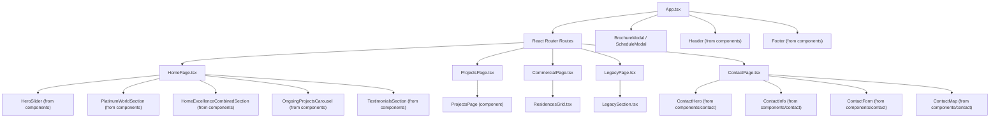
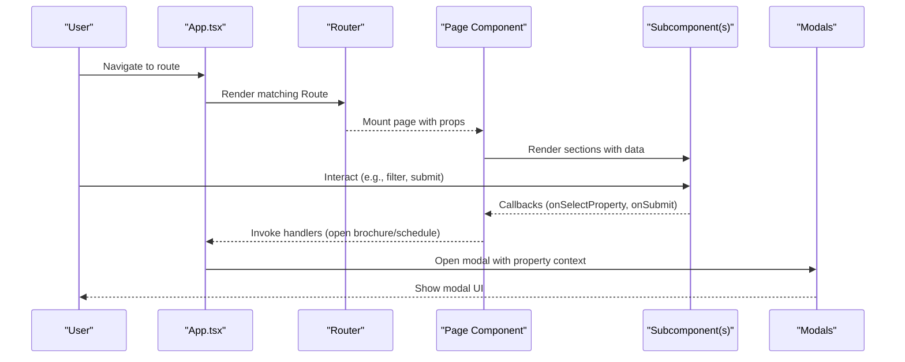
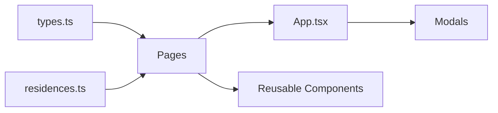

# Page Components

<cite>
**Referenced Files in This Document**
- [App.tsx](file://src/App.tsx)
- [HomePage.tsx](file://src/pages/HomePage.tsx)
- [ProjectsPage.tsx](file://src/pages/ProjectsPage.tsx)
- [CommercialPage.tsx](file://src/pages/CommercialPage.tsx)
- [LegacyPage.tsx](file://src/pages/LegacyPage.tsx)
- [ContactPage.tsx](file://src/pages/ContactPage.tsx)
- [ResidencesGrid.tsx](file://src/components/ResidencesGrid.tsx)
- [LegacySection.tsx](file://src/components/LegacySection.tsx)
- [residences.ts](file://src/data/residences.ts)
- [types.ts](file://src/types.ts)
</cite>

## Table of Contents
1. Introduction
2. Project Structure
3. Core Components
4. Architecture Overview
5. Detailed Component Analysis
6. Dependency Analysis
7. Performance Considerations
8. Troubleshooting Guide
9. Conclusion

## Introduction
This document provides comprehensive documentation for the page-level components in the N-Square application: HomePage, ProjectsPage, ContactPage, CommercialPage, and LegacyPage. It explains each page’s purpose, layout structure, data dependencies, user interactions, composition of sections, routing configuration, navigation patterns, responsive behavior, loading states, and error handling strategies. It also includes examples of page-specific functionality such as property filtering on ProjectsPage, contact form handling on ContactPage, and commercial property display on CommercialPage.

## Project Structure
The application is a React + TypeScript SPA with client-side routing via react-router-dom. Pages are defined under src/pages and composed from reusable components under src/components. Data (properties and hero slides) is centralized in src/data, and shared types are defined in src/types. The root App component wires routing, theme state, modals, and global navigation.

**Diagram sources**
- [App.tsx:106-227](file://src/App.tsx#L106-L227)
- [HomePage.tsx:25-44](file://src/pages/HomePage.tsx#L25-L44)
- [ProjectsPage.tsx:22-32](file://src/pages/ProjectsPage.tsx#L22-L32)
- [CommercialPage.tsx:20-29](file://src/pages/CommercialPage.tsx#L20-L29)
- [LegacyPage.tsx:10-14](file://src/pages/LegacyPage.tsx#L10-L14)
- [ContactPage.tsx:40-74](file://src/pages/ContactPage.tsx#L40-L74)

**Section sources**
- [App.tsx:1-255](file://src/App.tsx#L1-L255)
- [residences.ts:1-190](file://src/data/residences.ts#L1-L190)
- [types.ts:1-60](file://src/types.ts#L1-L60)

## Core Components
- Theme and Navigation State: Managed in App.tsx to apply dark/light mode and sync active tab with URL.
- Routing: React Router defines routes for home, projects, about/legacy, contact, and commercial pages.
- Global Modals: Brochure and Schedule visit modals are controlled by App state and triggered from any page.
- Shared Types: Property, HeroSlide, ThemeMode, NavTab define contracts across pages and components.

Key responsibilities:
- App.tsx orchestrates routing, theme, selected property, and modal visibility.
- Pages render content and delegate specific UI logic to subcomponents.
- Data flows from residences.ts into pages via props or direct imports.

**Section sources**
- [App.tsx:15-104](file://src/App.tsx#L15-L104)
- [App.tsx:106-227](file://src/App.tsx#L106-L227)
- [types.ts:1-60](file://src/types.ts#L1-L60)

## Architecture Overview
The application uses a top-down architecture:
- App manages global state (theme, selected property, modals) and routing.
- Each page receives necessary data and callbacks via props.
- Pages compose multiple section components that handle their own local state and rendering.
- User actions trigger callbacks that bubble up to App to open modals or navigate.

**Diagram sources**
- [App.tsx:106-227](file://src/App.tsx#L106-L227)
- [HomePage.tsx:18-44](file://src/pages/HomePage.tsx#L18-L44)
- [ProjectsPage.tsx:14-32](file://src/pages/ProjectsPage.tsx#L14-L32)
- [CommercialPage.tsx:13-29](file://src/pages/CommercialPage.tsx#L13-L29)
- [LegacyPage.tsx:10-14](file://src/pages/LegacyPage.tsx#L10-L14)
- [ContactPage.tsx:17-74](file://src/pages/ContactPage.tsx#L17-L74)

## Detailed Component Analysis

### HomePage
Purpose:
- Landing page showcasing hero slider, legacy world section, excellence highlights, ongoing projects carousel, and testimonials.

Layout structure:
- HeroSlider with slides from HERO_SLIDES.
- PlatinumWorldSection for brand storytelling.
- HomeExcellenceCombinedSection for feature highlights.
- OngoingProjectsCarousel for current projects.
- TestimonialsSection for social proof.

Data dependencies:
- Props include theme, slides (HERO_SLIDES), and callbacks for brochure, schedule visit, and selecting a property by id.
- Slides reference properties via propertyId; App resolves to actual Property objects.

User interactions:
- Opening brochure or scheduling a visit triggers App-level modals.
- Selecting a property updates the selected property used by other pages/modals.

Routing and navigation:
- Mounted at route "/" and animated with motion transitions.

Responsive behavior:
- Uses Tailwind classes for flexible layouts; sections stack vertically on smaller screens.

Loading states and error handling:
- No explicit loading/error states within HomePage; relies on parent for data readiness.

Example references:
- Composition and prop usage: [HomePage.tsx:18-44](file://src/pages/HomePage.tsx#L18-L44)
- Slide data source: [residences.ts:3-58](file://src/data/residences.ts#L3-L58)

**Section sources**
- [HomePage.tsx:1-47](file://src/pages/HomePage.tsx#L1-L47)
- [residences.ts:3-58](file://src/data/residences.ts#L3-L58)
- [App.tsx:109-138](file://src/App.tsx#L109-L138)

### ProjectsPage
Purpose:
- Displays project portfolio with filtering capabilities and actions to view details, request brochures, or schedule visits.

Layout structure:
- Wraps a ProjectsPage component from components that handles tabs and cards.
- Provides initialFilter to control default tab (ongoing/completed/upcoming).

Data dependencies:
- Receives properties array from App (PROPERTIES) and passes them down.
- Uses onSelectProperty, onRequestBrochure, onScheduleVisit callbacks to interact with App.

User interactions:
- Filtering by category via tabs.
- Clicking “View Details” selects a property and navigates back to residences.
- Request brochure or schedule visit opens corresponding modals.

Routing and navigation:
- Mounted at "/projects".
- On selection, navigates to "/" (residences) after setting selected property.

Responsive behavior:
- Grid adapts from single column to multi-column based on screen size.

Loading states and error handling:
- No explicit loading/error states in page wrapper; internal component may manage its own.

Example references:
- Page wrapper and props: [ProjectsPage.tsx:5-32](file://src/pages/ProjectsPage.tsx#L5-L32)
- Route configuration and filter handling: [App.tsx:140-164](file://src/App.tsx#L140-L164)

Note:
- The internal ProjectsPage component file contains extensive commented code and alternative implementations. The active implementation is delegated to a component export referenced by the page wrapper.

**Section sources**
- [ProjectsPage.tsx:1-35](file://src/pages/ProjectsPage.tsx#L1-L35)
- [App.tsx:140-164](file://src/App.tsx#L140-L164)

### ContactPage
Purpose:
- Provides contact information, an interactive form, and a map location.

Layout structure:
- ContactHero banner.
- Two-column layout on large screens: ContactInfo on left, ContactForm on right.
- ContactMap at the bottom.

Data dependencies:
- Local state holds form fields (name, email, phone, project, message).
- Form submission toggates submitting and success states.

User interactions:
- Field changes update local state.
- Submit simulates async submission and shows success feedback.
- Reset clears form and resets submitted state.

Routing and navigation:
- Mounted at "/contact".

Responsive behavior:
- Single column on mobile; two columns on lg+ with a decorative divider.

Loading states and error handling:
- Simulated async submission using setTimeout; no real network calls.
- Success state shown after submission; reset available.

Example references:
- Form state and handlers: [ContactPage.tsx:5-38](file://src/pages/ContactPage.tsx#L5-L38)
- Layout and subcomponents: [ContactPage.tsx:40-74](file://src/pages/ContactPage.tsx#L40-L74)

**Section sources**
- [ContactPage.tsx:1-77](file://src/pages/ContactPage.tsx#L1-L77)

### CommercialPage
Purpose:
- Displays commercial properties using a grid with filters and actions.

Layout structure:
- ResidencesGrid component renders property cards with type-based filtering.

Data dependencies:
- Properties filtered by type === 'Commercial' passed from App.
- Callbacks for selecting property, requesting brochure, and scheduling visit.

User interactions:
- Filter buttons toggle between All, Villa, Penthouse, Residential, Commercial.
- Cards expose actions to select property or request brochure.

Routing and navigation:
- Mounted at "/commercial".
- Selecting a property navigates back to residences and sets selected property.

Responsive behavior:
- Grid switches from one to two columns on medium+ screens.

Loading states and error handling:
- No explicit loading/error states; relies on provided data.

Example references:
- Page wrapper and props: [CommercialPage.tsx:5-29](file://src/pages/CommercialPage.tsx#L5-L29)
- Route configuration and data filtering: [App.tsx:201-224](file://src/App.tsx#L201-L224)
- ResidencesGrid filter logic: [ResidencesGrid.tsx:20-57](file://src/components/ResidencesGrid.tsx#L20-L57)

**Section sources**
- [CommercialPage.tsx:1-32](file://src/pages/CommercialPage.tsx#L1-L32)
- [ResidencesGrid.tsx:1-151](file://src/components/ResidencesGrid.tsx#L1-L151)
- [App.tsx:201-224](file://src/App.tsx#L201-L224)

### LegacyPage
Purpose:
- Presents company history, leadership, vision/mission/belief, and ideology.

Layout structure:
- LegacySection component with hero banner, overlapping intro card, first and second generation leader profiles, and value pillars.

Data dependencies:
- Receives theme and callback to open visit modal.

User interactions:
- “Schedule Private Preview” button triggers visit modal via callback.

Routing and navigation:
- Mounted at "/about" (also mapped to "/legacy" in navigation sync).

Responsive behavior:
- Sections use responsive grids and typography scaling.

Loading states and error handling:
- No explicit loading/error states; static content.

Example references:
- Page wrapper and props: [LegacyPage.tsx:5-14](file://src/pages/LegacyPage.tsx#L5-L14)
- Section content and modal trigger: [LegacySection.tsx:20-337](file://src/components/LegacySection.tsx#L20-L337)
- Route mapping: [App.tsx:166-183](file://src/App.tsx#L166-L183)

**Section sources**
- [LegacyPage.tsx:1-17](file://src/pages/LegacyPage.tsx#L1-L17)
- [LegacySection.tsx:1-337](file://src/components/LegacySection.tsx#L1-L337)
- [App.tsx:166-183](file://src/App.tsx#L166-L183)

## Dependency Analysis
Pages depend on shared types and data:
- Types: ThemeMode, NavTab, Property, HeroSlide define contracts.
- Data: PROPERTIES and HERO_SLIDES provide content for pages.
- App coordinates routing and passes data/callbacks to pages.

**Diagram sources**
- [types.ts:1-60](file://src/types.ts#L1-L60)
- [residences.ts:1-190](file://src/data/residences.ts#L1-L190)
- [App.tsx:1-255](file://src/App.tsx#L1-L255)

**Section sources**
- [types.ts:1-60](file://src/types.ts#L1-L60)
- [residences.ts:1-190](file://src/data/residences.ts#L1-L190)
- [App.tsx:1-255](file://src/App.tsx#L1-L255)

## Performance Considerations
- Rendering efficiency: Pages pass minimal props and rely on subcomponents for local state, reducing re-renders in parent.
- Animations: Motion transitions are applied at route level for smooth page entry/exit without heavy per-page overhead.
- Image optimization: Images are loaded from external URLs; consider lazy-loading or responsive image formats for production.
- Filtering: Client-side filtering in ResidencesGrid is efficient for small datasets; for larger datasets, consider server-side filtering or memoization.

[No sources needed since this section provides general guidance]

## Troubleshooting Guide
Common issues and resolutions:
- Modal not opening: Ensure the correct callback is wired in App and invoked by the page/component. Check that the property context is set before opening.
- Incorrect property selection: Verify propertyId mapping from slides or cards to PROPERTIES in App handlers.
- Form submission feedback: ContactPage simulates submission; ensure UI reflects submitting and submitted states appropriately.
- Navigation sync: Active tab synchronization depends on pathname; confirm routes match expected paths.

Error handling strategies:
- Pages do not implement explicit error boundaries; consider adding error boundaries around critical sections for resilience.
- For asynchronous operations (e.g., future backend integrations), add loading and error states to provide user feedback.

**Section sources**
- [App.tsx:39-45](file://src/App.tsx#L39-L45)
- [App.tsx:109-138](file://src/App.tsx#L109-L138)
- [ContactPage.tsx:26-38](file://src/pages/ContactPage.tsx#L26-L38)

## Conclusion
The N-Square application organizes page-level components with clear separation of concerns: App manages routing and global state, pages compose focused sections, and reusable components encapsulate UI logic. Each page demonstrates responsive design, consistent interaction patterns, and integration with shared data and modals. Future enhancements can include robust error handling, performance optimizations for large datasets, and richer analytics for user interactions.

[No sources needed since this section summarizes without analyzing specific files]