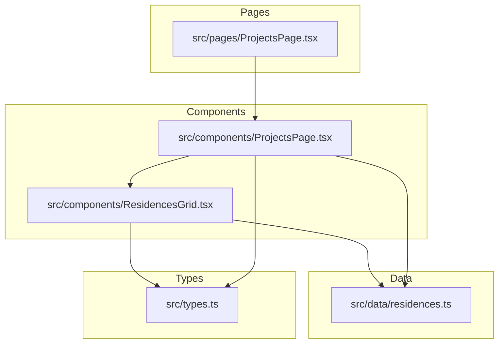
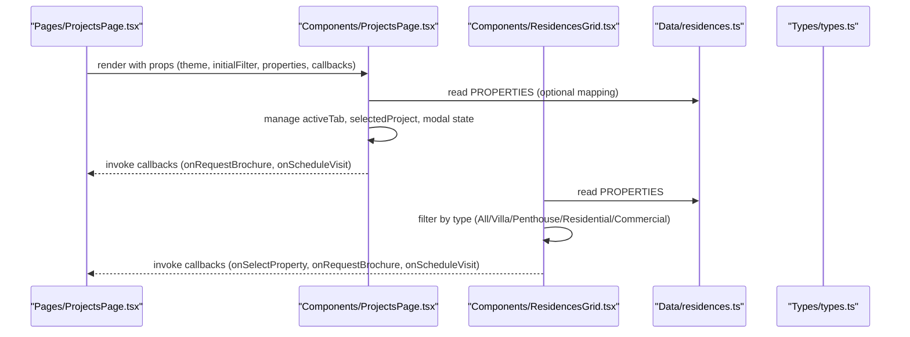
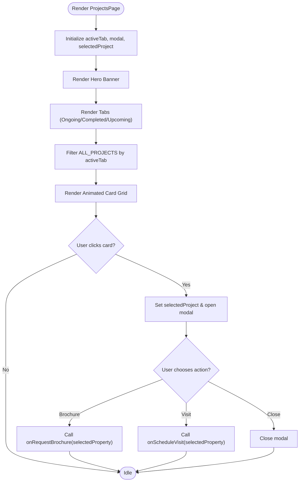
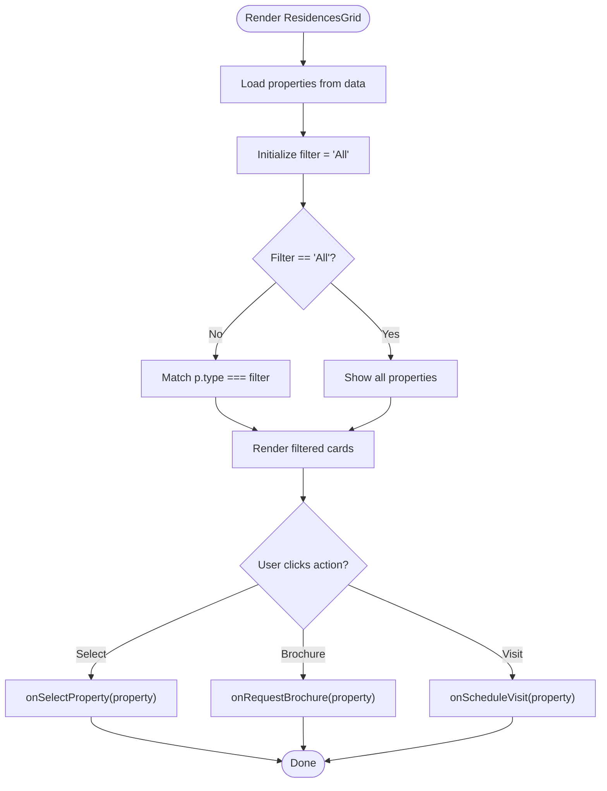
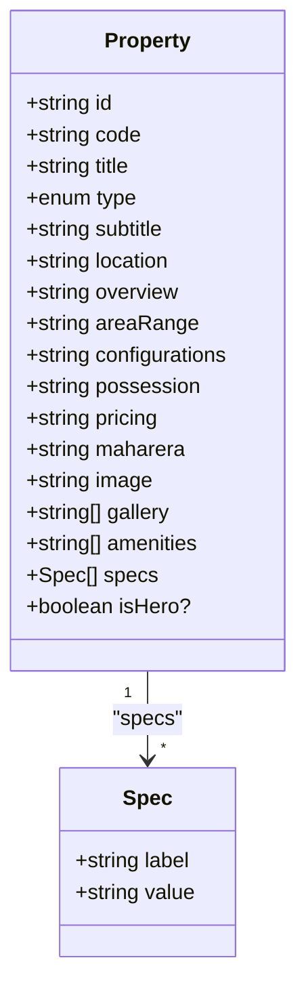
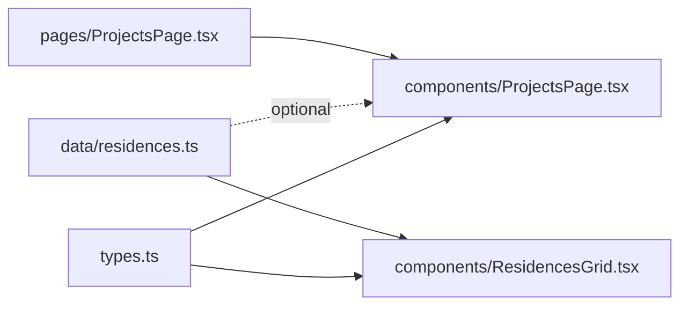

# Projects Page Component

<cite>
**Referenced Files in This Document**
- [ProjectsPage.tsx](file://src/components/ProjectsPage.tsx)
- [ProjectsPage (page wrapper).tsx](file://src/pages/ProjectsPage.tsx)
- [ResidencesGrid.tsx](file://src/components/ResidencesGrid.tsx)
- [residences.ts](file://src/data/residences.ts)
- [types.ts](file://src/types.ts)
</cite>

## Table of Contents
1. [Introduction](#introduction)
2. [Project Structure](#project-structure)
3. [Core Components](#core-components)
4. [Architecture Overview](#architecture-overview)
5. [Detailed Component Analysis](#detailed-component-analysis)
6. [Dependency Analysis](#dependency-analysis)
7. [Performance Considerations](#performance-considerations)
8. [Troubleshooting Guide](#troubleshooting-guide)
9. [Conclusion](#conclusion)

## Introduction
This document explains the ProjectsPage component and its integration with the ResidencesGrid, focusing on:
- Property grid layout and responsive design
- Filtering by property types (Residential, Commercial, Penthouse, Villa)
- Search functionality overview
- Data flow from residences.ts into components
- State management for filters and search queries
- User interaction handling (selection, brochure request, visit scheduling)
- Examples of filtering logic and mobile-responsive behavior

## Project Structure
The project uses a layered structure:
- Pages layer wraps route-level components and passes props down
- Components layer contains reusable UI (ProjectsPage, ResidencesGrid)
- Data layer centralizes property data and hero slides
- Types define shared interfaces used across components

**Diagram sources**
- [ProjectsPage (page wrapper).tsx:1-35](file://src/pages/ProjectsPage.tsx#L1-L35)
- [ProjectsPage.tsx:918-1346](file://src/components/ProjectsPage.tsx#L918-L1346)
- [ResidencesGrid.tsx:1-151](file://src/components/ResidencesGrid.tsx#L1-L151)
- [residences.ts:1-190](file://src/data/residences.ts#L1-L190)
- [types.ts:1-60](file://src/types.ts#L1-L60)

**Section sources**
- [ProjectsPage (page wrapper).tsx:1-35](file://src/pages/ProjectsPage.tsx#L1-L35)
- [ProjectsPage.tsx:918-1346](file://src/components/ProjectsPage.tsx#L918-L1346)
- [ResidencesGrid.tsx:1-151](file://src/components/ResidencesGrid.tsx#L1-L151)
- [residences.ts:1-190](file://src/data/residences.ts#L1-L190)
- [types.ts:1-60](file://src/types.ts#L1-L60)

## Core Components
- ProjectsPage (component): Renders a hero banner, tabbed navigation for ongoing/completed/upcoming projects, animated card grid, and a modal for brochure/visit actions. It manages local state for active tab, selected project, and modal visibility.
- ResidencesGrid: Renders a signature portfolio grid with type-based filters (All, Villa, Penthouse, Residential, Commercial), property cards with specs, and action buttons to select property, request brochure, or schedule visit.
- Data (residences.ts): Exports HERO_SLIDES and PROPERTIES arrays with typed fields for titles, locations, pricing, amenities, and more.
- Types (types.ts): Defines shared interfaces like Property, HeroSlide, ThemeMode, and form shapes.

Key responsibilities:
- ProjectsPage: Tab filtering by project status; modal interactions; bridges to parent via callbacks
- ResidencesGrid: Type filtering; responsive grid; user actions delegated to parent via callbacks

**Section sources**
- [ProjectsPage.tsx:918-1346](file://src/components/ProjectsPage.tsx#L918-L1346)
- [ResidencesGrid.tsx:1-151](file://src/components/ResidencesGrid.tsx#L1-L151)
- [residences.ts:1-190](file://src/data/residences.ts#L1-L190)
- [types.ts:1-60](file://src/types.ts#L1-L60)

## Architecture Overview
High-level flow:
- The page wrapper mounts the component and passes theme, initialFilter, properties, and callbacks
- ProjectsPage renders tabs and an animated grid of project cards
- ResidencesGrid provides a separate portfolio view with type filters and property cards
- Both components consume data from residences.ts and rely on types.ts for shape validation
- User actions trigger callbacks passed from the page wrapper (e.g., onSelectProperty, onRequestBrochure, onScheduleVisit)

**Diagram sources**
- [ProjectsPage (page wrapper).tsx:1-35](file://src/pages/ProjectsPage.tsx#L1-L35)
- [ProjectsPage.tsx:918-1346](file://src/components/ProjectsPage.tsx#L918-L1346)
- [ResidencesGrid.tsx:1-151](file://src/components/ResidencesGrid.tsx#L1-L151)
- [residences.ts:1-190](file://src/data/residences.ts#L1-L190)
- [types.ts:1-60](file://src/types.ts#L1-L60)

## Detailed Component Analysis

### ProjectsPage Component
- Purpose: Displays a curated list of projects grouped by status (ongoing, completed, upcoming) with a hero banner and animated transitions. Includes a modal for brochure requests and visit scheduling.
- State:
  - activeTab: controls which category is shown
  - isModalOpen: controls modal visibility
  - selectedProject: tracks the currently selected project for modal context
- Filtering:
  - Filters ALL_PROJECTS by activeTab to show only matching projects
- Interactions:
  - Clicking a project opens the modal
  - Modal actions call back to parent via provided callbacks
- Layout:
  - Hero section with background image and overlay
  - Tab navigation with visual indicators
  - Responsive grid using Tailwind classes
  - AnimatePresence for smooth transitions between tabs

**Diagram sources**
- [ProjectsPage.tsx:1187-1346](file://src/components/ProjectsPage.tsx#L1187-L1346)

**Section sources**
- [ProjectsPage.tsx:918-1346](file://src/components/ProjectsPage.tsx#L918-L1346)

### ResidencesGrid Component
- Purpose: Presents a “Signature Portfolio” grid of properties with type-based filtering and detailed cards.
- State:
  - filter: current type filter (All, Villa, Penthouse, Residential, Commercial)
- Filtering Logic:
  - If filter is All, show all properties
  - Otherwise, show properties where p.type equals the selected filter
- Layout:
  - Header with title and horizontally scrollable filter pills
  - Responsive grid: single column on small screens, two columns on medium+
  - Cards include image, code/type badges, location, overview, specs summary, and action buttons
- Interactions:
  - onSelectProperty: navigate to feature showcase
  - onRequestBrochure: request brochure for the property
  - onScheduleVisit: schedule a visit (if provided)

**Diagram sources**
- [ResidencesGrid.tsx:13-151](file://src/components/ResidencesGrid.tsx#L13-L151)

**Section sources**
- [ResidencesGrid.tsx:1-151](file://src/components/ResidencesGrid.tsx#L1-L151)

### Data Model and Types
- Property interface defines the shape of each property including id, code, title, type, subtitle, location, overview, areaRange, configurations, possession, pricing, maharera, image, gallery, amenities, specs, and optional isHero flag.
- HeroSlide defines slide metadata linked to a propertyId.
- PROPERTIES array includes four distinct properties covering all supported types: Villa, Penthouse, Commercial, Residential.

**Diagram sources**
- [types.ts:20-41](file://src/types.ts#L20-L41)

**Section sources**
- [types.ts:1-60](file://src/types.ts#L1-L60)
- [residences.ts:60-189](file://src/data/residences.ts#L60-L189)

## Dependency Analysis
- ProjectsPage depends on:
  - types.ts for Property and ThemeMode
  - Optional access to PROPERTIES for mapping project cards to full property details when needed
  - Internal state for tabs and modal
- ResidencesGrid depends on:
  - types.ts for Property and ThemeMode
  - data/residences.ts for PROPERTIES
- Page wrapper depends on:
  - components/ProjectsPage.tsx to render content
  - passes callbacks up to higher-level routing or app state

**Diagram sources**
- [types.ts:1-60](file://src/types.ts#L1-L60)
- [residences.ts:1-190](file://src/data/residences.ts#L1-L190)
- [ProjectsPage.tsx:918-1346](file://src/components/ProjectsPage.tsx#L918-L1346)
- [ResidencesGrid.tsx:1-151](file://src/components/ResidencesGrid.tsx#L1-L151)
- [ProjectsPage (page wrapper).tsx:1-35](file://src/pages/ProjectsPage.tsx#L1-L35)

**Section sources**
- [ProjectsPage (page wrapper).tsx:1-35](file://src/pages/ProjectsPage.tsx#L1-L35)
- [ProjectsPage.tsx:918-1346](file://src/components/ProjectsPage.tsx#L918-L1346)
- [ResidencesGrid.tsx:1-151](file://src/components/ResidencesGrid.tsx#L1-L151)
- [residences.ts:1-190](file://src/data/residences.ts#L1-L190)
- [types.ts:1-60](file://src/types.ts#L1-L60)

## Performance Considerations
- Filtering is performed in-memory on small datasets; acceptable for current size. For larger datasets, consider memoization or server-side filtering.
- Use of AnimatePresence adds animation overhead; ensure animations are lightweight and avoid excessive re-renders.
- Images are loaded from external URLs; consider lazy loading or responsive image sizes if performance becomes critical.
- Avoid unnecessary re-renders by keeping filter state minimal and stable.

[No sources needed since this section provides general guidance]

## Troubleshooting Guide
Common issues and resolutions:
- No properties displayed in ResidencesGrid:
  - Ensure PROPERTIES array is correctly imported and not empty
  - Verify filter state is set to a valid value; default is 'All'
- Type filter not working:
  - Confirm that property.type values match filter options exactly ('Residential', 'Commercial', 'Penthouse', 'Villa')
- Modal does not close:
  - Check that onClose callback is invoked on background click or close button
- Callbacks not firing:
  - Ensure page wrapper passes onRequestBrochure and onScheduleVisit to both components
  - Validate that onSelectProperty is wired to navigate or open detail views

**Section sources**
- [ResidencesGrid.tsx:20-57](file://src/components/ResidencesGrid.tsx#L20-L57)
- [ProjectsPage.tsx:1120-1182](file://src/components/ProjectsPage.tsx#L1120-L1182)
- [ProjectsPage.tsx:1187-1346](file://src/components/ProjectsPage.tsx#L1187-L1346)

## Conclusion
The ProjectsPage component provides a polished, animated presentation of projects with tab-based filtering and a modal-driven workflow for brochure requests and visit scheduling. The ResidencesGrid complements it with a robust, type-filtered portfolio grid and responsive design. Together, they offer a clear, accessible experience for browsing and engaging with property offerings.

[No sources needed since this section summarizes without analyzing specific files]