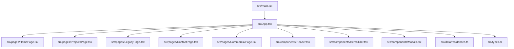
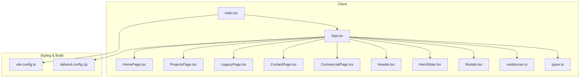
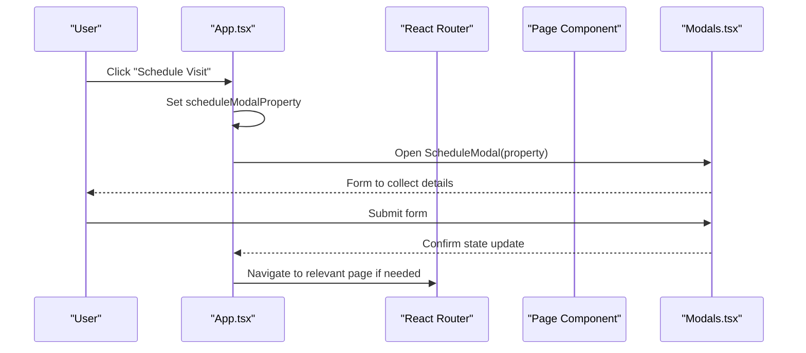
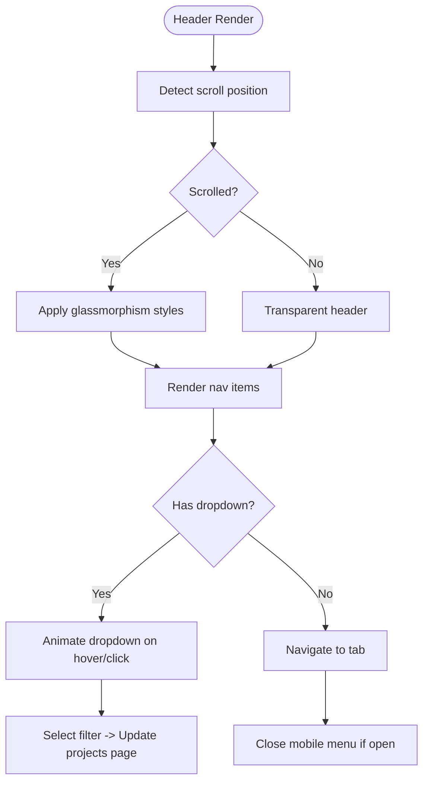
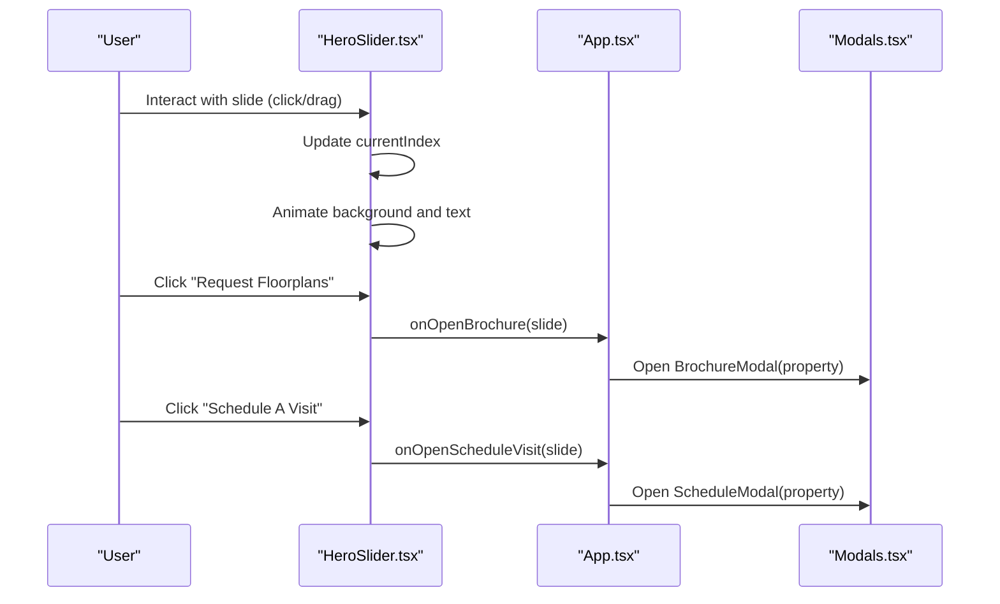
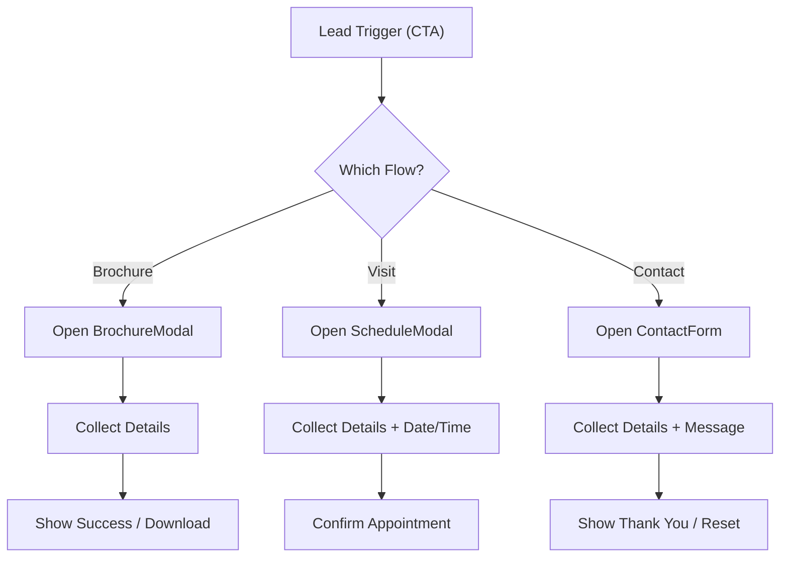
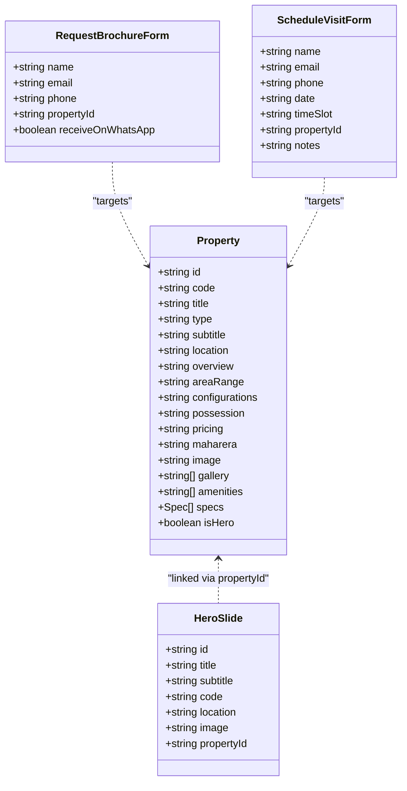
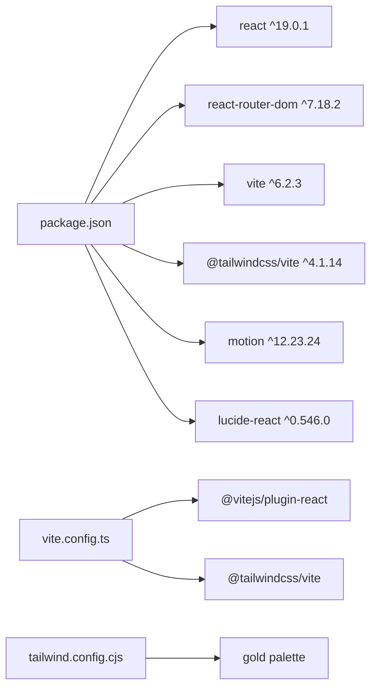

# Project Overview

<cite>
**Referenced Files in This Document**
- [README.md](file://README.md)
- [package.json](file://package.json)
- [vite.config.ts](file://vite.config.ts)
- [tailwind.config.cjs](file://tailwind.config.cjs)
- [src/main.tsx](file://src/main.tsx)
- [src/App.tsx](file://src/App.tsx)
- [src/types.ts](file://src/types.ts)
- [src/data/residences.ts](file://src/data/residences.ts)
- [src/components/Header.tsx](file://src/components/Header.tsx)
- [src/components/HeroSlider.tsx](file://src/components/HeroSlider.tsx)
- [src/components/Modals.tsx](file://src/components/Modals.tsx)
- [src/pages/HomePage.tsx](file://src/pages/HomePage.tsx)
- [src/components/contact/ContactForm.tsx](file://src/components/contact/ContactForm.tsx)
</cite>

## Table of Contents
1. Introduction
2. Project Structure
3. Core Components
4. Architecture Overview
5. Detailed Component Analysis
6. Dependency Analysis
7. Performance Considerations
8. Troubleshooting Guide
9. Conclusion

## Introduction
N-Square is a luxury real estate showcase platform designed to present premium residential and commercial properties with an elegant, responsive user experience. The application emphasizes property showcase, lead generation, and responsive design across devices. It leverages modern web technologies to deliver smooth animations, accessible navigation, and conversion-focused interactions such as brochure requests and scheduled visits.

Key objectives:
- Property showcase: High-impact hero visuals, detailed project pages, and rich media galleries.
- Lead generation: Integrated forms for brochure requests and visit scheduling to capture qualified leads.
- Responsive design: Fluid layouts and adaptive UI components that work seamlessly on mobile, tablet, and desktop.

Conceptual overview for beginners:
- A real estate website helps potential buyers explore properties, learn about amenities, and contact the sales team. N-Square focuses on a premium visual experience while making it easy for users to request information or book site visits.

Technical overview for experienced developers:
- Built with React 19, TypeScript, and Vite for fast development and optimized builds.
- Styling via Tailwind CSS v4 with custom gold color tokens.
- Animations powered by Framer Motion (motion/react).
- Client-side routing with React Router.
- Modular component architecture with clear separation of concerns between pages, shared components, and data models.

**Section sources**
- [README.md:1-16](file://README.md#L1-L16)
- [package.json:1-38](file://package.json#L1-L38)

## Project Structure
The project follows a feature-oriented structure:
- src/pages: Top-level page components (Home, Projects, About/Legacy, Contact, Commercial).
- src/components: Reusable UI elements (Header, HeroSlider, Modals, sections like PlatinumWorldSection, TestimonialsSection).
- src/data: Static content for properties and hero slides.
- src/types.ts: Shared TypeScript interfaces for properties, forms, and theme/navigation states.
- Root configuration files: vite.config.ts, tailwind.config.cjs, package.json, index.html.

**Diagram sources**
- [src/main.tsx:1-14](file://src/main.tsx#L1-L14)
- [src/App.tsx:1-255](file://src/App.tsx#L1-L255)
- [src/pages/HomePage.tsx:1-47](file://src/pages/HomePage.tsx#L1-L47)
- [src/components/Header.tsx:1-328](file://src/components/Header.tsx#L1-L328)
- [src/components/HeroSlider.tsx:1-251](file://src/components/HeroSlider.tsx#L1-L251)
- [src/components/Modals.tsx:1-312](file://src/components/Modals.tsx#L1-L312)
- [src/data/residences.ts:1-190](file://src/data/residences.ts#L1-L190)
- [src/types.ts:1-60](file://src/types.ts#L1-L60)

**Section sources**
- [src/main.tsx:1-14](file://src/main.tsx#L1-L14)
- [src/App.tsx:1-255](file://src/App.tsx#L1-L255)
- [src/data/residences.ts:1-190](file://src/data/residences.ts#L1-L190)
- [src/types.ts:1-60](file://src/types.ts#L1-L60)

## Core Components
- App: Central orchestrator managing theme, active navigation tab, selected property, modals, and route transitions. It wires up pages and global state for brochure and schedule visit flows.
- Header: Fixed navigation with dropdown filters for projects, theme toggle, and call-to-action for scheduling visits. Includes responsive mobile menu.
- HeroSlider: Full-screen carousel showcasing property highlights with animated typography, Ken Burns background effects, and CTAs for brochure and visit scheduling.
- Modals: BrochureModal and ScheduleModal handle lead generation forms with confirmation states and accessibility considerations.
- HomePage: Composes HeroSlider and key sections (Platinum World, Excellence, Ongoing Projects Carousel, Testimonials).
- ContactForm: Structured form for inquiries with validation, submission feedback, and reset behavior.

Practical examples:
- Property showcase: Users interact with the HeroSlider to view high-quality images and titles; clicking “Request Floorplans” opens the BrochureModal to capture lead details.
- Lead generation: The ScheduleVisit flow collects name, email, phone, preferred date/time, and property context, then confirms the appointment visually.
- Responsive design: Header collapses into a mobile menu; HeroSlider adapts typography and controls for smaller screens.

**Section sources**
- [src/App.tsx:15-255](file://src/App.tsx#L15-L255)
- [src/components/Header.tsx:1-328](file://src/components/Header.tsx#L1-L328)
- [src/components/HeroSlider.tsx:1-251](file://src/components/HeroSlider.tsx#L1-L251)
- [src/components/Modals.tsx:1-312](file://src/components/Modals.tsx#L1-L312)
- [src/pages/HomePage.tsx:1-47](file://src/pages/HomePage.tsx#L1-L47)
- [src/components/contact/ContactForm.tsx:1-146](file://src/components/contact/ContactForm.tsx#L1-L146)

## Architecture Overview
The application uses a client-side SPA architecture:
- Entry point mounts React with StrictMode and BrowserRouter.
- App manages global state (theme, active tab, selected property) and routes to pages using React Router.
- Pages compose reusable components and pass callbacks for lead generation actions.
- Data layer provides static property and slide content consumed by components.
- Styling and theming are handled via Tailwind CSS with custom tokens and dark/light mode toggles.

**Diagram sources**
- [src/main.tsx:1-14](file://src/main.tsx#L1-L14)
- [src/App.tsx:1-255](file://src/App.tsx#L1-L255)
- [src/pages/HomePage.tsx:1-47](file://src/pages/HomePage.tsx#L1-L47)
- [src/components/Header.tsx:1-328](file://src/components/Header.tsx#L1-L328)
- [src/components/HeroSlider.tsx:1-251](file://src/components/HeroSlider.tsx#L1-L251)
- [src/components/Modals.tsx:1-312](file://src/components/Modals.tsx#L1-L312)
- [src/data/residences.ts:1-190](file://src/data/residences.ts#L1-L190)
- [src/types.ts:1-60](file://src/types.ts#L1-L60)
- [vite.config.ts:1-22](file://vite.config.ts#L1-L22)
- [tailwind.config.cjs:1-15](file://tailwind.config.cjs#L1-L15)

## Detailed Component Analysis

### App Orchestrator
Responsibilities:
- Theme management: Applies dark/light classes to document and body.
- Navigation sync: Updates active tab based on URL path and navigates to appropriate routes.
- State coordination: Tracks selected property and modal visibility for brochure and schedule visit flows.
- Route rendering: Uses AnimatePresence for smooth transitions between views.

**Diagram sources**
- [src/App.tsx:15-255](file://src/App.tsx#L15-L255)
- [src/components/Modals.tsx:1-312](file://src/components/Modals.tsx#L1-L312)

**Section sources**
- [src/App.tsx:15-255](file://src/App.tsx#L1-L255)

### Header and Navigation
Features:
- Desktop and mobile navigation with dropdown filters for ongoing/completed/upcoming projects.
- Theme toggle with animated switcher.
- Call-to-action button to open schedule visit modal.
- Scroll-aware styling for fixed header with backdrop blur.

**Diagram sources**
- [src/components/Header.tsx:1-328](file://src/components/Header.tsx#L1-L328)

**Section sources**
- [src/components/Header.tsx:1-328](file://src/components/Header.tsx#L1-L328)

### HeroSlider and Property Showcase
Highlights:
- Auto-advancing carousel with Ken Burns effect and crossfade transitions.
- Staggered typography reveal for titles and subtitles.
- Location badge and diamond indicators for slide navigation.
- CTAs to open brochure and schedule visit modals.

**Diagram sources**
- [src/components/HeroSlider.tsx:1-251](file://src/components/HeroSlider.tsx#L1-L251)
- [src/App.tsx:15-255](file://src/App.tsx#L1-L255)
- [src/components/Modals.tsx:1-312](file://src/components/Modals.tsx#L1-L312)

**Section sources**
- [src/components/HeroSlider.tsx:1-251](file://src/components/HeroSlider.tsx#L1-L251)

### Lead Generation Flows
- BrochureModal: Captures name, email, phone, WhatsApp preference; shows success state and direct download option.
- ScheduleModal: Captures name, email, phone, preferred date/time slot; confirms appointment visually.
- ContactForm: Handles general inquiries with project selection and message fields; shows success state and reset option.

**Diagram sources**
- [src/components/Modals.tsx:1-312](file://src/components/Modals.tsx#L1-L312)
- [src/components/contact/ContactForm.tsx:1-146](file://src/components/contact/ContactForm.tsx#L1-L146)

**Section sources**
- [src/components/Modals.tsx:1-312](file://src/components/Modals.tsx#L1-L312)
- [src/components/contact/ContactForm.tsx:1-146](file://src/components/contact/ContactForm.tsx#L1-L146)

### Data Models and Types
Core types define the shape of properties, hero slides, and forms used throughout the app:
- Property: Encapsulates title, type, location, pricing, specs, amenities, gallery, and marketing metadata.
- HeroSlide: Represents hero banner content linked to a property.
- Forms: RequestBrochureForm and ScheduleVisitForm standardize lead capture inputs.

**Diagram sources**
- [src/types.ts:1-60](file://src/types.ts#L1-L60)
- [src/data/residences.ts:1-190](file://src/data/residences.ts#L1-L190)

**Section sources**
- [src/types.ts:1-60](file://src/types.ts#L1-L60)
- [src/data/residences.ts:1-190](file://src/data/residences.ts#L1-L190)

## Dependency Analysis
Technology stack and build configuration:
- React 19 and React DOM for UI rendering.
- React Router for client-side routing.
- Vite for fast dev server and optimized builds with HMR control via environment variables.
- Tailwind CSS v4 with custom gold color palette for luxury branding.
- Framer Motion (motion/react) for animations and transitions.
- Lucide icons for consistent iconography.

**Diagram sources**
- [package.json:1-38](file://package.json#L1-L38)
- [vite.config.ts:1-22](file://vite.config.ts#L1-L22)
- [tailwind.config.cjs:1-15](file://tailwind.config.cjs#L1-L15)

**Section sources**
- [package.json:1-38](file://package.json#L1-L38)
- [vite.config.ts:1-22](file://vite.config.ts#L1-L22)
- [tailwind.config.cjs:1-15](file://tailwind.config.cjs#L1-L15)

## Performance Considerations
- Vite HMR can be disabled via DISABLE_HMR to reduce CPU usage during development when file watching is not required.
- HeroSlider auto-advance timer resets on slide changes to avoid unnecessary re-renders.
- Use of AnimatePresence ensures efficient transition animations without layout thrashing.
- Tailwind CSS v4 enables efficient utility-based styling with minimal runtime overhead.
- Images are loaded from external sources; consider lazy loading and optimization strategies for production assets.

[No sources needed since this section provides general guidance]

## Troubleshooting Guide
Common issues and resolutions:
- Development server not starting: Ensure Node.js is installed and dependencies are present; run npm install followed by npm run dev.
- HMR not working: Check DISABLE_HMR environment variable; set appropriately in vite.config.ts.
- Routing issues: Verify BrowserRouter is configured in main.tsx and routes are defined in App.tsx.
- Theme not applying: Confirm useEffect applies correct classes to document and body when theme changes.
- Forms not submitting: Validate required fields and ensure onSubmit handlers are wired correctly in Modals and ContactForm.

**Section sources**
- [README.md:6-15](file://README.md#L6-L15)
- [vite.config.ts:14-19](file://vite.config.ts#L14-L19)
- [src/main.tsx:1-14](file://src/main.tsx#L1-L14)
- [src/App.tsx:24-33](file://src/App.tsx#L24-L33)
- [src/components/Modals.tsx:24-32](file://src/components/Modals.tsx#L24-L32)
- [src/components/contact/ContactForm.tsx:22-49](file://src/components/contact/ContactForm.tsx#L22-L49)

## Conclusion
N-Square delivers a polished, conversion-focused real estate showcase platform built with modern tools and best practices. Its architecture separates concerns cleanly, enabling scalable growth and maintainability. Key strengths include:
- Property showcase through immersive hero visuals and detailed project pages.
- Lead generation via integrated brochure requests and visit scheduling.
- Responsive design ensuring accessibility and usability across devices.
- Robust technology stack leveraging React 19, TypeScript, Vite, Tailwind CSS v4, and Framer Motion for performance and developer experience.

For business value:
- Enhances brand perception with a premium aesthetic aligned to luxury real estate.
- Streamlines lead capture to improve conversion rates and customer engagement.
- Provides a scalable foundation for adding new properties, features, and integrations.

[No sources needed since this section summarizes without analyzing specific files]