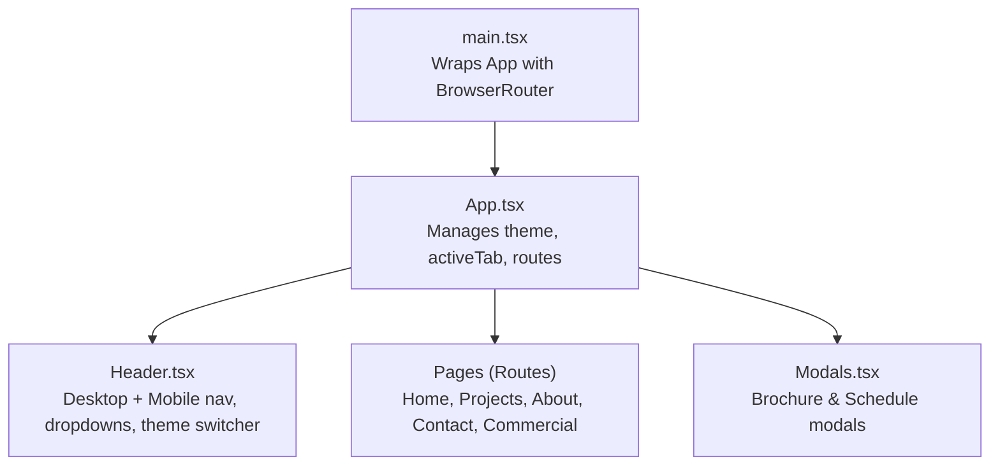
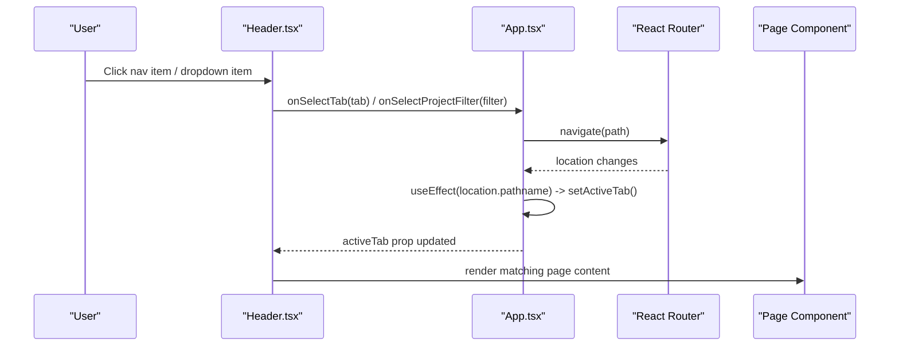
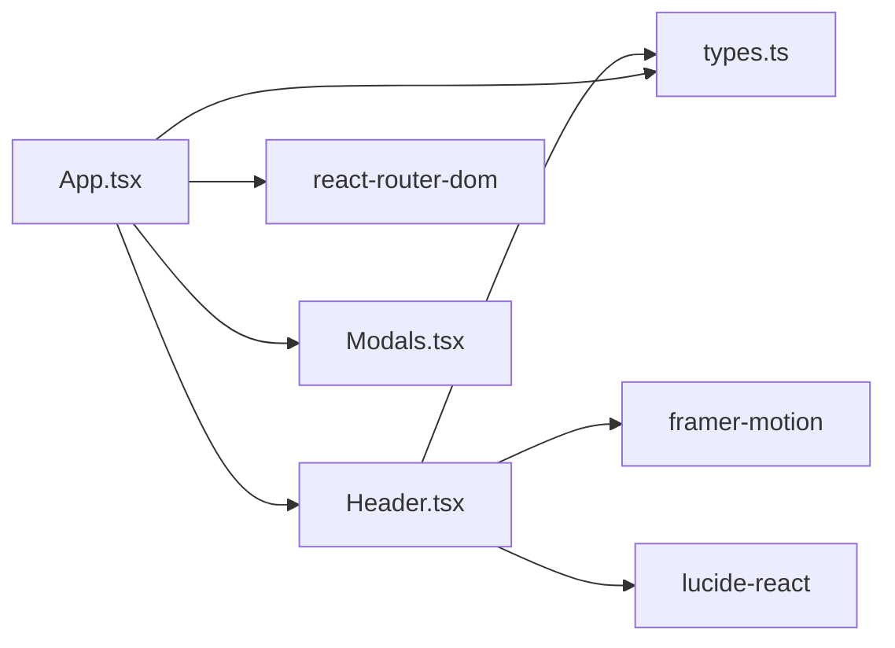

# Header Navigation

<cite>
**Referenced Files in This Document**
- [Header.tsx](file://src/components/Header.tsx)
- [App.tsx](file://src/App.tsx)
- [main.tsx](file://src/main.tsx)
- [types.ts](file://src/types.ts)
- [Modals.tsx](file://src/components/Modals.tsx)
- [index.css](file://src/index.css)
</cite>

## Table of Contents
1. [Introduction](#introduction)
2. [Project Structure](#project-structure)
3. [Core Components](#core-components)
4. [Architecture Overview](#architecture-overview)
5. [Detailed Component Analysis](#detailed-component-analysis)
6. [Dependency Analysis](#dependency-analysis)
7. [Performance Considerations](#performance-considerations)
8. [Troubleshooting Guide](#troubleshooting-guide)
9. [Conclusion](#conclusion)
10. [Appendices](#appendices)

## Introduction
This document explains the header navigation system in the N-Square application. It covers responsive navigation patterns for desktop and mobile, active tab state synchronization with URL paths using React Router, dropdown menus for project filters, navigation handlers, scroll-to-top behavior, theme switching integration, modal triggers from the header, accessibility considerations, and guidance for customization and adding new items.

## Project Structure
The header navigation is implemented as a reusable component that integrates with the application’s routing and global state:
- The root app sets up React Router and manages theme and active tab state.
- The header renders both desktop and mobile navigation UIs and exposes callbacks to navigate, open modals, toggle theme, and filter projects.
- Types define the allowed navigation tabs and other shared structures.

**Diagram sources**
- [main.tsx:7-13](file://src/main.tsx#L7-L13)
- [App.tsx:15-104](file://src/App.tsx#L15-L104)
- [Header.tsx:15-328](file://src/components/Header.tsx#L15-L328)
- [Modals.tsx:12-312](file://src/components/Modals.tsx#L12-L312)

**Section sources**
- [main.tsx:7-13](file://src/main.tsx#L7-L13)
- [App.tsx:15-104](file://src/App.tsx#L15-L104)
- [Header.tsx:15-328](file://src/components/Header.tsx#L15-L328)
- [types.ts:1-3](file://src/types.ts#L1-L3)

## Core Components
- Header: Renders brand logo, desktop nav links, a “Projects” dropdown, mobile menu, theme switcher, and a call concierge button. It handles local states for mobile menu visibility, dropdown visibility, scroll detection, and hover highlighting.
- App: Owns theme and active tab state, syncs active tab with URL via useLocation, navigates on tab selection, opens modals, and passes project filter selection to pages.
- Modals: Provide brochure request and schedule visit flows triggered from the header.

Key responsibilities:
- Responsive UI: Desktop horizontal nav; mobile overlay menu with collapsible sections.
- Active tab synchronization: Maintains visual consistency between URL and header state.
- Dropdown functionality: Filters projects by ongoing/completed/upcoming.
- Theme switching: Toggles light/dark mode across the app.
- Modal triggers: Opens scheduling or brochure modals from header actions.

**Section sources**
- [Header.tsx:15-328](file://src/components/Header.tsx#L15-L328)
- [App.tsx:15-104](file://src/App.tsx#L15-L104)
- [Modals.tsx:12-312](file://src/components/Modals.tsx#L12-L312)

## Architecture Overview
The navigation architecture centers around a single source of truth for the active tab in App, which updates based on the current route and user interactions. The Header consumes this state and emits events to change routes and apply filters.

**Diagram sources**
- [Header.tsx:55-62](file://src/components/Header.tsx#L55-L62)
- [App.tsx:47-85](file://src/App.tsx#L47-L85)
- [App.tsx:51-65](file://src/App.tsx#L51-L65)

## Detailed Component Analysis

### Header Component
Responsibilities:
- Render desktop navigation with hover effects and an animated vertical line indicator for the active/hovered tab.
- Implement a “Projects” dropdown with sub-items that set a project filter and navigate to the projects page.
- Provide a mobile menu overlay with collapsible sections and a call-to-action button.
- Manage scroll-aware styling (transparent vs. blurred background).
- Expose theme toggle and modal trigger buttons.

Key behaviors:
- Active tab highlighting: Uses the activeTab prop to determine highlighted state and shows a connecting vertical line animation.
- Dropdown: Controlled by local state; toggles on hover/click and closes on selection.
- Mobile menu: Toggled via a hamburger/close icon; collapses when navigating away from non-dropdown items.
- Scroll effect: Adds a backdrop blur and shadow when scrolled beyond a threshold.

Accessibility notes:
- Buttons are used for interactive elements.
- Some elements include aria-label attributes for clarity.
- Keyboard navigation relies on default browser behavior for buttons; no custom key handling is present.

Customization points:
- Add new nav items by extending the navItems array.
- Extend dropdown items by modifying the projectDropdownItems list.
- Adjust styles via Tailwind classes or CSS variables if needed.

**Section sources**
- [Header.tsx:23-62](file://src/components/Header.tsx#L23-L62)
- [Header.tsx:64-235](file://src/components/Header.tsx#L64-L235)
- [Header.tsx:237-328](file://src/components/Header.tsx#L237-L328)

### App Component (Navigation State and Routing)
Responsibilities:
- Maintain theme and activeTab state at the top level.
- Sync activeTab with the current URL path using useLocation.
- Navigate to appropriate routes and scroll to top on navigation.
- Pass project filter selection to the projects view.
- Open modals from header actions.

Active tab synchronization:
- On mount and whenever the pathname changes, the app maps the path to a NavTab and updates activeTab accordingly.
- When a user selects a tab, the app navigates to the corresponding path and scrolls to the top.

Scroll-to-top behavior:
- After each navigation, the app programmatically scrolls to the top with smooth behavior.

Theme switching:
- Toggles a class on the document element and body to apply dark/light themes globally.

Modal integration:
- Header calls onOpenVisitModal to open the schedule modal; brochure modal can be opened from other components but is managed centrally here.

**Section sources**
- [App.tsx:15-49](file://src/App.tsx#L15-L49)
- [App.tsx:51-85](file://src/App.tsx#L51-L85)
- [App.tsx:87-104](file://src/App.tsx#L87-L104)

### Types
Defines the allowed navigation tabs and other shared types used by the header and app.

**Section sources**
- [types.ts:1-3](file://src/types.ts#L1-L3)

### Modals Integration
The header exposes a callback to open the schedule visit modal. The app manages modal state and renders the modal overlays.

**Section sources**
- [Header.tsx:207-215](file://src/components/Header.tsx#L207-L215)
- [Header.tsx:256-261](file://src/components/Header.tsx#L256-L261)
- [App.tsx:94-104](file://src/App.tsx#L94-L104)
- [Modals.tsx:12-312](file://src/components/Modals.tsx#L12-L312)

## Dependency Analysis
The header depends on:
- React hooks for state and effects.
- Framer Motion for animations.
- Lucide icons for UI glyphs.
- Tailwind utility classes for styling.

The app depends on:
- React Router for routing and location-based state sync.
- Motion/react for page transitions.
- Shared types for consistent interfaces.

**Diagram sources**
- [Header.tsx:1-5](file://src/components/Header.tsx#L1-L5)
- [App.tsx:1-13](file://src/App.tsx#L1-L13)
- [types.ts:1-3](file://src/types.ts#L1-L3)
- [Modals.tsx:1-4](file://src/components/Modals.tsx#L1-L4)

**Section sources**
- [Header.tsx:1-5](file://src/components/Header.tsx#L1-L5)
- [App.tsx:1-13](file://src/App.tsx#L1-L13)
- [types.ts:1-3](file://src/types.ts#L1-L3)
- [Modals.tsx:1-4](file://src/components/Modals.tsx#L1-L4)

## Performance Considerations
- Scroll listener: The header attaches a passive scroll event listener to update styling only when necessary. Ensure the threshold check remains lightweight.
- Animations: Framer Motion is used for subtle transitions; keep motion props minimal to avoid layout thrashing.
- Conditional rendering: Dropdowns and mobile menu are conditionally rendered to reduce DOM size when not visible.
- Route transitions: Page transitions use AnimatePresence; consider reducing transition durations on low-end devices.

[No sources needed since this section provides general guidance]

## Troubleshooting Guide
Common issues and resolutions:
- Active tab not updating: Verify that the pathname mapping in the app includes all relevant routes and that the header’s onSelectTab calls navigate correctly.
- Dropdown not closing: Ensure the dropdown close logic runs on item click and outside interactions; verify state resets.
- Mobile menu not collapsing: Confirm that non-dropdown items close the menu after selection.
- Theme not applying: Check that the document element and body classes are toggled and that CSS rules target these classes.
- Scroll-to-top not working: Ensure navigation calls scrollTo with smooth behavior after route changes.

**Section sources**
- [App.tsx:51-85](file://src/App.tsx#L51-L85)
- [Header.tsx:55-62](file://src/components/Header.tsx#L55-L62)
- [Header.tsx:271-328](file://src/components/Header.tsx#L271-L328)

## Conclusion
The N-Square header navigation provides a cohesive, responsive experience with clear active states, smooth animations, and integrated features like dropdown filtering, theme switching, and modal triggers. The centralized state management in App ensures consistency between URL and UI, while the Header encapsulates presentation and interaction details. Extending or customizing the navigation is straightforward through the provided configuration arrays and callback props.

[No sources needed since this section summarizes without analyzing specific files]

## Appendices

### Adding a New Navigation Item
Steps:
- Define the new tab in the types if it is a new category.
- Add an entry to the navItems array in the header with label, tab, and optional hasDropdown flag.
- Update the app’s pathname mapping to recognize the new route and set the active tab accordingly.
- If the item requires a dropdown, extend the dropdown items list and handle selection in the header.

**Section sources**
- [types.ts:1-3](file://src/types.ts#L1-L3)
- [Header.tsx:42-53](file://src/components/Header.tsx#L42-L53)
- [App.tsx:51-65](file://src/App.tsx#L51-L65)

### Customizing Navigation Styles
- Use Tailwind classes within the header for quick adjustments to colors, spacing, and typography.
- For broader style changes, leverage the existing CSS classes in index.css for navigation links and theme-specific styles.

**Section sources**
- [Header.tsx:64-235](file://src/components/Header.tsx#L64-L235)
- [index.css:62-105](file://src/index.css#L62-L105)

### Accessibility Guidance
Current implementation uses semantic buttons and some aria-label attributes. To improve accessibility:
- Add aria-expanded to the Projects dropdown button to indicate open/closed state.
- Associate labels with interactive controls where missing.
- Ensure focus management when opening/closing the mobile menu and dropdowns.
- Provide keyboard support for opening/closing dropdowns and navigating within them.

[No sources needed since this section provides general guidance]