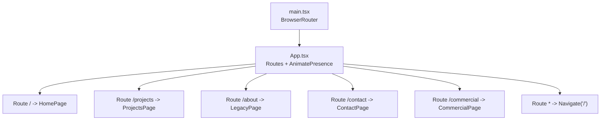
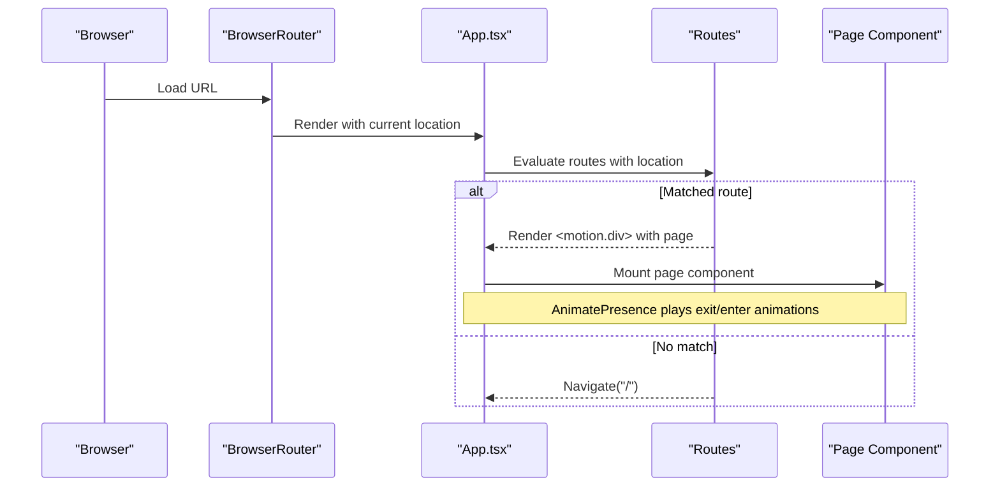
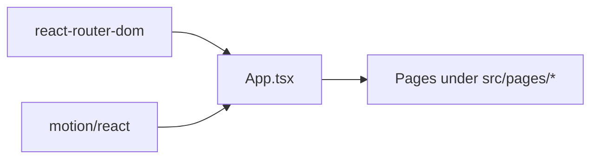

# Route Configuration

<cite>
**Referenced Files in This Document**
- [main.tsx](file://src/main.tsx)
- [App.tsx](file://src/App.tsx)
- [HomePage.tsx](file://src/pages/HomePage.tsx)
- [ProjectsPage.tsx](file://src/pages/ProjectsPage.tsx)
- [LegacyPage.tsx](file://src/pages/LegacyPage.tsx)
- [ContactPage.tsx](file://src/pages/ContactPage.tsx)
- [CommercialPage.tsx](file://src/pages/CommercialPage.tsx)
- [package.json](file://package.json)
</cite>

## Table of Contents
1. [Introduction](#introduction)
2. [Project Structure](#project-structure)
3. [Core Components](#core-components)
4. [Architecture Overview](#architecture-overview)
5. [Detailed Component Analysis](#detailed-component-analysis)
6. [Dependency Analysis](#dependency-analysis)
7. [Performance Considerations](#performance-considerations)
8. [Troubleshooting Guide](#troubleshooting-guide)
9. [Conclusion](#conclusion)
10. [Appendices](#appendices)

## Introduction
This document explains the React Router configuration in the N-Square application, focusing on route definitions for all page routes and their components, animated page transitions powered by Framer Motion (via motion/react), routing setup in main.tsx with BrowserRouter and global providers, and practical guidance for adding new routes, nested routes, route parameters, catch-all handling, navigation guards, SEO considerations, and performance optimization through code splitting.

## Project Structure
The routing is configured at the application root and rendered inside a BrowserRouter. The App component defines all top-level routes and wraps each route’s element with AnimatePresence and motion to provide consistent page transitions.



**Diagram sources**
- [main.tsx:7-13](file://src/main.tsx#L7-L13)
- [App.tsx:106-228](file://src/App.tsx#L106-L228)

**Section sources**
- [main.tsx:1-14](file://src/main.tsx#L1-L14)
- [App.tsx:1-255](file://src/App.tsx#L1-L255)

## Core Components
- Routing container: App.tsx uses Routes from react-router-dom and AnimatePresence from motion/react to orchestrate page transitions keyed by location.pathname.
- Page components: Each route renders a dedicated page component under pages/.
- Global providers: BrowserRouter is provided in main.tsx; theme state and modals are managed in App.tsx and passed down as needed.

Key behaviors:
- Active tab synchronization with URL path using useLocation and useNavigate.
- Smooth scroll-to-top on navigation via window.scrollTo.
- Consistent transition animations per route using motion.div with initial, animate, and exit states.

**Section sources**
- [App.tsx:47-85](file://src/App.tsx#L47-L85)
- [App.tsx:106-228](file://src/App.tsx#L106-L228)

## Architecture Overview
The application bootstraps with React StrictMode and BrowserRouter, then mounts App. Inside App, a central Routes tree maps paths to page components. Each route element is wrapped in a motion.div that animates on mount/unmount, while AnimatePresence ensures smooth transitions between pages.



**Diagram sources**
- [main.tsx:7-13](file://src/main.tsx#L7-L13)
- [App.tsx:106-228](file://src/App.tsx#L106-L228)

## Detailed Component Analysis

### Route Definitions and Page Mapping
- Root route "/" renders HomePage.
- "/projects" renders ProjectsPage with optional filter state.
- "/about" renders LegacyPage.
- "/contact" renders ContactPage with form and map sections.
- "/commercial" renders CommercialPage filtered to commercial properties.
- Catch-all "*" redirects to "/" using Navigate with replace.

Each route element is wrapped in a motion.div with:
- initial: fade-in and slight upward movement
- animate: final state with full opacity and original position
- exit: fade-out and slight downward movement
- transition: duration and easing tuned per route

```mermaid
flowchart TD
Start(["App renders"]) --> CheckRoute{"Path matches?"}
CheckRoute --> |"/"| R1["Render HomePage"]
CheckRoute --> |"/projects"| R2["Render ProjectsPage"]
CheckRoute --> |"/about"| R3["Render LegacyPage"]
CheckRoute --> |"/contact"| R4["Render ContactPage"]
CheckRoute --> |"/commercial"| R5["Render CommercialPage"]
CheckRoute --> |"*" or other"| Redirect["Navigate('/')"]
R1 --> End(["AnimatePresence transition"])
R2 --> End
R3 --> End
R4 --> End
R5 --> End
Redirect --> End
```

**Diagram sources**
- [App.tsx:106-228](file://src/App.tsx#L106-L228)

**Section sources**
- [App.tsx:106-228](file://src/App.tsx#L106-L228)
- [HomePage.tsx:1-47](file://src/pages/HomePage.tsx#L1-L47)
- [ProjectsPage.tsx:1-35](file://src/pages/ProjectsPage.tsx#L1-L35)
- [LegacyPage.tsx:1-17](file://src/pages/LegacyPage.tsx#L1-L17)
- [ContactPage.tsx:1-77](file://src/pages/ContactPage.tsx#L1-L77)
- [CommercialPage.tsx:1-32](file://src/pages/CommercialPage.tsx#L1-L32)

### Animated Page Transitions with Framer Motion
- AnimatePresence mode="wait" ensures one page exits before the next enters.
- Each route’s motion.div uses key based on view identifiers to trigger enter/exit animations.
- Transition durations vary slightly across routes for visual variety.

Implementation highlights:
- Initial state: opacity 0, y offset
- Animate state: opacity 1, y 0
- Exit state: opacity 0, negative y offset
- Transition: duration and custom ease curve

**Section sources**
- [App.tsx:106-228](file://src/App.tsx#L106-L228)

### Routing Setup in main.tsx with BrowserRouter and Global Providers
- main.tsx creates the React root and renders App within StrictMode and BrowserRouter.
- Global styles are imported here.
- All routing context is available throughout the app due to BrowserRouter wrapping App.

**Section sources**
- [main.tsx:1-14](file://src/main.tsx#L1-L14)

### Adding New Routes
To add a new page route:
1. Create a new page component under src/pages/.
2. Import it into App.tsx.
3. Add a new Route entry inside the Routes block with path and element.
4. Wrap the element in a motion.div with initial/animate/exit props for consistent transitions.
5. Optionally update active tab logic if the route corresponds to a navigation tab.

Example pattern:
- Define Route with path="/your-path"
- Element: motion.div with animation props containing YourPageComponent
- Ensure AnimatePresence remains around Routes

**Section sources**
- [App.tsx:106-228](file://src/App.tsx#L106-L228)

### Implementing Nested Routes
Nested routes can be implemented by:
- Creating a parent route that renders a layout component.
- Using nested <Routes> inside the parent’s element to define child paths.
- Passing data/context via props or context providers.

Note: The current codebase uses flat top-level routes. To adopt nested routing, introduce a layout component and nest Routes accordingly.

[No sources needed since this section provides general guidance]

### Configuring Route Parameters
To support dynamic segments:
- Define a route with a parameter placeholder (e.g., path="/projects/:id").
- Use useParams hook inside the page component to read the parameter.
- Update navigation calls to include the parameter value.

Note: The current codebase does not use route parameters. Add them where dynamic content is required.

[No sources needed since this section provides general guidance]

### Catch-All Route Handling
A catch-all route is defined to redirect unknown paths to the home page using Navigate with replace to avoid extra history entries.

Behavior:
- Any unmatched path triggers an immediate redirect to "/".
- Ensures users always land on a valid page.

**Section sources**
- [App.tsx:226-227](file://src/App.tsx#L226-L227)

### Navigation Guards Implementation
Current implementation does not include explicit authentication or authorization guards. To implement guards:
- Create a wrapper component that checks permissions or auth state.
- Conditionally render protected routes or redirect to login.
- Apply the guard around specific Route elements or nested routes.

Example approach:
- Define a ProtectedRoute component that checks session/token.
- If unauthorized, navigate to login; otherwise render the intended element.

[No sources needed since this section provides general guidance]

## Dependency Analysis
- React Router v7 is used for client-side routing.
- motion/react (Framer Motion) provides AnimatePresence and motion primitives for transitions.
- App orchestrates both libraries to deliver animated page changes.



**Diagram sources**
- [package.json:13-25](file://package.json#L13-L25)
- [App.tsx:1-14](file://src/App.tsx#L1-L14)

**Section sources**
- [package.json:13-25](file://package.json#L13-L25)
- [App.tsx:1-14](file://src/App.tsx#L1-L14)

## Performance Considerations
- Code splitting: Use React.lazy and Suspense to lazy-load heavy page components to reduce initial bundle size.
- Route-based splitting: Lazy-load each page component so only the necessary code is loaded when navigating to that route.
- Prefetching: Consider prefetching resources for likely next routes during idle time.
- Animation performance: Keep transition durations short and reuse easing curves; avoid excessive re-renders in route elements.
- Image/media optimization: Defer loading off-screen images and use responsive formats.

[No sources needed since this section provides general guidance]

## Troubleshooting Guide
Common issues and resolutions:
- Routes not rendering: Ensure BrowserRouter wraps App in main.tsx and Routes is present in App.
- Animations not playing: Verify AnimatePresence wraps Routes and each route element has a unique key.
- Redirect loops: Check catch-all route and any programmatic navigations for conflicting conditions.
- Active tab mismatch: Confirm useLocation syncs with activeTab state and handleSelectNavTab updates correctly.

**Section sources**
- [main.tsx:7-13](file://src/main.tsx#L7-L13)
- [App.tsx:47-85](file://src/App.tsx#L47-L85)
- [App.tsx:106-228](file://src/App.tsx#L106-L228)

## Conclusion
The N-Square application uses a clean, centralized routing setup with React Router and Framer Motion to deliver smooth, animated page transitions. Routes are well-defined for core pages, with a catch-all redirect ensuring robust navigation. Extending the routing system with nested routes, parameters, and guards follows standard patterns. For performance, adopt route-based code splitting and optimize assets and animations.

[No sources needed since this section summarizes without analyzing specific files]

## Appendices

### Route Reference Table
- "/" -> HomePage
- "/projects" -> ProjectsPage
- "/about" -> LegacyPage
- "/contact" -> ContactPage
- "/commercial" -> CommercialPage
- "*" -> Navigate("/")

**Section sources**
- [App.tsx:106-228](file://src/App.tsx#L106-L228)

### Environment and Scripts
- Development server runs on port 3000 with host binding enabled.
- Build and preview scripts provided via Vite.

**Section sources**
- [package.json:6-11](file://package.json#L6-L11)