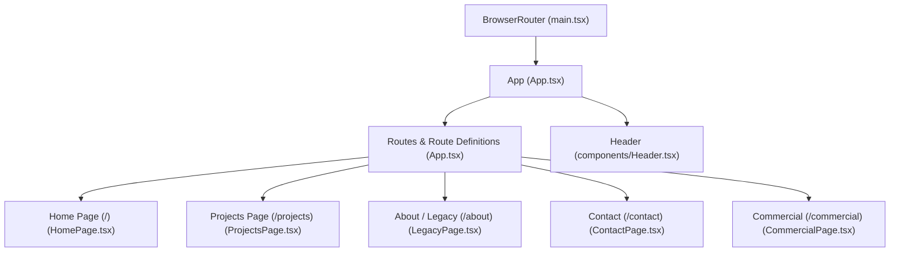
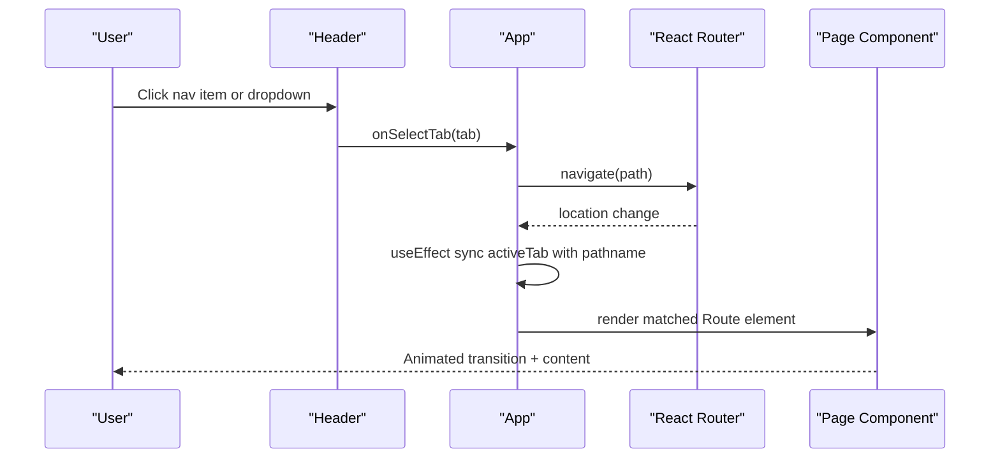
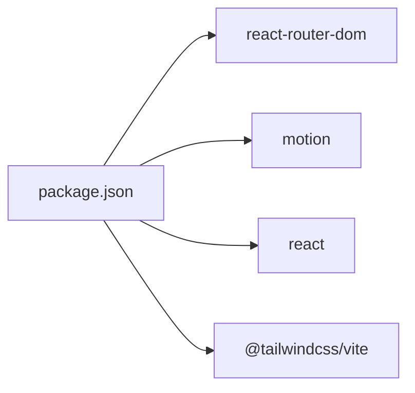

# Routing and Navigation

<cite>
**Referenced Files in This Document**
- [main.tsx](file://src/main.tsx)
- [App.tsx](file://src/App.tsx)
- [Header.tsx](file://src/components/Header.tsx)
- [HomePage.tsx](file://src/pages/HomePage.tsx)
- [ProjectsPage.tsx](file://src/pages/ProjectsPage.tsx)
- [LegacyPage.tsx](file://src/pages/LegacyPage.tsx)
- [ContactPage.tsx](file://src/pages/ContactPage.tsx)
- [CommercialPage.tsx](file://src/pages/CommercialPage.tsx)
- [types.ts](file://src/types.ts)
- [package.json](file://package.json)
</cite>

## Table of Contents
1. Introduction
2. Project Structure
3. Core Components
4. Architecture Overview
5. Detailed Component Analysis
6. Dependency Analysis
7. Performance Considerations
8. Troubleshooting Guide
9. Conclusion
10. Appendices

## Introduction
This document explains the routing and navigation system in the N-Square application. It covers React Router configuration, route definitions, page transitions with animations, header navigation with dropdown menus, active state management, responsive mobile navigation, URL synchronization, and navigation state patterns. It also provides guidance for adding new routes, implementing navigation guards, optimizing performance, SEO considerations for client-side routing, and accessibility features for keyboard navigation.

## Project Structure
The application uses React Router v7 with a BrowserRouter to enable client-side routing. The root component defines all routes and orchestrates animated page transitions using motion libraries. The Header component manages navigation interactions, dropdowns, and active states, while each page is rendered by its corresponding route.

**Diagram sources**
- [main.tsx:7-12](file://src/main.tsx#L7-L12)
- [App.tsx:106-227](file://src/App.tsx#L106-L227)
- [Header.tsx:64-326](file://src/components/Header.tsx#L64-L326)

**Section sources**
- [main.tsx:1-14](file://src/main.tsx#L1-L14)
- [App.tsx:1-255](file://src/App.tsx#L1-L255)
- [Header.tsx:1-328](file://src/components/Header.tsx#L1-L328)

## Core Components
- App: Central router container that defines Routes, syncs active tab with URL, handles programmatic navigation, and wraps pages with animated transitions.
- Header: Provides desktop and mobile navigation, dropdown menus, active state indicators, theme toggle, and call-to-action actions.
- Pages: Lightweight wrappers around content components for each route.

Key responsibilities:
- Route definitions and animated transitions are centralized in App.
- Navigation events originate in Header and propagate via callbacks to App.
- Active tab state is synchronized with the current pathname.

**Section sources**
- [App.tsx:15-85](file://src/App.tsx#L15-L85)
- [App.tsx:106-227](file://src/App.tsx#L106-L227)
- [Header.tsx:42-62](file://src/components/Header.tsx#L42-L62)
- [Header.tsx:82-235](file://src/components/Header.tsx#L82-L235)
- [Header.tsx:237-326](file://src/components/Header.tsx#L237-L326)

## Architecture Overview
The routing architecture centers on a single <Routes> block inside App, with each path rendering a page wrapped in an animated container. Navigation is driven by user interactions in Header, which trigger programmatic navigation via useNavigate. Active tab state is derived from the current location to keep UI consistent.

**Diagram sources**
- [App.tsx:47-85](file://src/App.tsx#L47-L85)
- [App.tsx:106-227](file://src/App.tsx#L106-L227)
- [Header.tsx:82-235](file://src/components/Header.tsx#L82-L235)

## Detailed Component Analysis

### React Router Configuration and Route Definitions
- Root setup: BrowserRouter wraps the app in main.tsx.
- Route definitions: All routes are declared in App.tsx under a single Routes block. Each route renders a page component wrapped in a motion container for enter/exit animations.
- Wildcard: A catch-all route redirects unknown paths to the home page.

Routes:
- "/" -> HomePage
- "/projects" -> ProjectsPage
- "/about" -> LegacyPage
- "/contact" -> ContactPage
- "/commercial" -> CommercialPage
- "*" -> Navigate to "/"

Animated transitions:
- Each route’s element is wrapped in a motion container with initial, animate, exit, and transition props to create smooth page transitions.

URL synchronization:
- A useEffect watches location.pathname and updates the active tab accordingly, ensuring the header reflects the current page.

Programmatic navigation:
- Navigation is performed via useNavigate when a user selects a tab or dropdown item. Scroll-to-top behavior is applied after navigation.

**Section sources**
- [main.tsx:7-12](file://src/main.tsx#L7-L12)
- [App.tsx:47-85](file://src/App.tsx#L47-L85)
- [App.tsx:106-227](file://src/App.tsx#L106-L227)

### Header Navigation: Dropdown Menus, Active State, and Mobile Menu
Desktop navigation:
- Nav items include HOME, PROJECTS (with dropdown), ABOUT US, CONTACT US.
- Active state is visually indicated with a dot indicator and optional vertical line animation.
- Hovering highlights the active tab; clicking navigates to the corresponding route.

Dropdown menu:
- The PROJECTS item has a dropdown with filters: ONGOING, COMPLETED, UPCOMING.
- Selecting a filter navigates to /projects and applies the selected filter via callback.

Mobile navigation:
- A hamburger button toggles a full-screen overlay menu.
- The same nav items and dropdown logic apply on mobile.
- Theme toggle and call-to-action buttons are available in the mobile controls area.

Accessibility:
- Interactive elements use semantic buttons and aria-label attributes where appropriate.
- Focus outlines are preserved by not overriding focus styles globally.

**Section sources**
- [Header.tsx:42-62](file://src/components/Header.tsx#L42-L62)
- [Header.tsx:82-235](file://src/components/Header.tsx#L82-L235)
- [Header.tsx:237-326](file://src/components/Header.tsx#L237-L326)

### Page Transitions and Animation Strategy
- Each route element is wrapped in a motion container with entrance and exit animations.
- AnimatePresence mode="wait" ensures sequential transitions between routes.
- Transition durations and easing are tuned for a smooth experience without impacting perceived performance.

**Section sources**
- [App.tsx:106-227](file://src/App.tsx#L106-L227)

### Navigation State Management
- Active tab state is maintained in App and synced with the URL via useLocation.
- Programmatic navigation via useNavigate updates the URL and triggers re-render of the matching route.
- Dropdown selections combine navigation with local state changes (e.g., project filter).

**Section sources**
- [App.tsx:47-85](file://src/App.tsx#L47-L85)
- [App.tsx:106-227](file://src/App.tsx#L106-L227)

### Adding a New Route (Step-by-Step)
1. Create a page wrapper in src/pages if needed (see existing pages for pattern).
2. Add a Route entry in App.tsx under the Routes block with a unique key and motion animation.
3. If the route should be reachable from Header, add it to the navItems array in Header.tsx and ensure handleSelectNavTab navigates to the correct path.
4. Update active tab mapping in App.tsx to recognize the new pathname.
5. Test navigation from both Header and direct URL access.

Example references:
- Route definition pattern: see existing routes in App.tsx.
- Header nav items and dropdown handling: see Header.tsx.

**Section sources**
- [App.tsx:106-227](file://src/App.tsx#L106-L227)
- [Header.tsx:42-62](file://src/components/Header.tsx#L42-L62)

### Implementing Navigation Guards
Currently, there are no authentication-based guards in place. To implement guards:
- Create a higher-order component or wrapper function that checks authentication state before rendering protected routes.
- Wrap specific Route elements with the guard to redirect unauthenticated users to a login or public route.
- Use useNavigate to programmatically redirect within guards.

Recommended approach:
- Define a ProtectedRoute component that checks auth status and conditionally renders the intended element or redirects.
- Apply it to sensitive routes like /projects or /commercial if needed.

[No sources needed since this section provides general guidance]

### Optimizing Navigation Performance
- Keep route-level components lightweight; defer heavy computations until necessary.
- Use lazy loading for large page components to reduce initial bundle size.
- Avoid excessive re-renders by memoizing expensive components and stabilizing callbacks passed to children.
- Ensure animations are GPU-accelerated and short enough to maintain responsiveness.

[No sources needed since this section provides general guidance]

### SEO Considerations for Client-Side Routing
- Ensure each route has meaningful meta tags (title, description) and Open Graph data.
- Provide server-side rendering or static site generation if SEO is critical, or use prerendering strategies compatible with your build toolchain.
- Maintain canonical URLs and avoid duplicate content across similar routes.
- Verify that crawlers can discover links within the app (e.g., internal links in Header and pages).

[No sources needed since this section provides general guidance]

### Accessibility Features for Keyboard Navigation
- All interactive elements are native buttons, preserving default keyboard behavior.
- Ensure visible focus indicators remain intact.
- For dropdowns, manage focus trapping and escape key behavior to close menus.
- Provide descriptive labels and roles where custom widgets are used.

[No sources needed since this section provides general guidance]

## Dependency Analysis
The routing stack relies on React Router v7 and motion libraries for animations. Dependencies are declared in package.json.

**Diagram sources**
- [package.json:13-25](file://package.json#L13-L25)

**Section sources**
- [package.json:1-38](file://package.json#L1-L38)

## Performance Considerations
- Use AnimatePresence mode="wait" to prevent overlapping animations during route transitions.
- Keep transition durations moderate to balance visual polish and responsiveness.
- Defer non-critical work on route mount; prefer code splitting for large pages.
- Minimize layout thrashing by avoiding forced synchronous reads during animations.

[No sources needed since this section provides general guidance]

## Troubleshooting Guide
Common issues and resolutions:
- Active tab not updating: Ensure useEffect syncing activeTab with location.pathname runs and dependencies are correct.
- Dropdown not closing on mobile: Confirm event handlers set mobileMenuOpen to false after selection.
- Animations not playing: Verify AnimatePresence is wrapping Routes and each route element has a unique key.
- Redirect not working: Check wildcard route and ensure Navigate component is imported and used correctly.

**Section sources**
- [App.tsx:47-85](file://src/App.tsx#L47-L85)
- [App.tsx:106-227](file://src/App.tsx#L106-L227)
- [Header.tsx:237-326](file://src/components/Header.tsx#L237-L326)

## Conclusion
The N-Square application implements a clean, centralized routing setup using React Router v7 with animated page transitions and a robust Header-driven navigation system. Active state synchronization with the URL ensures consistency across desktop and mobile experiences. The structure supports easy extension with new routes and future enhancements such as navigation guards and advanced SEO strategies.

## Appendices

### Route Map Summary
- "/" -> HomePage
- "/projects" -> ProjectsPage
- "/about" -> LegacyPage
- "/contact" -> ContactPage
- "/commercial" -> CommercialPage
- "*" -> Redirect to "/"

**Section sources**
- [App.tsx:106-227](file://src/App.tsx#L106-L227)

### Types Used in Navigation
- NavTab enumerates top-level tabs: residences, projects, commercial, legacy, contact.
- These types drive active state and navigation logic.

**Section sources**
- [types.ts:1-4](file://src/types.ts#L1-L4)