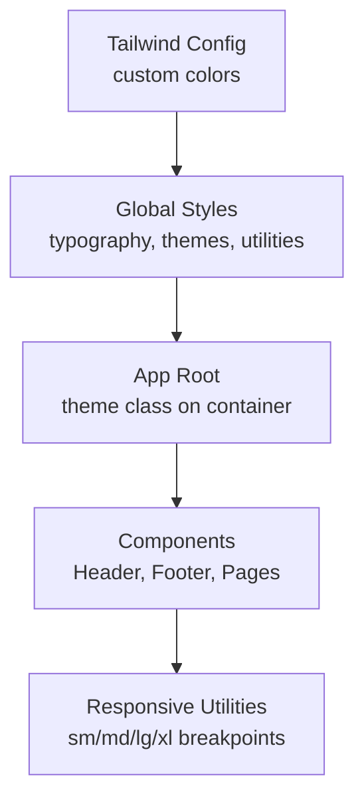
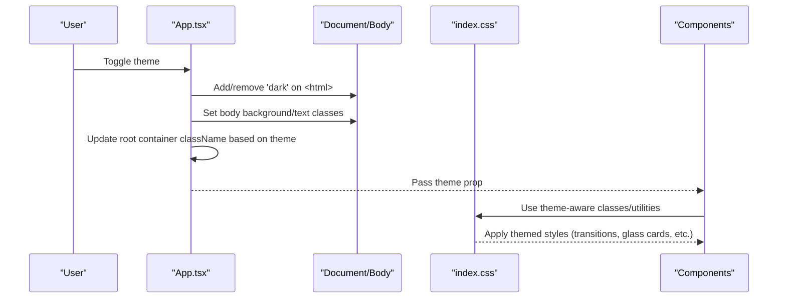
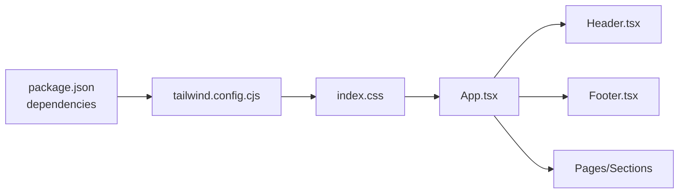

# Styling and Theming

<cite>
**Referenced Files in This Document**
- [tailwind.config.cjs](file://tailwind.config.cjs)
- [index.css](file://src/index.css)
- [App.tsx](file://src/App.tsx)
- [Header.tsx](file://src/components/Header.tsx)
- [Footer.tsx](file://src/components/Footer.tsx)
- [HomePage.tsx](file://src/pages/HomePage.tsx)
- [HeroSlider.tsx](file://src/components/HeroSlider.tsx)
- [HomeExcellenceSection.tsx](file://src/components/HomeExcellenceSection.tsx)
- [package.json](file://package.json)
</cite>

## Table of Contents
1. Introduction
2. Project Structure
3. Core Components
4. Architecture Overview
5. Detailed Component Analysis
6. Dependency Analysis
7. Performance Considerations
8. Troubleshooting Guide
9. Conclusion
10. Appendices

## Introduction
This document explains the styling and theming system used in the N-Square application. It covers:
- Tailwind CSS configuration, including custom colors and utility layers
- Dark/light theme implementation via global state and CSS class management
- The hybrid approach combining utility-first classes with scoped custom CSS
- Responsive design strategies across components
- Guidance for extending themes, adding new colors/styles, and maintaining consistency
- Performance considerations and best practices for scalable CSS architecture

## Project Structure
The styling system is centered around:
- A Tailwind configuration that extends the default palette with brand gold tones
- A global stylesheet that defines typography utilities, theme base styles, glass card effects, transitions, and custom scrollbars
- Application-level state that toggles between light and dark modes by applying classes to the root element and body
- Components that use responsive Tailwind utilities and theme-aware classes

**Diagram sources**
- [tailwind.config.cjs:1-15](file://tailwind.config.cjs#L1-L15)
- [index.css:1-105](file://src/index.css#L1-L105)
- [App.tsx:24-33](file://src/App.tsx#L24-L33)
- [Header.tsx:65-69](file://src/components/Header.tsx#L65-L69)
- [Footer.tsx:13-14](file://src/components/Footer.tsx#L13-L14)

**Section sources**
- [tailwind.config.cjs:1-15](file://tailwind.config.cjs#L1-L15)
- [index.css:1-105](file://src/index.css#L1-L105)
- [App.tsx:24-33](file://src/App.tsx#L24-L33)

## Core Components
- Tailwind configuration: Extends the color palette with gold variants and sets content scanning paths.
- Global stylesheet: Imports Tailwind, enables a dark variant, defines typography utilities (serif/sans), theme base classes (.dark-theme, .light-theme), transition rules, glass-card styles, navigation link styles, dividers, glow effects, and custom scrollbars.
- App root: Holds theme state and applies theme classes to the root container and body; also toggles the HTML dark class for Tailwind’s dark mode variant support.
- Header/Footer: Demonstrate responsive layouts, theme-aware UI elements, and consistent spacing/typography using Tailwind utilities.

Key responsibilities:
- Centralized theme tokens via Tailwind colors and CSS variables are not used; instead, explicit hex values and theme classes are applied.
- Theme switching is driven by React state and DOM class toggling.
- Responsive behavior is achieved through Tailwind’s built-in breakpoints.

**Section sources**
- [tailwind.config.cjs:1-15](file://tailwind.config.cjs#L1-L15)
- [index.css:1-105](file://src/index.css#L1-L105)
- [App.tsx:15-37](file://src/App.tsx#L15-L37)
- [Header.tsx:65-69](file://src/components/Header.tsx#L65-L69)
- [Footer.tsx:13-14](file://src/components/Footer.tsx#L13-L14)

## Architecture Overview
The theming flow starts at the application root and propagates through the component tree via props and CSS classes.

**Diagram sources**
- [App.tsx:24-33](file://src/App.tsx#L24-L33)
- [index.css:27-44](file://src/index.css#L27-L44)
- [Header.tsx:217-234](file://src/components/Header.tsx#L217-L234)

## Detailed Component Analysis

### Tailwind Configuration
- Custom color palette: Adds gold, gold-light, and gold-dark to be used throughout the app via Tailwind utilities.
- Content scanning: Ensures all relevant source files are scanned for generated utilities.

Usage patterns:
- Brand accents can be applied using the extended color names (e.g., text-gold, bg-gold).
- Keep all brand colors centralized here to maintain consistency.

**Section sources**
- [tailwind.config.cjs:1-15](file://tailwind.config.cjs#L1-L15)

### Global Styles and Theme Base
- Typography utilities: Provides serif and sans font families for reusable text styling.
- Theme base classes:
  - .dark-theme: Sets dark background and light text.
  - .light-theme: Sets light background and dark text.
- Transitions: Smooth color/background/border changes when switching themes.
- Glass cards: Distinct visuals for dark vs light contexts using backdrop blur and borders.
- Navigation links and dividers: Reusable style tokens for consistent UI.
- Scrollbars: Themed scrollbar thumbs for both modes.

Best practices:
- Prefer these base classes on containers rather than inline styles for theme consistency.
- Use the provided utilities (serif/sans, accent-gold, bg-gold, border-gold) to keep typography and accents uniform.

**Section sources**
- [index.css:1-105](file://src/index.css#L1-L105)

### Theme State Management in App
- State: theme holds 'light' or 'dark'.
- Effect: Applies 'dark' class to the documentElement and sets body background/text classes accordingly.
- Root container: Wraps the entire app with either .dark-theme or .light-theme and applies matching background/text classes.
- Propagation: theme is passed down to child components where needed.

Implications:
- Consistent theme application across the app.
- Predictable transitions due to global transition rules.

**Section sources**
- [App.tsx:15-37](file://src/App.tsx#L15-L37)
- [App.tsx:87-92](file://src/App.tsx#L87-L92)

### Header Component Styling
- Responsive layout: Uses hidden/flex patterns and breakpoint-specific padding/margins to adapt from mobile to desktop.
- Theme toggle: Animated switcher with sun/moon icons; visually indicates current mode.
- Scrolled state: Changes header background and shadow on scroll for better readability.
- Accessibility: Includes aria-labels and focus outlines where applicable.

**Section sources**
- [Header.tsx:65-69](file://src/components/Header.tsx#L65-L69)
- [Header.tsx:217-234](file://src/components/Header.tsx#L217-L234)
- [Header.tsx:238-269](file://src/components/Header.tsx#L238-L269)

### Footer Component Styling
- Grid-based layout adapts from single-column on small screens to multi-column on larger screens.
- Uses brand gold for headings and hover states to reinforce visual identity.
- Maintains consistent spacing and typography across sections.

**Section sources**
- [Footer.tsx:13-14](file://src/components/Footer.tsx#L13-L14)
- [Footer.tsx:15-58](file://src/components/Footer.tsx#L15-L58)

### Page Composition and Theme Usage
- HomePage composes multiple sections and passes theme down to children.
- Sections rely on shared utilities and theme classes to ensure consistent appearance.

**Section sources**
- [HomePage.tsx:18-44](file://src/pages/HomePage.tsx#L18-L44)

### Hero Slider Responsiveness
- Demonstrates responsive typography and positioning across breakpoints.
- Uses absolute positioning and layered z-indexes to create immersive hero experiences.

**Section sources**
- [HeroSlider.tsx:115-123](file://src/components/HeroSlider.tsx#L115-L123)
- [HeroSlider.tsx:175-191](file://src/components/HeroSlider.tsx#L175-L191)
- [HeroSlider.tsx:221-224](file://src/components/HeroSlider.tsx#L221-L224)

### Section Layouts and Breakpoints
- Complex sections use responsive grids and images that reflow across breakpoints.
- Overlapping and bled layouts are managed with absolute positioning and viewport-relative sizing.

**Section sources**
- [HomeExcellenceSection.tsx:1598-1613](file://src/components/HomeExcellenceSection.tsx#L1598-L1613)

## Dependency Analysis
- Tailwind integration:
  - Package dependencies include Tailwind v4 and Vite plugin for Tailwind.
  - The config file defines content scanning and color extensions.
- CSS layering:
  - index.css imports Tailwind and adds custom utilities and theme base styles.
- Component coupling:
  - App owns theme state and distributes it via props; components remain mostly presentational and rely on utilities.

**Diagram sources**
- [package.json:13-35](file://package.json#L13-L35)
- [tailwind.config.cjs:1-15](file://tailwind.config.cjs#L1-L15)
- [index.css:1-105](file://src/index.css#L1-L105)
- [App.tsx:87-92](file://src/App.tsx#L87-L92)

**Section sources**
- [package.json:13-35](file://package.json#L13-L35)
- [tailwind.config.cjs:1-15](file://tailwind.config.cjs#L1-L15)
- [index.css:1-105](file://src/index.css#L1-L105)

## Performance Considerations
- Utility-first CSS: Tailwind generates only used utilities, keeping bundle size lean. Ensure content paths in the config include all templates to avoid missing styles.
- Transition costs: Global transitions apply to many elements; prefer animating specific properties and avoid overusing heavy effects like backdrop-filter on large areas.
- Backdrop filters: Used for glass cards; consider limiting usage to necessary elements to reduce repaint/reflow overhead.
- Image handling: Hero and section images should be optimized and sized appropriately for breakpoints to prevent layout shifts.
- Avoid excessive inline styles: Prefer Tailwind utilities and CSS classes for maintainability and performance.

[No sources needed since this section provides general guidance]

## Troubleshooting Guide
Common issues and resolutions:
- Theme not applying:
  - Verify that the root container has the correct theme class and that the effect updates the documentElement and body classes.
  - Check that index.css is imported in the entry point.
- Colors not appearing:
  - Confirm that the Tailwind config includes the correct content paths and that your components reference the extended color names.
- Inconsistent typography:
  - Use the provided serif/sans utilities to ensure consistent fonts across components.
- Scrollbar styles not visible:
  - Ensure the theme class is applied to the root so that themed scrollbar rules match.

**Section sources**
- [App.tsx:24-33](file://src/App.tsx#L24-L33)
- [index.css:27-44](file://src/index.css#L27-L44)
- [tailwind.config.cjs:1-15](file://tailwind.config.cjs#L1-L15)

## Conclusion
N-Square uses a clear, scalable styling system:
- Centralized theme tokens via Tailwind config and global CSS
- Simple, robust theme switching with React state and DOM class toggling
- Responsive design leveraging Tailwind’s utilities
- Consistent visual language through reusable utilities and theme-aware components

Adhering to these patterns ensures maintainability, performance, and a cohesive user experience across devices and themes.

[No sources needed since this section summarizes without analyzing specific files]

## Appendices

### How to Customize Themes and Add New Colors
- Add new brand colors in the Tailwind configuration under the extend.colors section.
- Create additional theme base classes if you need alternative palettes beyond light/dark.
- Define reusable utilities in the global stylesheet for common patterns (e.g., accent colors, typography).

**Section sources**
- [tailwind.config.cjs:1-15](file://tailwind.config.cjs#L1-L15)
- [index.css:5-21](file://src/index.css#L5-L21)

### Adding New Styles and Maintaining Consistency
- Prefer Tailwind utilities for layout, spacing, and typography.
- Use global utilities for repeated patterns (e.g., nav-link, line-vertical, gold-glow).
- Keep theme-specific overrides grouped under .dark-theme and .light-theme to avoid scattering logic.

**Section sources**
- [index.css:62-81](file://src/index.css#L62-L81)
- [index.css:27-44](file://src/index.css#L27-L44)

### Responsive Design Strategies
- Use Tailwind’s sm/md/lg/xl breakpoints to adjust layout, typography, and spacing.
- Employ flex/grid with responsive modifiers to build adaptive interfaces.
- Test critical components (header, hero, sections) across viewports to ensure usability.

**Section sources**
- [Header.tsx:65-69](file://src/components/Header.tsx#L65-L69)
- [HeroSlider.tsx:175-191](file://src/components/HeroSlider.tsx#L175-L191)
- [HomeExcellenceSection.tsx:1598-1613](file://src/components/HomeExcellenceSection.tsx#L1598-L1613)