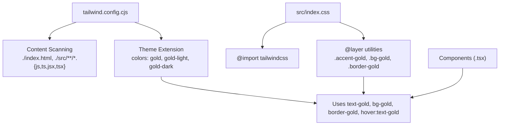
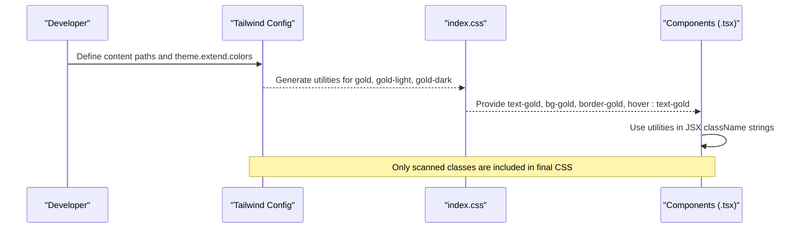
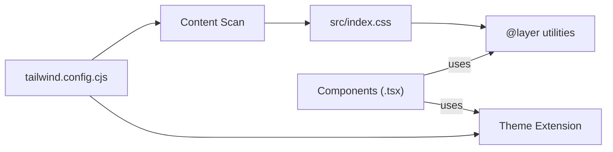

# Tailwind CSS Configuration

<cite>
**Referenced Files in This Document**
- [tailwind.config.cjs](file://tailwind.config.cjs)
- [index.css](file://src/index.css)
- [Footer.tsx](file://src/components/Footer.tsx)
- [Modals.tsx](file://src/components/Modals.tsx)
</cite>

## Table of Contents
1. [Introduction](#introduction)
2. [Project Structure](#project-structure)
3. [Core Components](#core-components)
4. [Architecture Overview](#architecture-overview)
5. [Detailed Component Analysis](#detailed-component-analysis)
6. [Dependency Analysis](#dependency-analysis)
7. [Performance Considerations](#performance-considerations)
8. [Troubleshooting Guide](#troubleshooting-guide)
9. [Conclusion](#conclusion)
10. [Appendices](#appendices)

## Introduction
This document explains the Tailwind CSS configuration for the N-Square application with a focus on the custom gold color palette (gold, gold-light, gold-dark), how content scanning is configured to generate utility classes, and how theme extensions integrate into the design system. It also provides practical usage patterns from components, best practices for maintaining consistency, and guidelines for extending the theme further.

## Project Structure
The Tailwind setup centers around two primary files:
- The Tailwind configuration file that defines content scanning and theme extensions.
- The global CSS file that imports Tailwind and adds custom utilities and styles.

**Diagram sources**
- [tailwind.config.cjs:1-14](file://tailwind.config.cjs#L1-L14)
- [index.css:1-21](file://src/index.css#L1-L21)

**Section sources**
- [tailwind.config.cjs:1-14](file://tailwind.config.cjs#L1-L14)
- [index.css:1-21](file://src/index.css#L1-L21)

## Core Components
- Content configuration: Tailwind scans HTML and all source files under src to extract used class names and generate only what’s needed.
- Theme extension: Custom colors are added via theme.extend.colors, making them available as standard Tailwind utilities (e.g., text-gold, bg-gold, border-gold).
- Global utilities: index.css includes @layer utilities with additional helper classes like .accent-gold, .bg-gold, .border-gold for consistent styling.

Key outcomes:
- Consistent gold palette across the app via theme tokens.
- Minimal CSS bundle due to content scanning.
- Reusable utility classes for common gold-based styling.

**Section sources**
- [tailwind.config.cjs:3-11](file://tailwind.config.cjs#L3-L11)
- [index.css:5-21](file://src/index.css#L5-L21)

## Architecture Overview
The flow from configuration to runtime usage:

**Diagram sources**
- [tailwind.config.cjs:3-11](file://tailwind.config.cjs#L3-L11)
- [index.css:5-21](file://src/index.css#L5-L21)

## Detailed Component Analysis

### Custom Color Palette
- gold: Primary accent color used for text, backgrounds, borders, and interactive states.
- gold-light: Lighter variant used for hover states and subtle highlights.
- gold-dark: Darker variant used for emphasis and contrast.

These colors are defined in the theme extension and become available as standard Tailwind utilities.

**Section sources**
- [tailwind.config.cjs:5-11](file://tailwind.config.cjs#L5-L11)

### Content Configuration
- Scans index.html and all JS/TS/JSX/TSX files under src.
- Ensures generated CSS includes only classes actually used in the codebase.
- Enables safe refactoring without worrying about unused styles.

**Section sources**
- [tailwind.config.cjs:3](file://tailwind.config.cjs#L3)

### Theme Extension Approach
- Uses theme.extend to add new colors without overriding defaults.
- Colors are integrated into the design system as first-class tokens.
- Utilities automatically generated: text-gold, bg-gold, border-gold, hover:text-gold, etc.

**Section sources**
- [tailwind.config.cjs:4-11](file://tailwind.config.cjs#L4-L11)

### Usage Patterns in Components
- Footer uses text-gold for headings and hover:text-gold for link interactions.
- Modals use bg-gold for buttons, text-gold for icons and accents, border-gold for focus states, and hover:bg-[#D4B575] for hover variants.
- Global utilities in index.css provide .accent-gold, .bg-gold, .border-gold for quick access.

Examples of usage patterns:
- Accent text: text-gold
- Backgrounds: bg-gold
- Borders: border-gold
- Hover states: hover:text-gold, hover:bg-[#D4B575]
- Focus states: focus:border-gold

**Section sources**
- [Footer.tsx:16-55](file://src/components/Footer.tsx#L16-L55)
- [Modals.tsx:41-152](file://src/components/Modals.tsx#L41-L152)
- [index.css:12-20](file://src/index.css#L12-L20)

### Best Practices for Consistency
- Always prefer theme tokens (text-gold, bg-gold, border-gold) over arbitrary values to maintain a unified palette.
- Use hover variants (hover:text-gold, hover:bg-[#D4B575]) for interactive feedback.
- Keep focus states accessible with visible borders or outlines (e.g., focus:border-gold).
- Centralize any repeated visual effects (like glow or dividers) in index.css under @layer utilities.

[No sources needed since this section provides general guidance]

### Guidelines for Adding New Colors or Extending the Theme
- Add new colors in theme.extend.colors within the Tailwind config file.
- Use semantic naming (e.g., brand-primary, neutral-100) to keep the palette meaningful.
- If you need reusable utility classes beyond standard ones, define them in index.css under @layer utilities.
- Ensure your content paths remain comprehensive so new classes are not purged.

**Section sources**
- [tailwind.config.cjs:4-11](file://tailwind.config.cjs#L4-L11)
- [index.css:5-21](file://src/index.css#L5-L21)

## Dependency Analysis
Tailwind’s build process depends on:
- Content scanning to determine which utilities to include.
- Theme extension to expose custom color tokens.
- Global CSS to import Tailwind and add project-specific utilities.

**Diagram sources**
- [tailwind.config.cjs:3-11](file://tailwind.config.cjs#L3-L11)
- [index.css:1-21](file://src/index.css#L1-L21)

**Section sources**
- [tailwind.config.cjs:3-11](file://tailwind.config.cjs#L3-L11)
- [index.css:1-21](file://src/index.css#L1-L21)

## Performance Considerations
- Content scanning ensures minimal CSS output by including only used classes.
- Avoid arbitrary values when possible; prefer theme tokens to reduce duplication.
- Group related utilities in @layer utilities to keep CSS organized and efficient.

[No sources needed since this section provides general guidance]

## Troubleshooting Guide
Common issues and resolutions:
- Classes not applied: Verify content paths include all relevant directories and file types.
- Missing hover/focus variants: Ensure you’re using the correct modifier syntax (e.g., hover:text-gold, focus:border-gold).
- Inconsistent colors: Prefer theme tokens over inline hex values to avoid drift.
- Custom utilities missing: Confirm they are defined in index.css under @layer utilities and imported correctly.

**Section sources**
- [tailwind.config.cjs:3](file://tailwind.config.cjs#L3)
- [index.css:5-21](file://src/index.css#L5-L21)

## Conclusion
The N-Square application leverages Tailwind’s theme extension to establish a cohesive gold palette and uses content scanning to optimize CSS size. Components consistently apply these tokens for text, backgrounds, borders, and interactive states. By following the outlined best practices and guidelines, teams can maintain visual consistency and extend the design system safely.

[No sources needed since this section summarizes without analyzing specific files]

## Appendices

### Quick Reference: Gold Palette and Utilities
- Colors:
  - gold: Primary accent
  - gold-light: Lighter variant
  - gold-dark: Darker variant
- Common utilities:
  - text-gold, hover:text-gold
  - bg-gold, hover:bg-[#D4B575]
  - border-gold, focus:border-gold
  - .accent-gold, .bg-gold, .border-gold (from @layer utilities)

**Section sources**
- [tailwind.config.cjs:5-11](file://tailwind.config.cjs#L5-L11)
- [index.css:12-20](file://src/index.css#L12-L20)