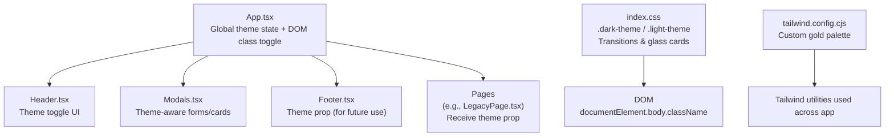
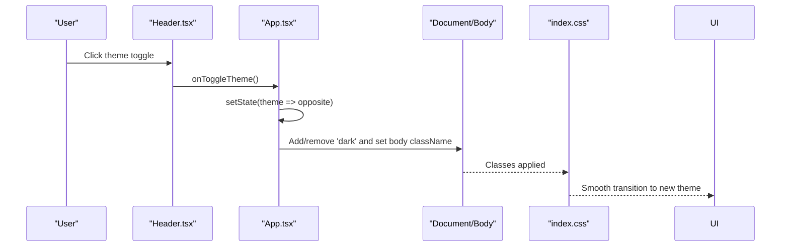
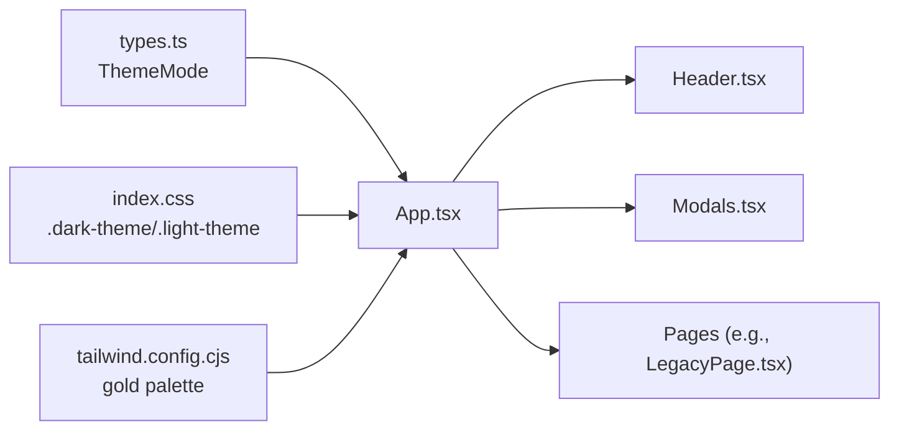

# Theme System Implementation

<cite>
**Referenced Files in This Document**
- [App.tsx](file://src/App.tsx)
- [Header.tsx](file://src/components/Header.tsx)
- [Modals.tsx](file://src/components/Modals.tsx)
- [Footer.tsx](file://src/components/Footer.tsx)
- [LegacyPage.tsx](file://src/pages/LegacyPage.tsx)
- [index.css](file://src/index.css)
- [tailwind.config.cjs](file://tailwind.config.cjs)
- [types.ts](file://src/types.ts)
- [main.tsx](file://src/main.tsx)
</cite>

## Table of Contents
1. [Introduction](#introduction)
2. [Project Structure](#project-structure)
3. [Core Components](#core-components)
4. [Architecture Overview](#architecture-overview)
5. [Detailed Component Analysis](#detailed-component-analysis)
6. [Dependency Analysis](#dependency-analysis)
7. [Performance Considerations](#performance-considerations)
8. [Troubleshooting Guide](#troubleshooting-guide)
9. [Conclusion](#conclusion)
10. [Appendices](#appendices)

## Introduction
This document explains the dark/light theme implementation in the N-Square application. It covers how global theme state is managed, how CSS classes are toggled to apply themes, and how components consume the theme for styling. It also includes guidance on creating theme-aware components, customizing theme colors, implementing theme persistence, accessibility considerations, and performance optimization techniques.

## Project Structure
The theme system is centered around a single source of truth: React state in the root App component. The theme value is passed down as props to child components that need it. A side effect updates the DOM with theme-related classes on the root element and body, enabling both Tailwind’s dark mode variant and custom CSS rules to take effect.

**Diagram sources**
- [App.tsx:15-37](file://src/App.tsx#L15-L37)
- [Header.tsx:217-234](file://src/components/Header.tsx#L217-L234)
- [Modals.tsx:34-38](file://src/components/Modals.tsx#L34-L38)
- [index.css:27-44](file://src/index.css#L27-L44)
- [tailwind.config.cjs:4-11](file://tailwind.config.cjs#L4-L11)

**Section sources**
- [App.tsx:15-37](file://src/App.tsx#L15-L37)
- [index.css:27-44](file://src/index.css#L27-L44)
- [tailwind.config.cjs:4-11](file://tailwind.config.cjs#L4-L11)

## Core Components
- Global state and DOM synchronization live in the root App component. It maintains the current theme and applies corresponding classes to the document element and body when the theme changes.
- The Header component provides the user-facing theme switcher (desktop and mobile). It receives the current theme and a callback to toggle it.
- Modal components render theme-aware inputs and containers by branching styles based on the theme prop.
- Pages receive the theme prop where needed; some pages may not require it if they rely on global CSS classes.

Key behaviors:
- When theme is dark, the root element gets a specific class and the body background/text colors are set via inline Tailwind utility classes.
- When theme is light, those classes are removed and replaced with light-mode equivalents.
- A global transition rule ensures smooth color transitions during theme switches.

**Section sources**
- [App.tsx:15-37](file://src/App.tsx#L15-L37)
- [Header.tsx:217-234](file://src/components/Header.tsx#L217-L234)
- [Modals.tsx:34-38](file://src/components/Modals.tsx#L34-L38)

## Architecture Overview
The theme architecture follows a simple top-down prop pattern rather than a Context API. The root App owns the theme state and passes it to any component that needs to render theme-specific UI. Simultaneously, a side effect updates the DOM to enable CSS-level theming through Tailwind’s dark variant and custom classes.

**Diagram sources**
- [Header.tsx:217-234](file://src/components/Header.tsx#L217-L234)
- [App.tsx:24-37](file://src/App.tsx#L24-L37)
- [index.css:27-44](file://src/index.css#L27-L44)

## Detailed Component Analysis

### Global State Management (App.tsx)
- Maintains theme as local state initialized to light.
- Uses an effect to synchronize the DOM:
  - Adds/removes a class on the document element to activate Tailwind’s dark variant.
  - Sets body background and text colors using utility classes.
- Exposes a toggle function that flips between dark and light.

Implementation highlights:
- Theme type is defined centrally for type safety.
- Root wrapper div conditionally applies theme classes to ensure consistent base styles.

**Section sources**
- [App.tsx:15-37](file://src/App.tsx#L15-L37)
- [types.ts:1](file://src/types.ts#L1-L1)

### Theme Toggle UI (Header.tsx)
- Provides a visually animated toggle with sun/moon icons.
- Responds to clicks by invoking the parent-provided onToggleTheme callback.
- Works on both desktop and mobile layouts.

Accessibility notes:
- The toggle has a title attribute describing its action.
- Icons are decorative; focus management relies on surrounding interactive elements.

**Section sources**
- [Header.tsx:217-234](file://src/components/Header.tsx#L217-L234)

### Theme-Aware Modals (Modals.tsx)
- Both brochure and schedule modals accept a theme prop.
- They branch border and text colors based on the theme to maintain contrast and readability.
- Use shared glass-card styling from CSS for consistent visual depth.

**Section sources**
- [Modals.tsx:34-38](file://src/components/Modals.tsx#L34-L38)
- [index.css:47-60](file://src/index.css#L47-L60)

### Footer Integration (Footer.tsx)
- Accepts a theme prop but currently uses fixed colors. It can be extended to react to theme changes if needed.

**Section sources**
- [Footer.tsx:5-13](file://src/components/Footer.tsx#L5-L13)

### Page-Level Usage (LegacyPage.tsx)
- Receives theme as a prop and forwards it to nested sections.
- Demonstrates how pages can integrate theme into their content when necessary.

**Section sources**
- [LegacyPage.tsx:5-13](file://src/pages/LegacyPage.tsx#L5-L13)

### CSS Theming and Transitions (index.css)
- Defines .dark-theme and .light-theme base styles for background and text.
- Applies a global transition rule to animate color and background changes smoothly.
- Provides glass-card styles that adapt to the active theme context.
- Includes custom scrollbar styling per theme.

**Section sources**
- [index.css:27-44](file://src/index.css#L27-L44)
- [index.css:47-60](file://src/index.css#L47-L60)
- [index.css:83-105](file://src/index.css#L83-L105)

### Tailwind Configuration (tailwind.config.cjs)
- Extends the default color palette with brand gold tones used throughout the UI.
- Enables consistent accent colors across components.

**Section sources**
- [tailwind.config.cjs:4-11](file://tailwind.config.cjs#L4-L11)

## Dependency Analysis
The theme system has minimal coupling:
- App.tsx depends on types.ts for the ThemeMode union.
- Header.tsx depends on App.tsx via props for theme and toggle.
- Modals.tsx depend on theme props for conditional styling.
- index.css defines reusable theme classes consumed by components.
- tailwind.config.cjs supplies color tokens used across the app.

**Diagram sources**
- [types.ts:1](file://src/types.ts#L1-L1)
- [App.tsx:15-37](file://src/App.tsx#L15-L37)
- [Header.tsx:217-234](file://src/components/Header.tsx#L217-L234)
- [Modals.tsx:34-38](file://src/components/Modals.tsx#L34-L38)
- [index.css:27-44](file://src/index.css#L27-L44)
- [tailwind.config.cjs:4-11](file://tailwind.config.cjs#L4-L11)

**Section sources**
- [types.ts:1](file://src/types.ts#L1-L1)
- [App.tsx:15-37](file://src/App.tsx#L15-L37)

## Performance Considerations
- Minimize re-renders: Keep theme state at the root level to avoid prop drilling overhead beyond what is already present.
- Efficient DOM updates: The effect updates only the root element and body classes, which is lightweight.
- Transition costs: Global transitions are enabled for common elements; keep duration reasonable to avoid jank on low-end devices.
- Avoid heavy computations in effects: Current logic is O(1) operations on DOM classes.

[No sources needed since this section provides general guidance]

## Troubleshooting Guide
Common issues and resolutions:
- Theme not applying: Ensure the root effect runs after mount and that no other code overwrites documentElement or body classes later.
- Inconsistent colors: Verify that components use the provided theme prop or rely on global .dark-theme/.light-theme classes consistently.
- Broken transitions: Check that transition utilities are applied to elements whose color/background change during theme switch.
- Accessibility: Confirm that interactive controls have appropriate labels and keyboard support.

**Section sources**
- [App.tsx:24-37](file://src/App.tsx#L24-L37)
- [index.css:27-44](file://src/index.css#L27-L44)

## Conclusion
The N-Square theme system uses a straightforward, scalable approach:
- Single source of truth in App.tsx for theme state.
- DOM class toggling to leverage Tailwind’s dark variant and custom CSS.
- Prop-based theme consumption in components that need it.
This design keeps complexity low while providing a smooth, accessible user experience. Future enhancements can include persistence and system preference detection without disrupting the existing flow.

[No sources needed since this section summarizes without analyzing specific files]

## Appendices

### Creating Theme-Aware Components
- Accept a theme prop typed as ThemeMode.
- Branch styles using conditional classes or theme-dependent values.
- Prefer using Tailwind utilities and the global .dark-theme/.light-theme classes for consistency.

Example patterns:
- Conditional borders and text colors in form fields.
- Glass card backgrounds that adapt to theme context.

**Section sources**
- [Modals.tsx:34-38](file://src/components/Modals.tsx#L34-L38)
- [index.css:47-60](file://src/index.css#L47-L60)

### Customizing Theme Colors
- Extend the Tailwind configuration to add new brand colors.
- Use these tokens in components to maintain a cohesive palette.

**Section sources**
- [tailwind.config.cjs:4-11](file://tailwind.config.cjs#L4-L11)

### Implementing Theme Persistence
Recommended approach:
- On initial load, read the stored preference from localStorage and initialize theme accordingly.
- On theme change, persist the new value to localStorage.
- Optionally respect the system preference using a media query and fall back to stored preference.

Note: This repository does not currently implement persistence; adding it would involve reading/writing localStorage and initializing state before first render.

[No sources needed since this section provides general guidance]

### Accessibility Considerations
- Provide clear labels and titles for theme controls.
- Ensure sufficient color contrast in both themes.
- Support keyboard navigation for theme toggles.
- Announce theme changes to assistive technologies if needed (e.g., via aria-live regions).

**Section sources**
- [Header.tsx:217-234](file://src/components/Header.tsx#L217-L234)

### Transition Effects Between Themes
- Global transitions are configured for common elements to animate color and background changes.
- Adjust durations and easing in CSS if you need faster or smoother transitions.

**Section sources**
- [index.css:27-44](file://src/index.css#L27-L44)